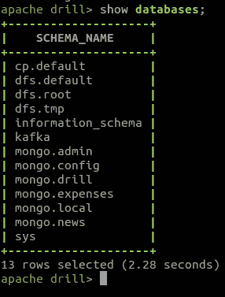
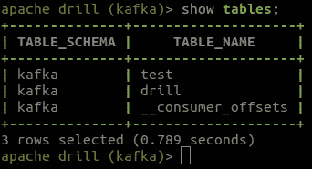
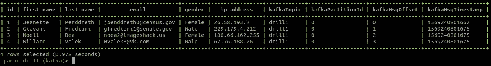

# 使用 Apache Drill 通过 SQL 查询分析 Kafka 消息

> 原文：<https://towardsdatascience.com/analyse-kafka-messages-with-sql-queries-using-apache-drill-cc26420bb7c3?source=collection_archive---------20----------------------->

> 原文发布于此:[https://blog . contact sunny . com/tech/analyse-Kafka-messages-with-SQL-queries-using-Apache-drill](https://blog.contactsunny.com/tech/analyse-kafka-messages-with-sql-queries-using-apache-drill)

在上一篇文章中，我们弄清楚了如何[将 MongoDB 与 Apache Drill](https://blog.contactsunny.com/tech/getting-started-with-apache-drill-and-mongodb) 连接起来，并使用 SQL 查询来查询数据。在这篇文章中，让我们扩展这方面的知识，看看如何使用类似的 SQL 查询来分析我们的 Kafka 消息。


在 Apache Drill 中配置 Kafka 存储插件非常简单，与我们配置 MongoDB 存储插件的方式非常相似。首先，我们运行 Apache Drill、Apache Zookeeper 和 Apache Kafka 的本地实例。在这之后，前往[http://localhost:8047/storage](http://localhost:8047/storage)，在那里我们可以启用 Kafka 插件。您应该在页面右侧的列表中看到它。单击启用按钮。存储插件将被启用。在这之后，我们需要添加一些配置参数来开始从 Kafka 查询数据。单击 Kafka 旁边的 Update 按钮，这将打开一个带有 JSON 配置的新页面。用以下内容替换 JSON:

```
{
   "type": "kafka",
   "kafkaConsumerProps": {
     "key.deserializer": "org.apache.kafka.common.serialization.ByteArrayDeserializer",
     "auto.offset.reset": "earliest",
     "bootstrap.servers": "localhost:9092",
     "group.id": "drill-query-consumer-1",
     "enable.auto.commit": "true",
     "value.deserializer": "org.apache.kafka.common.serialization.ByteArrayDeserializer",
     "session.timeout.ms": "30000"
   },
   "enabled": true
 }
```

如果需要，您可以更改此配置。如果您要连接到远程引导服务器，请更改引导服务器地址。一旦完成这些，我们就可以开始从 Kafka 主题中查询数据了。因此，让我们切换到终端，看看一些查询。

# 使用 Drill SQL 查询查询 Apache Kafka 消息

首先，我们来看看 Kafka 存储插件是否确实启用了。为此，我们只需运行 *show 数据库；*查询。这将列出我们已启用的所有存储插件，以及这些服务中的数据库(如果适用)。如果您运行此查询，您的输出应该类似于:



可以看到，*卡夫卡*被列为数据库。让我们使用下面的命令切换到这个模式:

```
use kafka;
```

要开始从 Kafka 主题中读取数据，我们需要首先查看该主题是否被 Drill 识别。Kafka 中的每个主题都会在 Drill 中以表格的形式出现在 kafka 数据库中。所以我们只需要列出这个数据库中的所有表。出于测试目的，您可以创建一个新主题。我创建了主题“drill ”,用于使用 Drill 进行测试。让我们看看它是否在这个数据库中显示为一个表。



这就是了。我们将在这个表上运行我们的查询。

> *这里你需要注意的一件事是，现在，对于最新版本的 Apache Drill 和 Kafka 存储插件，只有 JSON 消息可以工作。如果你发送的不是 JSON，Drill 会抛出一个异常，并且不能工作。所以让我们来解决这个问题。*

让我们使用 Kafka 控制台生成器发送一些随机的 JSON 消息，看看 Drill 是否能够查询这些消息。

我将从一个控制台生成器向“drill”主题发送以下 JSON 消息(总共四条)。这是我在简单的谷歌搜索后在网上得到的一些样本数据。

```
{
  "id": 1,
  "first_name": "Jeanette",
  "last_name": "Penddreth",
  "email": "jpenddreth0@census.gov",
  "gender": "Female",
  "ip_address": "26.58.193.2"
}
{
  "id": 2,
  "first_name": "Giavani",
  "last_name": "Frediani",
  "email": "gfrediani1@senate.gov",
  "gender": "Male",
  "ip_address": "229.179.4.212"
}
{
  "id": 3,
  "first_name": "Noell",
  "last_name": "Bea",
  "email": "nbea2@imageshack.us",
  "gender": "Female",
  "ip_address": "180.66.162.255"
}
{
  "id": 4,
  "first_name": "Willard",
  "last_name": "Valek",
  "email": "wvalek3@vk.com",
  "gender": "Male",
  "ip_address": "67.76.188.26"
}
```

现在，让我们对 Drill 中的表运行以下简单的 SQL 命令，看看会得到什么输出:

```
select * from drill;
```



这就是我们想要的结果。从 Drill 查询阿帕奇卡夫卡就是这么简单。我不知道为什么我没有早点遇到这个工具。