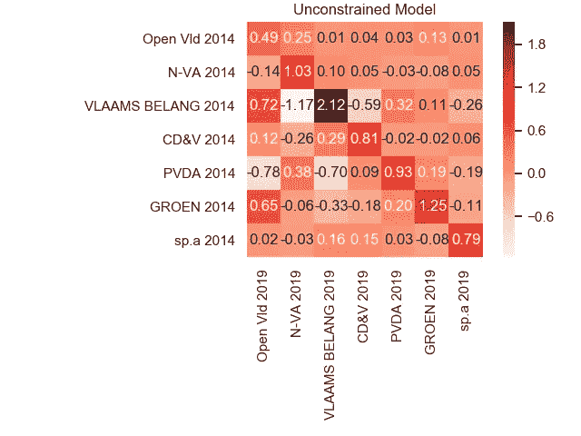

# 分析比利时选举结果

> 原文：<https://towardsdatascience.com/analysing-belgian-election-results-5c4124452689?source=collection_archive---------33----------------------->

## 对数据的深入研究

Photo by [Element5 Digital](https://unsplash.com/@element5digital?utm_source=medium&utm_medium=referral) on [Unsplash](https://unsplash.com?utm_source=medium&utm_medium=referral)

## 介绍

2019 年 5 月 26 日，比利时组织了联邦选举。在本文中，我不想讨论这些选举的政治含义。我想研究一下这些数据，看看我们能从中学到什么。

更具体地说，我想回答这样一个问题:“自上次选举以来，选民是如何改变他们的想法的”。

看总的结果，不可能回答这个问题。请注意，这是真的，即使只有两个政党参加选举。

举个例子，我们想象一下，连续两次选举，两党都拿到了半数选票。那么仍然不可能得出是没有一个选民改变主意，还是所有的选民都改变了主意，或者介于两者之间。

## 资料组

一切有趣的事情都始于数据集。所以我开始为自己寻找一个包含选举结果数据的数据集。

我偶然发现这个[网站](https://verkiezingen2019.belgium.be)，上面有每个地区 2019 年和 2014 年(以前的选举)的投票结果数据。我所说的区在比利时被称为“行政区”，大约有 200 多个。

我是手动复制粘贴这个网站上的所有结果，还是采用不太合法的方法编写 Python 脚本来自动抓取结果，这是任何人的猜测。我只能说我强烈推荐“ [BeautifulSoup](https://pypi.org/project/beautifulsoup4/) ”库进行截屏。

我最终得到了一个数据集，它提供了 2019 年和 2014 年 200+个地区中每个政党的票数。

为了准确起见，我必须提到比利时分为三个自治区:佛兰德、瓦隆和布鲁塞尔首都，并非所有政党在所有地区都有代表。在这篇文章的结果部分，我将把重点放在最大的部分(佛兰德)，但该方法也测试了其他部分。

## 模型描述

为了了解哪些选民改变了主意，我建立了一个非常简单的模型。
我将选举简化为一个 N 党制，放弃所有在 2014 年和 2019 年获得少于 15 万张选票的政党。

然后我假设所有在 2014 年投票的人，在 2019 年会以同样的方式改变他们的想法。更具体地说，在 2014 年投票给 Pᵢ党的人，在 2019 年投票给 Pᵣ党的概率是一样的。(我称这个概率为 X *ᵢᵣ).*

我们的目标是找到概率 X *ᵢᵣ.的最佳值*换句话说:“x 的哪些值 *ᵢᵣ，*根据 2014 年的结果最好地解释了 2019 年的结果”。

为了“解释”或“预测”2019 年政党 *Pᵣ* 的票数 V *ᵣ* ⁰ ⁹，基于 2014 年的结果，我可以使用概率 X *ᵢᵣ* 如下:

那看起来很熟悉不是吗？这是一个简单的线性回归。所以我开始着手用 Python 实现这个模型。

应该注意的是，即使我们在谈论预测 2019 年的结果，我们也不关心预测 2019 年的选举，因为它们已经过去了。我们只是试图创建一个预测模型，然后研究“这个模型的内部”(概率 X *ᵢᵣ).*

## 初步结果

我将在热图中展示这个线性回归的结果。热图中的每个单元格都包含一个概率 X *ᵢᵣ.*

这个热图应该这样理解:每个单元格位于一行和一列的交叉点上。行代表在 2014 年投票给某个政党的人，列代表他们在 2019 年投票给的政党。单元格中的值表示 2014 年投票给第一个政党的人与 2019 年投票给第二个政党的人的比率。

举个例子:如果所有人在 2014 年和 2019 年以完全相同的方式投票，热图对角线上的值为 1，其他地方的值为 0。

我的第一个结果显示在下面的热图中。

Results of the first model: Not what I was hoping for

一张图说了千言万语，这次却是只喊一件事:**“模型错了！”。**

## 模型的问题

这个模型给出了无意义的结果，因为这个问题当然不是传统的线性回归问题，原因有二。

首先，在我对模型的解释中，参数 X *ᵢᵣ* 不能取任意值。因为它们代表选民转向另一个政党的概率，所以它需要是 0 到 1 之间的一个数字。在 2019 年，某个群体的选民有-59%的概率投票给某个政党，这根本没有意义。

其次，概率 X *和ᵢᵣ* 并不是相互独立的。所有选民都需要在 2019 年投下新的一票，否则就有成为非法移民的风险，因为投票在比利时是强制性的。

因此，每个政党的总和 X *ᵢᵣ* 需要“大约”100%(因为在 2014 年和 2019 年之间，人们可能已经死亡、迁移或达到允许投票的最低年龄)。
我可以多做一点，添加 2014 年至 2019 年每个地区的人口变化信息，但为了简化问题，我假设它大致不变。

## 改进模型

因此，我修改了模型，将这些限制因素考虑在内。

该模型在两个方面进行了调整:

1.  我从默认的线性回归转向最小二乘问题，用独立变量的界限来限制我的概率在 0 和 1 之间。
2.  我为每个政党添加了一个等式，以迫使所有 2014 年的选民在 2019 年再次投票。这个方程用一个超参数加权来表示它的相对权重。

有趣的是，模型的“性能”(将在本文末尾讨论)只有在考虑到这些约束的情况下才会下降。但是鉴于我们对模型的解释比对预测能力更感兴趣，我们很乐意接受这种性能上的打击。

## 超参数调谐

上面提到的超参数定义了这个约束相对于“正确预测”的相对重要性。

我通过检查作为超参数函数的性能图来调整这个参数的值。在误差达到最高点之前，我选择了高原上的某个点。

为了让自己相信结果不太依赖于超参数，我很快检查了超参数值不同的模型之间的结果差异。结果并没有太大的不同，这是令人欣慰的。

## 改进模型的结果

在下面的热图中，您可以看到改进模型的结果。

Results of the improved model

该模型明确显示了一些有趣的结果。有些非常符合预期和“常识”。

该模型表明，人们在“志同道合”的政党之间改变主意。这方面的一些例子:

*   PVDA、格罗恩和 SP-A(都是左翼政党)主要是相互失去选票。
*   NV-A 只输给了另一个右翼政党(Vlaams Belang)

一些观察结果出乎意料:

*   22%的七党联盟投票者，改变了他们对 OpenVLD(左翼转右翼)的看法
*   Vlaams Belang(一个相当极端的右翼政党)输给了一个相当极端的左翼政党(PVDA)10%的选票
*   OpenVLD(一个右翼政党)的选票输给了几乎所有政党(除了最极端的左翼政党)

## 表演

为了比较模型，(甚至为了训练模型)，我需要选择一个“性能度量”。
一个很好的例子是“*所有地区的错误预测票数*”。

如果我在以下型号上使用此指标:

*   初始线性回归模型: **9.9%错误预测选票**
*   改进后的模型: **13.5%误预测票**
*   基于投票的模型。我很幸运地找到了来自代表组织的一份研究报告，代表组织是一个由比利时五所大学的政治学家组成的联盟，描述了他们对选举结果进行的一次民意调查。使用他们的投票结果导致 18.9 %的选票被错误预测。

从这些绩效得分中观察到的一些情况:

*   约束模型的表现比“初始线性回归”差(如预期的)。
*   我很高兴地看到，我的模型比大学进行的民意调查表现得更好。这表明这种方法可能优于选举后投票。

## 可能的后续步骤

目前的模型只有有限的可用信息作为决策的基础。它使用的唯一数据点是:“一个人在 2014 年投票给了哪个政党？”。

因此，它必须认为所有在 2014 年投票给同一政党的人都是平等的。这当然是非常粗糙的简化。人们可以想象，在 2014 年投票给某个政党的人，有不同的背景和理由这样做。这些不同的原因可能会导致 2019 年选举中的不同行为。

如果我们希望模型能够做出类似于“Y 党失去了 X 党的大量富裕选民，同时重新获得了大量老年选民”的预测，我们需要对模型进行改进。为模型添加每个地区的财富分布、城市化或年龄分布信息，可能会释放这种潜力。

提高模型性能的另一种方法是改进训练数据，这种方法很容易实现。运行分析后，我发现选举结果也可以在更细粒度的级别上获得(称为“Gemeente”)。对这个更丰富的数据集重新运行相同的分析应该会产生更准确的结果。这也将使我能够纳入更多的政党，而不仅仅是最大的政党。

## 结论

使用相当简单的机器学习技术，绝对有可能获得一些关于选举结果的有趣见解。它比一个政治科学家财团进行的民意调查(样本规模为 3400 人)更好地解释了 2019 年的结果。

有足够的机会来改进模型或对该数据集执行不同的分析。

但最重要的是:下次当你怀疑你的投票是否会有所不同时，要知道你至少会成为线性回归的一部分；-)