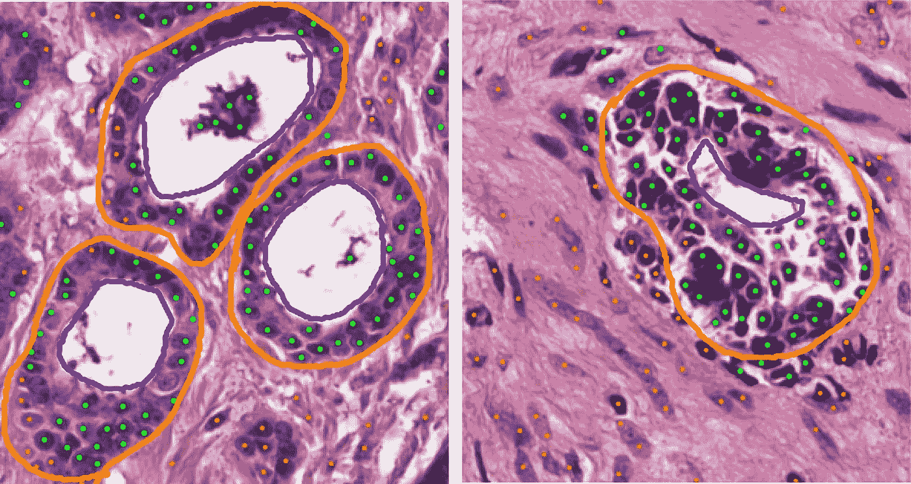
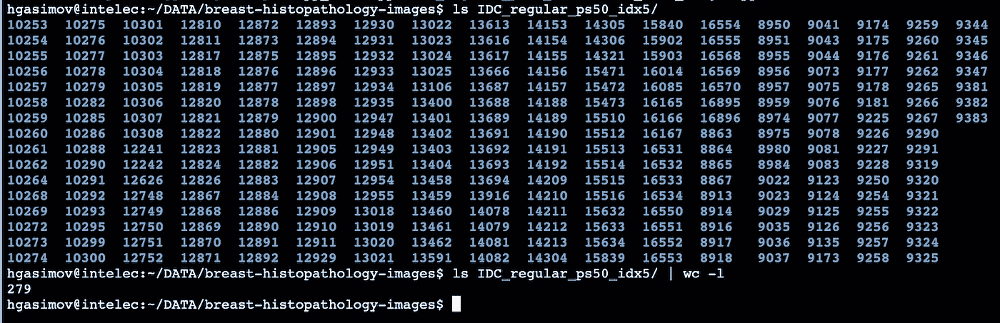
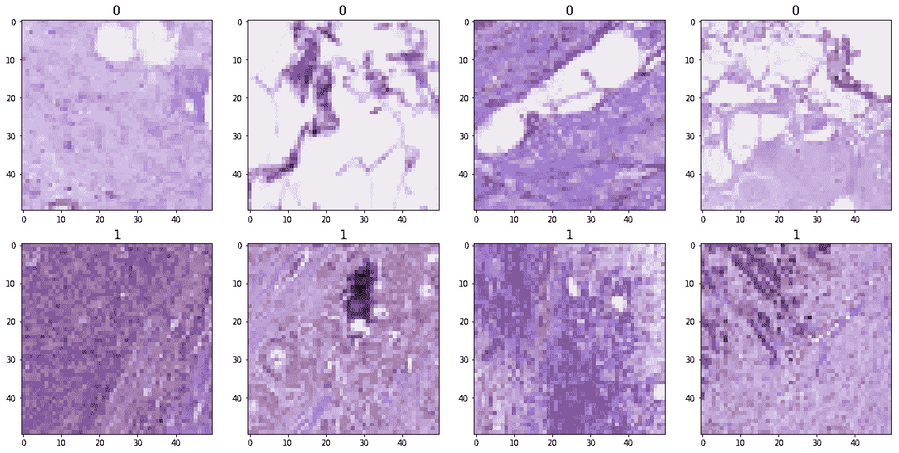
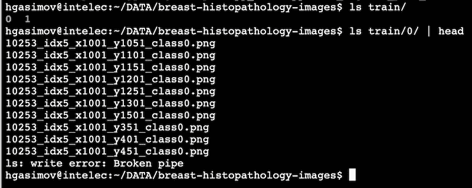
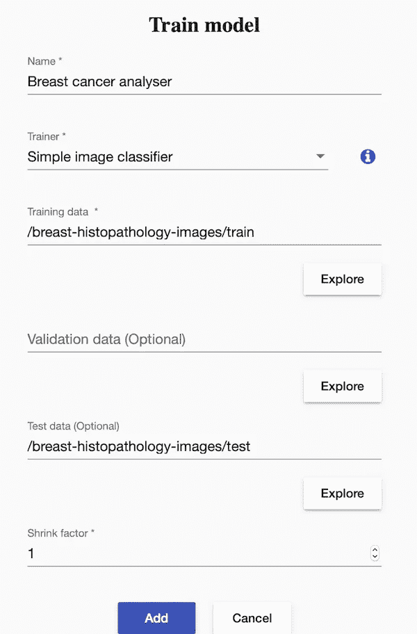
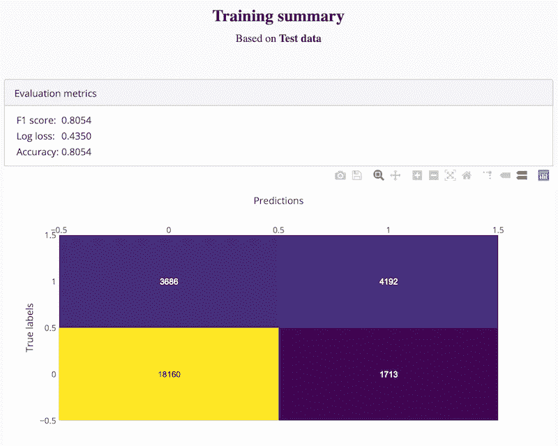
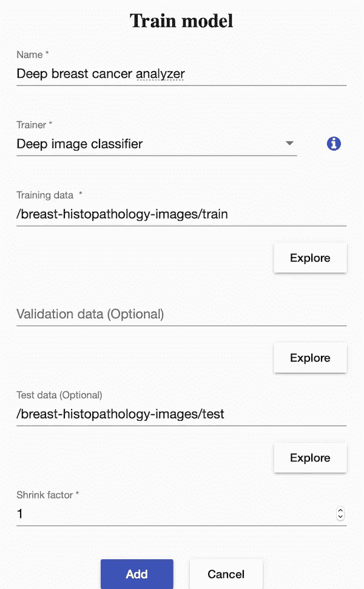
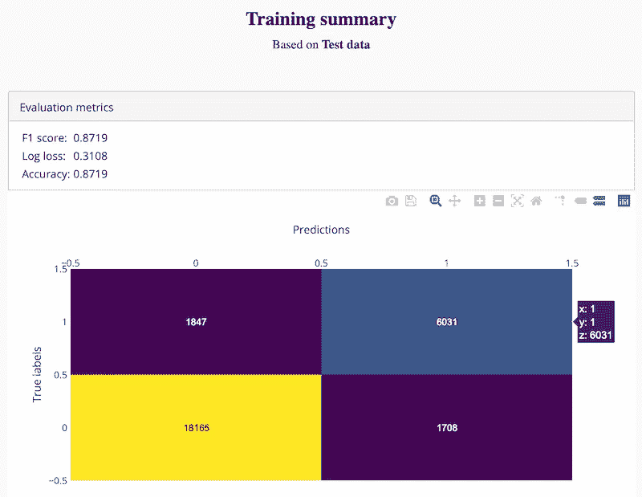

# 使用深度学习分析乳腺癌

> 原文：<https://towardsdatascience.com/analysing-breast-cancer-using-deep-learning-e3426f768c52?source=collection_archive---------29----------------------->



用于检测乳腺癌的过程非常耗时，小的恶性肿瘤区域可能会被遗漏。

为了检测癌症，将组织切片放在载玻片上。然后，病理学家在显微镜下检查这张载玻片，目视扫描没有癌症的大区域，以便最终找到恶性区域。由于这些载玻片现在可以数字化，计算机视觉可以用来加快病理学家的工作流程，并提供诊断支持。

# 一些术语

组织病理学
这包括在显微镜下检查玻璃组织切片，看是否存在疾病。在这种情况下，这将是检查淋巴结的组织样本，以检测乳腺癌。

**整个载玻片图像(WSI)**
用扫描仪拍摄的载玻片的数字化高分辨率图像。这些图像的大小可能有几千兆字节。因此，为了让它们用于机器学习，这些数字图像被切割成小块。

**小块**
小块是图像的一小块，通常为矩形。例如，一个 50×50 的小块是一个包含 2500 个像素的正方形小块，取自一个更大的图像，比如 1000×1000 个像素。

淋巴结是一个小豆状结构，是人体免疫系统的一部分。淋巴结过滤通过淋巴液的物质。它们含有淋巴细胞(白细胞)，帮助身体对抗感染和疾病。

**前哨淋巴结**
在肿瘤附近注射蓝色染料和/或放射性示踪剂。这种注射物质到达的第一个淋巴结称为前哨淋巴结。我们将使用的图像是取自前哨淋巴结的所有组织样本。

**转移**
癌细胞扩散到身体新的区域，通常通过淋巴系统或血液。

# 数据

浸润性导管癌(IDC)是所有乳腺癌中最常见的亚型。几乎 80%确诊的乳腺癌都是这种亚型。这个 [kaggle 数据集](https://www.kaggle.com/paultimothymooney/breast-histopathology-images)由 277，524 个大小为 50 x 50 的小块组成(198，738 个 IDC 阴性，78，786 个 IDC 阳性)，这些小块是从 162 个以 40 倍扫描的乳腺癌(BCa)标本的整块载玻片图像中提取的。每个补片的文件名格式为:u_xX_yY_classC.png(例如，10253 _ idx 5 _ X 1351 _ Y 1101 _ class 0 . png)，其中 u 为患者 ID (10253_idx5)，X 为该补片裁剪位置的 X 坐标，Y 为该补片裁剪位置的 Y 坐标，C 表示类别，其中 0 为非 IDC，1 为 IDC。

## 下载和准备数据

首先，我们需要下载数据集并解压。这些图像将保存在“IDC_regular_ps50_idx5”文件夹中。每 279 名患者都有一个文件夹。患者文件夹包含 2 个子文件夹:文件夹“0”包含非 IDC 补丁，文件夹“1”包含相应患者的 IDC 图像补丁。



IDC dataset structure

50x50 图像补丁看起来像这样:



IDC images

现在，我们需要将所有患者的所有 IDC 图像放入一个文件夹，并将所有非 IDC 图像放入另一个文件夹。可以手动完成，但是我们编写了一个简短的 python 脚本来完成:

```
**import** os 
**from** shutil **import** copyfile src_folder = 'IDC_regular_ps50_idx5' 
dst_folder = 'train' os.mkdir(os.path.join(dst_folder, '0')) os.mkdir(os.path.join(dst_folder, '1')) folders = os.listdir(src_folder) 
**for** f **in** folders:
     f_path = os.path.join(src_folder, f)
     **for** cl **in** os.listdir(f_path):
         cl_path = os.path.join(f_path, cl)
         **for** img **in** os.listdir(cl_path):
             copyfile(os.path.join(cl_path, img), os.path.join(dst_folder, cl, img)) 
```

结果将如下所示。我们可以把它作为我们的训练数据。



然后，我们将 10%的训练图像放入一个单独的文件夹中，用于测试。为此，我们创建一个“test”文件夹，并执行以下 python 脚本:

```
**import** numpy **as** np
**import** os 
**from** shutil **import** movesrc_folder = 'train' 
dst_folder = 'test' 
test_ratio = 0.1 os.mkdir(os.path.join(dst_folder, '0')) os.mkdir(os.path.join(dst_folder, '1')) **for** cl **in** os.listdir(src_folder):
     class_path = os.path.join(src_folder, cl)
     class_images = os.listdir(class_path)
     n_test_images = int(test_ratio*len(class_images))
     np.random.shuffle(class_images)
     **for** img **in** class_images[:n_test_images]:
         move(os.path.join(class_path, img), os.path.join(dst_folder, cl, img)) 
```

# 安装机器学习工具

我们将使用 [Intelec AI](https://www.intelec.ai/) 创建一个图像分类器。你可以从这里免费下载并安装。

# 训练图像分类器

Intelec AI 为图像分类提供了 2 种不同的训练器。第一个是**简单图像分类器**，它使用浅层卷积神经网络(CNN)。训练速度很快，但是最终的准确度可能没有另一个更深层次的 CNN 那么高。第二个是**深度图像分类器**，训练时间更长，但准确率更高。

首先，我们使用简单的图像分类器创建了一个训练，并开始它:



Train a simple image classifier

培训总结如下:



Training summary on test data

测试集准确率为 80%。对于一个小车型来说也算是不错的成绩了。但是我们可以做得更好。因此我们尝试了“深度图像分类器”,看看我们是否能训练出更准确的模型。



Train a deep CNN for image classification

我们得到了更好的测试集准确性:



Deep CNN training summary

我们能够通过训练更深层次的网络来提高模型的准确性。添加更多的训练数据也可能提高准确性。

# 专家对计算病理学有什么看法？

计算病理学副教授、2016 年和 2017 年非常成功的[camelion grand challenges](https://camelyon17.grand-challenge.org/)的协调员耶鲁安·范德拉克教授认为，计算方法将在病理学的未来发挥重要作用。

在下一个视频中，诺丁汉大学的癌症病理学教授伊恩·埃利斯，他无法想象没有计算方法的病理学:

# 感谢

使用的来源:

*   [来自 kaggle 的数据集](https://www.kaggle.com/paultimothymooney/breast-histopathology-images)
*   [Kaggle 内核](https://www.kaggle.com/vbookshelf/part-1-breast-cancer-analyzer-web-app)