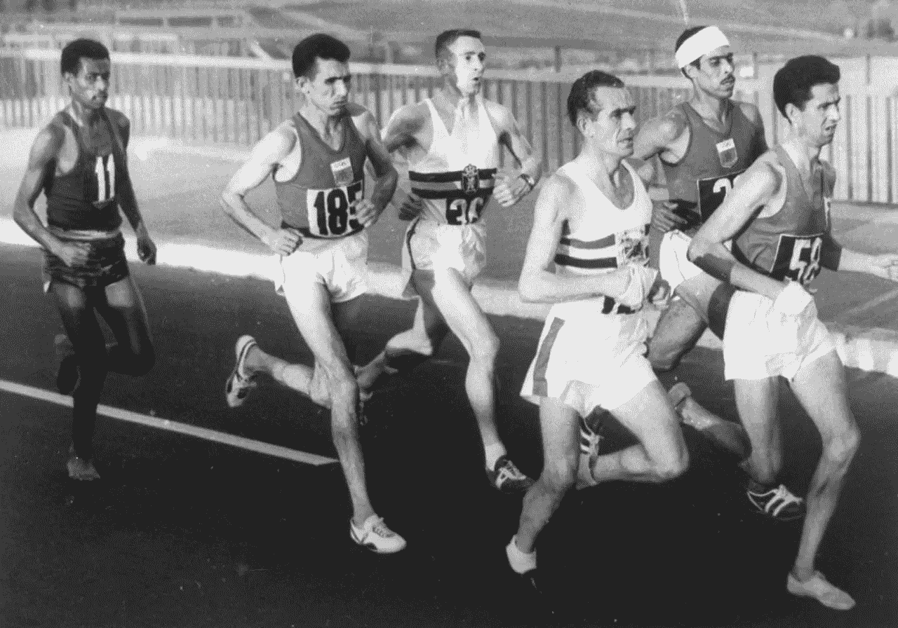
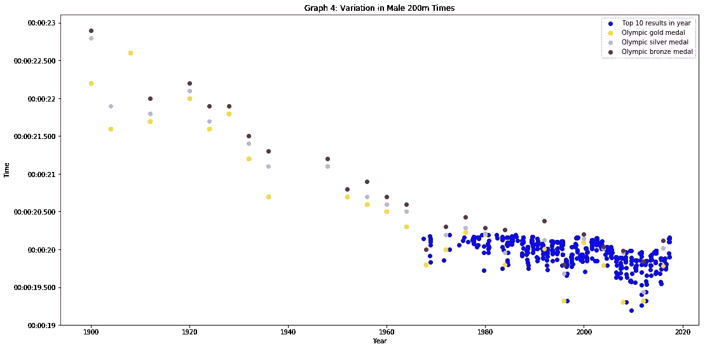
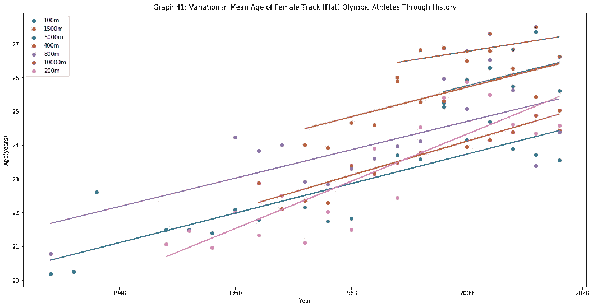
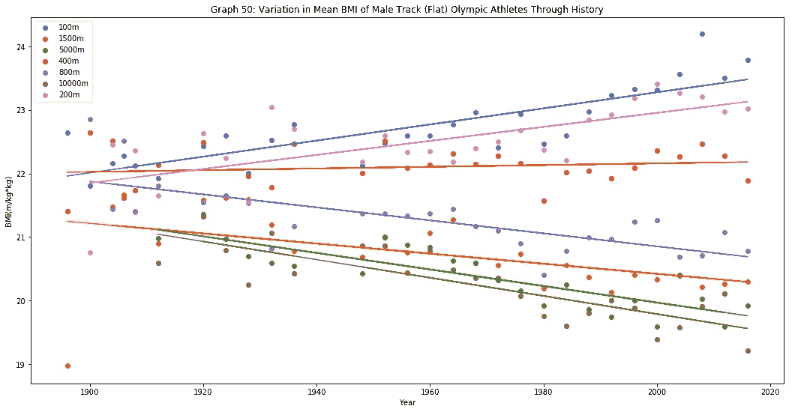
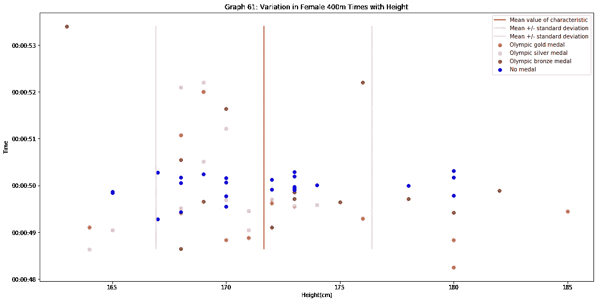
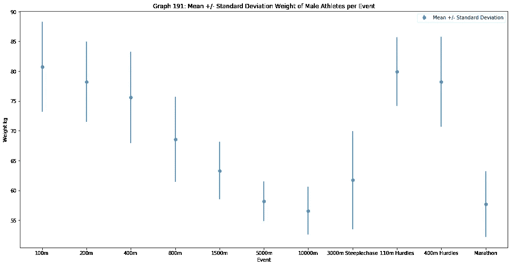

# 用历史数据分析优秀运动员的跑步成绩

> 原文：<https://towardsdatascience.com/analysing-elite-running-performance-with-historical-data-b9c6bdd9c5d8?source=collection_archive---------15----------------------->

1960 Olympic marathon ([credit](https://roma.corriere.it/foto-gallery/cronaca/14_dicembre_15/olimpiadi-roma-1960-4e5bc10c-8491-11e4-b9cc-80d61e8956c5.shtml))

# **简介**

每个级别的跑步者都努力提高自己的成绩。无论是旨在创造新的个人最好成绩的业余选手，还是志在赢得重大比赛的精英运动员，他们都面临着同一个问题:我如何跑得更快？

这是一个引人入胜的问题，直觉上我们可以预期答案是一个复杂的因素混合物。这一分析试图通过检查关于优秀跑步者表现的历史数据来为这一讨论做出贡献。具体而言，它解决了以下问题:

1.  历史上，优秀跑步运动员的表现是如何变化的？
2.  奥运选手的特征(身高、体重、年龄、体重指数(身体质量指数))在历史上有什么变化？
3.  奥运跑者的特质和成绩有关系吗？

# 数据

数据集可以在 Kaggle 上获得，数据清理和分析的完整过程可以在 GitHub 上找到——参见下面的**参考文献**部分。值得注意的是，数据的一个局限性是性别失衡——男子比赛的数据比女子比赛的数据多。这是因为直到最近，女性才被允许参加所有现代奥林匹克距离的比赛。然而，通常有足够的数据来得出结论。

# 分析和调查结果

**性能有所提高**

绘制特定事件中最佳表现(指比赛中的完成时间)与日期的图表显示，历史上表现有显著改善。图 1 中的图表(来自参考文献[4])显示了一个例子:男子 200 米的成绩在 117 年间提高了近 20%。

Figure 1: Graph showing the improvement in men’s 200 m performances over time

不仅仅是 200 米的成绩有所提高，所有项目的男女运动员都有所提高。人们很自然会想是什么因素导致了这种情况。

**运动员已经适应**

一个原因是现代运动员与奥运会早期的运动员有很大不同。图 2 [4]是一个例子，显示了几个奥运会径赛项目中女运动员平均年龄的变化。很明显，平均年龄增加了，男运动员也有同样的趋势。这可能是成绩提高的一个因素:运动员在达到巅峰之前花更多的时间训练，这使得他们的成绩更好。

Figure 2: Graph showing the increase in mean age of female track athletes over time

年龄的变化只是运动员特征的几个变化之一。例如，短跑运动员的平均体重指数(身体质量指数)在历史上一直在增加，而长跑运动员的平均体重指数却在下降。这显示在图 3 [4]中。这是有道理的:短距离运动员依靠高身体质量指数产生的爆发性加速度。长距离运动员不需要太多的加速度，而是需要长时间有效工作的能力——低身体质量指数有助于这一点。运动员身体特征的变化证明了他们适应了每个项目的要求，从而取得更好的成绩。

**特定项目的运动员有共同的特点**

图 3 [4]显示了事件距离和平均身体质量指数之间的明确关系。对于短距离项目，平均体重指数都相对较高；对于长距离项目，平均身体质量指数较低，中距离项目介于两者之间。

Figure 3: Graph showing body mass index of male track athletes

身体质量指数并不是每个事件中围绕一个明显平均值分组的唯一特征:体重、身高和年龄也显示出这种效应。例如，比赛时间越长，运动员的平均年龄就越高。

**具有一系列特征的运动员表现出色**

每个项目似乎都有一套特定的特征值，一个运动员最有可能表现良好的“甜蜜点”。然而，最好的表现往往来自那些与平均水平有很大差异的运动员。图 4 [4]显示了最好的(意味着最低的)女子 400 米成绩分布在很大的身高值范围内，数据中没有特别的趋势。这也表明*内*某个*特定奥运项目*的运动员群体，相对于所有运动员的一般人群，身高和成绩之间没有很强的关系。年龄、体重和身体质量指数也是如此。

Figure 4: Scatter plot showing variation in women’s 400 m times with athlete height

**运动员体重是一个重要因素**

在所有考虑的特征(身高、体重、年龄、身体质量指数)中，决定成绩最重要的是运动员体重。图 5 [4]显示每个项目的运动员平均体重被很好地分开。特别是，比较长跑运动员和短跑运动员的平均体重:他们相距甚远。具有短跑运动员体重的运动员不太可能成为成功的马拉松运动员，反之亦然。

Figure 5: mean and standard deviation of male athlete’s weights in different events

身体质量指数，作为一个重量的函数，显示了类似的模式。运动员在不同项目中的平均身高比体重更容易重叠。这表明，在特定项目中，身高对表现的影响较小。不同项目的平均年龄有很大的重叠。这表明年龄的影响很小，尽管需要谨慎对待:数据告诉我们关于顶尖运动员的表现，而且他们的年龄范围相当窄。这些数据无法告诉我们年龄对那些年龄明显偏大的老运动员的影响。

**运动员和教练的实际应用**

这一分析引出了一些有用的见解。

*   为了在某项比赛中取得优异成绩，运动员的身高、体重、年龄和身体质量指数最好接近该项比赛中奥运会运动员的平均值。了解这一点可以影响训练和运动员选择参加的项目。
*   然而，顶级运动员表现出的特征值的范围很广，一些非常优秀的运动员的特征值远离平均值。尤塞恩·博尔特是这种运动员的一个很好的例子——对于一个 100 米短跑运动员来说不寻常的高大和沉重，但却是世界纪录保持者。
*   在所考察的四个特征中，体重对表现的影响最大。这也是一个运动员可以通过训练改变的特征。

# 结论

我们看到了精英运动员的表现是如何变化的，运动员是如何变化的，并对运动员特征与表现的关系有了一些了解。这项研究只调查了四个特征——身高、体重、年龄和身体质量指数。许多顶级运动员的特征值远低于平均水平，这一事实表明，其他因素肯定对成绩有重大影响。未来研究的一个很好的机会是检查各种因素的影响，如训练计划(如每周跑步距离、举重训练等技术)、饮食和运动员特征(如最大摄氧量)。

# 参考

使用的数据集是:

*   [1][https://www . ka ggle . com/hee soo 37/120-years-of-Olympic-history-sports-and-results](https://www.kaggle.com/heesoo37/120-years-of-olympic-history-athletes-and-results)
*   [2]https://www.kaggle.com/jayrav13/olympic-track-field-results
*   [3][https://www.kaggle.com/jguerreiro/running](https://www.kaggle.com/jguerreiro/running)

详细的数据清理和分析，包括本文中的所有图表，可以在这里找到:

*   [https://github.com/mattjezza/ds-proj1-t2-elite-athletics](https://github.com/mattjezza/ds-proj1-t2-elite-athletics)

**致谢**

感谢那些创建了这三个数据集(参考文献[1]、[2]、[3])并在 Kaggle 上发布它们的人。

文章顶部的图片来源:维基媒体 Commons，[https://Commons . Wikimedia . org/wiki/File:Abebe _ biki la _ 1960 _ Olympics . jpg](https://commons.wikimedia.org/wiki/File:Abebe_Bikila_1960_Olympics.jpg)，来自原始来源:[https://Roma . Corriere . it/foto-gallery/cron ACA/14 _ dicembre _ 15/olimpiadi-Roma-1960-4 e5b c10c-8491-11e 4-b9cc-80 d61e 8955](https://roma.corriere.it/foto-gallery/cronaca/14_dicembre_15/olimpiadi-roma-1960-4e5bc10c-8491-11e4-b9cc-80d61e8956c5.shtml)