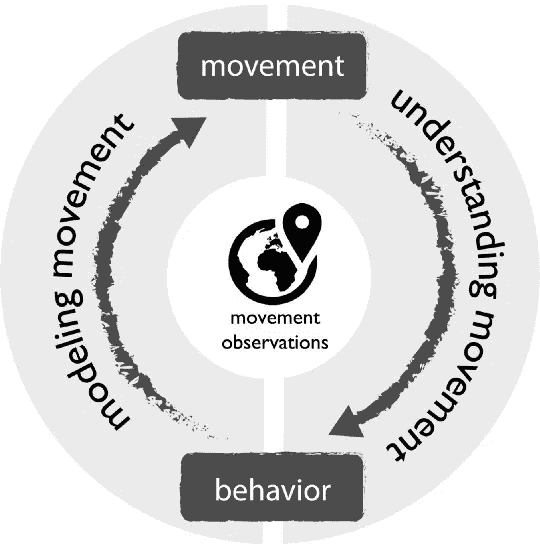
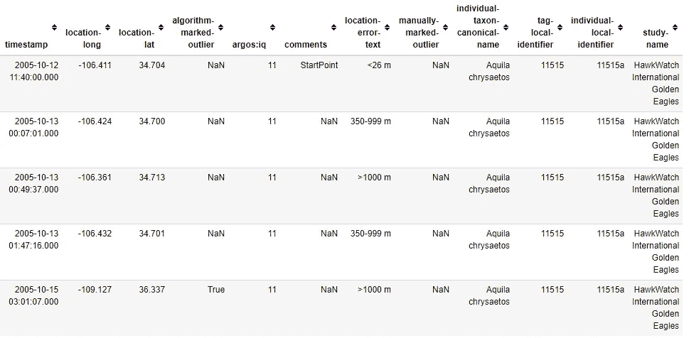
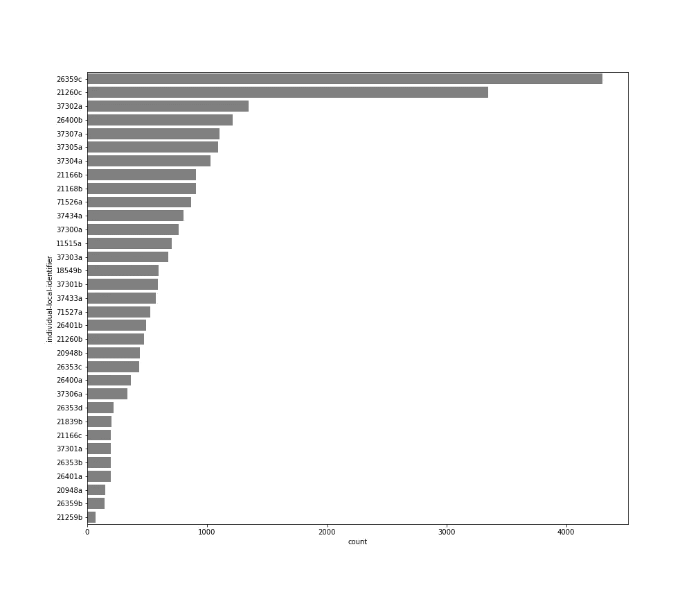
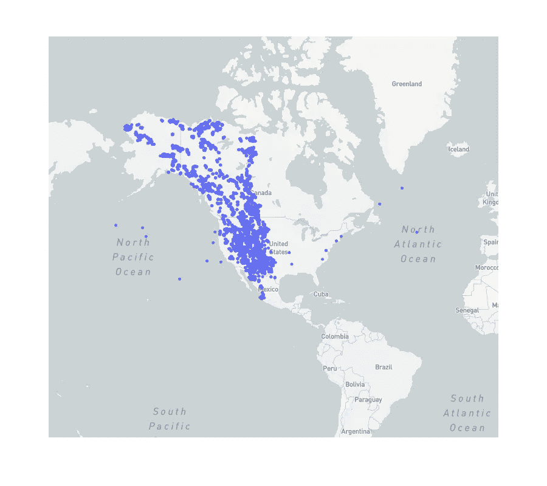
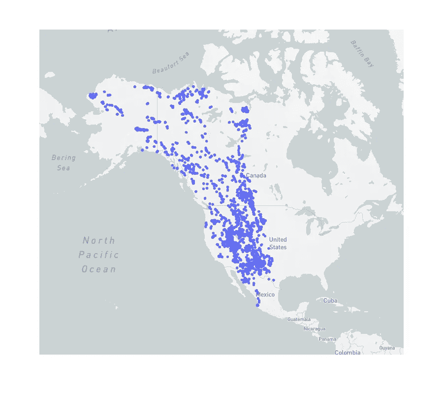
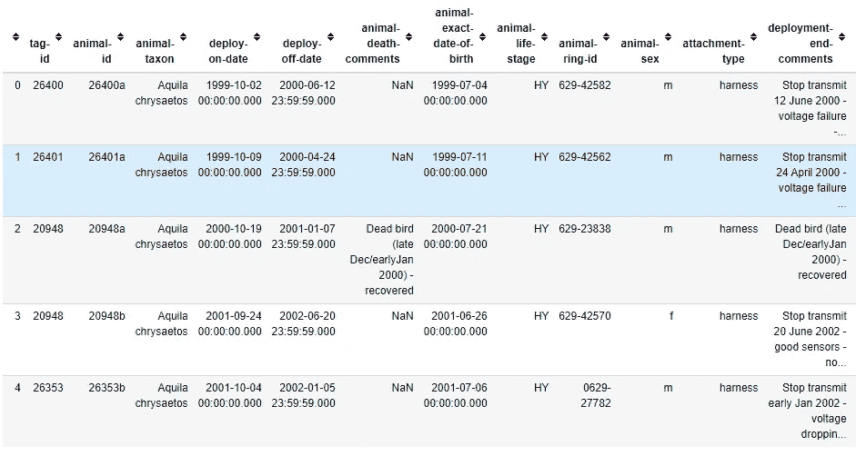
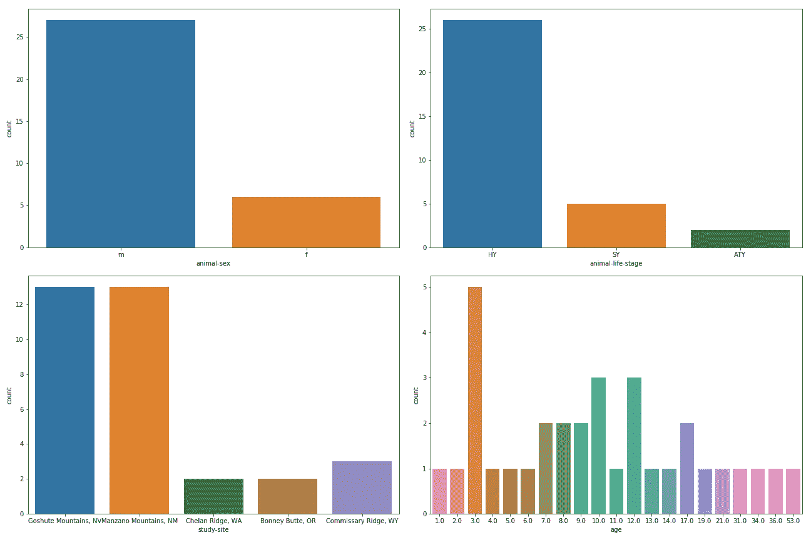
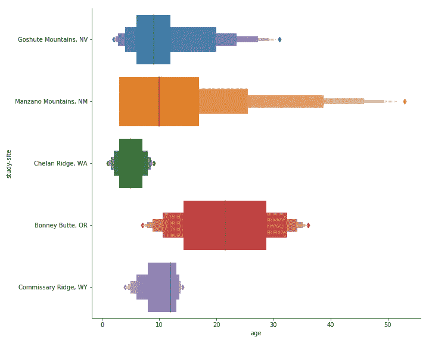
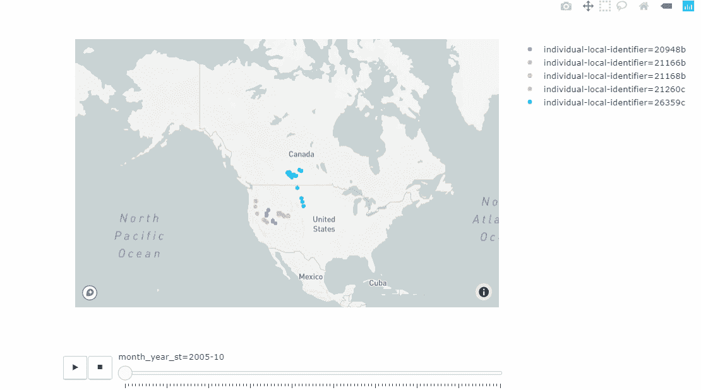
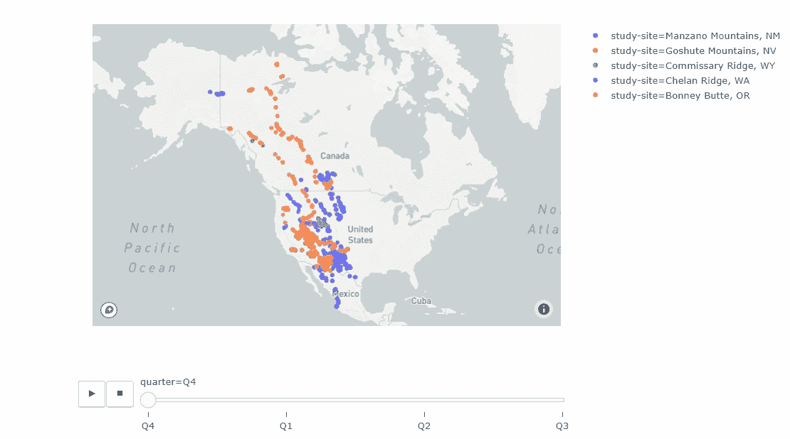

# 分析空间和时间上的运动数据

> 原文：<https://towardsdatascience.com/analysing-movement-data-in-space-and-time-8521c5e8bf46?source=collection_archive---------14----------------------->

## 时间序列和数据驱动的时空动画，包含 33 只鸟(金雕)，历时十年。

空间和时间上的运动数据提供了关于所研究的物体，即车辆、人和动物的行为的关键信息。

对空间和时间运动的洞察推动了许多人类和生态研究。这些研究有助于深入分析和理解复杂的过程，如动物和人类的迁移、森林火灾和自然灾害以及流动性和运输。



Somayeh Dodge, A Data Science Framework for Movement

由于数据科学、人工智能和跟踪设备，科学家现在可以研究、模拟和预测鸟类。此外，他们可以了解自己的迁移模式、迁移原因、迁移目的地以及许多其他关键问题。

在本文中，我使用来自 [Movebank](https://www.movebank.org/) 的数据集进行了深入的时空分析。[数据集](https://www.datarepository.movebank.org/handle/10255/move.951)由北美西部 10 年来 33 只鸟(金雕)的轨迹组成。

## 探索性数据分析

我们像往常一样用熊猫读数据。

```
df = pd.read_csv(“goldenEagles_dataset.csv”)
df.head()
```

该数据由时间戳、纬度和经度列以及鸟的个人本地标识符组成。



让我们计算出每只鸟有多少行，并用 Seaborn 绘制出来。

```
fig, ax = plt.subplots(1, figsize=(14,12))
sns.countplot(y=’individual-local-identifier’, data=df);
```



Countplot

大多数鸟都有超过 500 分，但是我们也有超过 1000 分的鸟。低于 100 分的鸟可能是由于死亡或追踪器的技术问题。

让我们用简单的一行代码创建一个点的 Plotly Express 地图。

```
px.scatter_mapbox(df, lat=’location-lat’, lon=’location-long’, zoom=2, width=900, height=800)
```

Plotly Express 是 Plotly 的高级 API。有些人甚至把 Plotly Express 比作 Seaborn 之于 Matplotlib。从下面的地图可以看出，鸟类的飞行轨迹大多是墨西哥和北美的狭窄走廊。接下来我们将更深入地分析，但是现在，一些异常值需要我们注意——海洋中的那些点和东部的其他一些点是异常值。



数据集具有来自算法标记以及手动标记的离群值列。我们可以根据纬度和经度进行排除，但由于数据集中有标记异常值，我们从数据帧中过滤掉这些标记异常值。

```
# Filter out outliers
df= df[(df[‘algorithm-marked-outlier’].isnull())&(df[‘manually-marked-outlier’].isnull())]# Plot scatter map with Plotly Express
px.scatter_mapbox(df, lat=’location-lat’, lon=’location-long’, zoom=2, width=900, height=800)
```

如下所示，这是我们去除异常值后的曲线图。



最后，对于我们的探索性数据分析，我们参考数据集附带的参考表来了解这些鸟的附加属性。

```
ref_df = pd.read_csv(“reference_table.csv”)
ref_df.head()
```

下表显示了引用表的一些列。我们这里有一些有价值的栏目，可以揭示这种鸟的特征，即性别、产地、生命阶段和部署日期。



Reference table

这是这张桌子的一些引人注目的图像。

```
fig, ax = plt.subplots(2,2, figsize=(18,12))
sns.countplot(ref_df[‘animal-sex’], ax= ax[0,0])
sns.countplot(ref_df[‘animal-life-stage’], ax= ax[0,1])
sns.countplot(ref_df[‘study-site’], ax= ax[1,0])
sns.countplot(ref_df[‘age’], ax= ax[1,1])
plt.tight_layout()
plt.show()
```

下图显示了某些特征的计数图。左上角显示了雌鸟和雄鸟的分布——大多数鸟碰巧都是雄性。右上是部署开始时动物的年龄等级或生命阶段。左下显示了最初的研究地点，而右下是鸟类的年龄分布



Counplots

此外，在追踪这些分类特征的过程中，我们可以将鸟的年龄联系起来。比如我们可以看到学习地点和年龄的关系。

```
sns.catplot(x=”age”, y=’study-site’, kind=”boxen”, orient=”h”, height=8, aspect=10/8, data=ref_df);
```



现在，我们对数据集有了更好的理解，让我们进入动画和分析运动数据。然而，在此之前，我们将引用表合并到我们的数据框架中。

```
df_merged = pd.merge(df, ref, left_on=”individual-local-identifier”, right_on=”animal-id”)
```

## 这些鸟迁徙到哪里？什么时候？

让我们为数据帧创建一些时间戳。

```
df_merged['month'] = pd.DatetimeIndex(df_merged['timestamp']).month
df_merged['month_year'] = pd.to_datetime(df_merged['timestamp']).dt.to_period('M')
df_merged['quarter_year'] = pd.to_datetime(df_merged['timestamp']).dt.to_period('Q')
df_merged['quarter'] = df_merged['quarter_year'].astype(str).str[-2:]
df_merged['month_year_st'] = df_merged["month_year"].dt.strftime('%Y-%m')
```

上面显示的地图很拥挤，并且没有提供太多关于它们何时何地迁移的信息。这就是动画发挥重要作用的地方。

让我们首先为一年中的每个月(从 1999 年到 2009 年)制作鸟的动画。

```
px.scatter_mapbox(df, 
     lat=’location-lat’, 
     lon=’location-long’, 
     color= ‘individual-local-identifier’, 
     animation_frame=”month_year”, 
     zoom=2
 ).update(layout={“mapbox”:{“style”: “satellite-streets”}})
```

下面的 GIF 展示了数据集十年来每个月每只鸟的动画。



更好的洞察力，但不是那么细粒度的运动洞察力，因为这显示了一年中所有月份的顺序。然而，你可以看到这些鸟往返于墨西哥、美国和加拿大的所有动向。我们还可以将所有数据汇总到一年的各个季度，并制作动画，看看是否有什么模式。

```
px.scatter_mapbox(df_merged, 
 lat=’location-lat’, 
 lon=’location-long’, 
 color= ‘study-site’, 
 animation_frame=str(‘quarter’), 
 zoom=2,
 )
```

此外，这是基于季度的动画的 GIF。



这一较高的总量显示了一种更好的模式。在 Q1，几乎所有的鸟都在美国境内，只有少数在加拿大。相反 Q3，没有一只鸟在墨西哥。

## 结论

在本教程中，我们已经看到了如何通过使用 Panda 和 Plotly 库制作鸟类迁徙动画来获得洞察力。本文的代码可以从 Github 获得。

 [## shaka som/运动

### 空间和时间中的运动数据提供了关于所研究物体(即车辆)行为的重要信息

github.com](https://github.com/shakasom/movement) 

要直接体验本教程，请通过以下链接使用 Binder，无需任何安装。

[](https://mybinder.org/v2/gh/shakasom/movement/master) [## GitHub:shaka som/运动/大师

### 单击运行此交互式环境。来自活页夹项目:可复制、可共享、交互式计算…

mybinder.org](https://mybinder.org/v2/gh/shakasom/movement/master)