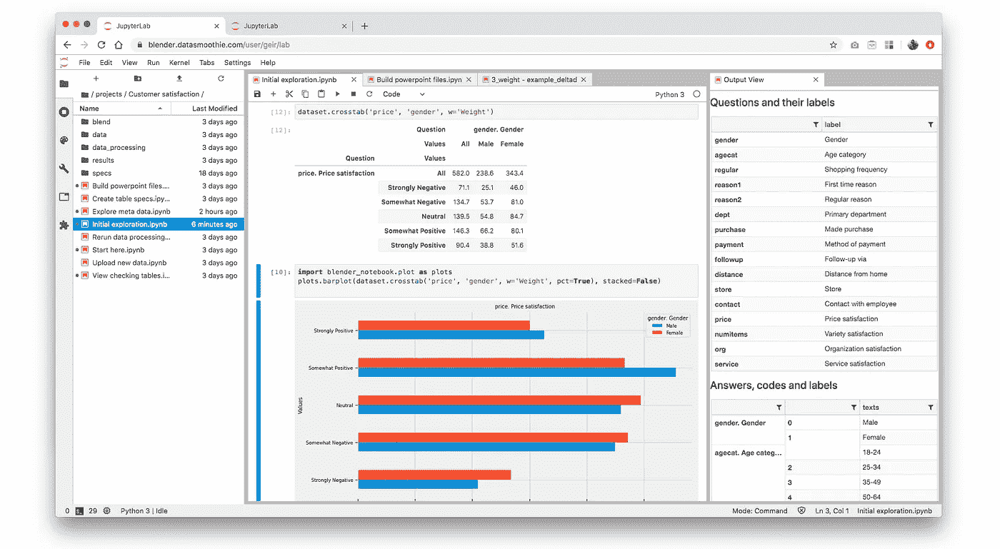
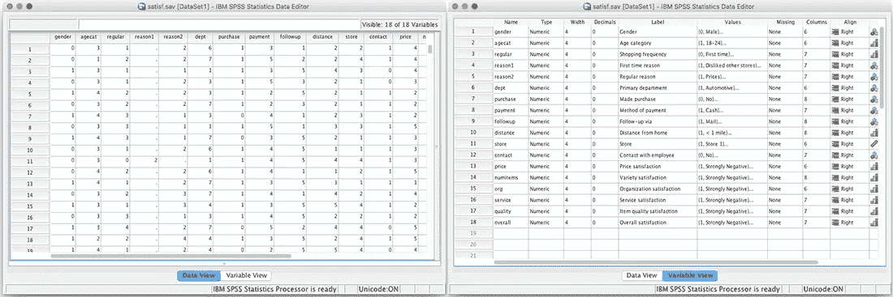
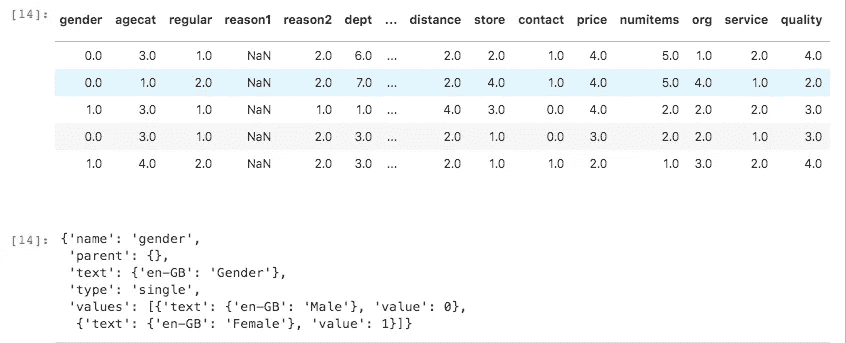
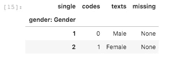
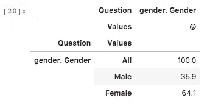
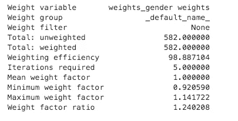
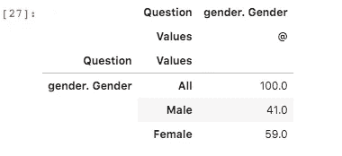
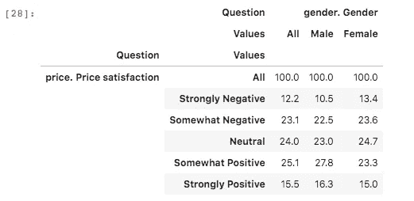
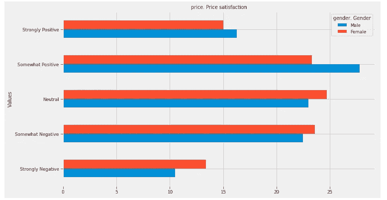

# 使用 Python 和 Jupyter 笔记本分析调查数据

> 原文：<https://towardsdatascience.com/analysing-survey-data-with-python-and-jupyter-notebooks-f0339ccd989d?source=collection_archive---------11----------------------->

## 笔记本环境非常适合处理调查数据的特殊性质

调查是数据世界的变形虫。不是因为它们会吃掉你的大脑(反正不是字面上的意思)，而是因为它们的形状和结构一直在变化。

即使是那些旨在保持不变的调查——定期追踪我们对从政客到马桶刷等一切事物的感受的研究——也在不断变化。客户以他们可爱的创造力，抛弃问题，发明新的问题，并想出无穷无尽的新聚合来执行结果。

在本文中，我们将展示为什么 Jupyter 笔记本，一个交互式脚本和故事讲述环境，与 python 库 Quantipy 相结合，是驯服食脑者并使他们屈从于我们意愿的完美工具集。



A screenshot of a Jupyter Lab setup optimised for analysing survey data with the Python open source library Quantipy. The window on the right shows a list of all the variables in the data for quick lookup.

# 从 SPSS(或 CSV 或 ddfs)导入数据

调查数据通常一方面存储为数据，另一方面存储为元数据。在 SPSS 中，用户可以查看数据(在下图的左侧)或变量信息，即元数据(在图像的右侧)。



SPSS splits the data and the variable information (the metadata) into two seperate views. The open source python library Quantipy can read SPSS and other survey specific file types and remove the pain of mapping the numeric results in the data to human readable labels.

开箱即用，python 并不擅长处理丰富的调查元数据，其主要用途是处理结构简单得多的事务性数据。这意味着，在我们使用标准 python 库运行计算之后，我们必须将元数据中的变量标签映射到我们的结果上(清楚地表明，在我们的输出中，相对于“1”的百分比数字实际上是指“男性”)。这在处理 python 无法理解的专有数据格式(如 Unicom Intelligence 的 ddf/mdd 文件)时变得更加棘手。

但是，Quantipy 为 SPSS 和 Unicom Intelligence(以前称为 Dimensions)文件提供现成的阅读器，并将数据和元数据转换为 pandas 数据框架和自己的元数据模式。

# 快速浏览结果

我们首先命名并创建一个数据集(数据集就是数据和元数据的组合):

```
dataset = qp.DataSet("Customer satisfaction wave 1")
dataset.read_spss("customer_satisfaction.sav")
```

Quantipy 将响应存储在 dataframe( `dataset._data`)中，将元数据存储在 python 字典(`dataset._meta`)中。我们可以通过查看字典的 columns 元素来引用关于特定变量的元数据。

```
dataset._data.head()
dataset._meta['columns']['gender']
```



数据部分看起来和在 SPSS 中一样，但是 json 元数据模式是 Quantipy 独有的。它支持多种语言和各种类型的变量(列):单选、分隔集和网格。

Quantipy 提供了一个方便的快捷功能，可以通过命令查看元数据

```
dataset.meta('gender')
```



那么，让我们看看有多少男性和女性做了顾客满意度调查。

```
#the pct parameter decides whether we show percentages or the count
dataset.crosstab(“gender”, pct=True)
```



等等，我们知道只有 59%的顾客是女性，但她们却是调查对象的 64.1%。我们需要权衡我们的变量，这样我们的结果才能真正代表我们的客户群。

# 对答案进行加权以正确代表总体

我们将使用 Quantipy 的 RIM 加权算法实现(它有其他加权选项)，这允许我们使用任意数量的目标变量进行加权。在这种情况下，我们只使用一个；性别。

```
# Quantipy's Rim class implements the RIM weighting algorithm
scheme = qp.Rim('gender weights')# Men should be 41% and women 59%
scheme.set_targets({'gender':{0: 41, 1: 59}})dataset.weight(scheme,
               unique_key='RespondentId',
               weight_name="Weight",
               inplace=True)
```



当 Quantipy 运行权重时，它会生成一个权重报告，这允许我们仔细检查权重是否做了任何疯狂的事情。这里的最大重量是 1.14，我们对此很满意。现在，我们的数据集中有了一个新变量，叫做“权重”,我们可以在计算中使用它。

```
dataset.crosstab(‘gender’, pct=True, w=’Weight’)
```



现在我们可以看到，我们的客户群中有 41%是男性，这在结果中并没有被低估。

# 快速可视化我们的结果

我们在 Jupyter 实验室环境中的事实意味着我们可以很容易地看到结果。我们关注价格变量，它显示了客户对定价的满意程度。

```
dataset.crosstab('price', 'gender', w='Weight', pct=True)
```



现在让我们想象一下，以便更好地了解结果。为了简洁起见，我们不会深入细节，但是您可以看到使用标准功能来可视化数据是多么容易。

```
import blender_notebook.plot as plots
plots.barplot(dataset.crosstab('price', 
                               'gender', 
                               w='Weight', 
                               pct=True), 
              stacked=False)
```



## 为未来的项目自动化我们的工作

在 Jupyter 笔记本上工作还有另外一个好处:它让我们的笔记本可以重复使用，从而使我们的工作自动化。基于网飞数据科学团队的想法(参见:B [eyond Interactive:网飞笔记本创新](https://medium.com/netflix-techblog/notebook-innovation-591ee3221233))，我们之前已经报道过[如何自动化数据处理任务，如清理、加权和重新编码](/automating-survey-data-analysis-with-open-source-software-f08f000bd672)以及[如何自动化生成 PowerPoint 幻灯片组](/one-survey-100-decks-and-1-000-slides-in-10-minutes-8fcfd1b246ee)。这些都是因为我们的工作是在笔记本上完成的。

Jupyter 笔记本正在数据科学界掀起风暴，这一次，调查数据分析不应落后。用笔记本分析调查数据消除了数据处理专业人员和研究人员的全部痛苦，并能对双方的生产力产生奇迹。

Geir Freysson 是 Datasmoothie 的联合创始人，这是一个专门从事调查数据分析和可视化的平台。如果你对使用开源软件进行调查数据分析感兴趣，注册我们的时事通讯，名为[自发认知](https://confirmsubscription.com/h/r/123C34C5066BF0AD2540EF23F30FEDED)。