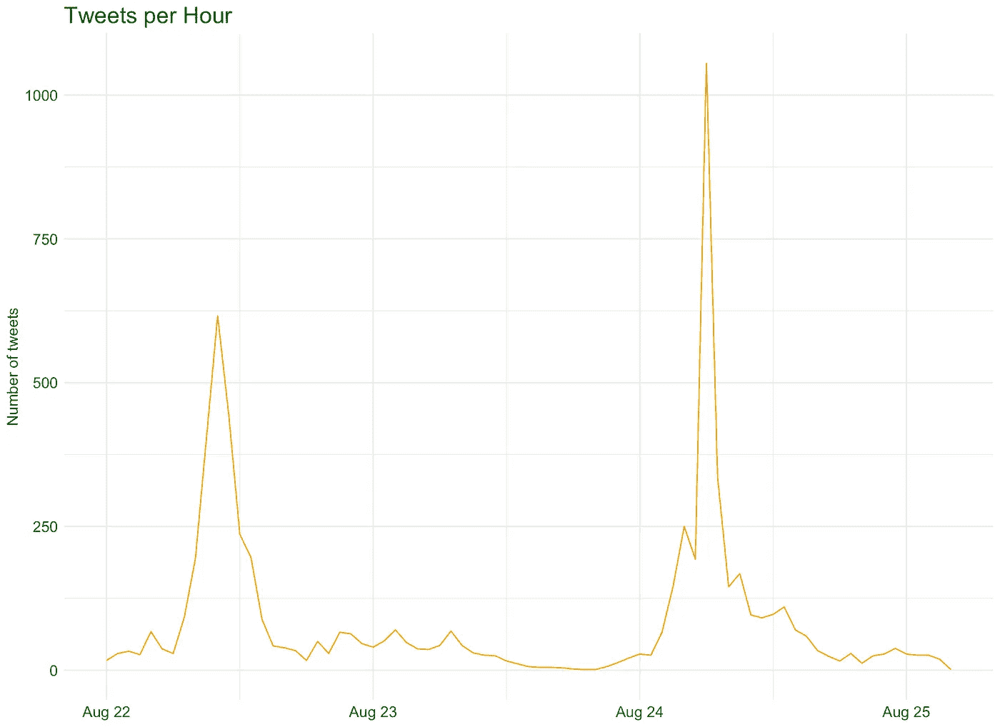
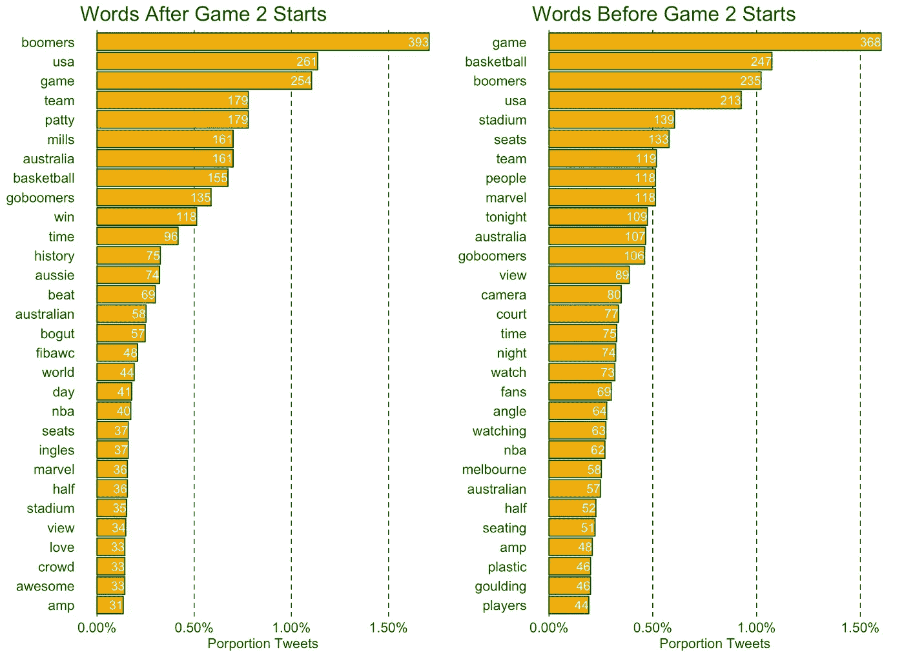
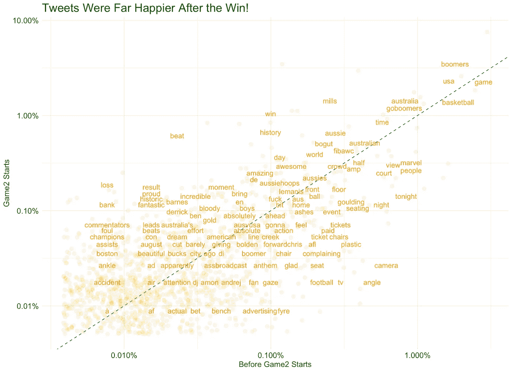
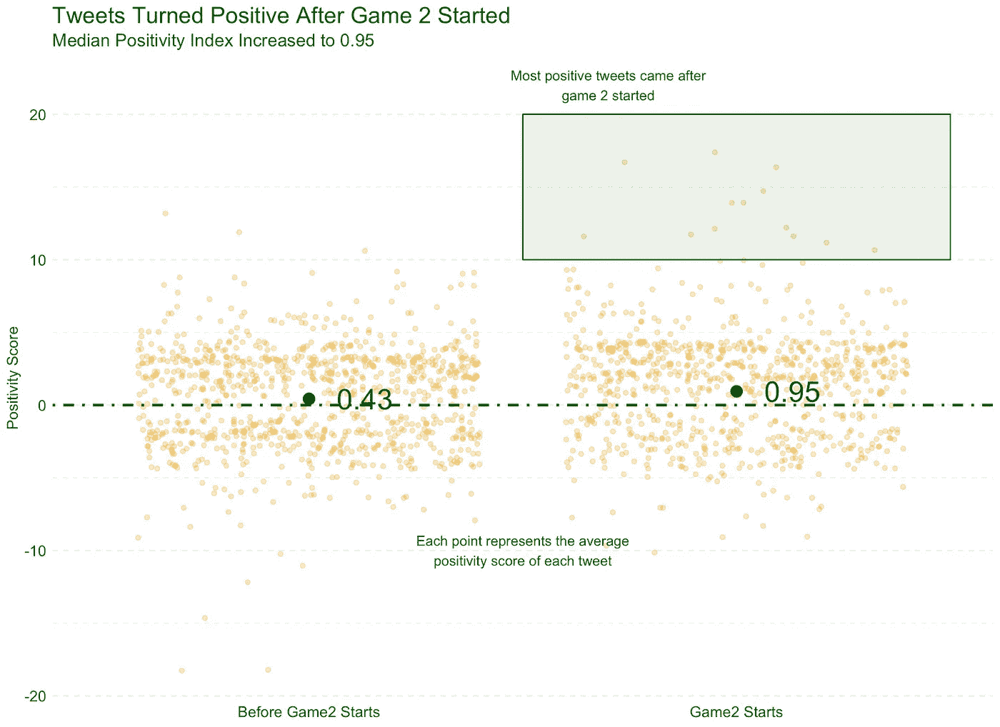

# 分析美国队对澳大利亚队的篮球推文

> 原文：<https://towardsdatascience.com/analysing-team-usa-vs-australian-basketball-tweets-using-rtweet-in-r-465b62a29a5d?source=collection_archive---------27----------------------->

## 在 R 中使用 rtweet 和 tidyverse

2019 年 8 月 24 日，澳大利亚男子篮球队 Boomers 创造了历史，他们能够上演自己的大卫和歌利亚时刻，有史以来第一次击败美国队。更令人印象深刻的是，美国队 13 年来从未输过一场比赛。这是澳大利亚篮球历史上的一个奇妙时刻，当美国派出了被广泛认为是他们中较弱的球队之一时，这是一个让我们都回味的时刻。不管结果如何，我们能够让世界上最好的国家参加表演赛，这是值得庆祝的。

事实并非如此…

在漫威体育场历史性的第一场男子篮球赛后，媒体的叙述似乎充满了负面，主要集中在昂贵的座位上，球迷的视野很差。

我怀疑这种情况在任何地方都会发生，但我们澳大利亚人似乎比大多数人更容易让自己的观点摇摆不定——当事情进展不顺利时，我们非常乐意取笑个人或团队，但当事情进展顺利时，我们会迅速转变态度(尼克·克耶高斯打招呼)。

这项分析将着眼于两场比赛前后的 Twitter 活动，试图证明或反驳叙事的变化。

为了收集 tweet 数据，使用了`rtweet`和`ROAuth`包。blow analysis 收集并分析了 8 月 22 日至 8 月 25 日下午 2 点之间的推文。使用官方标签- `#BoomersUSA`引用`@BasketballAus`的推文被删除。

这个项目的完整代码库和数据可以在[这里](https://github.com/JaseZiv/Boomers-vs-USA-Tweets)找到

如果这条推文是在`2019-08-24 04:00:00 UTC`(第二场比赛的提示时间)之后录制的，它将被归类为`Game2 Starts`中的推文。这使得我们可以将历史性的第二场比赛之前的推文与神奇之夜期间和之后发生的推文进行比较。

# 推特分析

查看自第一场比赛以来的所有推文，我们可以看到第二场比赛每小时的推文更多。毫无疑问，令人震惊的结果在其中起了很大的作用。

Tweets per hour peaked during the historic game 2

在 4019 条“收藏夹”中，NBATV 的以下推文是最受欢迎的推文:

> 感觉棒极了。…我希望我们都能以此为基础。@Patty_Mills 描述了他带领篮球队首次战胜美国队后的心情

在所分析的时间段内，被转发次数最多的推文来自 NBL，有 833 次转发。推文是:

> 第四节帕蒂·米尔斯是一件艺术品🔥# BoomersUSA @ SBSVICELAND @ SBSOnDemand

# 使用的 TWEET 单词

在我们可以测量推文的情绪之前，推文字符串需要被分割成“令牌”(或单个单词)。

一旦这些标记被取消嵌套(分离)，我们就可以画出最常用的单词。重要的是，停用词和其他我们在分析中不想要的词已经被省略了。停用词包括“and”、“the”、“a”等，这些词对情感分析没有太大帮助。此外，“BoomersUSA”被删除了，因为这是游戏的标签，几乎在所有的推文中都会提到。

下面列出了第二场比赛前后推特上最常用的 20 个词。

不出所料，“座椅”、“塑料”、“座椅”是第二场比赛开始前推特中频繁出现的词汇，而第二场比赛开始后推特中只出现了“座椅”。对于第二场比赛开始后的推文，“历史”，“帕蒂·米尔斯”，“真棒”和“爱”都频繁出现在推文中——非常软和糊状嘿？

Not so many seating issues for tweets after game 2 started (left panel)

下面的图表可以让我们更好地了解第二场比赛前后使用的单词之间的差异。贯穿剧情的对角线右下方的单词表示在第二场比赛之前在推特上更频繁使用的单词，而该线上方的单词在第二场比赛期间和之后更频繁使用。

看起来我们终于是快乐的一群了…

# 推特情感分析

一旦标记被分离，就可以计算情感分数。

将使用的方法是由芬恩·厄普·尼尔森([http://www2.imm.dtu.dk/pubdb/views/publication_details.php?)创建的情感分析常用词典 id=6010](http://www2.imm.dtu.dk/pubdb/views/publication_details.php?id=6010) )，称为 *AFINN* 词典。更积极的词(比如“棒极了”)比更消极的词(比如“崩溃了”)得分更低，前者得分更低。

为了感受情绪分析的力量，下面这条推文是最积极的推文，积极指数为 17:

> 对婴儿潮一代今天的胜利感到非常激动，帕蒂·米尔斯在关键时刻表现得非常出色。非常棒的团队合作。带来世界杯！#BoomersUSA

在光谱的(完全)另一端，下面的推文是最负面的，得分为-18(抱歉，我已经尽最大努力清除它们):

> 谁他妈的！&%雇了这些人来组织这次活动，真是愚蠢！&%ing bs stich up。邦宁斯的$椅子有分叉的障碍吗？&%.像 WTF 一样，投资建造体育场的公司肯定没有那么穷。#BoomersUSA

不出意外，最积极的推文是在我们赢了之后，最消极的是在第一场比赛之后。

绘制每条推文的情绪得分分布，我们可以清楚地看到，第二场比赛开始后的推文变得更加积极——这些推文的积极得分中位数(积极词与消极词的比率)为 0.95，是第二场比赛前推文中位数 0.43 的两倍多。

正如我所料，我们在历史性的胜利后变得更加开心…几乎到了忘记座位“崩溃”的地步，尽管第二场比赛是在确切的场地进行的，座位安排也是确切的…非常奇怪。

总有一天，我会将我们澳大利亚人的这一理论进行终极测试，看看我们如何回应基尔吉奥斯的成功……如果他尝到了终极成功的滋味！

***本帖原创，发布在不怪数据博客***[***【https://www.dontblamethedata.com】***](https://www.dontblamethedata.com/)