# 分析英国退出欧盟的影响:统计方法

> 原文：<https://towardsdatascience.com/analysing-the-effects-of-brexit-a-statistical-approach-aeb276289fa3?source=collection_archive---------12----------------------->

## 了解英国退出欧盟事件如何影响我们周围的世界

Photo by [Habib Ayoade](https://unsplash.com/@thedolapo?utm_source=medium&utm_medium=referral) on [Unsplash](https://unsplash.com?utm_source=medium&utm_medium=referral)

依我拙见，数据科学家的武器库中最强大的武器之一无疑是将统计应用于特定用例的能力，以提取关于相应数据的底层结构的有意义的见解。通过统计建模和分析，数据科学家将能够更好地理解正在研究的领域；从而为进一步的机器学习建模和其他分析打下坚实的基础。因此，鉴于我的背景，我决定加强我的统计能力，这是我所知道的唯一有效的方法——用用例来练习。

随着对英国退出欧盟越来越多的关注，我立即发现这是一个绝佳的实践机会。下面是不同过程、技术和分析的总结。

首先，我想从最重要的英国退出欧盟事件开始，如下图所示。

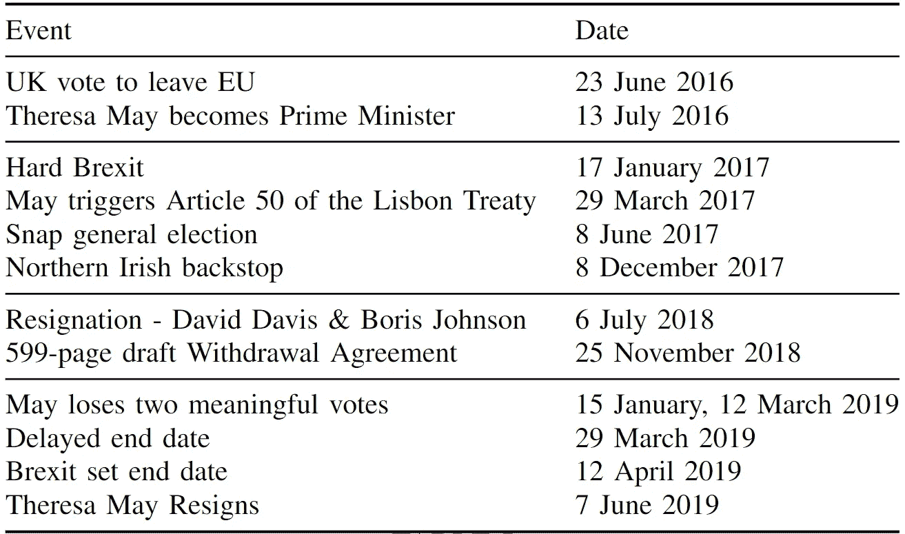

The Major Brexit Events

获得这些主要数据后，我们就可以着手分析、关联和测试这些英国退出欧盟事件和其他影响之间的潜在因果关系。这一统计分析背后的计划如下:抓取重大事件，分析英镑/欧元汇率、英镑有效汇率指数、英国交易数据、英国消费者价格指数，最后分析对加密货币金融市场的影响。

# **英镑/欧元汇率**

## OHLC

从 2014 年 1 月 1 日到 2019 年 6 月 19 日的英镑/欧元历史汇率数据是通过 *quantmod* R 的软件包从雅虎财经获得的。第一步是按年份分组，以便能够绘制 OHLC 图表，并计算每一年的一些描述性统计指标。

> OHLC 图是一种条形图，显示每个时期的开盘价、最高价、最低价和收盘价。OHLC 图表很有用，因为它们显示了一段时间内的四个主要数据点，收盘价被许多交易者认为是最重要的。— [投资媒体](https://www.investopedia.com/terms/o/ohlcchart.asp)

此外，在 OHLC 图表的顶部，还绘制了各种其他统计图表，如*布林线(BB)、移动平均线收敛背离(MACD)、变化率(ROC)、随机动量指数(SMI)、相对强弱指数(RSI)、商品通道指数(CCI)、*和*止损反转(SAR)* 。这些图表都提供了对特定时间序列所遵循的趋势的统计洞察。不用说，这些统计工具在金融交易和投资领域被广泛采用。

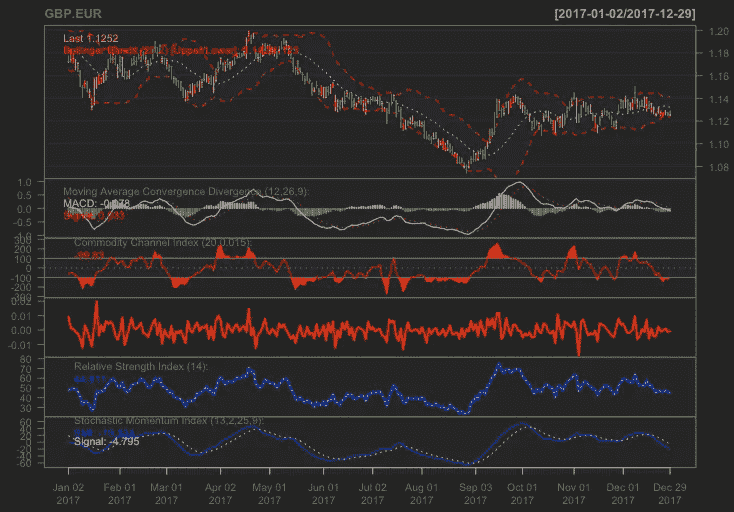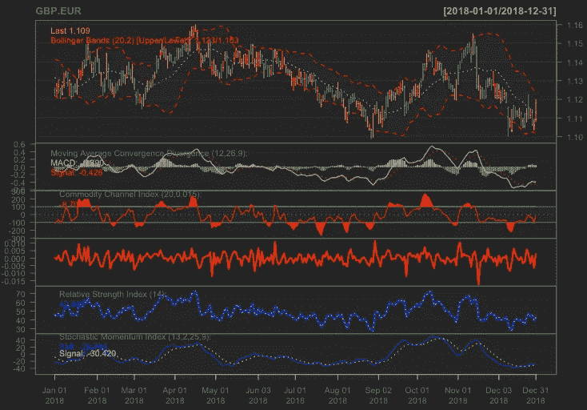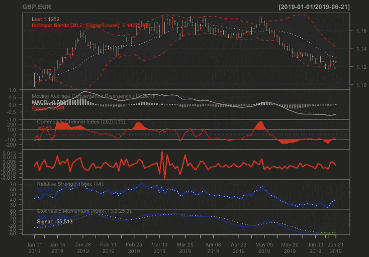

OHLC charts of the GBP/EUR Exchange Rate along with some other statistical charts.

## 因果效应

除了分析 OHLC 价格，我还想确定一个特定的事件是否对时间序列有直接的因果影响。经过一番研究，我找到了谷歌发布的这篇论文，它完美地完成了我想要分析的内容。简而言之，本文介绍了一种通过构建贝叶斯结构时间序列模型来确定单个事件因果影响的统计显著性的方法。反过来，这个模型然后被用来预测时间序列可能是什么样子，假设该事件从一开始就没有发生过。然后，基于贝叶斯单侧尾区概率，获得 p 值来说明这种因果影响的统计显著性。

Causal Impact Result Visualisation taken from the package’s Github page.

此外，所提供的软件包还可以生成可视化结果(如下图所示),并能够将统计结果输出为通俗易懂的报告。总之，感谢参与这项研究的每一个人。工作做得非常好！

## 分析

基于上述设想，2016 年初，英镑相对于欧元的价值遭受重创，英镑/欧元汇率开始下跌。正如布林线(描述波动性)所示，英镑/欧元汇率波动极大，在上下区间波动。然而，在 2016 年 6 月(英国退出欧盟投票)前后，汇率遭受了毁灭性的负面影响，导致不断触及布林波动较低波段。与此一致，MACD 也支持英国退出欧盟投票对汇率产生负面影响的假设。后者主要是因为 MACD 线已跌破信号线，而不是投票前后的时间点，这似乎更符合信号。同样，中华民国路线也支持和暗示英国退出欧盟投票所带来的不利影响的事实。就在 2016 年 7 月开始之前，ROC 线描绘了一个急剧的负尖峰，这强烈表明熊市投资，意味着投资亏损。此外，在构建贝叶斯模型并测试获得这种效果的概率后，获得的 p 值具有统计学意义；因此，这表明英国退出欧盟的投票确实损害了英镑/欧元的汇率。

同样，SMI 也暗示了 2016 年 6 月下旬左右的看跌投资，该信号继续下降到 2016 年 7 月的最终低点-60(投资者通常认为 SMI-40 是高度看跌的趋势)。除此之外，基于 RSI，作为投资的英镑/欧元似乎在 2016 年 6 月下旬极度走软。诚然，蜡烛图以及之前讨论的统计方法似乎在 2016 年 7 月中旬开始企稳，这大约是特里萨·梅(Theresa May)被任命为英国首相的时间。然而，这一事件在统计上可能不会对汇率产生积极影响，因为汇率在今年剩余时间里仍然高度不稳定。这一结论也得到了因果贝叶斯推理模型的支持，该模型得出了一个不显著的 p 值。

进入 2017 年，英镑/欧元外汇收盘价再次持续触及布林带下轨，导致持续高度波动的下行模式，主要是在参考 ROC 图时。今年的第一个重大英国退出欧盟事件发生在 1 月 17 日；因此，大约在那个时候，所有图表都显示汇率收盘价出现了负峰值。CCI 甚至达到了-200 的数值，证明了在那个时候，汇率遭受了坚定的下跌趋势。除此之外，还可以看到 SMI 线已经跌破了均线信号线。此外，当在原始时间序列上绘制 SAR 图时，除了确认 1 月中旬的大幅下跌之外，它还突出了该月剩余时间内收盘价的上涨。同样，这种变动可能与这一汇率表现出的极度波动行为高度相关，因为从贝叶斯模型获得的 p 值未能拒绝具有统计显著性的零假设。CCI 表明 2017 年 3 月下旬左右的看涨趋势(绝佳的投资机会-表明未来收盘价上涨)，这可能与里斯本条约第 50 条的触发有关，这也导致了因果推断的统计显著 p 值。在此期间，汇率达到了今年迄今为止的最高值。正如 CCI 所代表的，汇率的下一个令人兴奋的运动将发生在 2017 年 5 月下旬，接近英国大选(6 月 8 日)。

此外，CCI 的分析也潜在地暗示了 6 月初的稳定下降；然而，像 SMI 和 RSI 这样的其他方法在这一天似乎没有受到太大的影响。因此，解释这种行为的一个假设可能是，投资者可能在选举日之前就采取了行动，从而产生了早期效应。为了支持这一结论，2017 年 4 月 18 日举行了一次提前选举，因此，这也是今年最重要的价值下跌的开始，在 8 月底达到最低点。因此，这是一个非常可行的假设，即提前大选的影响主要是在事件本身之前观察到的。接下来，从尾区概率获得的 p 值显示了对汇率的统计上显著的不利影响。

今年的最后一件大事是北爱尔兰无缝边境支持协议(12 月 8 日)。从年底到 2018 年，收盘价似乎再次上涨，这是有道理的，因为支持协议将意味着英国与欧盟保持密切的关系。一致的是，在构建贝叶斯模型之后，p 值也显示出在这一事件之后统计学上显著的值增加。此外，2018 年的表现与前几年非常相似，显示出类似的波动特征，市场数据在布林线之间来回波动。ROC 似乎相当稳定，只有 6 月下旬(负峰值)和 11 月下旬(负峰值)是例外。巧合的是，在此期间，也有两个与英国退出欧盟相关的重大事件，可能引发了极端运动。然而，CCI 圆图在这些时期没有显示出显著的效果，并且 SMI 似乎平滑地跟随信号，然而，发现在影响负面效果方面是显著的(两个 p 值都< 0.05)。

目前，2019 年似乎为英镑/欧元汇率提供了一些稳定性。虽然仍然相当不稳定，但 CCI、SMI 和 RSI 图显示交易中性，尤其是在 2 月和 4 月之间，价值似乎也相对保持在布林线之间。在 1 月 15 日和 3 月 12 日，May 失去了两次必要的投票，这两次投票都导致了所有统计指标的上升趋势，这是基于获得的尾部区域概率 p 值的具有统计意义的结果。此外，英国退出欧盟的初始结束日期(2019 年 4 月 12 日)导致价值下降，后来通过延迟英国退出欧盟的决定重新平衡。令人惊讶的是，乍一看，梅的辞职似乎并没有改变交易所的行为，因为 ROC 图显示当时几乎没有显著的变化率；尽管如此，ROC 图表明，在该特定事件之后，交易所的价格可能会上升(正的 ROC 表明潜在的看涨趋势)。此外，使用贝叶斯模型获得的 p 值表明对英镑/欧元值有显著的不利影响。然而，如上所述，ROC 非常小，并且积极影响的指示也没有得到其他指标的支持。

Analysing the Statistical Significance and Impact (positive or negative) of the Causal Effect on the GBP/EUR per Major Brexit Event.

## 英镑/欧元投资风险

为了有效地确定构建风险评估的最佳模型，我们必须首先检查**正态性、独立性和统计平稳性**。

Basic Descriptive Statistics for the GBP/EUR Exchange per year.

首先，对组成时间序列的描述性统计数据进行一些分析对于开始理解这些数据的基本结构是必不可少的。2016 年是方差最大、负偏差最大、对数收益峰值最高(峰度较高)且均值最低(也是负值)的一年。计算归一化的对数回归，并绘制成折线图和直方图，以便更好地理解回归的密度，同时还绘制了一些描述性统计数据，如下所示。

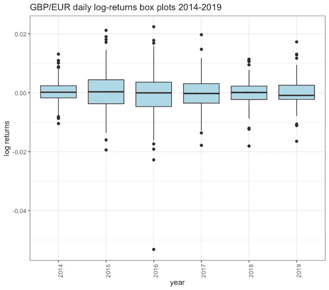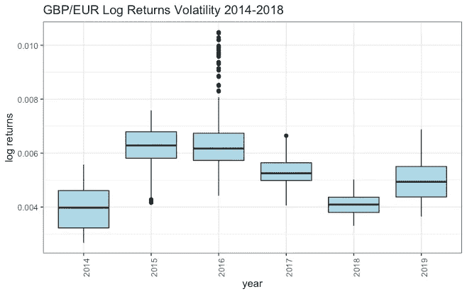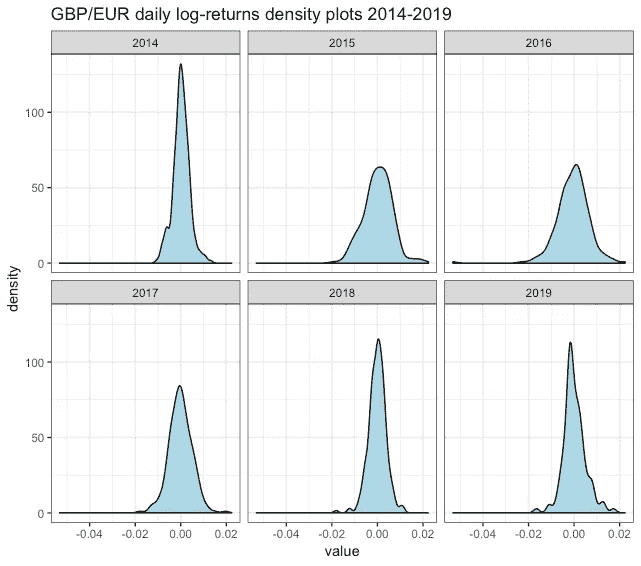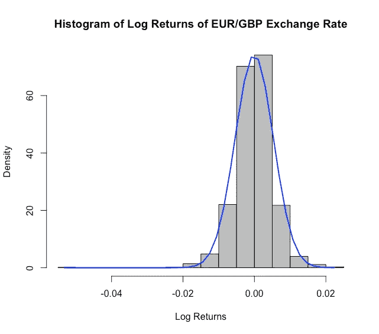

Descriptive Statistics Plots for GBP/EUR Closing Log Returns per year.

此外，如下所示，对数回归时间序列通过降低其幅度进行了清理，然后绘制在原始对数回归时间序列上，这有助于提供一些关于潜在异常值的见解。

Outlier Detection for the Closing Log Returns of the GBP/EUR

此外，还创建了每年对数收益的分位数-分位数(Q-Q)图。很明显，Q-Q 图显示了一些偏离正态分布的情况，表明这个时间序列并不遵循高斯分布。为了进一步检查正态性，进行了两个统计测试——Jarque-Bera 测试(对整个时间序列执行)和夏皮罗-维尔克测试(每年子集)。对于这两种检验，零假设表示数据确实来自正态分布。Jarque-Bera 测试得出 p 值< 0.05；因此，拒绝了零假设，并确认了从 Q-Q 图得出的结论。

此外，对数据子集(每年)运行夏皮罗-维尔克检验，得出 2014 年、2016 年、2018 年和 2019 年的 p 值< 0.05，这进而拒绝了正态性的零假设。此外，在其他年份，测试未能拒绝零假设。尽管如此，鉴于股票市场数据不遵循正态分布的已知性质，假设这些年也不遵循正态分布。这个假设也是基于这样一个事实，即整个数据集上的 Jarque-Bera 测试返回了一个显著的 p 值。为了检验时间序列的独立性，使用了永盒检验。该测试获得了一个不显著的 p 值；因此，不能拒绝自相关的零假设。基于这个测试，然后假设这个时间序列没有任何自相关。最后，使用扩展的 Dickey-Fuller 检验来检验平稳性，其返回了拒绝单位根的零假设的显著 p 值。基于这些统计检验，构建了 AR 和 MA 值为 0 的 ARIMA 模型。通过构建扩展的自相关和互相关函数(EACF)来选择这些值。使用 ARCH 的拉格朗日乘数(LM)检验对 ARIMA 模型的残差进行了检验。该测试返回的 p 值是显著的；因此，表明 ARIMA 模型的残差中存在 ARCH 效应。由于没有 ARCH 效应的零假设被拒绝，该时间序列然后由 GARCH 模型建模。

在拟合时，模型的拟合优度使用调整后的皮尔逊检验进行测试，结果发现残差之间没有相关性。拟合优度也使用 Box-Ljung 检验进行了测试，该检验未能拒绝零假设。因此，基于这两个结果，该模型被认为是一个很好的拟合。

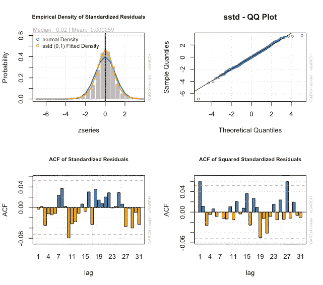

此外，如侧图所示，绘制了自相关函数(ACF)和偏自相关函数(PACF)、Q-Q 图和标准化残差的经验密度，以进一步总结拟合模型。使用拟合的 GARCH 模型，绘制了对数收益波动率，如下所示。

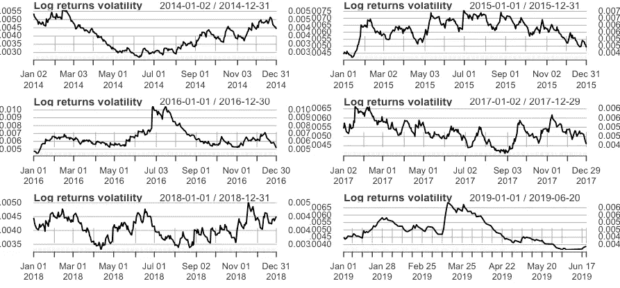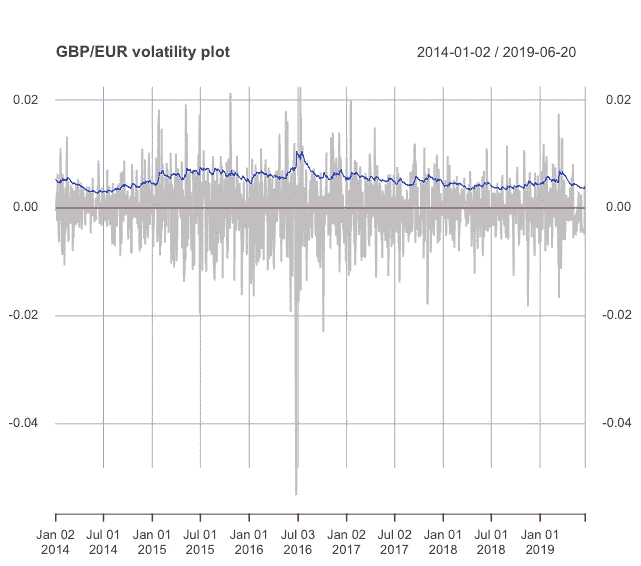

Volatility plots of the GBP/EUR exchange based on the GARCH Model

最终，使用 GARCH 模型和蒙特卡洛模拟，计算出未来 20 个交易日的投资风险，结果是-2.784%，显著性水平为 0.05。因此，该风险分析表明，英镑/欧元汇率高度波动且不可预测，任何外汇投资都可能导致不良结果。

# 英镑有效汇率指数

作为有效模拟英镑汇率强度的尝试，英镑有效汇率指数的历史数据以. csv 文件的形式从英国国家统计局获得。然后将指数时间序列可视化，并在图上添加代表主要英国退出欧盟事件的标记。该图的强大之处在于能够进一步支持前面讨论的因果推断分析，并且能够有效地将欧元的类似兑换行为映射到其他货币。

# 英国贸易数据

分析英国进出口贸易数据的目的是为了了解英镑汇率的实际波动，以及英国退出欧盟以外的外部事件对英镑汇率的影响。与前一小节类似，对这一方面进行的主要分析集中在按国家显示进出口数据的流动。通过使用垂直线标记，每个标记代表一个特定的英国退出欧盟事件，可以估计对单个国家的价值的影响。从结果来看，英国退出欧盟事件和各自与欧盟国家的进口关系之间似乎没有关联。然而，德国似乎是一个例外，在英国退出欧盟发生重大事件后，德国的进出口似乎都出现了变化。诚然，这一特征可以用不断增长的物质市场和人口来解释，这反过来会导致更多的进口和出口。

另一方面，英国退出欧盟事件后，来自/非欧盟国家的进出口似乎受到很大影响。无论是进口还是出口，数量似乎都会在特定事件发生后立即激增，这表明了直接的因果关系和影响。这种行为在中国、挪威和美国尤其明显。因此，根据这一分析，可以假设英国退出欧盟事件对英镑汇率指数有很大影响；然而，进一步的假设检验将有助于接受这一基于统计学意义的观察结果。

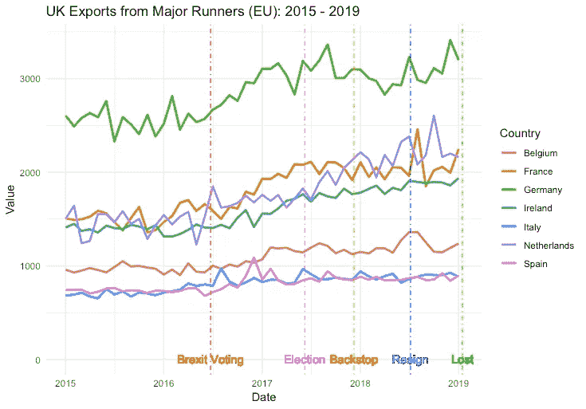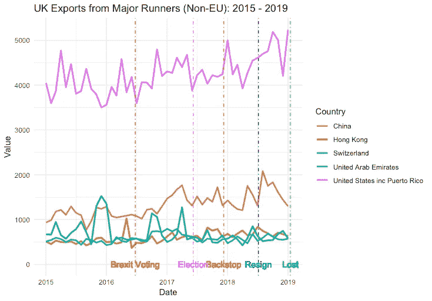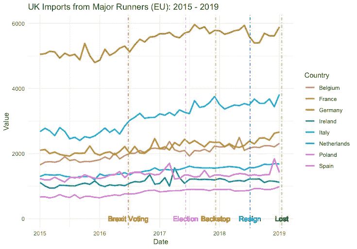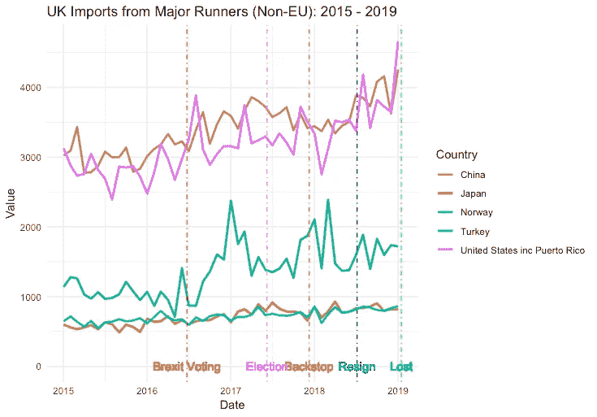

UK Trading Data filtered by the top EU and non-EU Countries.

# 英国消费者价格指数

这部分分析是为了更好地理解英国退出欧盟事件如何影响英国的生活质量。选定数量的消费物价指数(从英国国家统计局获得)的原始时间序列数据被绘制出来，通货膨胀百分比也是根据这些数据计算出来的。虽然所有被调查的消费物价指数都受到通货膨胀持续上升的影响，但似乎没有明显的迹象表明这些指数受到英国退出欧盟事件的深刻影响。尽管如此，值得一提的是，从英国退出欧盟交易开始(2016 年 6 月)，英国公民的平均生活成本上升了 6.362%。同样，这种差异可能被认为是不属于本分析项目调查范围的其他事件。

UK Inflation for a number of CPI’s.

**加密货币金融市场**

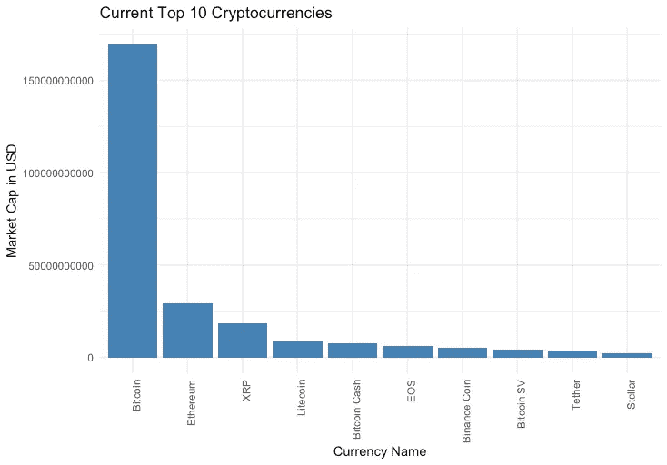

Top 10 Cryptocurrencies by Market Cap.

如上图所示，目前市值排名前 5 的加密货币分别是比特币、以太坊、Ripple (XRP)、莱特币、比特币现金。因此，这五种加密货币在一些英国退出欧盟事件后的表现也进行了分析。从比特币开始，英国退出欧盟似乎对其价值产生了积极影响。

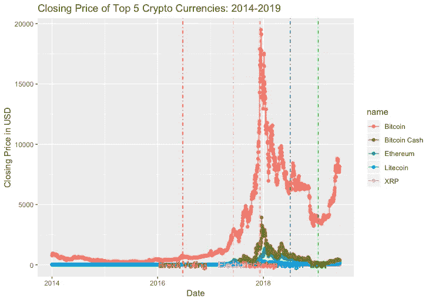

在每一次重大的英国退出欧盟事件之后，比特币的价格都会上涨。在使用贝叶斯推理对时间序列进行建模后，突然大选和支持交易的因果影响概率为 0.9998，尾部概率为 0.0002。因此，根据构建的贝叶斯模型，英国退出欧盟事件对比特币价值的明确提升具有统计学意义。

同样，以太坊在后台交易会议后的价格上涨也导致了统计上的显著性。以以太坊为例，在' *lost* '标记处，事件发生后价格似乎会下跌；我们还对这种潜在的因果关系进行了调查，得出了一个不显著的结果，该结果可以解释为基于英国退出欧盟以外其他不同事件的随机波动。英国退出欧盟事件似乎也没有影响莱特币的走势，使其流通在整个时期相对稳定。然而，也有人指出，在背景会议后的一段时间内进行的测试导致 p 值<为 0.05，这使得莱特币在统计上具有显著的正面因果影响，约为+150%。比特币现金也受益于显著的积极影响，有时收益高达 100%。同样，Ripple 似乎也受到了这些英国退出欧盟事件的积极影响；然而，在这种情况下，涨幅只有 10%左右。

**总结**

总之，该分析彻底调查了英国退出欧盟事件如何影响英镑/欧元外汇指数以及加密货币金融市场。除此之外，作为分析的一部分，英镑有效汇率指数也进行了研究，以更好地了解英镑在整个外汇市场的实际实力。这种分析允许将使用英镑/欧元兑换调查的结果复制到英镑兑换的其他货币，从而允许进行更全面的分析。此外，该项目还考虑了英国进出口贸易数据方面，其中主要国家(欧盟和非欧盟)的贸易量以及英国的通货膨胀率都进行了检查。这一方面为关于英国退出欧盟事件和 GBP 事件之间的相关性和因果关系推论的评论提供了更确凿的证据。这一部分有助于确定英镑的升值或贬值是直接受到英国退出欧盟的影响，还是受到其他外部因素的影响，如进出口贸易的下降/上升。

此外，该分析还提供了一个额外的分析视角，即英国退出欧盟是否对英国的进出口货物贸易有任何影响。反过来，这个项目在建立统计知识和应用于现实世界的基础方面具有很高的价值，并成为真正展示适当的统计分析和建模的好处的一种方式。此外，尽管这一分析面临一些限制，如没有考虑其他股票市场，特别是欧盟内部的股票市场，或者未能从统计上证明对英国进出口贸易的重大影响，但这一分析仍然设法得出了相对可靠和结论性的结果。

## 扩展这项工作

1.  考虑其他金融市场，如富时 100 指数、标准普尔 500 指数和道琼斯工业平均指数。
2.  *通过纳入其他国家的贸易数据，对比变化率，对进出口贸易数据进行更深入的统计分析。*
3.  *分析英国退出欧盟对汇丰银行、劳埃德银行和巴克莱银行等英国公司的影响。*
4.  *分析英国退出欧盟对英国和欧盟失业率的影响。*

这个项目的更多信息和完整源代码可以在这个 [GitHub 资源库](https://github.com/davidfarrugia/Brexit-Statistical-Analysis)中找到。

如果你想联系——davidfarrugia53@gmail.com

[Linkedin](https://www.linkedin.com/in/david-farrugia/)——[Twitter](https://twitter.com/davidfarrugia53)