# 熊猫艺术调查分析

> 原文：<https://towardsdatascience.com/analysis-of-an-art-survey-using-pandas-ea782c0d0691?source=collection_archive---------28----------------------->

[**熊猫**](https://pandas.pydata.org/?source=post_page---------------------------) 是用于**数据科学**的 **Python** 开源库，它允许我们轻松地处理结构化数据，如 **csv 文件**、 **SQL 表**或 **Excel 电子表格**。在这篇文章中，我们用熊猫来分析布拉迪斯拉发的夸美纽斯大学统计学学生进行的艺术调查的结果。学生们被要求从 1 到 5(意思是 1“一点也不喜欢”)给 39 幅知名画作打分。该数据集包括评级，以及绘画、艺术运动和艺术家的名称，每个艺术运动包含 3 幅绘画。**数据集**可以在**中找到。 [**Kaggle**](https://www.kaggle.com/?source=post_page---------------------------) 是一个数据科学家和机器学习者的在线社区，其中包含了各种各样的**数据集**。**

** [## 涂漆

### 学生评价不同艺术运动的名画。

www.kaggle.com](https://www.kaggle.com/miroslavsabo/paintings) 

# 探索性数据分析和数据清理

**探索性数据分析**包括分析数据集的主要特征，通常采用**可视化方法**和**汇总统计**。目标是理解数据，发现模式和异常，并在我们执行进一步评估之前检查假设。

从 Kaggle 下载 csv 文件后，我们可以使用[**Pandas . read _ CSV**](https://pandas.pydata.org/pandas-docs/stable/reference/api/pandas.read_csv.html)函数将其加载到 Pandas dataframe 中，并使用 [**pandas 可视化前 5 行。data frame . head**](https://pandas.pydata.org/pandas-docs/stable/reference/api/pandas.DataFrame.head.html)**方法。**

**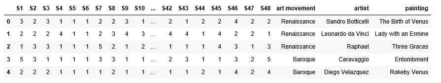**

**由于列的数量太大，我们无法使用 head 方法看到所有的列。一种选择是改变显示选项，以便我们可以可视化整个数据帧。另一种选择是使用列属性，如下所示:**

**正如我们所看到的，dataframe 包含 51 列:48 个评级，以及绘画、艺术运动和艺术家的名称。学生们总共给 39 幅画打分。**

**不适当的数据类型和缺失值是数据集最常见的问题。我们可以使用 [**熊猫轻松分析这两者。**data frame . info](https://pandas.pydata.org/pandas-docs/stable/reference/api/pandas.DataFrame.info.html)方法。这个方法打印关于数据帧的信息，包括索引数据类型和列数据类型、非空值和内存使用情况。**

**我们已经验证了不存在空值，并且数据类型是预期的类型。列 S1-S48 包含整数，其他列(艺术运动、艺术家和绘画)包含对象(熊猫中的字符串)。在这种特殊情况下，我们不需要执行任何清理操作，但这与其说是一种规则，不如说是一种例外，因为数据集通常非常混乱。**

**我们还可以评估数据集是否包含空值，如下所示:**

**或者，我们可以使用**熊猫来评估数据类型。DataFrame.dtypes** 属性。这将返回包含每列数据类型的序列。**

**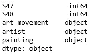**

****Pandas** 提供了一个名为[**pandas 的方法。DataFrame.describe**](https://pandas.pydata.org/pandas-docs/stable/reference/api/pandas.DataFrame.describe.html) 生成数据集的描述性统计数据(集中趋势、离散度和形状)。默认情况下，describe 方法只分析数字列，但是它也可以通过向参数 *include 提供 *all* 来分析对象列。*由于 **describe** 方法返回的 summary 是一个 dataframe，我们可以通过使用 [**pandas 轻松访问它的元素。DataFrame.loc**](https://pandas.pydata.org/pandas-docs/stable/reference/api/pandas.DataFrame.loc.html) 方法。**

**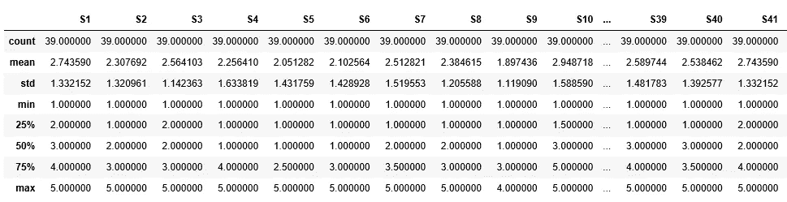**

**如上图所示，每个学生总共评价了 39 张图片。我们还可以得出结论，一些学生比其他人更挑剔。例如，学生 9 给出的平均评分为 1.8974，比学生 10 低 1 分左右。除了学生 9(最大值=4)和学生 46(最小值=2)之外，大多数学生给出的最低评分为 1，最高评分为 5。虽然五个数字的摘要(最小值、25%、50%、75%、最大值)为我们提供了关于观察值分布的信息，但通过可视化的方式来分析评级的分布将会很有趣。我们会做到的！继续读😉**

**我们还可以验证专栏、艺术运动、艺术家和绘画中独特元素的数量，如下所示:**

**[**熊猫。series . nunicque**](https://pandas.pydata.org/pandas-docs/stable/reference/api/pandas.Series.nunique.html)**方法返回多个唯一元素。如上所示，dataframe 包含不同艺术家的 39 幅画，包括每个艺术运动的 3 幅画。****

****该数据集不包含大量样本。为此，它不需要重要的清洁操作；但是，我们可以执行一些小的更改，以便于进一步分析数据集。****

1.  ****消除列名中的空格→使用点符号按名称选择单个列。****
2.  ****通过绘画计算平均评分→评估对绘画和艺术运动的偏好。****
3.  ****将绘画列设置为索引→以便使用绘画名称而不是索引轻松访问信息。****

****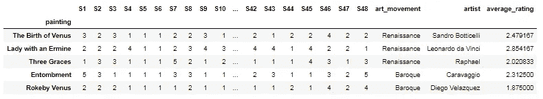****

****执行更改后，我们可以使用数据轻松地得出结论。💪 😊我们开始吧！****

# ****回答问题并得出结论****

******探索性数据分析**和**数据清理**是让我们对数据集有所了解并准备好数据集以便使用它轻松得出结论的步骤。现在！我们准备使用数据集回答以下问题。****

## ****哪 5 幅是评价最高的画？****

****要获得最高评分的画作，我们可以使用之前创建的平均评分栏，如下所示:****

****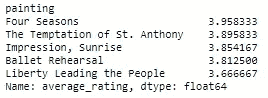****

****我们还可以创建一个**条形图**来可视化结果。**条形图**与**分类数据**一起使用，其中每个条形图代表一个特定的类别。条形的高度与它们所代表的值成比例。****

****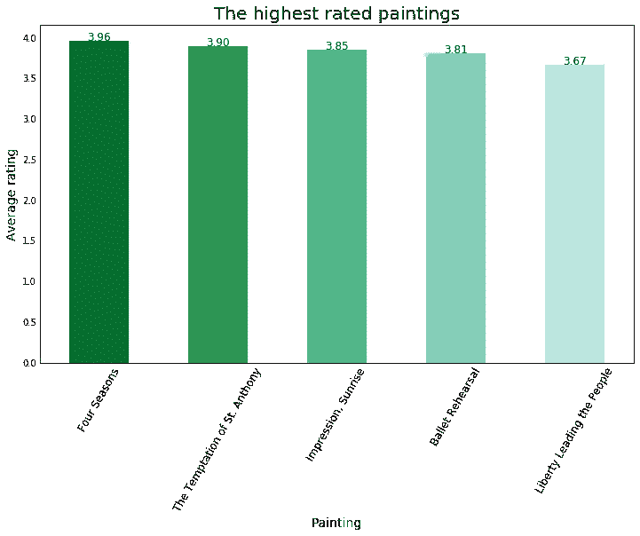****

****我们可以很容易地访问关于最佳评级画作的所有信息，如下所示:****

****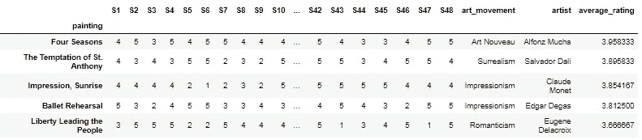****

****评分最高的画作是穆卡的《四季》，平均评分为 3.96。阿尔丰斯·穆夏是捷克画家和新艺术运动大师，最著名的是他独创的女性海报，海报周围环绕着装饰性的植物图案。《四季》描绘了以乡村季节景色为背景的年轻女性。他总共画了 3 个系列(1896-1897-1900)。因为没有提供日期，我们不能断定哪个系列被展示给学生。但是都很神奇！😍****

********

****Four Seasons — Serie 1896****

****下面的情节描绘了其他的顶级画作。我相信你知道其中一些😍****

****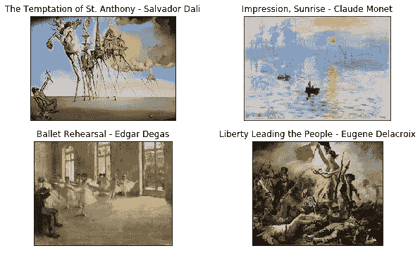****

## ****哪 5 幅画的评分最低？****

****为了分析评分最低的画，我们像以前一样进行。首先，我们创建一个包含平均评级的系列。然后，我们使用条形图来可视化信息。****

****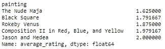********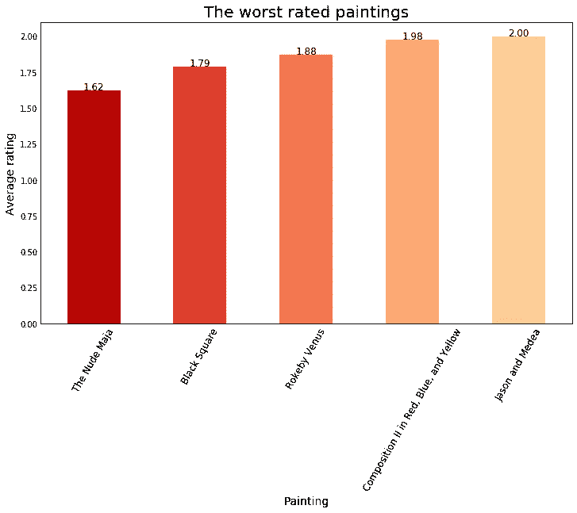****

****和以前一样，我们可以通过以下方式轻松访问关于最低评级绘画的所有信息:****

****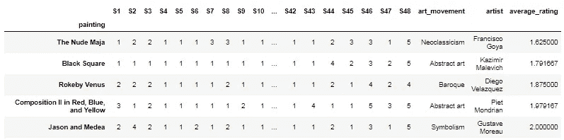****

****评分最低的画是弗朗西斯科·戈雅画的裸体玛雅。戈雅是西班牙浪漫主义画家，也是 18 世纪末 19 世纪初最重要的艺术家之一。裸体的玛嘉被认为是最早展示全裸女性的肖像画之一，它可以在马德里的普拉多博物馆找到。虽然他的画是调查中评分最低的，但我不得不承认戈雅是我最喜欢的画家之一，他有大量的绘画作品，从宫廷肖像到可怕的战争场景。****

## ****哪些被认为是评价最高的艺术运动？****

****该数据集包含 13 种不同艺术运动的绘画:(1)文艺复兴，(2)巴洛克，(3)新古典主义，(4)浪漫主义，(5)印象主义，(6)后印象主义，(7)象征主义，(8)新艺术，(9)立体主义，(10)抽象艺术，(11)超现实主义，(12)欧普艺术，(13)波普艺术。要评估最高评级的艺术运动，我们必须计算属于每个艺术运动的三幅绘画的平均评级。我们可以很容易地通过使用 [**熊猫来计算。DataFrame.groupby** 方法 T3。groupby 操作包括拆分对象、应用函数和组合结果的组合。](https://pandas.pydata.org/pandas-docs/stable/reference/api/pandas.DataFrame.groupby.html)****

****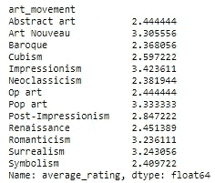****

****首先，我们按艺术运动分组。然后，我们计算每组的平均值。如前所述，我们可以通过使用如下条形图轻松解释结果:****

****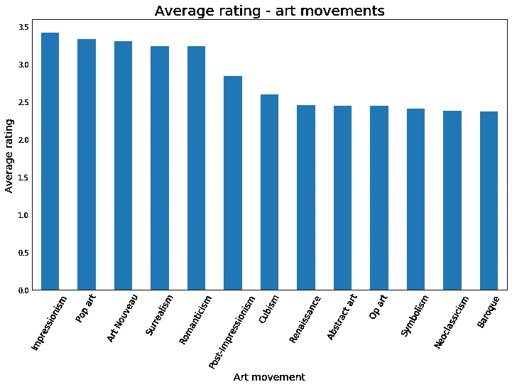****

****如上图所示，评价最高的艺术运动是印象派。我们可以通过以下方式获得本次调查中使用的印象派画作:****

## ****哪个学生给了最高分？哪个学生得分最低？****

****之前，我们已经计算了每幅画的平均评分。现在，我们必须计算每个学生提供的平均评分。****

****前面的代码返回一个数列，其中包含每列值的平均值。我们可以按以下方式使用 head 方法观察数列的第一个值:****

****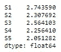****

****我们可以使用以下方法获得最高分和最低分的学生****

*   ****[熊猫。Series.idxmin](https://pandas.pydata.org/pandas-docs/stable/reference/api/pandas.Series.idxmin.html#pandas.Series.idxmin) **→** 返回最小值的行标签。****
*   ****[**熊猫。series . idx max**](https://pandas.pydata.org/pandas-docs/stable/reference/api/pandas.Series.idxmax.html)**→**返回最大值的行标签。****

****如上所示，学生 48 提供了平均 4.05 的最高分。相反，21 号学生得分最低，平均为 1.84 分。****

****我们可以用柱状图直观地显示两个学生各自的分数。****

****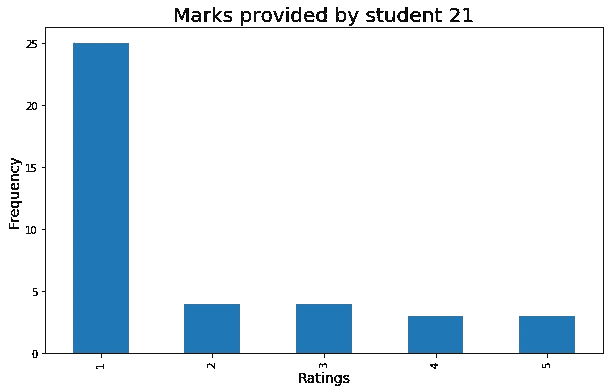********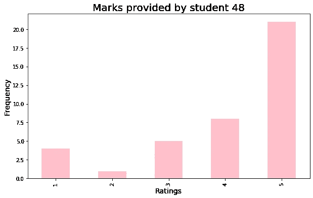****

## ****学生如何分配他们的分数？****

****我们可以通过绘制之前创建的 series(students _ average)来可视化学生提供的平均评分。****

****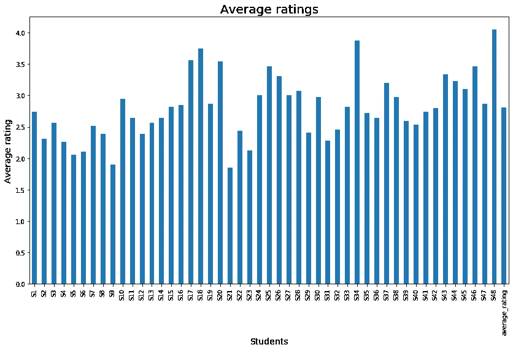****

## ****毕加索的《格尔尼卡》在排名中占据什么位置？****

****《格尔尼卡》是西班牙艺术家巴勃罗·毕加索的一幅大型布面油画，被认为是毕加索最著名的画作之一。《格尔尼卡》展现了战争的悲剧，是为了回应西班牙内战(1936-1939)期间位于西班牙北部的小镇格尔尼卡的轰炸而创作的。这幅画位于欧洲和美洲的不同城市。佛朗哥独裁统治结束后，西班牙成为一个民主国家，这幅画于 1981 年回到西班牙。如今埃尔·格尔尼卡被认为是现代艺术和强有力的反战绘画中最重要的标志之一。****

****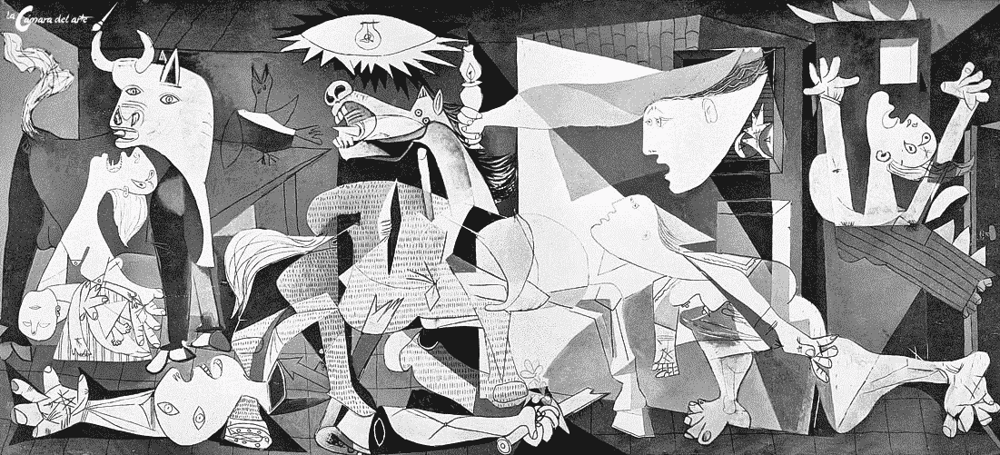****

****我们可以用 [**熊猫来获得埃尔格尔尼卡的排名位置。index . get _ loc**T3**。**该方法返回特定索引的整数位置。首先，我们必须按降序对平均评级列进行排序。然后，我们将 get_loc 方法应用于系列的索引。](https://pandas.pydata.org/pandas-docs/stable/reference/api/pandas.Index.get_loc.html)****

****因为 python 和 pandas 中的索引是从 0 开始的，所以 el Gernica 的排名位置是 16。****

# ****关键要点****

*   ******探索性数据分析**包括分析数据集的主要特征，通常采用**可视化方法**和**汇总统计**。熊猫**。头()**，**。info()** ，**。**形容()**。努尼克()**、**、**和**。形状**是探索性数据分析的有用方法。****
*   ****我们可以使用**来访问一组行和列。loc()** 法。****
*   ****我们可以用熊猫。DataFrame.plot 方法使用 **matplotlib** 对数据帧进行绘图。图的类型在参数*种类中指定。*****
*   ****如果未指定**条形图**的 x 轴，则使用数据框的索引。****
*   ******。value_counts()** 方法返回一个包含唯一值计数序列。****
*   ******。sort_values()** 方法用于对数据帧中的值进行排序。参数 **ascending=False** 用于按降序排序。****

****感谢阅读！！！😍******