# 使用 Pandas 分析波士顿犯罪事件公开数据

> 原文：<https://towardsdatascience.com/analysis-of-boston-crime-incident-open-data-using-pandas-5ff2fd6e3254?source=collection_archive---------9----------------------->


[Pixabay.com](https://pixabay.com/photos/panda-china-bamboo-zoo-bear-3857754/)

当我在 Python 中使用 [Pandas](https://pandas.pydata.org/pandas-docs/stable/user_guide/index.html) 学习数据分析时，我对分析我目前居住的城市的开放数据很感兴趣。

开放数据为人们提供了无数的机会，让他们随心所欲、不受限制地使用和分析数据。通过查看一个城市的犯罪事件公开数据，您可以了解这个城市或特定社区是否安全。因此，我使用波士顿犯罪事件报告的公开数据，通过使用 Pandas 来分析和可视化它们。希望你看完我的经历，能对获取、分析、可视化开放数据有更好的理解。

# 获取数据

*   首先我去 [*分析波士顿*](https://data.boston.gov/) *:* 一个波士顿开放数据网站。搜索“犯罪”并转到[犯罪事件报告](https://data.boston.gov/dataset/crime-incident-reports-august-2015-to-date-source-new-system)

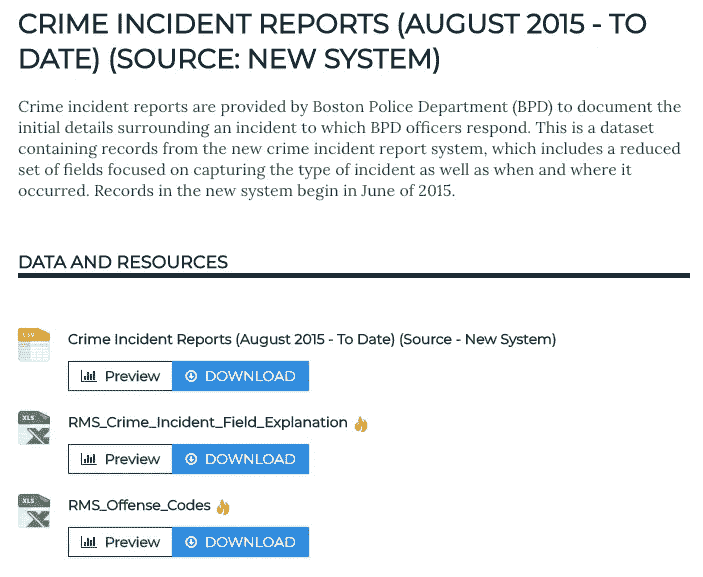

*   为了获得数据，我复制了下载 csv 格式数据的链接:

```
url = “[https://data.boston.gov/dataset/6220d948-eae2-4e4b-8723-2dc8e67722a3/resource/12cb3883-56f5-47de-afa5-3b1cf61b257b/download/tmppj4rb047.csv](https://data.boston.gov/dataset/6220d948-eae2-4e4b-8723-2dc8e67722a3/resource/12cb3883-56f5-47de-afa5-3b1cf61b257b/download/tmppj4rb047.csv)”
```

*   使用`wget`命令下载数据。

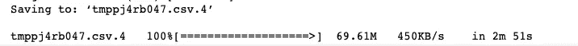

*   进口熊猫

`import pandas as pd`

*   使用熊猫中的`read_csv`读取数据并保存到数据框中

`df = pd.read_csv('tmppj4rb047.csv')`

*   检查是否成功获取数据。

`df.head()`


# 数据分析

## 1.犯罪类型

获得数据后，我想知道波士顿有多少种犯罪类型。

*   在熊猫身上用`value_counts`。

`value_counts`帮助统计不同类型犯罪的出现次数，并进行排序。

```
df.OFFENSE_CODE_GROUP.value_counts().iloc[:10]
```

为了便于展示，我只要求返回前十个结果。

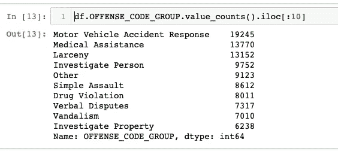

Top 10 Crime Incidents in Boston

在这里，我们可以看到波士顿发生最频繁的犯罪事件是“机动车事故反应”，“盗窃”也发生得非常频繁。

然后，为了更好的可视化，我绘制了结果。

```
df.OFFENSE_CODE_GROUP.value_counts().iloc[:10].sort_values().plot(kind= “barh”)
```

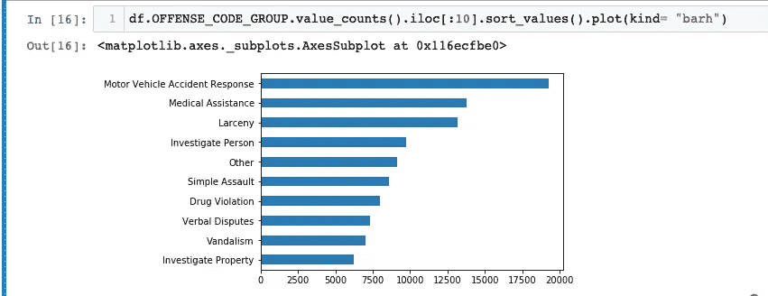

## 2.分析具体的犯罪

我想具体分析一下波士顿的盗窃罪。因此，我将数据帧中包含盗窃的部分放到另一个数据帧中，并将其称为“盗窃”

```
larceny = df[df.OFFENSE_CODE_GROUP.str.contains(“Larceny”)]
larceny.head()
```

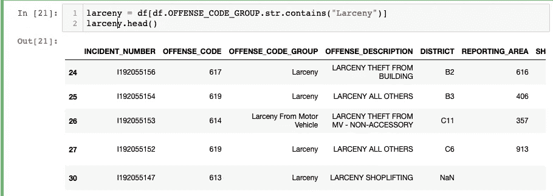

*   检查“盗窃”数据的大小

```
larceny.shape() 
```

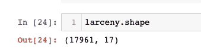

盗窃事件记录 17961 条，每条记录 17 列。

## 3.分析地点

我想知道波士顿不同地点的犯罪事件数据，更具体地说，波士顿哪些地方更危险。

我用熊猫里的`groupby`函数对犯罪地点类型进行分组，用`size`函数查看条目数量。

```
larceny.groupby(“STREET”).size().sort_values(ascending = False)
```

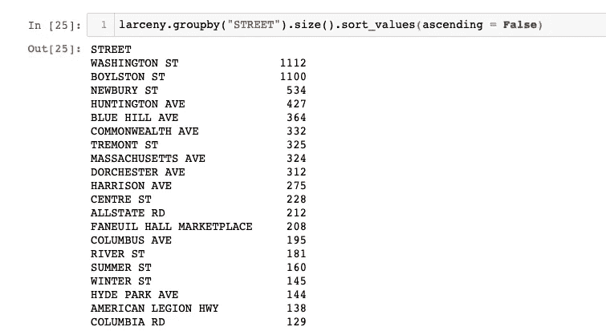

First few entires of the result

查看结果，我们可以看到波士顿盗窃案发生率较高的地点是华盛顿街、博伊尔斯顿街和纽伯里街。

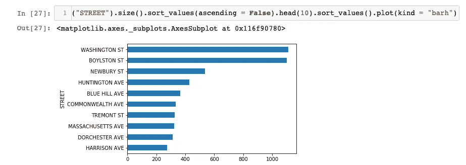

## 4.分析时间

我还想知道波士顿盗窃事件的趋势。

```
larceny.groupby(“MONTH”).size().plot(kind = “bar”)
```

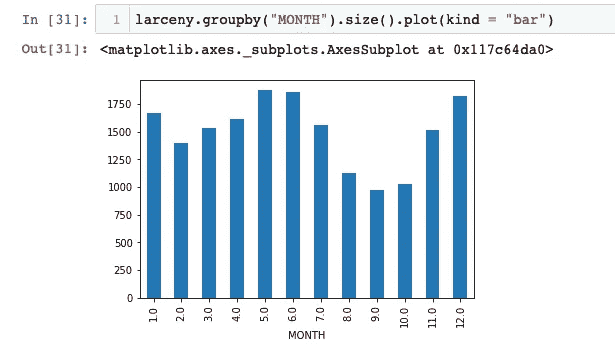

根据我计算的柱状图，盗窃在 5 月、6 月和 12 月发生最多，而 9 月、10 月和 8 月似乎更安全。

让我们看看盗窃事件的数量在一天内是如何变化的。

```
larceny.groupby(“HOUR”).size().plot(kind= “bar”) 
```

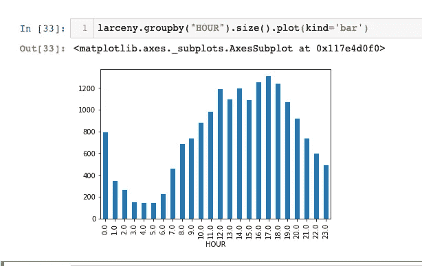

在这里，我们可以告诉你波士顿一天中最不容易发生盗窃的时间是凌晨 5 点。然而，人们需要在下午 4 点到 6 点更加小心。

现在，我想全面了解一下波士顿每月和 24 小时内的盗窃事件数据。由于 2019 年还没有结束，数据不完整，我们具体看一下 2018 年的数据。

如果我们在熊猫中使用`groupby`对月和小时进行分组，我们会得到以下结果。

```
larceny[larceny.YEAR == 2019].groupby([‘MONTH’, ‘HOUR’]).size()
```

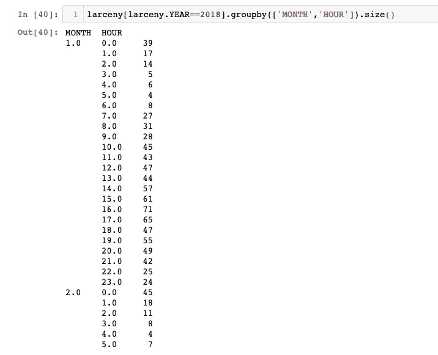

但是，这对我们轻松读取数据没有帮助。为了使它更好，我使用了`unstack`，这将把结果转换成可读性更好的形式。

```
larceny[larceny.YEAR==2018].groupby([‘MONTH’,’HOUR’]).size().unstack(0)
```

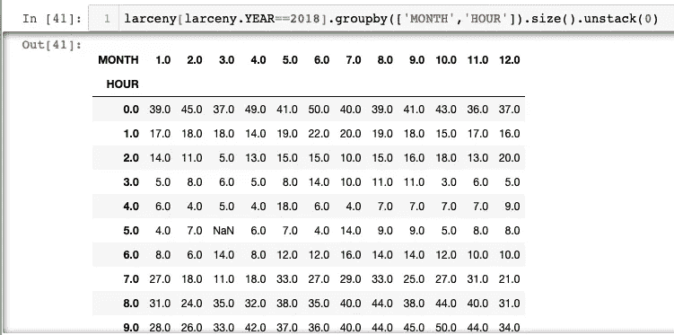

现在，我想把结果可视化。

因为我将 12 个月的数据可视化为 12 张图表，所以我想使用分面图。在熊猫的`plot`中有一个参数叫做`subplots`。初始化为`True`。我还可以通过使用`figsize`来调整图形的长度和宽度。

```
larceny[larceny.YEAR==2018].groupby([‘MONTH’,’HOUR’]).size().unstack(0).plot(subplots=True, kind = “bar”, figsize = (5, 30)
```

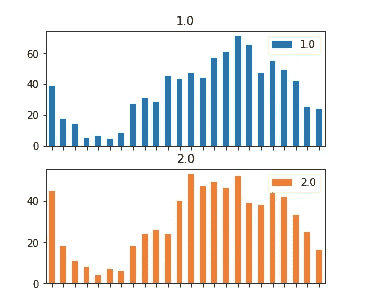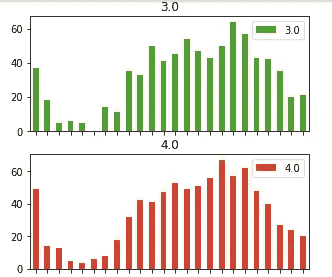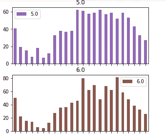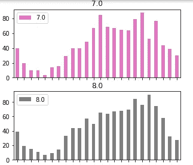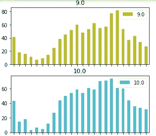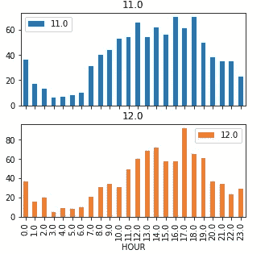

现在，我们对 2018 年发生在波士顿的盗窃事件有了完整的可视化。

# 摘要

通过使用 Pandas，我分析并可视化了波士顿犯罪事件报告的公开数据。在提取、分组、排序、分析和绘制数据方面，Pandas 确实是一个非常强大的 Python 包。如果你对数据分析感兴趣，使用熊猫来分析一些真实的数据集是一个很好的开始。