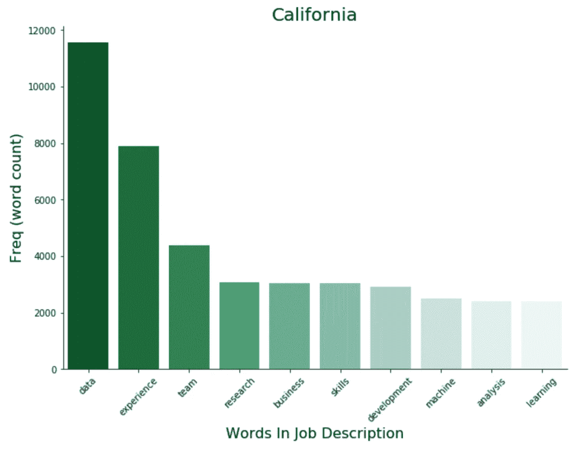
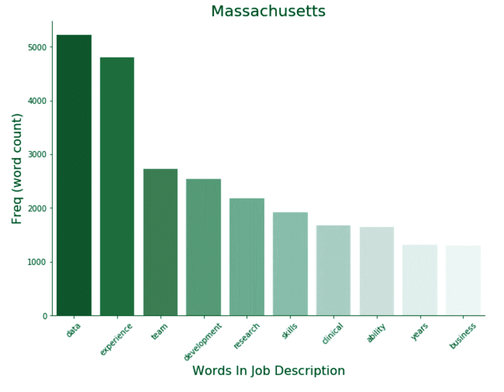

# 使用正确的关键词创建您的数据科学简历

> 原文：<https://towardsdatascience.com/analysis-of-data-job-descriptions-97721046d8d4?source=collection_archive---------34----------------------->

## 深度学习，管理，卷积神经网络，大数据，协作，分析，机器学习

Medium 的建议算法是否选中了我的字幕？如果我在找工作，我应该使用类似的策略吗？

在 ATS 系统的世界里，最重要的是你的简历要符合基于你资历/状态的“热门词汇”。ATSs 基于关键词进行匹配，作为一名目前正在申请的入门级数据科学家，通过简历筛选的任何帮助都是至关重要的。

在这篇简短的文章中，我们将利用[空间](https://spacy.io/)来涵盖职位描述中最常用的词汇，以此来归类这些流行的职位名称…

1.  入门级
2.  中等水平
3.  经理

这四种状态…

1.  加利福尼亚
2.  马萨诸塞州
3.  华盛顿
4.  纽约

*请注意——我不是每个级别之间界限的专家，因为我是根据职位头衔做出假设的。关注我在文末的 jupyter 笔记本寻求建议/改进:)*

## NLP 详细信息

单词标记化、停止单词移除和过滤以包括…

词性:形容词和名词
依存关系:DOBJ、CONJ、AMOD、NUM、ADVMOD、QUANTMOD、MEASURE

Notable terms: Research, Analysis, Skills

Notable Terms: Team, Machine (Learning), Experience

Notable Terms: Experience, Team, Business, Management

# 标题摘要

回顾这些发现后，大多数数据都指向我们的直觉告诉我们的东西。职称之间的一些关键发现

1.数据是工作描述中最常用的术语，入门级角色使用频率最高。

2.团队、业务、开发、管理和产品位于经理职位描述的顶端。

3.经验、研究、团队、机器、学习在中级职位上比在初级职位上出现得更频繁。

Notable Terms: Business, Machine (Learning), Skills

Notable Terms: Business, Product, Technical

Notable Terms: Development, Research, Clinical

Notable Terms: Experience, Data, Team

# 状态摘要

在回顾了各州的职位描述后，我们发现了一些要点。

1.  马萨诸塞州——临床和能力出现在提及次数的前十位(与其他州不同),发展几乎是其他州的两倍。
2.  纽约—在体验和团队提及方面排名最低，但在数据方面排名最高
3.  华盛顿——产品和技术出现在提及次数的前十名中(与其他州不同),并领先于商业提及
4.  加利福尼亚州——接近其他三个州的平均水平，除了出现在十大提及中的分析

你可以随意翻翻 jupyter 笔记本，自己看看！