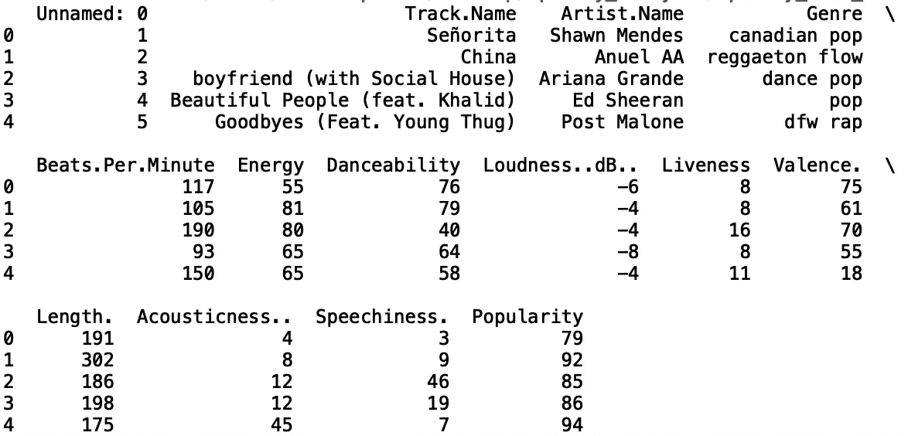
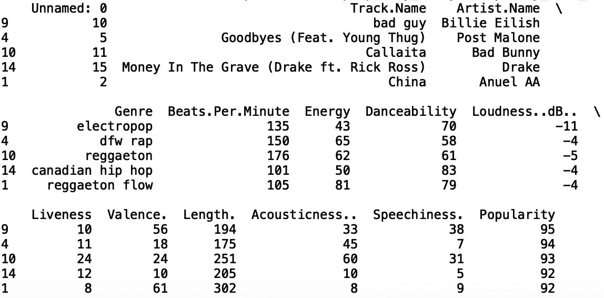
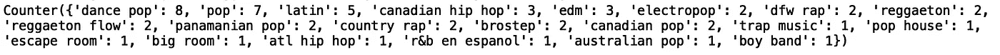
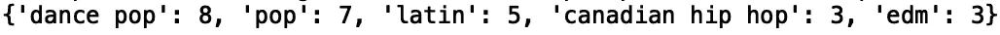
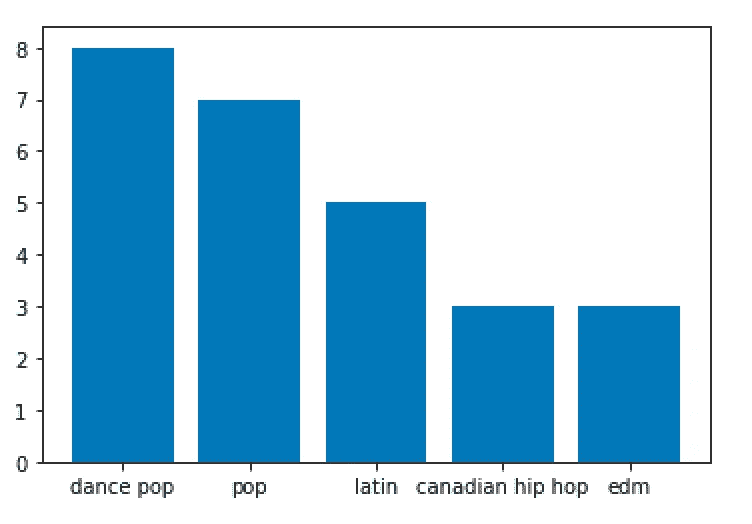
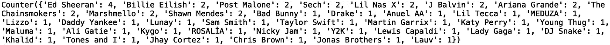
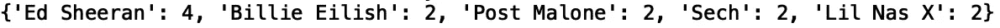
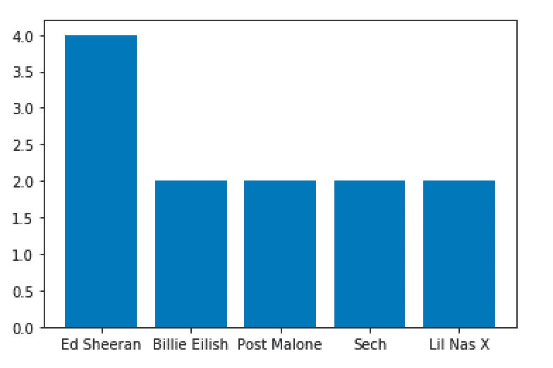
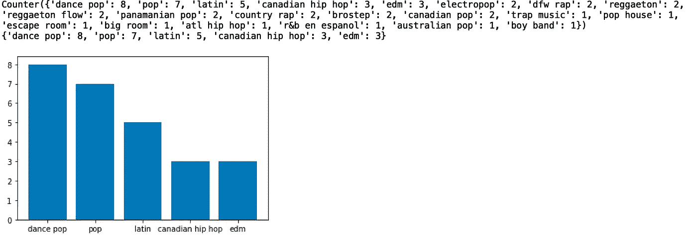

# 使用 Python 分析前 50 首 Spotify 歌曲

> 原文：<https://towardsdatascience.com/analysis-of-top-50-spotify-songs-using-python-5a278dee980c?source=collection_archive---------18----------------------->

## 2019 年哪些歌曲最受欢迎？


Photo by [John Tekridis](https://www.pexels.com/@john-tekeridis-21837) on [Pexels](https://www.pexels.com/photo/apps-cellphone-communication-computer-340103/)

2019 年最受欢迎的歌曲有哪些？2019 年哪些流派最受欢迎？哪些艺术家最受欢迎？

在本帖中，我们将分析排名前 50 的 Spotify 歌曲数据集，这些数据可以在 [Kaggle](https://www.kaggle.com/leonardopena/top50spotify2019) 上找到。该数据集提供了 2019 年 Spotify 上听得最多的 50 首歌曲。它摘自[整理你的音乐](http://organizeyourmusic.playlistmachinery.com)网站。

数据集包含以下字段:

1.  **追踪。名称** —轨道名称
2.  **艺人。名字** —艺人的名字
3.  **流派** —曲目流派
4.  **节拍。每分钟** —歌曲的速度
5.  **能量**——宋的能量——数值越高，能量越大
6.  **可跳舞性** —该值越高，就越容易随着歌曲跳舞
7.  **响度..dB。**。—数值越高，歌声越响亮。
8.  **Liveness** —值越高，歌曲越有可能是现场录制的。
9.  **化合价**。—值越高，歌曲的情绪越积极。
10.  **长度**。—歌曲的持续时间。
11.  **声音**..值越高，歌曲的声音越大
12.  语速。—值越高，歌曲包含的口语单词越多
13.  **流行度** —数值越高，歌曲越流行。

首先，让我们将数据读入 pandas 数据帧，并打印前五行:

```
import pandas as pddf = pd.read_csv("top50.csv", encoding="ISO-8859-1")print(df.head())
```



我们可以按降序对数据帧进行排序，以查看前 5 首最流行的歌曲:

```
df.sort_values('Popularity', ascending = False, inplace = True)print(df.head())
```



排名前五的流行歌曲和对应的艺人分别是:

1.  坏蛋，比莉·埃利什
2.  *再见*(壮举。年轻的暴徒)，后马龙
3.  *卡莉塔*，坏兔子
4.  坟墓里的钱。里克·罗斯)，德雷克
5.  *中国*，阿努埃尔 AA

在这篇文章的其余部分，我们将关注“流派”和“艺术家”。名称”,但是可以对其他一些专栏做进一步的分析。

让我们从使用 python 集合模块中的 Counter 方法来查看每个流派出现在前 50 个列表中的频率开始。让我们从集合中导入“计数器”并打印每个流派的频率:

```
from collections import Counter 
print(Counter(df['Genre'].values))
```



我们还可以将输出限制在最常见的 5 种类型:

```
print(Counter(df['Genre'].values).most_common(5))
```



然后，我们可以使用 matplotlib 在条形图上显示结果:

```
import matplotlib.pyplot as plt
bar_plot = dict(Counter(df['Genre'].values).most_common(5))
plt.bar(*zip(*bar_plot.items()))
plt.show()
```



我们看到，在前 50 名的榜单中，属于舞曲流行这一体裁的歌曲出现了 8 次，流行出现了 7 次，拉丁出现了 5 次，加拿大嘻哈出现了 3 次，edm 出现了 3 次。

我们可以为艺术家做同样的事情:

```
print(Counter(df['Artist.Name'].values))
```



并且只限于最常见的五位艺术家:

```
print(Counter(df['Artist.Name'].values).most_common(5))
```



并绘制结果:

```
bar_plot = dict(Counter(df['Artist.Name'].values).most_common(5))
plt.bar(*zip(*bar_plot.items()))
plt.show()
```



我们可以看到，艾德·希兰的歌曲在前 50 名中出现了 4 次，比利·埃利希、波斯特·马龙、塞克和里尔·纳斯克斯各出现了 2 次。

出于代码重用的目的，我们可以定义一个函数，该函数接受分类变量的列名，并打印一个包含列值和该值出现的次数的字典，以及一个显示每个值出现频率的条形图:

```
def get_frequencies(column_name):
    print(Counter(df[column_name].values))
    print(dict(Counter(df[column_name].values).most_common(5)))
    bar_plot = dict(Counter(df[column_name].values).most_common(5))
    plt.bar(*zip(*bar_plot.items()))
    plt.show()
```

现在，如果我们用“流派”调用这个函数，我们得到:

```
get_frequencies('Genre')
```



和“艺术家”。姓名':

```
get_frequencies('Artist.Name')
```


我就讲到这里，但是您可以随意处理数据和编写代码。这篇文章的代码可以在 GitHub 上找到。感谢您的阅读！