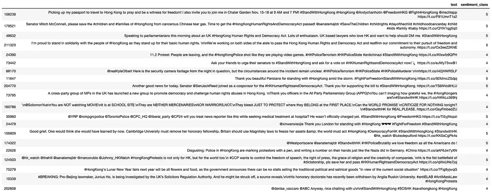

# 用 Python 分析 2019 年香港抗议运动的推文

> 原文：<https://towardsdatascience.com/analysis-of-tweets-on-the-hong-kong-protest-movement-2019-with-python-a331851f061?source=collection_archive---------21----------------------->


Photo by [Joseph Chan](https://unsplash.com/@yulokchan?utm_source=medium&utm_medium=referral) on [Unsplash](https://unsplash.com?utm_source=medium&utm_medium=referral)

> 免责声明:本文无意对香港当前形势作任何形式的政治或社会评论。所做的分析完全基于手头数据集的推断。

最近，在完成了吴恩达教授的 Coursera 深度学习课程后，我有动力做一个关于情感分析的宠物项目，其中一个专业是序列模型。我写这篇文章是为了巩固和分享我的学习和代码。

随着香港抗议运动已经发生了将近 6 个月，我突然有了一个想法，收集关于抗议的 Twitter 推文，并将其用于这个项目。例如，我不想使用 Kaggle 上容易获得的现有(可能已经清理过的)数据集。我想这是一个让我把手弄脏并学习抓取推文的过程的机会。

该项目的目标是发现:

1.  微博对抗议的总体看法，特别是，这些微博对中国中央政府、香港政府和警方的立场/观点是什么
2.  twitter 用户的人口统计数据
3.  标签的流行度
4.  顶级用户和一般用户的行为
5.  每日热门推文

本文的结构将不同于通常的教程，在通常的教程中，流程是数据清理和预处理，接着是探索性的数据分析，然后是模型训练和调优。在这里，我们希望读者首先关注数据分析和可视化。数据清理和预处理步骤将在后面介绍。您可以从这个[库](https://github.com/leowgriffin/tweets_analysis_hkprotests_2019)访问源代码。

# 使用 Tweepy 抓取 Twitter 消息

因为抓取 Twitter tweets 也不是本文的重点，所以我另外写了一篇文章详细描述抓取的过程。如果你需要一步一步的指导，点击这个[链接](https://medium.com/@leowgriffin/scraping-tweets-with-tweepy-python-59413046e788?source=friends_link&sk=b037451da958081d793746387bc40ab6)。

# 探索性数据分析


Source: [https://miro.medium.com/max/810/1*p3Ste5R_iJzi5IcSmFkmtg.png](https://miro.medium.com/max/810/1*p3Ste5R_iJzi5IcSmFkmtg.png)

让我们用常用的数据可视化库——seaborn 和 matplotlib——来探索和可视化已经处理过的推文。

## 1.WordCloud——在关于抗议的推文中找到的流行词汇的快速预览

首先，我们使用一个词云，它可以立即向我们显示在与抗议相关的推文中使用最多的词。所需的代码如下:

```
from wordcloud import WordCloud
import matplotlib.pyplot as pltdef show_wordcloud(data, title = None):
    wordcloud = WordCloud(
        background_color = 'white',
        max_words = 200,
        max_font_size = 40, 
        scale = 3,
        random_state = 42
    ).generate(str(data))fig = plt.figure(1, figsize = (15, 15))
    plt.axis('off')
    if title: 
        fig.suptitle(title, fontsize = 20)
        fig.subplots_adjust(top = 2.3)plt.imshow(wordcloud)
plt.show()

# print wordcloud
show_wordcloud(data['cleaned_text'])
```


Our word cloud for the top 100 words found in the tweets

我们为前 100 个单词生成了一个单词云，其中一个单词越受欢迎，该单词在单词云中就越大(您可以通过更改“max_words”的值来调整该参数)。

> 一些很快打动我们的词是:厌恶、警察、消防员、抗议者、催泪瓦斯、公民、失败、信任等等。总的来说，如果没有推特的背景，我们无法确定每个词，作为它自己，是否代表对政府或抗议者的负面或正面情绪。但对于我们这些一直关注社交媒体和新闻的人来说，对警察的反对声很大。

## 2.正面情绪的数量与负面情绪的数量

接下来，我们看看正面和负面推文的分布情况。基于 NLTK Vader-Lexicon 库的 SentimentIntensityAnalyzer，这个分析器检查一个句子的情感，关于它是积极的、中性的还是消极的。

我们可以用下面的方式来解释这种情绪。如果一种情绪是积极的，这可能意味着它是亲政府和/或警察的。然而，负面情绪可能意味着它是反政府和/或反警察的，是支持抗议者的。

分析器为每个句子返回 4 个分数，即“肯定”、“否定”、“中性”和“复合”。分数“复合”返回范围为[-1，1]的句子的总体情感。出于我们当前的目的，我们使用“复合”分数将每条推文分为 5 类，并为每类分配一个数值范围:

1.  非常正的“5”——[0.55，1.00]
2.  正' 4' — [0.10，0.55]
3.  中性' 3 '——(-0.10，0.10)
4.  负“2”——(-0.55，-0.10)
5.  非常负的“1”——[-1.00，-0.55]

注意:中性情绪的值范围更严格。

> 事实证明，由于抗议的性质，使用基于规则的方法分析推文的情绪是极其不准确的。每条推文的情绪可以是关于政府或抗议者的。另一方面，在诸如酒店评论的其他情况下，每个评论的情感分析是关于酒店的，而不是给出评论的酒店客人的。因此，很明显，好的情绪分数意味着对该酒店的评论是好的，而坏的情绪分数意味着对该酒店的评论是坏的。然而，在我们目前的案例研究中，一条推文的良好情绪得分可能意味着支持一方，也可能意味着反对/否定另一方。这将在下面显示出来。

**根据数据的“复合”分数，将数据分类:**

```
# Focus on 'compound' scores
# Create a new column called 'sentiment_class'
sentimentclass_list = []for i in range(0, len(data)):

    # current 'compound' score:
    curr_compound = data.iloc[i,:]['compound']

    if (curr_compound <= 1.0 and curr_compound >= 0.55):
        sentimentclass_list.append(5)
    elif (curr_compound < 0.55 and curr_compound >= 0.10):
        sentimentclass_list.append(4)
    elif (curr_compound < 0.10 and curr_compound > -0.10):
        sentimentclass_list.append(3)
    elif (curr_compound <= -0.10 and curr_compound > -0.55):
        sentimentclass_list.append(2)
    elif (curr_compound <= -0.55 and curr_compound >= -1.00):
        sentimentclass_list.append(1)# Add the new column 'sentiment_class' to the dataframe
data['sentiment_class'] = sentimentclass_list# Verify if the classification assignment is correct:
data.iloc[0:5, :][['compound', 'sentiment_class']]
```


我们制作了一个 seaborn countplot 来显示数据集中情感类别的分布:

```
import seaborn as sns# Distribution of sentiment_class
plt.figure(figsize = (10,5))
sns.set_palette('PuBuGn_d')
sns.countplot(data['sentiment_class'])
plt.title('Countplot of sentiment_class')
plt.xlabel('sentiment_class')
plt.ylabel('No. of classes')
plt.show()
```


## 让我们来看看每个情感类中的一些推文:

1.  **10 条被归类为“负面情绪”的随机推文——1 类和 2 类**

```
# Display full text in Jupyter notebook:
pd.set_option('display.max_colwidth', -1)# Look at some examples of negative, neutral and positive tweets# Filter 10 negative original tweets:
print("10 random negative original tweets and their sentiment classes:")
data[(data['sentiment_class'] == 1) | (data['sentiment_class'] == 2)].sample(n=10)[['text', 'sentiment_class']]
```


10 random tweets with negative sentiments. This means that the tweets are SUPPOSED to show support towards the protestors but not seem to the Hong Kong government and/or police.

> 很明显，这些推文是关于谴责所谓的警察暴力，争取国际支持——特别是来自美国的支持——以及报道警察反对抗议者的活动。

2. **10 条被归类为“中性情绪”的随机推文——第三类**

```
# Filter 10 neutral original tweets:
print("10 random neutral original tweets and their sentiment classes:")
data[(data['sentiment_class'] == 3)].sample(n=10)[['text', 'sentiment_class']]
```


10 random tweets with neutral sentiments. This means that the tweets are SUPPOSED to show support neither towards the protestors nor the Hong Kong government and/or police.

> 除了最后一条索引为 114113 的推文，大多数推文的立场应该是中立的。但考虑到背景，可以推断这些推文是为了支持抗议者和他们的事业。

3. **20 条随机推文被归类为“积极情绪”——第 4 类和第 5 类**

```
# Filter 20 positive original tweets:
print("20 random positive original tweets and their sentiment classes:")
data[(data['sentiment_class'] == 4) | (data['sentiment_class'] == 5)].sample(n=20)[['text', 'sentiment_class']]
```



> 随机挑选了 20 条推文，但几乎所有推文的情绪都是负面的，这意味着它们反对香港政府和/或警方。快速观察发现，这些推文涵盖了以下主题:在美国通过香港民主和人权法；取消香港政客的奖学金；总体上支持香港抗议者。
> 
> 这支持了之前提出的论点，即在这种情况下，使用 Vader 词典库对推文进行基于规则的情感分析在识别真正的积极情感方面是不准确的，给我们留下了许多假阳性。它没有检查和考虑推文的背景。大多数“积极情绪”的推文包含更多“积极”的词语，而不是“消极”的词语，但它们实际上是对抗议者及其事业的支持，而不是对香港政府和/或中国的支持。

## 3.标签的流行度

回想一下，这些推文是使用预定义的搜索词搜集的，其中包含与抗议活动相关的特定标签列表。此外，推文还可以包含搜索项中未定义的其他标签，只要推文包含由搜索项定义的标签。

在这一部分，我们想找出 Twitter 用户在他们的推文中使用的最受欢迎和最不受欢迎的标签。

```
# the column data['hashtags'] returns a list of string(s) for each tweet. Build a list of all hashtags in the dataset.hashtag_list = []for i in range(0, len(data)):
    # Obtain the current list of hashtags
    curr_hashtag = data.iloc[i, :]['hashtags']

    # Extract and append the hashtags to 'hashtag_list':
    for j in range(0, len(curr_hashtag)):
        hashtag_list.append(curr_hashtag[j])
```

使用的 hashtags 的总数可以通过以下方式确定:

```
# No. of hashtags
print('No. of hashtags used in {} tweets is {}'.format(len(data), len(hashtag_list)))
```

> 在 233651 条推文中使用的标签数量是 287331

我们构建了一个简单的数据框架用于可视化:

```
df_hashtag = pd.DataFrame(
    {'hashtags': hashtag_list}
)print(df_hashtag.head())
print('Shape of df_hashtag is:', df_hashtag.shape)
```


**基本视觉化:使用的前 15 个标签**

让我们来看看用户使用的前 15 个标签

```
# Define N to be the top number of hashtags
N = 15
top_hashtags = df_hashtag.groupby(['hashtags']).size().reset_index(name = 'counts').sort_values(by = 'counts', ascending = False).head(N)
print(top_hashtags)# seaborn countplot on the top N hashtags
plt.figure(figsize=(30,8))
sns.set_palette('PuBuGn_d')
sns.barplot(x = 'hashtags', y = 'counts', data = top_hashtags)
plt.title('Barplot of Top ' + str(N) + ' Hashtags used')
plt.xlabel('Hashtags')
plt.ylabel('Frequency')
plt.show()
```


A Seaborn bar plot for the all-time top 15 hashtags used by users.

> 不出所料，15 个标签中有 14 个包含关键词“香港”和“香港”，因为用户使用它们来识别他们与香港和抗议活动有关的推文。唯一与众不同的标签是#中国。
> 
> 有 6 个标签明确表示支持抗议者，并谴责香港警方的行动和行为——这些标签是:#fightforfreedom、#freehongkong、#fightforfreedom、#hkpoliceterrorism、#hkpolicestate 和#hkpolicebrutality。

**高级可视化:过去 7 天前 10 个标签的时间序列(不完全是时间序列…)**

我们希望看到从 2019 年 11 月 3 日开始收集数据时开始的标签使用量的增长。随着时间的推移，一个或几个标签变得越来越流行了吗？让我们来看看:

```
from datetime import datetimeind_to_drop = []
date = []# First find out which 'tweetcreatedts' is not a string or in other weird formats
for i in range(0, len(data)):
    ith_date_str = data.iloc[i,:]['tweetcreatedts']
    ith_match = re.search(r'\d{4}-\d{2}-\d{2}', ith_date_str)
    if ith_match == None:
        ind_to_drop.append(i)
    else:
        continue# Drop these rows using ind_to_drop
data.drop(ind_to_drop, inplace = True)# Create a new list of datetime date objects from the tweets:
for i in range(0, len(data)):
    ith_date_str = data.iloc[i, :]['tweetcreatedts']
    ith_match = re.search(r'\d{4}-\d{2}-\d{2}', ith_date_str)
    ith_date = datetime.strptime(ith_match.group(), '%Y-%m-%d').date()

    date.append(ith_date)

# Size of list 'date'
print('Len of date list: ', len(date))
```

> 日期列表长度:233648

```
# Append 'date' to dataframe 'data' as 'dt_date' aka 'datetime_date'
data['dt_date'] = date# Check to see that we have the correct list of dates from the dataset
data['dt_date'].value_counts()
```


```
# Create a new dataframe first
timeseries_hashtags = pd.DataFrame(columns = ['hashtags', 'count', 'date', 'dayofnov'])# Obtain a set of unique dates in 'date' list:
unique_date = np.unique(date)
```

我们定义了一个函数，允许您选择要显示的前 N 个标签，以及最近 T 天的数据，而不是自 2019 年 11 月 3 日以来的每天数据(虽然您可以选择，但这会使图变得混乱)

```
def visualize_top_hashtags(main_df, timeseries_df, N, T, unique_dates):
    # main_df - main dataframe 'data'
    # timeseries_df - a new and empty dataframe to store the top hashtags 
    # N - number of top hashtags to consider
    # T - number of days to consider
    # unique_dates - list of unique dates available in the table

    # Returns:
    # timeseries_df

    # Start counter to keep track of number of days already considered
    counter = 1# Starting from the latest date in the list
    for ith_date in reversed(unique_dates):
        # Check if counter exceeds the number of days required, T:
        if counter <= T:

            # Filter tweets created on this date:
            ith_date_df = main_df[main_df['dt_date'] == ith_date]# From this particular df, build a list of all possible hashtags:
            ith_hashtag_list = []for i in range(0, len(ith_date_df)):
                # Obtain the current list of hashtags:
                curr_hashtag = ith_date_df.iloc[i,:]['hashtags']# Extract and append the hashtags to 'hashtag_list':
                for j in range(0, len(curr_hashtag)):
                    ith_hashtag_list.append(curr_hashtag[j])# Convert the list into a simple DataFrame
            ith_df_hashtag = pd.DataFrame({
                    'hashtags': ith_hashtag_list
            })# Obtain top N hashtags:
            ith_top_hashtags = ith_df_hashtag.groupby(['hashtags']).size().reset_index(name = 'count').sort_values(by = 'count', ascending = False).head(N)# Add date as a column
            ith_top_hashtags['date'] = ith_date
            ith_top_hashtags['dayofnov'] = ith_date.day# Finally, concat this dataframe to timeseries_hashtags
            timeseries_df = pd.concat([timeseries_df, ith_top_hashtags], axis = 0)# Increase counter by 1
            counter += 1

        else: # break the for loop
            break

    print('The newly created timeseries_hashtag of size {} is: '.format(timeseries_df.shape))
    timeseries_df.reset_index(inplace = True, drop = True)

    # Visualization
    plt.figure(figsize=(28,12))
    ax = sns.barplot(x = 'hashtags', 
                   y = 'count',
                   data = timeseries_df,
                   hue = 'dayofnov')# plt.xticks(np.arange(3, 6, step=1))
    # Moving legend box outside of the plot
    plt.legend(bbox_to_anchor=(1.05, 1), loc=2, borderaxespad=0.)
    # for legend text
    plt.setp(ax.get_legend().get_texts(), fontsize='22')
    # for legend title
    plt.setp(ax.get_legend().get_title(), fontsize='32') 
    plt.xlabel('Top Hashtags')
    plt.ylabel('Count of Hashtags')
    plt.title('Top ' + str(N) + ' Hashtags per day')
    sns.despine(left=True, bottom=True)
    plt.xticks(rotation = 45)
    plt.show()

    return timeseries_df
```

我们终于可以制作剧情了:

```
timeseries_hashtags = visualize_top_hashtags(main_df = data,
                       timeseries_df = timeseries_hashtags,
                       N = 10,
                       T = 7,
                       unique_dates = unique_date)
```


Top 10 hashtags over the last 7 days from 16th November 2019.

我认为用条形图查看每个标签的趋势比用散点图更容易，即使它会显示时间序列，因为当有这么多颜色和类别(标签)时，很难将每个点与图例相关联。

> 自 2019 年 11 月 16 日以来，过去 7 天每天排名前 10 位的标签显示了该运动常用的标签-#香港、#香港抗议、#香港警察、#standwithhongkong 和#香港警察。
> 
> 除了常见的标签，可视化功能可以揭示独特和重大的事件/事件，因为用户在谈论这些事件时会在他们的推文中使用这些标签。
> 
> Throughout the period, we see sudden appearance of hashtags such as #blizzcon2019 (not shown because of different parameters N and T), #周梓樂 (represented by squares in above graph), #japanese, #antielab, #pla, and #hkhumanrightsanddemocracyact.

这些标签与重要的里程碑相关联:

1.  # blizzcon 2019/blizzcon 19—[https://www . scmp . com/tech/apps-social/article/3035987/will-blizzcon-begin-最新-战场-香港-抗议](https://www.scmp.com/tech/apps-social/article/3035987/will-blizzcon-become-latest-battleground-hong-kong-protests)
2.  #周梓樂 — [https://www.bbc.com/news/world-asia-china-50343584](https://www.bbc.com/news/world-asia-china-50343584)
3.  #hkust (related to #周梓樂) — [https://www.hongkongfp.com/2019/11/08/hong-kong-students-death-prompts-fresh-anger-protests/](https://www.hongkongfp.com/2019/11/08/hong-kong-students-death-prompts-fresh-anger-protests/)
4.  #日本人(一名日本人被误认为是中国大陆人，因此遭到抗议者攻击)——[https://www3 . NHK . or . jp/NHK world/en/news/2019 11 12 _ 36/#:~:target text = Hong % 20 kong % 20 media % 20 reported % 20 on，take % 20pictures % 20of %抗议% 20 活动](https://www3.nhk.or.jp/nhkworld/en/news/20191112_36/#:~:targetText=Hong%20Kong%20media%20reported%20on,take%20pictures%20of%20protest%20activities)。
5.  #antielab(抗议者抵制选举，因为 Joshua Wong 被禁止参加选举)——[https://www . scmp . com/news/hong-hong kong/politics/article/3035285/democracy-activity-Joshua-Wong-banted-running-hong-hong kong](https://www.scmp.com/news/hong-kong/politics/article/3035285/democracy-activist-joshua-wong-banned-running-hong-kong)
6.  #pla(中国人民解放军(pla)驻香港部队帮助清理和清除被抗议者封锁和破坏的街道)——[https://www . channel news Asia . com/news/Asia/China-s-PLA-soldiers-help-clean-up-Hong Kong-streets-but-12099910](https://www.channelnewsasia.com/news/asia/china-s-pla-soldiers-help-clean-up-hong-kong-streets-but-12099910)

> 除了通常的标签外，预计未来重大事件将继续引发新的标签。

## 4.最受欢迎的推文

在这一部分，我们将重点关注最受欢迎的推文。有两个指标可以帮助我们做到这一点——一条推文的转发数和收藏数。不幸的是，我们只能提取 retweet 计数，因为在从。json 格式(知道怎么做的请随时留言评论！).

我们将执行以下操作:

*   有史以来的前 N 条推文
*   特定日期的前 N 条推文
*   过去 T 天的前 N 条推文

**史上十大推文**

```
# Convert the data type of the column to all int using pd.to_numeric()print('Current data type of "retweetcount" is:',data['retweetcount'].dtypes)data['retweetcount'] = pd.to_numeric(arg = data['retweetcount'])print('Current data type of "retweetcount" is:',data['retweetcount'].dtypes)
```

> “retweetcount”的当前数据类型为:object
> 当前数据类型为:int64

我们定义了一个函数来提取前 10 条推文:

```
def alltime_top_tweets(df, N):
    # Arguments:
    # df - dataframe
    # N - top N tweets based on retweetcount

    # Sort according to 'retweetcount'
    top_tweets_df = df.sort_values(by = ['retweetcount'], ascending = False)
    # Drop also duplicates from the list, keep only the copy with higher retweetcount
    top_tweets_df.drop_duplicates(subset = 'text', keep = 'first', inplace = True)
    # Keep only N rows
    top_tweets_df = top_tweets_df.head(N)

    # Print out only important details 
    # username, tweetcreatedts, retweetcount, original text 'text'
    return top_tweets_df[['username', 'tweetcreatedts', 'retweetcount', 'text']]print('All-time top 10 tweets:')
print('\n')
alltime_top_tweets(data, 10)
```


All-time top 10 tweets between 3rd Nov to 16th Nov 2019.

**某一天的前 10 条推文**

我们还可以创建另一个函数来提取某一天的前 N 条推文:

```
def specified_toptweets(df, spec_date, N):
    # Arguments
    # df - dataframe
    # N - top N tweets
    # date - enter particular date in str format i.e. '2019-11-02'

    # Specific date
    spec_date = datetime.strptime(spec_date, '%Y-%m-%d').date()

    # Filter df by date first
    date_df = df[df['dt_date'] == spec_date ]

    # Sort according to 'retweetcount'
    top_tweets_date_df = date_df.sort_values(by = ['retweetcount'], ascending = False)
    # Drop also duplicates from the list, keep only the copy with higher retweetcount
    top_tweets_date_df.drop_duplicates(subset = 'text', keep = 'first', inplace = True)
    # Keep only N rows
    top_tweets_date_df = top_tweets_date_df.head(N)

    print('Top ' + str(N) + ' tweets for date ' + str(spec_date) + ' are:')
    # Print out only important details 
    # username, tweetcreatedts, retweetcount, original text 'text'
    return top_tweets_date_df[['username', 'tweetcreatedts', 'retweetcount', 'text']]
```

让我们试试 2019 年 11 月 5 日:

```
specified_toptweets(data, '2019-11-05', 10)
```


Top 10 tweets for 5th Nov 2019.

**过去 5 天的前两条推文**

好了，最后，我们还可以使用以下函数提取最近 T 天的前 N 条推文:

```
def past_toptweets(df, T, N, unique_date):
    # Arguments:
    # df - dataframe 'data'
    # T - last T days 
    # N - top N tweets
    # List of all unique dates in dataset

    # Create a df to store top tweets for all T dates, in case there is a need to manipulate this df
    past_toptweets_df = pd.DataFrame(columns = ['username', 'tweetcreatedts', 'retweetcount', 'text'])
    print(past_toptweets_df)

    # Filter data according to last T dates first:
    # Do a check that T must not be greater than the no. of elements in unique_date
    if T <= len(unique_date):
        unique_date = unique_date[-T:] # a list
    else:
        raise Exception('T must be smaller than or equal to the number of dates in the dataset!')

    # Print out top N for each unique_date one after another, starting from the latest:
    for ith_date in reversed(unique_date):
        # Filter tweets created on this date:
        ith_date_df = df[df['dt_date'] == ith_date]

        # Sort according to 'retweetcount'
        top_tweets_date_df = ith_date_df.sort_values(by = ['retweetcount'], ascending = False)
        # Drop also duplicates from the list, keep only the copy with higher retweetcount
        top_tweets_date_df.drop_duplicates(subset = 'text', keep = 'first', inplace = True)
        # Keep only N rows
        top_tweets_date_df = top_tweets_date_df.head(N)
        # Keep only essential columns
        top_tweets_date_df = top_tweets_date_df[['username', 'tweetcreatedts', 'retweetcount', 'text']]

        # Append top_tweets_date_df to past_toptweets_df
        past_toptweets_df = pd.concat([past_toptweets_df, top_tweets_date_df], axis = 0)

        # Print out the top tweets for this ith_date
        print('Top ' + str(N) + ' tweets for date ' + str(ith_date) + ' are:')
        # print only essential columns:
        print(top_tweets_date_df)
        print('\n')

    return past_toptweets_dfpast_toptweets(data, T = 5, N = 2, unique_date = unique_date)
```


Top 2 tweets for the last 5 days from 12 Nov to 16 Nov 2019.

> 函数“past_toptweets”的一个缺陷是，它可以返回完全相同的推文。例如，第一天的热门推文可以在随后的几天被其他用户转发。这个函数可以选择这样的 tweet，因为还没有实现逻辑来只考虑不是从较早日期选择的 tweet。

## 5.Twitter 用户的行为

**每日推文数量**

让我们来看看每日推文数量的趋势。我们将建立另一个数据框架，用于绘制可视化。

```
top_user_df = pd.DataFrame(columns = ['username', 'noTweets', 'noFollowers', 'dt_date'])# Convert datatype of 'totaltweets' to numeric
pd.to_numeric(data['totaltweets'])for ith_date in unique_date:
    print('Current loop: ', ith_date)

    temp = data[data['dt_date'] == ith_date]

    # pd.DataFrame - count number of tweets tweeted in that day - noTweets
    temp_noTweets = temp.groupby(['username']).size().reset_index(name = 'noTweets').sort_values(by = 'username', ascending = False)

    # pd.Series - count max followers - might fluctuate during the day
    temp_noFollowing = temp.groupby(['username'])['followers'].max().reset_index(name = 'noFollowers').sort_values(by = 'username', ascending = False)['noFollowers']

    # *** NOT WORKING
    # pd.Series - count max totaltweets - might fluctuate during the day. Note this is historical total number of tweets ever since the user is created.
    # temp_noTotaltweets = temp.groupby(['username'])['totaltweets'].max().reset_index(name = 'noTotaltweets').sort_values(by = 'username', ascending = False)['noTotaltweets']

    # Concat series to temp_noTweets, which will be the main df
    final = pd.concat([temp_noTweets, temp_noFollowing], axis = 1) # add as columns
    final['dt_date'] = ith_date

    print(final)

    # Append 'final' dataframe to top_user_df
    top_user_df = pd.concat([top_user_df, final])
```

绘制可视化图:

```
# hue = retweetcount and followers, totaltweets
f, axes = plt.subplots(3, 1, figsize = (22,22))
sns.set_palette('PuBuGn_d')
sns.stripplot(x = 'dt_date', y = 'noTweets', data = top_user_df, jitter = True, ax = axes[0], size = 6, alpha = 0.3)
sns.boxplot(y = 'dt_date', x = 'noTweets', data = top_user_df, orient = 'h', showfliers=False, ax = axes[1])
sns.boxplot(y = 'dt_date', x = 'noTweets', data = top_user_df, orient = 'h', showfliers=True, fliersize = 2.0, ax = axes[2])# Axes and titles for each subplot
axes[0].set_xlabel('Date')
axes[0].set_ylabel('No. of Tweets')
axes[0].set_title('No. of Tweets Daily')axes[1].set_xlabel('No. of Tweets')
axes[1].set_ylabel('Date')
axes[1].set_title('No. of Tweets Daily')axes[2].set_xlabel('Date')
axes[2].set_ylabel('No. of Tweets')
axes[2].set_title('No. of Tweets Daily')plt.show()
```


Top: Seaborn strip plot showing the number of tweets daily; middle: Seaborn box plot showing the distribution of tweets per user daily WITHOUT outliers; bottom: Seaborn box plot showing the distribution of tweets per user daily WITH outliers.

> 从 Seaborn box 图和 strip 图中，我们看到数据集中的大多数用户一天都不会发很多微博。从带状图中，我们可能无法辨别数据集中的异常值，并且可能认为大多数用户每天发的微博数量在 1 到 30 条以上。
> 
> 然而，盒子情节告诉我们一个不同的故事。可视化中间的第一个方框图显示，大多数用户大约发了 1 到 8 条微博。另一方面，在可视化底部的第二个方框图中显示了许多异常值。这些用户发了很多推文，从 10 条起。在考虑的时间段内，至少有 7 个用户每天至少发 100 条以上的推文。

**每日发推次数最多的前 5 名用户**

让我们通过找出谁是顶级用户来进一步放大。

```
# To change the number of users, adjust the value in head()
# top_user_df.set_index(['dt_date', 'username']).sort_values(by = ['dt_date','noTweets'], ascending = False)
user_most_tweets_df = top_user_df.sort_values(by = ['dt_date', 'noTweets'], ascending = False, axis = 0).groupby('dt_date').head(5)# Extract 'days' out of dt_date so we can plot a scatterplot
# Will return an int:
user_most_tweets_df['dayofNov'] = user_most_tweets_df['dt_date'].apply(lambda x: x.day)
user_most_tweets_df['noTweets'] = user_most_tweets_df['noTweets'].astype(int)# Plot 2 subplots
# 1st subplot - show who are the users who tweeted the most
# 2nd subplot - trend in number of tweets
f, axes = plt.subplots(2, 1, figsize = (20,20))
f = sns.scatterplot(x = 'dayofNov', y = 'noTweets', hue = 'username', data = user_most_tweets_df, size = 'noFollowers', sizes = (250, 1250), alpha = 0.75, ax = axes[0])
sns.lineplot(x = 'dayofNov', y = 'noTweets', data = user_most_tweets_df, markers = True)# Axes and titles for each subplot
# First subplot
axes[0].set_xlabel('Day in Nov')
axes[0].set_ylabel('No. of Tweets')
axes[0].set_title('Most no. of tweets daily')# Legends for first subplot
box = f.get_position()
f.set_position([box.x0, box.y0, box.width * 1.0, box.height]) # resize position# Put a legend to the right side
f.legend(loc='center right', bbox_to_anchor=(1.5, 0.5), ncol=4)# Second subplot
axes[1].set_xlabel('Date')
axes[1].set_ylabel('No. of Tweets')
axes[1].set_title('Trend of no. of tweets by top users')plt.show()
```


Daily activities of top 5 users

## 6.Twitter 用户的人口统计数据

**推特用户的位置**

```
location = data['location']
print('No. of distinct locations listed by twitter users is:', len(location.value_counts()))
unique_locations = location.value_counts()# Remove n.a.
unique_locations = pd.DataFrame({'locations': unique_locations.index,
                                'count': unique_locations.values})
unique_locations.drop(0, inplace = True)# See top few locations
unique_locations.sort_values(by = 'count', ascending = False).head(10)
```


> 预计会看到这些用户中的许多人声称居住在香港，因为这些用户应该更接近地面。因此，他们可以通过亲眼所见迅速传播消息。

我们将把“香港”从视觉化中剔除，并专注于其余位置的分布:

```
# To remove 香港
hk_chinese_word = unique_locations.iloc[1,0]# Obtain the row index of locations that contain hong kong:
ind_1 = unique_locations[unique_locations['locations'] == 'hong kong'].index.values[0]
ind_2 = unique_locations[unique_locations['locations'] == 'hk'].index.values[0]
ind_3 = unique_locations[unique_locations['locations'] == 'hong kong '].index.values[0]
ind_4 = unique_locations[unique_locations['locations'] == 'hongkong'].index.values[0]
ind_5 = unique_locations[unique_locations['locations'] == hk_chinese_word].index.values[0]
ind_6 = unique_locations[unique_locations['locations'] == 'kowloon city district'].index.values[0]list_ind = [ind_1,ind_2,ind_3,ind_4,ind_5, ind_6]# Drop these rows from unique_locations
unique_loc_temp = unique_locations.drop(list_ind)# Focus on top 20 locations first
# Convert any possible str to int/numeric first
count = pd.to_numeric(unique_loc_temp['count'])
unique_loc_temp['count'] = count
unique_loc_temp = unique_loc_temp.head(20)# Plot a bar plot
plt.figure(figsize=(16,13))
sns.set_palette('PuBuGn_d')
sns.barplot(x = 'count', y = 'locations', orient = 'h',data = unique_loc_temp)
plt.xlabel('Count')
plt.ylabel('Locations')
plt.title('Top 20 Locations')
plt.show()
```


Top 20 locations of users

> 快速统计一下排名前 20 位的地点(不包括香港),就会发现这些地点大多来自西方国家。我们看到了预期中的国家，如美国、加拿大、英国和澳大利亚，那里的一些人和政治家也在关注抗议活动，并公开反对执政的政府和警察。

**拥有最多关注者的前 30 名用户**

```
# Reuse code from top_user_df
# Sort according to noFollowers
top_user_df = top_user_df.sort_values(by = 'noFol lowers', ascending = False)
user_most_followers = top_user_df.groupby('username')['noFollowers', 'dt_date'].max().sort_values(by = 'noFollowers', ascending = False)
user_most_followers['username'] = user_most_followers.index
user_most_followers.reset_index(inplace = True, drop = True)# plot chart
plt.figure(figsize = (25, 8))
sns.set_palette('PuBuGn_d')
sns.barplot(x = 'noFollowers', y = 'username', orient = 'h', data = user_most_followers.head(30))
plt.xlabel('No. of Followers')
plt.ylabel('Usernames')
plt.title('Top Twitter Accounts')
plt.show()
```


Seaborn bar chart for top 30 twitter accounts in terms of number of followers.

> 在排名前 30 位的账户中，大多数都属于新闻机构或媒体，如法新社、CGTNOfficial、EconomicTimes 和 ChannelNewsAsia。其余属于记者和作家等个人。约书亚·王(Joshua Wong)的账户是名单中唯一可以被确认为抗议活动一部分的账户。

**大客户活动**

```
user_most_followers_daily = top_user_df.sort_values(by = ['dt_date', 'noFollowers'], ascending = False, axis = 0).groupby('dt_date').head(5)
print(user_most_followers_daily)# Extract 'days' out of dt_date so we can plot a scatterplot
# Will return an int:
user_most_followers_daily['dayofNov'] = user_most_followers_daily['dt_date'].apply(lambda x: x.day)
user_most_followers_daily['noFollowers'] = 
user_most_followers_daily['noFollowers'].astype(int)
```


Top 5 users and their tweets per day

```
f, axes = plt.subplots(1, 1, figsize = (15,10))
f = sns.scatterplot(x = 'dayofNov', y = 'noTweets', hue = 'username',data = user_most_followers_daily, size = 'noFollowers', sizes=(50, 1000))# Axes and titles for each subplot
# First subplot
axes.set_xlabel('Day in Nov')
axes.set_ylabel('No. of Tweets')
axes.set_title('Daily activity of users with most number of followers')# Legends for first subplot
box = f.get_position()
f.set_position([box.x0, box.y0, box.width * 1, box.height]) # resize position# Put a legend to the right side
f.legend(loc='center right', bbox_to_anchor=(1.5, 0.5), ncol=3)
```


Daily activity of users with most number of followers. The size of each point is proportional to the number of followers.

> 尽管这些顶级账户有很多粉丝，但他们平均每天发布的推文数量不到 10 条。这种活动与“T4”栏目下每日发推次数最多的前 5 名用户相比就相形见绌了。

## 7.最常提及的用户名

我们能从这些推文中发现抗议运动中更多受欢迎的人物吗？Twitter 用户可能会标记这些人，以告知他们当地正在发生的事件。他们的背景可以是律师、立法者、政治家、记者，甚至抗议领袖。

```
def find_users(df):
    # df: dataframe to look at
    # returns a list of usernames

    # Create empty list
    list_users = []

    for i in range(0, len(df)):
        users_ith_text = re.findall('@[^\s]+', df.iloc[i,:]['text'])
        # returns a list
        # append to list_users by going through a for-loop:
        for j in range(0, len(users_ith_text)):
            list_users.append(users_ith_text[j])

    return list_users# Apply on dataframe data['text']
list_users = find_users(data)mentioned_users_df = pd.DataFrame({
    'mentioned_users': list_users
})mentionedusers = mentioned_users_df.groupby('mentioned_users').size().reset_index(name = 'totalcount').sort_values(by = 'totalcount', ascending = False)
mentionedusers.head()
```


Most mentioned users

```
plt.figure(figsize=(30,8))
sns.set_palette('PuBuGn_d')
sns.barplot(x = 'mentioned_users', y = 'totalcount', data = mentionedusers.head(15))
plt.xlabel('Mentioned users in tweets')
plt.ylabel('Number of times')
plt.title('Top users and how many times they were mentioned in tweets')
plt.show()
```


Most mentioned users in tweets from 3rd Nov to 16th Nov 2019.

> 在 15 个被提及最多的用户中，大部分(如果不是全部的话)都与香港和抗议运动直接相关。在谷歌上对这些用户进行快速搜索，结果显示他们要么支持抗议者和抗议活动，要么反对香港政府和警方。总而言之:

1.  @ Solomon yue——与美国通过的《香港人权与民主法案》有关的美籍华人政治家
2.  @ joshuawongcf——当地抗议领袖，原计划参加选举，但被禁止。
3.  @ GOVUK——威胁要制裁香港官员对抗议的处理
4.  @ HawleyMO——美国政治家
5.  @ heather wheeler——亚太事务部长，就拟议中的制裁致函香港政府官员。


Photo by [Jonathan Chng](https://unsplash.com/@jon_chng?utm_source=medium&utm_medium=referral) on [Unsplash](https://unsplash.com?utm_source=medium&utm_medium=referral)

# EDA 的结论

总而言之，从 2019 年 11 月 3 日开始到 2019 年 11 月 16 日的 14 天内，超过 20 万条关于 2019 年香港抗议运动的推文被删除。所需的主要步骤是设置 Twitter API 调用；对推文进行清理和处理；和创造海洋视觉效果。该项目的数据分析/可视化集中在几个主题上:

1.  最受欢迎的词有一个词云
2.  用来自 NLTK 的 Vader-Lexicon 进行情感分析
3.  标签的流行度
4.  最受欢迎的推文
5.  Twitter 用户的活动
6.  Twitter 用户的人口统计
7.  最常提及的用户名

## 标签的有用性

> 值得注意的是，通过监测用户使用的标签的每日受欢迎程度和趋势，有可能确定抗议活动中的重要里程碑。理论上，这意味着人们可以简单地监控标签，而不用阅读新闻或滚动社交媒体来了解抗议运动的最新动态。

## 热门推文的有用性

> 最受欢迎的推文也有助于揭示普通推特用户对运动的持续情绪。我们可以这样理解。当关于某个事件或内容的推文被许多人转发时，这可能意味着这些人对该信息产生了共鸣，并希望与尽可能多的人分享。例如,《香港人权和民主法案》就是这样一个热门话题。最受欢迎的推文也可以提供关于一天的主要话题/事件的进一步细节和粒度。在上面标题为“**最受欢迎的推文**”的部分显示的证据中，我们看到这些推文经常涉及警察暴力和涉嫌不当使用武力的案件。

## 个人观察

> 完成这个项目后，我更加相信，对一个话题/想法的整体情绪可能取决于社交媒体平台，即 Twitter、脸书、微博等。
> 
> 到目前为止，我们已经从这些推特上看到了香港抗议运动的整体情绪，对香港政府和警察的负面情绪压倒一切，但对抗议者的积极和支持。同样，在微博和其他中国媒体网站等平台上，我们可能会得到相反的反应，这些平台对香港政府和警方表示支持和赞扬。
> 
> 然而，也有可能是我错了，因为搜索词中使用了标签，所以推文收集中存在缺陷。我们在搜索中使用的标签都是关于警察负面的，比如#hkpolicebrutality。使用它的人显然是用它来谴责这些所谓的暴行。回想起来，考虑# support hong kong police # supporthkgovt # supporthkpolice 等标签会更公平。我将把这个留给读者去探索这个元素。

## 基于规则的情感分析的缺点

> 我们在上面使用 NLTLK 的 Vader 库进行的基本情绪分析揭示了大量的误报——在仔细检查这些被评为对政府和警察积极的随机推文后，它们实际上要么是对他们消极，要么是支持抗议者的事业。因此，我们需要转向深度学习技术，这将为我们提供更好、更可靠的结果。
> 
> 覆盖深度学习工作不在本项目的范围和目的之内。在分类一个小型推特数据集方面还需要做更多的工作，以便它可以用于预训练模型的迁移学习。
> 
> 然而，根据我们手头的推文，抗议者和他们的事业得到了压倒性的支持，但公众对警察的暴行和不当行为表示强烈抗议。任何将推文分为正面或负面情绪的尝试，最终都可能导致对香港政府和警方负面情绪的高度倾斜分布。因此，用深度学习来预测情绪可能是不值得的。在我看来，相关 Twitter 推文的情绪很大程度上是负面的。

# 清理和预处理推文

从这里开始，对这个项目的数据清理流程感兴趣的读者可以继续阅读本文的剩余部分。


Photo by [pan xiaozhen](https://unsplash.com/@zhenhappy?utm_source=medium&utm_medium=referral) on [Unsplash](https://unsplash.com?utm_source=medium&utm_medium=referral)

## 导入库和数据集

在另一个 Jupyter 笔记本中:

```
# Generic ones
import numpy as np
import pandas as pd
import os# Word processing libraries
import re
from nltk.corpus import wordnet
import string
from nltk import pos_tag
from nltk.corpus import stopwords
from nltk.tokenize import WhitespaceTokenizer
from nltk.stem import WordNetLemmatizer# Widen the size of each cell
from IPython.core.display import display, HTML
display(HTML("<style>.container { width:95% !important; }</style>"))
```

每一轮 tweet 抓取都会创建一个. csv 文件。各读各的。先将 csv 文件转换成数据帧:

```
# read .csv files into Pandas dataframes first
tweets_1st = pd.read_csv(os.getcwd() + '/data/raw' + '/20191103_131218_sahkprotests_tweets.csv', engine='python')
..
..
tweets_15th = pd.read_csv(os.getcwd() + '/data/raw' + '/20191116_121136_sahkprotests_tweets.csv', engine='python')# Check the shape of each dataframe:
print('Size of 1st set is:', tweets_1st.shape)# You can also check out the summary statistics:
print(tweets_1st.info())
```

将所有数据帧连接成一个数据帧:

```
# Concat the two dataset together:
data = pd.concat([tweets_1st, tweets_2nd, tweets_3rd, tweets_4th, tweets_5th, tweets_6th, tweets_7th, tweets_8th, tweets_9th, tweets_10th, tweets_11th, tweets_12th, tweets_13th, tweets_14th, tweets_15th], axis = 0)print('Size of concatenated dataset is:', data.shape)# Reset_index
data.reset_index(inplace = True, drop = True)
data.head()
print(data.info())
```


您将在数据框中看到的片段:


## 检查重复条目并删除它们

由于我们是在彼此靠近的地方进行抓取，所以只要它们在 search_date 起 7 天的搜索窗口内，就有可能抓取到相同的推文。我们从数据集中删除这些重复的行。

```
# Let's drop duplicated rows:
print('Initial size of dataset before dropping duplicated rows:', data.shape)
data.drop_duplicates(keep = False, inplace = True)print('Current size of dataset after dropping duplicated rows, if any, is:', data.shape)
```

> 删除重复行之前数据集的初始大小:(225003，11)
> 删除重复行(如果有)之后数据集的当前大小为:(218652，11)

## 删除非英语单词/符号

由于可能会删除日常英语对话中使用的非英语单词，如姓名等，因此按中文过滤可能会更好。

```
# Remove empty tweets
data.dropna(subset = ['text'], inplace = True)# The unicode accounts for Chinese characters and punctuations.
def strip_chinese_words(string):
    # list of english words
    en_list = re.findall(u'[^\u4E00-\u9FA5\u3000-\u303F]', str(string))

    # Remove word from the list, if not english
    for c in string:
        if c not in en_list:
            string = string.replace(c, '')
    return string# Apply strip_chinese_words(...) on the column 'text'
data['text'] = data['text'].apply(lambda x: strip_chinese_words(x))
data.head()
```

## 提取每条推文中提到的 Twitter 用户名

我们希望从每条推文中获得有用的信息，因为我们可以分析谁是抗议运动中的热门人物。

```
# Define function to sieve out [@users](http://twitter.com/users) in a tweet:
def mentioned_users(string):
    usernames = re.findall('@[^\s]+', string)
    return usernames# Create a new column and apply the function on the column 'text'
data['mentioned_users'] = data['text'].apply(lambda x: mentioned_users(x))
data.head()
```


## 主文本清理和预处理

从每个文本中删除和提取中文单词和用户名后，我们现在可以做繁重的工作了:

```
# Define Emoji_patterns
emoji_pattern = re.compile("["
         u"\U0001F600-\U0001F64F"  # emoticons
         u"\U0001F300-\U0001F5FF"  # symbols & pictographs
         u"\U0001F680-\U0001F6FF"  # transport & map symbols
         u"\U0001F1E0-\U0001F1FF"  # flags (iOS)
         u"\U00002702-\U000027B0"
         u"\U000024C2-\U0001F251"
         "]+", flags=re.UNICODE)# Define the function to implement POS tagging:
def get_wordnet_pos(pos_tag):
    if pos_tag.startswith('J'):
        return wordnet.ADJ
    elif pos_tag.startswith('V'):
        return wordnet.VERB
    elif pos_tag.startswith('N'):
        return wordnet.NOUN
    elif pos_tag.startswith('R'):
        return wordnet.ADV
    else:
        return wordnet.NOUN# Define the main function to clean text in various ways:
def clean_text(text):

    # Apply regex expressions first before converting string to list of tokens/words:
    # 1\. remove [@usernames](http://twitter.com/usernames)
    text = re.sub('@[^\s]+', '', text)

    # 2\. remove URLs
    text = re.sub('((www\.[^\s]+)|(https?://[^\s]+))', '', text)

    # 3\. remove hashtags entirely i.e. #hashtags
    text = re.sub(r'#([^\s]+)', '', text)

    # 4\. remove emojis
    text = emoji_pattern.sub(r'', text)

    # 5\. Convert text to lowercase
    text = text.lower()

    # 6\. tokenise text and remove punctuation
    text = [word.strip(string.punctuation) for word in text.split(" ")]

    # 7\. remove numbers
    text = [word for word in text if not any(c.isdigit() for c in word)]

    # 8\. remove stop words
    stop = stopwords.words('english')
    text = [x for x in text if x not in stop]

    # 9\. remove empty tokens
    text = [t for t in text if len(t) > 0]

    # 10\. pos tag text and lemmatize text
    pos_tags = pos_tag(text)
    text = [WordNetLemmatizer().lemmatize(t[0], get_wordnet_pos(t[1])) for t in pos_tags]

    # 11\. remove words with only one letter
    text = [t for t in text if len(t) > 1]

    # join all
    text = " ".join(text)

    return(text)# Apply function on the column 'text':
data['cleaned_text'] = data['text'].apply(lambda x: clean_text(x))
data.head()
```


```
# Check out the shape again and reset_index
print(data.shape)
data.reset_index(inplace = True, drop = True)# Check out data.tail() to validate index has been reset
data.tail()
```

## 处理列“hashtags”

列“hashtags”的数据类型最初是 string，所以我们需要将其转换为 Python 列表。

```
# Import ast to convert a string representation of list to list
# The column 'hashtags' is affected
import ast# Define a function to convert a string rep. of list to list
## Function should also handle NaN values after conversion
def strlist_to_list(text):

    # Remove NaN
    if pd.isnull(text) == True: # if true
        text = ''
    else:
        text = ast.literal_eval(text)

    return text# Apply strlist_to_list(...) to the column 'hashtags'
# Note that doing so will return a list of dictionaries, where there will be one dictionary for each hashtag in a single tweet.
data['hashtags'] = data['hashtags'].apply(lambda x: strlist_to_list(x))data.head()
```


因为每个“hashtag”条目包含一个字典列表，所以我们需要遍历列表来提取每个 hashtag:

```
# Define a function to perform this extraction:
def extract_hashtags(hashtag_list):
    # argument:
    # hashtag_list - a list of dictionary(ies), each containing a hashtag

    # Create a list to store the hashtags
    hashtags = []

    # Loop through the list:
    for i in range(0, len(hashtag_list)):
        # extract the hashtag value using the key - 'text'
        # For our purposes, we can ignore the indices, which tell us the position of the hashtags in the string of tweet
        # lowercase the text as well
        hashtags.append(hashtag_list[i]['text'].lower())

    return hashtags# Apply function on the column - data['hashtags']
data['hashtags'] = data['hashtags'].apply(lambda x: extract_hashtags(x))# Check out the updated column 'hashtags'
print(data.head()['hashtags'])
```


## 处理列“位置”

```
# Replace NaN (empty) values with n.a to indicate that the user did not state his location
# Define a function to handle this:
def remove_nan(text):
    if pd.isnull(text) == True: # entry is NaN
        text = 'n.a'
    else:
        # lowercase text for possible easy handling
        text = text.lower()

    return text# Apply function on column - data['location']
data['location'] = data['location'].apply(lambda x: remove_nan(x))# Check out the updated columns
print(data.head()['location'])# Let's take a quick look at the value_counts()
data['location'].value_counts()
```


> 不出所料，大多数推文是由来自/在香港的用户发布的。由于这些是每条推文用户的位置，现在确定实际的人口统计数据还为时过早。我们以后再处理这个问题。

## 处理列“acctdesc”

我们通过删除 NaN 值并用字符串“n.a”替换它们来清理这个列 twitter 用户的帐户描述。

```
# Apply the function already defined above: remove_nan(...)
# Apply function on column - data['acctdesc']
data['acctdesc'] = data['acctdesc'].apply(lambda x: remove_nan(x))# Check out the updated columns
print(data.head()['acctdesc'])
```

# 特征工程——基于规则的文字处理

到目前为止，我们已经删除了重复的行，提取了重要的信息，如标签，提到了用户和用户的位置，还清理了推文。在这一节中，我们将重点放在基于规则的文字处理来进行情感分析。一旦我们有了所有的要素，探索性的数据可视化将在以后完成。

## 使用 NLTK Vader_Lexicon 库从推文中产生情感

我们使用 NLTK 的 Vader_lexicon 库为每条推文生成情感。维德使用词汇来确定推文中的哪些词是积极的或消极的。然后，它将返回一组关于文本的积极、消极和中立性的 4 个分数，以及文本是积极还是消极的总分数。我们将定义以下内容:

1.  积极—“积极”
2.  消极——“消极”
3.  中立——“新”
4.  总分—“复合”

```
# Importing VADER from NLTK
from nltk.sentiment.vader import SentimentIntensityAnalyzer# Create a sid object called SentimentIntensityAnalyzer()
sid = SentimentIntensityAnalyzer()# Apply polarity_score method of SentimentIntensityAnalyzer()
data['sentiment'] = data['cleaned_text'].apply(lambda x: sid.polarity_scores(x))# Keep only the compound scores under the column 'Sentiment'
data = pd.concat([data.drop(['sentiment'], axis = 1), data['sentiment'].apply(pd.Series)], axis = 1)
```

## 提取附加特征——每条推文中的字符数和字数

```
# New column: number of characters in 'review'
data['numchars'] = data['cleaned_text'].apply(lambda x: len(x))# New column: number of words in 'review'
data['numwords'] = data['cleaned_text'].apply(lambda x: len(x.split(" ")))# Check the new columns:
data.tail(2)
```


## 单词嵌入—使用 Gensim 训练 Doc2Vec

单词嵌入涉及将文本语料库中的单词映射到数字向量，其中共享相似上下文的相似单词也将具有相似向量。它涉及一个浅层两层神经网络，该网络训练一个称为嵌入矩阵的矩阵/张量。通过取嵌入矩阵和语料库中每个词的一热向量表示的矩阵乘积，我们获得嵌入向量。

我们将使用 Gensim——一个开源 Python 库——来生成 doc2vec。

> 注意:应该在 word2vec 上使用 doc2vec 来获得“文档”的向量表示，在本例中，是整个 tweet。Word2vec 只会给我们一个 tweet 中单词的向量表示。

```
# Import the Gensim package
from gensim.test.utils import common_texts
from gensim.models.doc2vec import Doc2Vec, TaggedDocumentdocuments = [TaggedDocument(doc, [i]) for i, doc in enumerate(data["cleaned_text"].apply(lambda x: x.split(" ")))]# Train a Doc2Vec model with our text data
model = Doc2Vec(documents, vector_size = 10, window = 2, min_count = 1, workers = 4)# Transform each document into a vector data
doc2vec_df = data["cleaned_text"].apply(lambda x: model.infer_vector(x.split(" "))).apply(pd.Series)
doc2vec_df.columns = ["doc2vec_vector_" + str(x) for x in doc2vec_df.columns]
data = pd.concat([data, doc2vec_df], axis = 1)# Check out the newly added columns:
data.tail(2)
```


## 计算 TD-IDF 列

接下来，我们将使用 sklearn 库计算评论的 TD-IDF。TD-IDF 代表*词频-逆文档频率*，用于反映一个词在集合或语料库中对一个文档的重要程度。TD-IDF 值与单词在文档中出现的次数成比例地增加，并被语料库中包含该单词的文档的数量所抵消，这有助于调整某些单词通常出现更频繁的事实。

1.  术语频率—术语在文档中出现的次数。
2.  逆文档频率—逆文档频率因子，减少文档集中出现频率很高的术语的权重，增加出现频率很低的术语的权重。

由于 NLTK 不支持 TF-IDF，我们将使用 Python sklearn 库中的 tfidfvectorizer 函数。

```
from sklearn.feature_extraction.text import TfidfVectorizer# Call the function tfidfvectorizer
# min_df is the document frequency threshold for ignoring terms with a lower threshold.
# stop_words is the words to be removed from the corpus. We will check for stopwords again even though we had already performed it once previously.
tfidf = TfidfVectorizer(
    max_features = 100,
    min_df = 10,
    stop_words = 'english'
)# Fit_transform our 'review' (the corpus) using the tfidf object from above
tfidf_result = tfidf.fit_transform(data['cleaned_text']).toarray()# Extract the frequencies and store them in a temporary dataframe
tfidf_df = pd.DataFrame(tfidf_result, columns = tfidf.get_feature_names())# Rename the column names and index
tfidf_df.columns = ["word_" + str(x) for x in tfidf_df.columns]
tfidf_df.index = data.index# Concatenate the two dataframes - 'dataset' and 'tfidf_df'
# Note: Axis = 1 -> add the 'tfidf_df' dataframe along the columns  or add these columns as columns in 'dataset'.
data = pd.concat([data, tfidf_df], axis = 1)# Check out the new 'dataset' dataframe
data.tail(2)
```


# 关闭

我希望你获得了和我一样多的见识。欢迎留下评论来分享你的想法，或者就任何技术方面或我对数据的分析来纠正我。

感谢您花时间阅读这篇冗长的文章。