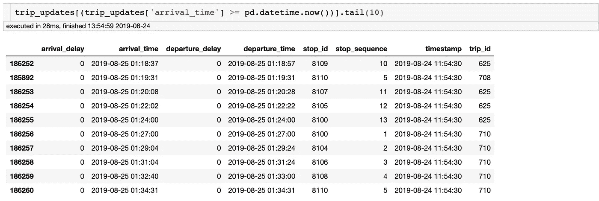

# 使用 Python (Pandas，Plotly，SodaPy)分析轻轨网络

> 原文：<https://towardsdatascience.com/analysis-on-the-light-rail-network-using-python-pandas-plotly-sodapy-6a8f255eb225?source=collection_archive---------12----------------------->

我记得当我听说堪培拉最新的公共交通时，我是多么兴奋。我只去过澳大利亚的几个地方，但我觉得堪培拉错过了悉尼和墨尔本的轻轨系统，因为它们非常方便，感觉很棒🏎

我喜欢轻轨运行的平稳程度 **(可能除了在到达终点站 Gungahlin 之前的那一小段，在那里感觉好像电车从轨道上刮去了税款)** ，它如何节省汽油、停车或只是一般的旅行费用(优惠利率——我在大学，我有折扣，政府理解我的财务困难，因为我把钱都花在大米上了*sob*)。乘坐电车往返城市对我来说很有意义，这太棒了！

但是就像世界上的所有事情一样，轻轨解决方案也有一些问题需要解决，比如[险些出事](https://www.youtube.com/watch?v=yBSB2efY03A)🤦🏽和[事故](https://www.abc.net.au/news/2019-08-12/pedestrian-hit-by-canberra-light-rail/11404506)，这可能会导致其他事情的延迟。在这篇文章中，我想看看延迟并收集一些见解。

# TL；速度三角形定位法(dead reckoning)

## Jupyter 笔记本:

[(全代码)](https://plot.ly/~noel.angelo/0/table-of-contentsspan-classtocski/)

> 在**平均**上，轻轨在高峰时段延误有多严重？— **全行程*** (阿林加圣⟷贡加林广场)

*   **到阿林加街:**晚 13.8 秒(*上午 8 点*)
*   **到 Gungahlin Pl:** 晚 25.5 秒(*下午 5 点*)

> 服务—完成百分比？💯

*   工作日: 212 次-100%
*   星期五: 224 次旅行— 100%
*   星期六: 152 次旅行——100%
*   周日: 123 趟——100%

> 记录的最长延迟时间是多少，是否与任何事故有关？

*   **2019 年 7 月 16 日:** 11.8 分钟— [北伯恩大道与斯温登街交叉口发生车祸](https://www.canberratimes.com.au/story/6276799/car-and-tram-crash-on-light-rail-line/)
*   **2019 年 8 月 12 日:** 9.8 分钟— [北伯恩大道与巴里街交叉口之间的行人事故](https://www.abc.net.au/news/2019-08-12/pedestrian-hit-by-canberra-light-rail/11404506)

> 哪个车站在终点站停车后延迟最长？

*   **到阿林加街:**埃卢埃拉街—9: *上午 25 点(9.1 分钟；8 月至 12 日)*
*   **到贡加林 Pl:** 曼宁克拉克 Cr —上午 7:18*(11.3 分；8 月 20 日)*

# 关于数据

堪培拉地铁运营 (CMO)运营着堪培拉有史以来第一条轻轨。轻轨系统已经运行了几个月，往返于城市和贡加林之间。你可能听说过在电车向公众开放的第一个月，人们来回乘坐电车。ACT 政府最近开始通过他们的[开放数据门户](https://www.data.act.gov.au/)发布轻轨[数据](https://www.transport.act.gov.au/contact-us/information-for-developers) ( [车辆](https://www.data.act.gov.au/Transport/Canberra-Metro-Light-Rail-Transit-Feed-Vehicle-Upd/4f7h-bvpk)，[车次](https://www.data.act.gov.au/Transport/Canberra-Metro-Light-Rail-Transit-Feed-Trip-Update/r9a8-xw6s))。他们以通用交通馈送规范(GTFS)格式提供完整的时间表，其中集成了谷歌地图的实时更新。有关更多信息，请参考以下链接:

*   [**CMET 轻轨 GTFS 数据馈送**](https://www.transport.act.gov.au/googletransit/google_transit_lr.zip) :该 zip 文件包含轻轨服务的静态时刻表数据( *CSV 文件*)
*   [**CMET 轻轨 GTFS-R 数据进给**](http://files.transport.act.gov.au/feeds/lightrail.pb) :此数据进给(*)。pb 文件*)包含轻轨实时位置和运动信息。
*   [**CMET 轻轨历史档案**](https://www.data.act.gov.au/Transport/Canberra-Metro-Light-Rail-Transit-Feed-Trip-Update/jxpp-4iiz) :此数据馈送( *API 端点*)包含通过 GTFS-R 馈送记录的行程。
*   [**使用轻轨—堪培拉交通**](https://www.transport.act.gov.au/about-us/public-transport-options/light-rail/using-light-rail):**TC 网站上对应轻轨服务频率的行驶时间。**

# **数据收集**

****Socrata 开放数据 API** :我从 ACT 的开放数据门户对 [***轻轨历史档案***](https://www.data.act.gov.au/Transport/Canberra-Metro-Light-Rail-Transit-Feed-Trip-Update/jxpp-4iiz) 进行了 API 调用，以获取几个月的 ***行程更新*** 记录，因为有时数据越多越有趣— *。***

> **(注:轻轨有 2 组信息实时更新并存档— **车辆**和**行程**更新，以下要点从门户拉存档的**行程** **更新**)**

**Retrieve data from ACT Open Data Portal**

> **对于以下文件，我们可以从堪培拉交通局网站上发布的 [**GTFS 数据馈送**](https://www.transport.act.gov.au/googletransit/google_transit_lr.zip) 中提取。**

****行程(GTFS)** :我们想从获取`trips.csv`文件，因为它包含每个**行程**的`route_id`，这将有助于以后将**部分**(井场→贡加林 Pl | EPIC→阿林加 St)行程与**全部**(贡加林 Pl →阿林加 St)行程分开。**

****停靠站(GTFS)** :我们也想得到这个`stops.csv`，因为我们想显示停靠站的名称，而不只是让它的`stop_id`在以后可视化。**

> ***在 GTFS，全车次有一个***`*ACTO001*`*，而部分车次可以是* `*X1*` *或* `*X2*` *。*****

# ****数据争论****

****这里是我对数据集做的一些事情。*(朱庇特笔记本)*****

*   ****按时间顺序对数据集进行排序(*最早到最晚*)****
*   ****选择适合用于此分析的列****
*   ****转换列的数据类型****
*   ****重命名一些列****
*   ****将轻轨记录与*预约公交车* → *沿轻轨路线行驶并在高峰时段将人从 A 点到 B 点的公交车*分开****
*   ****掉起飞延误(`departure delay`好像和`arrival delay`一样。我期望在某些事件期间看到到达和延误之间的一些变化，例如*电车故障、事故、未遂事故*——但在数据集中似乎没有变化****

# ****删除预测记录****

****我想查看数据集中的到达和离开时间，并将其与指示数据检索时间的时间戳进行比较。我这样做的原因是，我只想汇总历史记录。查看下面列出的`date range`,似乎在我们的数据集中有预测到达时间的行。****

********

****Last 10 rows of the data pulled from the Open Data Portal with a filter to see which rows have predicted values****

********

# ****添加其他信息****

****我还想为每次旅行添加路线类型，以便能够通过添加`month`和`days`来帮助我按照月份和工作日对行进行过滤和分组，从而将分类为`partial trip`或`full trip`****

****这段代码将为我们提供这个分析的最终数据集。****

********

****First five rows of the working dataset****

# ****数据分析****

****我想在宏观层面上查看数据集，我想根据行程的路线和目的地对行程进行分类:****

*   ******路线 id** :部分(`X1`和`X2`)和全部(`ACTO001`)行程。****
*   ******行程目的地** : ( `Gungahlin Pl`)和(`Alinga St`)。****

****我有兴趣看到以下内容:****

> ****高峰时段轻轨平均晚点多少？****
> 
> ****轻轨的总行程数是多少(按路线、目的地和服务)？****
> 
> ****记录的最长延迟时间是多少，是否与任何事故有关？****
> 
> ****哪个车站在终点站停车后延迟最长？****

## ****假设—高峰时段的延误****

****参照 **CMO** 出版的 [*频率指南*](https://cmet.com.au/frequency-guide/) 可以得知峰值时间如下:****

****到阿林加街(*每 6 分钟一趟，电车到达每个车站*):****

*   ******上午 7:00 至 9:00**:早高峰时间****
*   ******下午 4:00 到 5:30**:晚高峰时间****

****到 Gungahlin Place ( *每 6 分钟—电车到达每个车站*):****

*   ******早上 7:30 到 9:00**:早高峰时间****
*   ******下午 4 点到 6 点**:晚高峰时间****

****Data visualisation of the aggregated (average) delays from the trips in the dataset — (*Plotly)*****

> ****从上图中，我们可以看出，在所有 13 个站点中，前往 ***思域*** 的轻轨平均在上午 *8:00 左右晚点 **13.8 秒**，前往* ***君临*** 的轻轨平均在下午 *5:00 左右晚点 **25.5 秒**。*****
> 
> ****考虑到人们正前往工作，人们已经预料到去 Civic 的最高到达延迟将是在清晨左右。有趣的是，到达冈加林的时间会延迟。去思域的时候几乎是两倍的量。****

## ****分析 1——计划行程与观察行程的总次数****

****查看[堪培拉交通局](https://www.transport.act.gov.au/googletransit/google_transit_lr.zip)提供的`trips.csv`文件，我们可以提取轻轨的静态时间表，并计算出某一天应该有多少趟车。GTFS 有一个名为`service_id`的元数据，它为计划的旅行次数指定了工作日。****

****Number of expected trips for each weekday taken from static timetable (GTFS) — (Plotly)****

****现在看看工作数据集，我们可以细分每个月(6 月 19 日-8 月 24 日)的图表。****

********

****Number of actual trips from the 19th of June to the mid-day of 24th of August****

****然后，我们可以开始绘制静态时间表和每天发生的行程之间的差异，并获得每天完成的行程的百分比。****

****看上面的图表，汇总每天的数据来查看周五和周日是否完成了旅行次数有点棘手。这是因为周五和周日的服务与其他日期重叠，当数据被聚合时，重叠的数据被添加到它所属的工作日，而不是到服务本身。****

****我们可以根据服务 id 来计算唯一行程 id 的数量，而不是每天汇总数据*。—我们 100%完成了行程！*****

## *****分析 2 —记录的最高延迟时间；它与任何事件有关吗？*****

**********

*****图中最明显的异常是发生在 7 月 16 日的延迟。汽车撞上电车的日期是哪一天？—[https://www . Canberra times . com . au/story/6276799/car-and-tram-crash-on-light-rail-line/](https://www.canberratimes.com.au/story/6276799/car-and-tram-crash-on-light-rail-line/)。*****

********************

*****延迟上升的第一个实例发生在**斯温登街**(停止序列 8)——我们可以将此与纳拉伯大道和斯温登街交叉口发生事故的新闻相关联。由于坠机，延误了 11.8 分钟。*****

**********

*****对于 8 月，异常值来自 8 月 12 日。还有一起事故，一名行人被电车撞了。—[https://www . ABC . net . au/news/2019-08-12/行人被堪培拉轻轨撞/11404506](https://www.abc.net.au/news/2019-08-12/pedestrian-hit-by-canberra-light-rail/11404506) 。延迟时间长达 9.6 分钟。*****

## *****分析 3-在终端停止后，哪个停止的延迟最高？*****

**********

*****Stop Sequence 12 to Alinga St. is Elouera Street*****

*****这里延迟最高的是前往阿林加街的行程，8 月 9 日到达**埃卢埃拉街**时，比**晚了 9 分钟到达。*******

**********

*****Stop Sequence 9 is Well Station Drive*****

*****有趣的是，记录到 Gungahlin 的最高延迟是 712 秒的**井站驱动**(停止顺序:9)或延迟 717 秒(大约 12 分钟)的**nullabor Avenue**(停止顺序:10)。*****

# *****最终考虑*****

*****理解有轨电车服务的延误对于物流问题和环境原因是很重要的。如今，越来越多的居民尝试乘坐电车，并不得不应对对这种公共交通工具日益增长的需求。*****

*****在这里，我们试图研究这个问题的一部分:通过显示哪些停靠序列和哪些行程具有最高的延迟。我们可以更好地安排需求，并确定未投入使用的轻轨的最佳维护日期。过马路时请小心，注意周围的环境🙏。*****

******注意:我还计划建立一个仪表板，使用 Elasticsearch 框架将所有这些信息汇集到一个视图中。我对数据分析和这类事情还很陌生，所以如果你知道有关于 elasticsearch 或 Kafka 的好材料的文章或教程，请让我知道！在那之前-保持可爱！******