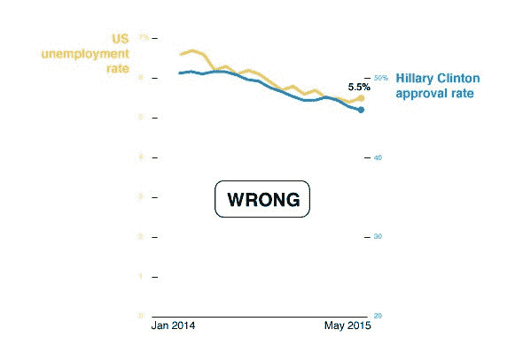

# 分析师来自金星，经理来自火星

> 原文：<https://towardsdatascience.com/analysts-are-from-venus-managers-are-from-mars-9193113167cd?source=collection_archive---------19----------------------->

# 你好，我的名字是 Aviad，我是一个数据迷。

作为一名分析师，我有时会对与高层管理人员一起工作感到沮丧。这不是针对个人的，我们只是有两种不同的心态。这篇文章是关于解决管理者对数据分析的一些常见误解。

> 他使用统计数据就像一个醉汉使用灯柱一样——为了支撑而不是为了照明。
> 
> ~苏格兰小说家安德鲁·朗

# 错误 1

## 让我们检查一切！

给分析师数据并指示他“告诉我一些我不知道的事情”是一个冒险的举动，结果会有很大的不同(以意想不到的方式),这取决于分析师的技能、经验和随机因素，如他当前的精神状态——这根本不是科学方法的工作方式。

对于人群中的所有怀疑者，我提供一个简单的测试:去找你的家庭医生，要求做所有的测试。他的答案将是直截了当的“不”，第一个原因是这是浪费时间和资源，第二个也是更重要的原因是你*会*得到假阳性。

更正确的方法是让你的分析师使用数据提出有趣的假设，而你，经理，将评估哪些假设对业务有潜在的重要意义。然后，分析师将尝试验证或否定这些特定的假设。

# 错误 2

## 只有一个事实

分析相同的数据集并不能保证不同的人会得到相同的结果。从相同的原始数据中得到相互矛盾的结果，这可能会让一些经理感到惊讶。重要的是要明白，重要的不仅是*你算什么*，还有*你怎么算*。

你下一个生日是几岁？让我们假设你出生于 2000 年 1 月 1 日。2030 年 1 月 2 日，你几岁了？嗯，根据公历的假设，你将是 30 岁，但你的韩国年龄实际上是 31 岁，你的回历年龄大约是 29 岁零 10 个月。

我们在分析数据时盲目应用的假设对数据本身的质量同样重要。作为经理，你需要理解潜在的假设，而不仅仅是最终结果。不这样做的经理们倾向于强迫他们的分析师总是重复相同的假设(即使这是一个严重的错误),只是为了让结果看起来一致，容易比较，尽管事实上并非如此。

# 错误 3

## 相关性表明因果关系

它没有！让我们用这个有趣的例子:你配偶的平均快乐程度与你给他们买花的次数成强烈的负相关。你有没有注意到，就在你递给他/她一束漂亮的花的时候，他们总是在为某件事烦恼？显然，这个事实并不意味着送花会让人难过。

A 和 B 之间的相关性可能意味着以下三种情况之一:

1.  a 导致 B
2.  b 导致 A
3.  或者在我们的具体例子中，C 导致 A *和* B(你做了一些愚蠢的事情，让你的配偶感到不安和内疚，让你给他们买花)

发现相互关系、现象、效果等。远不如建立解释它们为什么会发生的理论模型重要。观察到可以用单一理论解释的矛盾现象并不少见。不理解这一点的经理有可能根据短暂的观察做出糟糕的临时决策。

# 错误 4

## 数据不会说谎

具体来说，我说的是图表……不要误解我的意思，图表很神奇，它让你不用浪费太多脑力就能立即发现趋势和异常——但是*可能会带来问题。即使使用 100%准确的数据，用图表撒谎也是如此容易。*

这里有一个小练习:试着理解这三个例子中的偏见【感谢: [Chiqui Esteban，国家地理](http://news.nationalgeographic.com/2015/06/150619-data-points-five-ways-to-lie-with-charts/)】。

## 1.破碎的鳞片

## 2.虚假因果关系

## 3.缺失的视角

# 总结:数据政治

在这篇短文中，我们讨论了关于数据的四种常见误解。我认为它们源于管理者和分析师对数据的不同理解:

*   经理们倾向于使用数据来支持他们的决策，公司的议程，有时只是为了感觉在控制中。因此，管理者通常寻求高度可视化和一致的数据。
*   分析师寻求“狩猎的刺激”，揭示复杂和隐藏的真相。对于分析师来说，数据是一个游乐场，但我们确实需要知道游戏规则。

分析师和经理应该协同工作:经理定义游戏的方向和目标。分析师只是想找点乐子，确保没人作弊。一个好的经理应该理解游戏规则，就像一个好的分析师应该理解他为什么要玩游戏一样。