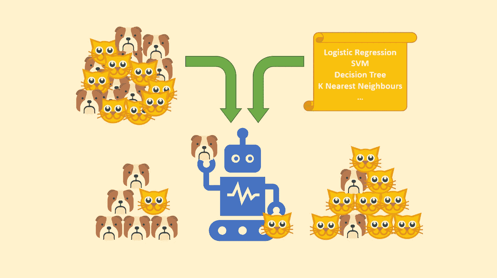
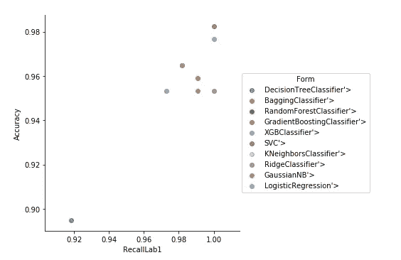

# 分析构建模块:二元分类

> 原文：<https://towardsdatascience.com/analytics-building-blocks-binary-classification-d205890314fc?source=collection_archive---------11----------------------->

## *模块化笔记本电脑，以控制面板的方式用最少的编码调整和比较 9 种分类算法*



Common Binary Classification Task

欢迎来到第二期分析构建模块！我的回归笔记本上的反馈是出版分类笔记本的巨大动力。如果您已经使用了回归笔记本，您可以滚动到底部，从我的 GitHub repo 访问该笔记本，因为结构保持不变。如果没有，请继续阅读…

本文总结并解释了我的分类模块(我正在开发的用于执行常见分析任务的简单模块化笔记本之一)的关键模块。该笔记本旨在帮助对分类模型和 Python 编程有一定了解的用户更快地进行实验。然而，这一次我已经包括了一些其他的伟大的文章，给用户关于这个主题的先验知识。GitHub 到笔记本的链接在文章底部！

## 介绍

与回归问题类似，分类也是分析学中的经典问题之一。通过预测数据属于某一类的概率，任何分类都可以转化为回归问题，但我们暂时不会深入探讨。这是我分享创建这些笔记本的标准动机:很多时候，在执行分析任务时，通过测试不同的模型形式来确定最合适的模型，以根据手头的问题提供准确性、复杂性和执行效率的良好平衡，这是很好的快速失败。RapidMiner 等一些软件提供此功能。然而，出于这个目的使用软件产品会导致在调整模型和探索一些复杂性方面的黑盒方法。因此，我决定创建一个简单的 python 脚本，它具有足够的模块化和参数化，能够测试和调整许多广泛使用的分类算法，只需对代码进行最小的更改。
本笔记本摘要如下:

## 目标:

在 Python 中以最少的人工干预测试、调整和比较各种分类模型。
本模块包含的车型有:

*   逻辑回归
*   脊线分类器
*   k 个最近邻居
*   决策树分类器
*   随机森林
*   打包(默认使用决策树)
*   梯度推进
*   XGBoost
*   支持向量机

## 用户熟练程度:

用户应该对每种算法的工作原理有一个直观的了解，并且很好地理解改变一个特定的超参数会如何影响结果。需要对 python 有基本的了解，以便能够有效地利用代码，并根据需求进一步定制代码。

尽管如此，我还是包含了一些很棒的文章的链接，以便理解这些算法的基础:

*   逻辑回归:

[](/logistic-regression-detailed-overview-46c4da4303bc) [## 逻辑回归—详细概述

### 逻辑回归在二十世纪早期被用于生物科学。它后来被用于许多社会…

towardsdatascience.com](/logistic-regression-detailed-overview-46c4da4303bc) 

*   决策树分类:

[](https://medium.com/@chiragsehra42/decision-trees-explained-easily-28f23241248) [## 决策树很容易解释

### 决策树(DTs)是一种用于分类和回归的非参数监督学习方法。决定…

medium.com](https://medium.com/@chiragsehra42/decision-trees-explained-easily-28f23241248) 

*   集合模型:

[](/two-is-better-than-one-ensembling-models-611ee4fa9bd8) [## 两个比一个好:集合模型

### 组装起初听起来像是一个非常吓人的词，但实际上看起来很简单…让我解释一下组装…

towardsdatascience.com](/two-is-better-than-one-ensembling-models-611ee4fa9bd8) 

*   评估分类模型的指标:

[](https://neptune.ai/blog/f1-score-accuracy-roc-auc-pr-auc) [## F1 评分 vs ROC AUC vs 准确性 vs PR AUC:应该选择哪种评价指标？|海王星的…

### 所以你在做一个机器学习项目，并且在想:什么时候准确度是比 ROC AUC 更好的度量？什么是…

海王星. ai](https://neptune.ai/blog/f1-score-accuracy-roc-auc-pr-auc) [](/understanding-auc-roc-curve-68b2303cc9c5) [## 理解 AUC-ROC 曲线

### 在机器学习中，性能测量是一项基本任务。所以说到分类问题，我们可以…

towardsdatascience.com](/understanding-auc-roc-curve-68b2303cc9c5) 

## 关键可修改输入:

以下是关键输入(行内注释中为每个输入提供了更多详细信息)。这些部分在代码中用注释“**突出显示，在此处进行修改**”:

*   用于分类分析的输入数据集:在本例中，我使用了来自熊猫默认数据集的“乳腺癌”数据集
*   测试数据比例:0 到 1 之间，默认为 0.3(或 30%)
*   归一化:0-无归一化，1-最小-最大缩放，2-Z 分数缩放
*   要测试的模型对象列表
*   网格搜索的折叠次数(超参数调整)
*   确定最佳模型的评分标准(例如，准确性)—代码注释中提供了更多详细信息
*   在模型拟合期间查看端子详细程度的标志:0-无输出，1-所有详细信息，2-进度条
*   超参数库:代码中的一个全局字典，为每个模型表单提供一组超参数进行调整

## 一般执行步骤:

获取这些输入后，对考虑中的**每个**模型形式执行以下动作:

*正向特征选择
*标准化
*网格搜索超参数调整
*最佳模型的度量计算

## 输出:

创建了一个 pandas 数据框架“结果”,它为标签 1 测试的每个模型提供了以下指标。您可能需要根据哪个类对基于上下文的分析更重要来调整输入数据。

*   具有最佳超参数的模型细节
*   模型精度
*   精确度和召回率
*   f-测度
*   受试者工作特征曲线下面积(AUC)

此表有助于比较各种模型形式。精确度和召回率指标有助于选择更符合业务目标而不仅仅是精确度的模型。

## 重要提示:

该模块不以任何方式处理特征工程，仅基于输入数据执行特征选择。为了改善任何模型的结果，执行有效的特征工程是非常重要的。用户可能会观察到一种模型形式比另一种给出更好的结果，但是任何模型的整体性能都可以随着预测变量的改进而显著提高。

## 剧本:

## 各种任务的模块

第一个函数根据用户在控制面板中指定的条件，为标准化和网格搜索创建管道。

```
def create_pipeline(norm, model):
    if norm == 1:
        scale = StandardScaler()
        pipe = Pipeline([('norm', scale), ('reg', model)])
    elif norm == 2:
        scale = MinMaxScaler()
        pipe = Pipeline([('norm', scale), ('reg', model)])
    else:
        pipe = Pipeline([('reg', model)])
    return pipe
```

第二个函数执行正向特征选择，并返回最佳特征的索引。

```
def select_features(model, X_train, Y_train, selection,
                    score_criteria, see_details, norm=0):
    pipe = create_pipeline(norm, model)
    sfs = SequentialFeatureSelector(pipe,
                                    forward=selection,
                                    k_features='best',
                                    scoring=score_criteria,
                                    verbose=see_details)
    sfs = sfs.fit(X_train, Y_train)
    return list(sfs.k_feature_idx_)
```

该函数对所提供的参数网格执行网格搜索，并返回最佳模型对象。

```
def run_model(model, param_grid, X_train, Y_train,
              X, Y, score_criteria, folds,
              see_details, norm=0):
    pipe = create_pipeline(norm, model)
    model_grid = GridSearchCV(pipe,
                              param_grid,
                              cv=folds,
                              scoring=score_criteria,
                              verbose=see_details)
    model_grid.fit(X_train, Y_train)pipe = create_pipeline(norm, model_grid.best_estimator_)
    return model_grid.best_estimator_
```

最后一个函数计算最佳超参数组合的所有相关指标，并返回这些指标的 pandas 系列。

```
def get_model_eval(model, X_train, Y_train, X_test, Y_test):
    cm = confusion_matrix(Y_test, model.predict(X_test))
    t1, f1, t0, f0 = cm[1, 1], cm[1, 0], cm[0, 0], cm[0, 1]
    precision = precision_score(Y_test, model.predict(X_test))
    recall = recall_score(Y_test, model.predict(X_test))
    return pd.Series([model,
                      (t1 + t0) / (t1 + t0 + f1 + f0),
                      precision,
                      recall,
                      2 * precision * recall / (precision + recall),
                      -1 if type(model.steps[1][1]) == RidgeClassifier else roc_auc_score(Y_test, model.predict_proba(X_test)[:, 1])])
```

## 全局超参数字典(在此进行修改)

这是该模块中所有模型的各种模型参数的全局字典。在基于癌症数据集的典型范围的代码中已经填充了一些缺省值集。该词典包含每个模型的一些关键超参数，但并不详尽。鼓励用户访问 scikit-learn 文档以获得所有参数的列表，并根据他们的要求添加到下面的字典中。

```
# Global model paramater grid dictionary------------------------------------
# Change your hyperparameter ranges for grid search in this section
PARAM_DICT = {
  LogisticRegression: {
    'reg__tol': [1e-2, 1e-4, 1e-6],
    'reg__fit_intercept': [True, False],
    'reg__penalty': ['l1', 'l2']
  },
  RidgeClassifier: {
    'reg__alpha': [0.1, 1, 100],
    'reg__copy_X': [True, False],
    'reg__fit_intercept': [True, False],
    'reg__tol': [0.1, 1],
    'reg__solver': ['auto', 'svd', 'cholesky', 'lsqr',
      'sparse_cg', 'sag', 'saga'
    ]
  },KNeighborsClassifier: {
    'reg__n_neighbors': [5, 30, 100]
  },
  GaussianNB: {
  },DecisionTreeClassifier: {
    'reg__max_depth': [5, 10, 20],
    'reg__max_features': [0.3, 0.7, 1.0],
    'reg__max_leaf_nodes': [10, 50, 100],
    'reg__splitter': ['best', 'random']
  },BaggingClassifier: {
    'reg__bootstrap': [True, False],
    'reg__bootstrap_features': [True, False],
    'reg__max_features': [0.3, 0.7, 1.0],
    'reg__max_samples': [0.3, 0.7, 1.0],
    'reg__n_estimators': [10, 50, 100]
  },
  RandomForestClassifier: {
    'reg__bootstrap': [True, False],
    'reg__max_depth': [5, 10, 20],
    'reg__max_features': [0.3, 0.7, 1.0],
    'reg__max_leaf_nodes': [10, 50, 100],
    'reg__min_impurity_decrease': [0, 0.1, 0.2],
    'reg__n_estimators': [10, 50, 100]
  },SVC: {
    'reg__C': [10 ** -3, 1, 1000],
    'reg__kernel': ['linear', 'poly', 'rbf'],
    'reg__shrinking': [True, False],
    'reg__probability': [True]
  },GradientBoostingClassifier: {
    'reg__learning_rate': [0.1, 0.2, 0.5],
    # 'reg__loss': ['ls', 'lad', 'huber', 'quantile'],
    'reg__max_depth': [10, 20, 50],
    'reg__max_features': [0.5, 0.8, 1.0],
    'reg__max_leaf_nodes': [10, 50, 100],
    'reg__min_impurity_decrease': [0, 0.1, 0.2],
    'reg__min_samples_leaf': [5, 10, 20],
    'reg__min_samples_split': [5, 10, 20],
    'reg__n_estimators': [10, 50, 100]
  },
  XGBClassifier: {
    'reg__booster': ['gbtree', 'gblinear', 'dart'],
    'reg__learning_rate': [0.2, 0.5, 0.8],
    'reg__max_depth': [5, 10, 20],
    'reg__n_estimators': [10, 50, 100],
    'reg__reg_alpha': [0.1, 1, 10],
    'reg__reg_lambda': [0.1, 1, 10],
    'reg__subsample': [0.3, 0.5, 0.8],
    'reg__probability': [True]
  }}
```

## 按键输入的用户控制面板(在此进行修改)

可以在此处更改模块的输入。这是这个脚本的控制面板，介绍中提到的所有变量都可以在这里修改，以测试各种场景。请参考评论了解变量。

```
# --------------------------------------------------------------------------
# USER CONTROL PANEL, CHANGE THE VARIABLES, MODEL FORMS ETC. HERE# Read data here, define X (features) and Y (Target variable)
data = datasets.load_breast_cancer()
X = pd.DataFrame(data['data'])
X.columns = data['feature_names']
Y = data['target']# Specify size of test data (%)
size = 0.3# Set random seed for sampling consistency
random.seed(100)# Set type of normalization you want to perform
# 0 - No Normalization, 1 - Min-max scaling, 2 - Zscore scaling
norm = 1# Mention all model forms you want to run
to_run = [DecisionTreeClassifier,
          BaggingClassifier,
          RandomForestClassifier,
          GradientBoostingClassifier,
          XGBClassifier,
          SVC,
          KNeighborsClassifier,
          RidgeClassifier,
          GaussianNB,
          LogisticRegression]# Specify number of crossvalidation folds
folds = 2# Specify model selection criteria
# Possible values are:
# 'accuracy'
# 'precision'
# 'recall'
# 'f1'
# 'roc_auc'score_criteria = 'accuracy'# Specify details of terminal output you'd like to see
# 0 - No output, 1 - All details, 2 - Progress bar
# Outputs might vary based on individual functions
see_details = 0
```

## 模型执行

该部分迭代地为用户指定的每个模型找到最佳的超参数集，计算度量并填充结果表，用于进一步的分析/实验。

```
# Model execution part, results will be stored in the dataframe 'results'
# Best model can be selected based on these criteriaresults = pd.DataFrame(columns=['model', 'Accuracy', 'PrecisionLab1', 'RecallLab1',
                                'FMeasureLab1', 'AUC'])X_train, X_test, Y_train, Y_test = train_test_split(X, Y, test_size=size)for model in to_run:
    with warnings.catch_warnings():
        warnings.simplefilter('ignore')
        best_feat = select_features(model(), X_train, Y_train, True,
                                    score_criteria, see_details, norm)
        model = run_model(model(), PARAM_DICT[model],
                          X_train.iloc[:, best_feat],
                          Y_train,
                          X.iloc[:, best_feat], Y,
                          score_criteria, folds, see_details, norm)
        stats = get_model_eval(model, X_train.iloc[:, best_feat], Y_train,
                               X_test.iloc[:, best_feat], Y_test)
        stats.index = results.columns
        results = results.append(stats, ignore_index=True)print(results)
results['Form'] = [str(i).split()[-1].split('.')[-1] for i in to_run]
sb.lmplot('RecallLab1', 'Accuracy', hue='Form', data=results, fit_reg=False)
```

## 结论



在癌症患者检测的情况下，从形式上来说，检测所有患者对于我们的模型具有尽可能高的召回率是非常重要的。从上图中，我们可以观察到有三种模型能够达到完美的召回率:岭分类器、逻辑回归和支持向量机。在这种情况下，最好的方法是在这些模型中选择精度最高的模型，即 SVM 模型。

与回归笔记本中的示例类似，逻辑回归和岭分类器等更简单的模型比集成模型表现得更好。

我希望这个模块能够加快实验速度，并提供一个机会，根据您的需求在它的基础上构建进一步的定制！

点击此处查看完整的笔记本:

[](https://github.com/himanshu0394/AnalyticsToolkit/blob/master/Classification%20Block.ipynb) [## himanshu0394/AnalyticsToolkit

### 通过在 GitHub 上创建一个帐户，为 himanshu0394/AnalyticsToolkit 开发做出贡献。

github.com](https://github.com/himanshu0394/AnalyticsToolkit/blob/master/Classification%20Block.ipynb)