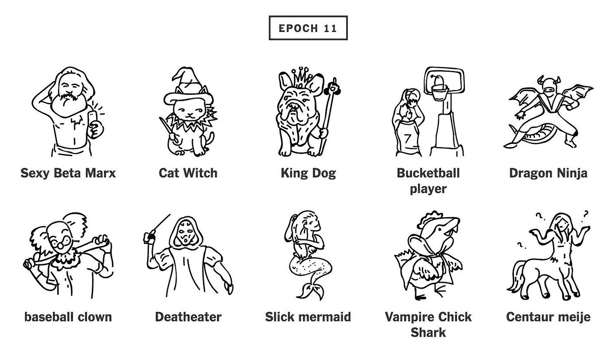

# 分析不是讲故事…

> 原文：<https://towardsdatascience.com/analytics-is-not-storytelling-a1fe61b1ab6c?source=collection_archive---------2----------------------->

## 关于分析的本质，第 1 部分，共 2 部分

Here’s the audio version of the article, read for you by the author.

From the TV show “[How I Met Your Mother](https://www.youtube.com/watch?v=f_J8QU1m0Ng)”

典型的分析 101 课程会发生什么？你通常会学习一些分析软件的基础知识(在 R-Python-SQL-SAS-Stata-MATLAB-big query-Tableau-Excel-Looker-whatever 中)，如何将[数据](http://bit.ly/quaesita_hist)加载到那个软件中，以及如何做出像上面的饼状图和条形图这样的可视化汇总。

If you forgot [how to read a bar chart or a histogram](http://bit.ly/quaesita_hist), just think of the versions you find in nature. Same thing!

但这就像艺术和画笔一样需要分析。艺术将会在过去的绘画中幸存，分析将会比电子表格更长久。为了在庆祝今天的节日时看到没有典型装饰的分析的本质，这里有一个万圣节风味的帖子供你娱乐…

*免责声明:对于那些今年在网上玩“不给糖就捣蛋”游戏的人，请注意一些细微差别被故意省略了，因为它们将在* [*第二部分*](http://bit.ly/quaesita_speed) *中出现，或者我已经在我的其他文章中讨论过了。[*[*1*](http://bit.ly/quaesita_di)*][*[*2*](http://bit.ly/quaesita_datasci)*][*[*3*](http://bit.ly/quaesita_hero)*][*[*4*](http://bit.ly/quaesita_roles)*][*[*5*](http://bit.ly/quaesita_inkblot)*][*[*6*](http://bit.ly/quaesita_history)

## 领域专业知识很重要

想象一下你从来没有庆祝过万圣节。但是你刚刚被说服参加今晚的派对。你是负责服装决定的决策者，我是你的分析师。你会得到很好的帮助，因为作为一个狂热的万圣节爱好者，我正在学习相关领域的知识。

A tricky Priority One Bug caught and fixed at Google. (Why, what do you wear to the office?)

领域专业知识对分析师来说极其重要——如果我没有，我最好去争取。从来没有听说过万圣节的分析师在帮你挑选服装时会受到严重限制。他们可能会忽略各种有用的数据，因为他们不知道自己在看什么。看到一个分析师进入一个新的领域而没有立即问，*“我在哪里可以找到一个领域大师交谈呢？”这是一个不好的迹象*

## 分析师可以讲故事，但他们不是讲故事的人

与普遍的看法相反，分析师的职能不是“讲故事”或用数据说服人。那叫*营销*。(或者可能是*新闻业*。)

在每个成年人的生活中，都会有这样一个时刻，我们必须推销我们的工作，以便我们的利益相关者重视我们，并做我们希望他们做的事情，但让我们把这种黑暗艺术称为什么，并在另一篇文章中谈论它。当然，优秀的分析师非常了解人类的注意力，并能操纵他们的观众，但这是一种职业为另一种职业打开大门的副产品。能够讲故事是分析师需要具备的技能，但他们的工作是另外一回事。

> 分析不是营销。区别在于，一个是关于扩大决策者的视角，而另一个是关于缩小它。

用万圣节的术语来说，我作为分析师的工作不是说服你穿上我去年穿过的蟑螂服。我享受万圣节甚至比愚人节和我的生日*加起来*还要多，所以说到服装，我自然是各种意见。

It’s okay if you don’t [get it](http://bit.ly/sigma-field). Measure theory isn’t for everyone.

我喜欢书呆子。我的服装越概念化、越晦涩越好。我每年只需要一个怪人的笑声，就能让整个努力变得有价值。今年我重现了[最初的 R.U.R .服装](http://bit.ly/rurobots)，而前几年包括一个印有“万圣节快乐”的 FORTRAN 打孔卡和一个上面有[勒贝格测量](http://bit.ly/lebesgue-measure)的[西格玛字段](http://bit.ly/sigma-field)。

然而，这个项目是关于你的品味，而不是我的。我作为分析师的角色不是操纵你得出我已经得出的结论。我的意见不是重点…除非你喜欢我为你挑一套服装。然后你就可以把决策权下放给我，把我从分析师变成决策者。(这样的话，让我们给你穿上[多臂强盗](http://bit.ly/multiarmed-bandit)。我们所需要的只是几双长手套、脱脂棉、一把玩具手枪、一块大手帕……)

## 分析师充当你的眼睛

作为一名分析师，我不应该卖给你任何东西。我是你的眼睛，每分钟给你尽可能多的灵感。你首先需要一个分析师的原因是你没有时间去研究数据，但是你仍然想成为发号施令的人。在这种情况下，我可能比你有*更多的领域专业知识……但这并不意味着你会同意我为你挑选服装。你雇我是为了让你开阔眼界，而不是代表你做决定。你不想放弃选择的权利，我有责任尊重这一点。这就是将分析与决策和营销分开的原因。*

> 如果决策者不想放弃选择的权力，分析师有责任尊重这一点。即使分析师比决策者更了解领域。

如果我采用营销或讲故事的方法，我会蒙蔽你的双眼，削弱你对可能性空间的看法。一个好的分析师会做相反的事情，让你很快接触到各种各样的观点。理想情况下，如果你是那个花时间在[数据](http://bit.ly/quaesita_hist)中漫游的人，我会帮助你吸收所有你想寻找的信息……加上你甚至不知道你应该要求查看的有用的东西。

## 工具是达到目的的手段

外面有万圣节的信息，分析师的工作就是找到它，检查它，为你过滤它，然后让你尽快吸收尽可能多的最有前途的东西。

不管我是用 R，SQL，C++，一个图书管理员，还是一个搜索引擎来表层信息，都是分析。如果你对数据的理解仅限于电子表格和数据库，那么你的思维不够开阔。你可以在这里找到我对数据本质及其与格言*“知识就是力量】* [的关系的思考。](http://bit.ly/quaesita_hist)

## 尽量不要浪费决策者的时间

一位专家分析师对速度的优点持严肃态度。那不仅仅是有快速查找东西的手指。我应该努力不浪费*你的*时间。我有无限多的选择来为你提供信息，但是你的派对是今晚的*。如果我开始用你需要提前几个月订购的“鼓舞人心的”精致手工服装轰炸你，我就是一个愚蠢的分析师。*

Creepy costume I saw last weekend in NYC, complete with mechanical baby arms. Probably not something you could cobble together in a day.

在我们更进一步之前，我需要了解你与时空连续体的关系，这样我就能知道你可以去哪些服装店，以及要取消哪些运输选项。我还应该问一下预算。如果你的预算是一个脚趾甲，我会浪费你的时间，如果我给你太多关于花费一只胳膊和一条腿的衣服的信息。

Maybe your budget is literally some [toenails](https://www.amazon.it/Costume-Costumi-adulto-vestiti-carnevale/dp/B01MDKM62E)? Who am I to judge?

我可能还是会给你看一两个昂贵的选择，以防这些未知的未知会激发你重新考虑你的预算。

> 快速激发灵感是这个游戏的名字。

我对数据和你的品味了解得越多，我就能更好地帮助你吸收和理解什么是可能的，这样你就能很快获得灵感。

> 作为一名分析师，我不是来引导你接受我的观点的。我是来帮你组建你自己的。

了解你的事件的性质将有助于我将我的调查转向最有可能有帮助的方面。室内舞会不适合穿会剜眼睛的尖尖的衣服，而穿过北极荒原的室外游行会限制你对温暖和笨重的选择。如果你要去参加一个工作聚会，我可能会避免给你看像*性感* [*贝叶斯后验*](http://bit.ly/bayesian-posterior) (配有一堆重金属[马尔可夫链](http://bit.ly/markovchains))……尽管我在一次[统计](http://bit.ly/quaesita_statistics)聚会上看到了这一点。我们统计学家是一群有趣的人。

Cool indeed, but maybe not the best choice for a dance party.

如果你没给我太多信息，我只能靠自己了。我可以列出离你坐标最近的三家服装店，还有他们的营业时间。我可以给你一个他们的相对价格的指示，使用他们所有库存的几个项目的指数。我可以告诉你，一个典型的美国万圣节商店有你需要的所有东西来组合一套完整的服装，除了鞋子。

我可以调查我的朋友，并根据服装颜色制作一个饼图(这样你就知道你必须选择什么来融入或突出我的朋友们的聚会…如果你的朋友不像我的朋友，这可能与你实际参加的活动完全无关)。

我可以试着找到万圣节有多贵的信息，以及制作自己的服装和购买服装需要多长时间。也许我会制作更好版本的[这份调查](http://bit.ly/hallowsurvey)的图表(基于 1000 名神秘的美国人，他们可能是也可能不是专业的服装制作人——小心那些你对一无所知的[来源的数据):](http://bit.ly/quaesita_notyours)

I’m not going to give a critique of these charts. Nope. Won’t even grumble about the color and legend serving no purpose.

我可以给你一个分类清单(和范例):经典怪物(吸血鬼)、动物(老虎)、职业(宇航员)、人(圣女贞德)、卡通人物(本德)、概念(西格玛菲尔德)、艺术品(蒙克的尖叫)、食物(胡萝卜)、物品(打孔卡)等等。

我可以在谷歌趋势上查找伴随万圣节的最受欢迎的关键词，看看主导类别是什么——一些善良的灵魂已经为我们做了这个，产生了下面的列表:

Harry Potter is **still** a top 10 costume? What year is it?

1.  《堡垒之夜》
2.  蜘蛛侠
3.  哈利·奎因
4.  《神奇女侠》
5.  黑豹
6.  《死侍》
7.  [文学作品]哈利波特
8.  猫女
9.  便士
10.  金·卡戴珊

显然，流行文化才是王道。但不是我的国王。

我可以更进一步，为您所在的地区制作一个类似这样的列表，标出两个地区的相对受欢迎程度……但是时间有限，这可能不是您所关心的。只有当细粒度的流行信息可能对你有所帮助时，才值得这么做。然而，从广义上讲，上面的列表可能足以让一个万圣节新手形成一种印象，即许多人都在寻找流行文化服装。我严重怀疑你会有额外的顿悟，追求那条线索到筋疲力尽，所以我也不会去那里。

我见过新手分析师在这一点上惊慌失措。他们在数据中搜寻，没有发现任何看起来像是明显的宝石的东西。哦亲爱的！也许没有人会注意到，如果你开始尽可能漂亮地绘制数据，也许还有动画？深呼吸，然后往前走。不要打磨一块垃圾。这是浪费——

没错。

回到手头的任务，我可以试着寻找一些不显眼的服装，然后整理出一个清单，列出那些可以激发灵感的*。*

更奇怪的是，你可以看看人工智能生成的服装建议，比如这些(由 aiweirdness.com 提供):

如果我认为你的目的是尽可能少付钱，我可以查一下最便宜的现成服装。逛逛网上零售商告诉我，你可以花不到 10 美元买到一件斗篷和一个面具，所以也许这些东西会是你在实体店看看的好选择。你还可以在旧货店找到破旧的衣服，外加廉价的眼影和红色唇膏，进行僵尸 DIY。

我可能还想提醒你，如果你的国家不是最喜欢庆祝的国家之一——除非你在橙色区域庆祝，否则你可能会在去派对的路上吸引陌生的目光。我自豪地穿着我的怪异，但其他人可能会考虑外套。

Source: [Twitter](https://twitter.com/alignstar/status/660185147438997504). Since this is someone else’s data, we’re too smart to trust it. Good! Decision-makers, treat it as inspiration only. Want something better? Then you’ll have to invest your team’s time and effort. Analysts, make sure the decision-maker considers time spent polishing something like this a good investment before rushing off to do it. If the decision-maker hasn’t asked for better quality, don’t polish anything unless you’ve truly got nothing better you could spend your work hours on.

我可以开始偏离轨道(*今年的*万圣节)，转向各种各样的好奇，比如*“人们什么时候开始在网上搜索万圣节服装信息？”*对你今年的服装来说不是很有用，但我还是想象出了它——看，一只[松鼠](http://bit.ly/squirrl)！

Some inspiration about when to start planning your costume next year if you want to be like the Joneses.

希望您开始看到领域专业知识的重要性，但是如果不了解我的决策者的业务，很难猜测会出现什么样的信息。最后，我会花很多时间跑来跑去，试图猜测你想知道什么。

当你参加分析课程时，一个关键的组成部分——与决策者的关系——通常会缺失。教数据新闻更容易，所以这可能是你学到的。这也是讲故事的重点所在。数据新闻最好的例子是* 讲故事，就其本质而言，网上的例子是为大众制作的，所以很容易对真实的工作产生扭曲的印象。

> 数据新闻不是帮助特定的个人做决定。这是关于呈现具有大众吸引力的信息。事实上，这与分析师给项目带来的东西正好相反。

数据新闻不是帮助特定的个人获得他们需要的数据。这是关于呈现具有大众吸引力的信息。事实上，这与分析师给项目带来的量身定制的帮助正好相反。不要误解我的意思，一个成功的一刀切的故事有一些美丽的东西，那种像病毒一样传播并给许多人一点启发的故事。但是，除非这完全是惊天动地的消息，否则它只会一点点改变你的决策者的生活。与一个熟练的分析师所能提供的相比，这只是一个安慰奖:能让你的领导和你的企业实现巨大飞跃的灵感。

当你对决策者或者他们的挑战和优先事项一无所知时，激发灵感是很棘手的。你最终会试图从事一刀切的新闻报道，用漂亮的情节和故事来弥补。这并没有解决根本问题。当分析是分析师和决策者之间的对话时，它有更多的机会增加价值。

前往[第二部分](http://bit.ly/quaesita_speed)了解是什么让分析师变得优秀。

# 感谢阅读！人工智能课程怎么样？

如果你在这里玩得开心，并且你正在寻找一个为初学者和专家设计的有趣的应用人工智能课程，这里有一个我为你制作的娱乐课程:

Enjoy the entire course playlist here: [bit.ly/machinefriend](http://bit.ly/machinefriend)

# 喜欢作者？与凯西·科兹尔科夫联系

让我们做朋友吧！你可以在 [Twitter](https://twitter.com/quaesita) 、 [YouTube](https://www.youtube.com/channel/UCbOX--VOebPe-MMRkatFRxw) 、 [Substack](http://decision.substack.com) 和 [LinkedIn](https://www.linkedin.com/in/kozyrkov/) 上找到我。有兴趣让我在你的活动上发言吗？使用[表格](http://bit.ly/makecassietalk)联系。