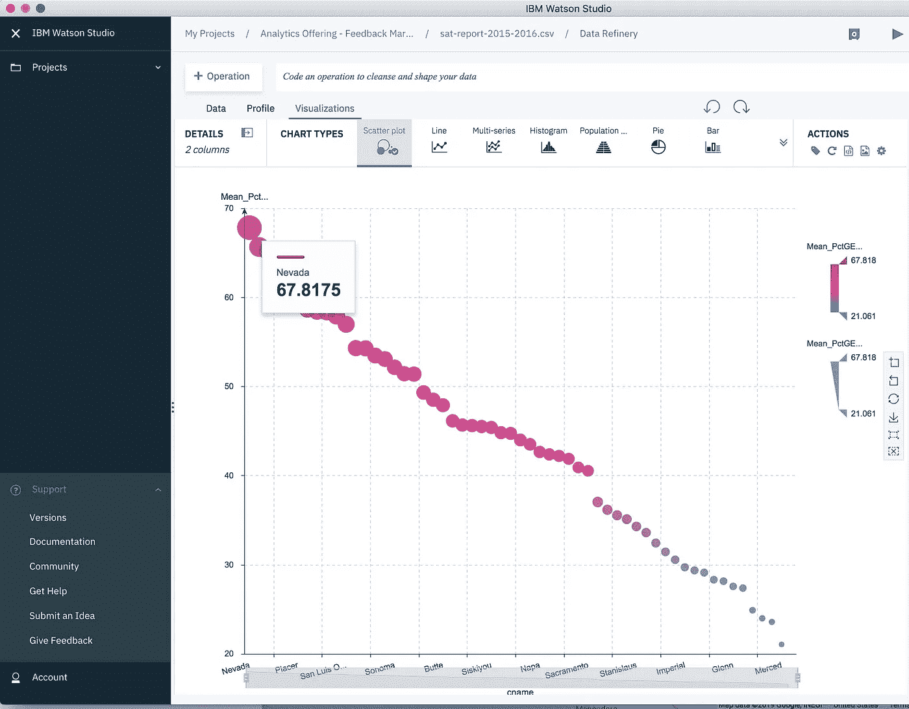
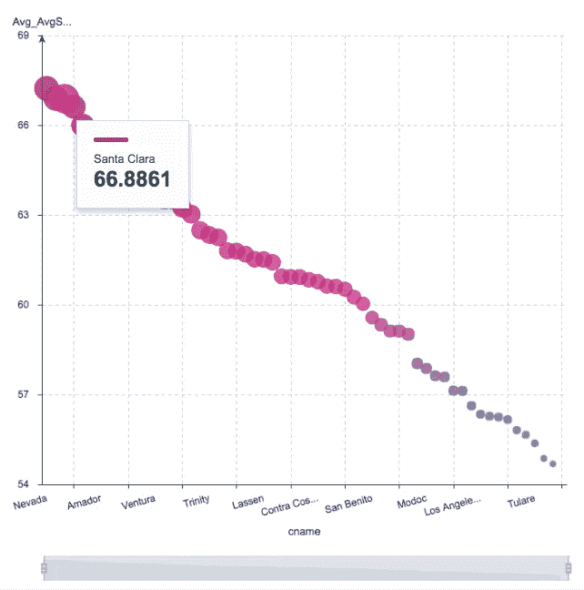
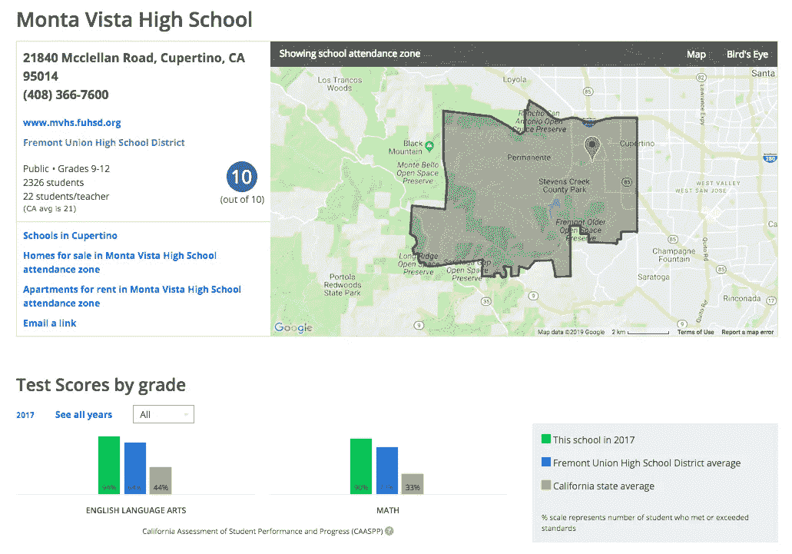

# 解读大学录取

> 原文：<https://towardsdatascience.com/analyze-college-education-admissions-967cccc12115?source=collection_archive---------25----------------------->

Photo by [Pang Yuhao](https://unsplash.com/@yuhao?utm_source=medium&utm_medium=referral) on [Unsplash](https://unsplash.com?utm_source=medium&utm_medium=referral)

我们大多数人都会同意，大学入学可能是一个高度偏见的过程，普遍缺乏透明度。一年前对申请人有效的方法，一年后可能就完全无效了。就其本身而言，这并不奇怪。一所大学的需求每年都会发生变化。有一年，他们可能需要一个出色的四分卫。下一年，也许会是一个优秀的赛跑运动员或物理明星学生。这些需求会以我们永远不知道的方式指导招生委员会。例如，在许多学校，遗产和运动员有优势(尽管很难衡量有多少)。

至少可以说，最近关于招生过程中作弊的新闻破坏了它的可信度。因此，我决定以数据驱动的方式研究大学招生。鉴于录取过程缺乏透明度，我从看 SAT 成绩开始。SAT 考试的设计可能并不完美，但它确实给了我们一个一致的指标来分析。

# 获取数据

我使用了谷歌的[数据集搜索](https://toolbox.google.com/datasetsearch)，这是一个追踪数据的神奇工具。我刚刚搜索了“加州 SAT”，最初的几个结果是不同学年的 SAT 报告，最近的是 2015-2016 年的加州 SAT 报告，可从 [data.world](https://data.world/) 下载。数据集显示了加州每所学校的平均分数。(为了保持匿名，数据集不包括参加考试的学生少于 15 人的学校的分数。)

# 探索和可视化分数

SAT 的最高分数为 2400 分，阅读、写作和数学三个独立的部分的分数从 200 到 800 不等。

数据集中的一列显示了得分大于或等于 1，500 分的学生的百分比。我决定将每个学校的百分比按县分组，然后取每个县的平均值。对于 1500 分及以上的分数，平均百分比最高的五个县是:

内华达州——67.8%

阿玛多——65.6%

马林——65.2%

埃尔多拉多——62.4%

圣马特奥——60.5%

平均百分比最低的五个县是:

默塞德——21.1%

Colusa——23.6%

弗雷斯诺——24%

图莱雷——24.9%

河边——27.4%

California Counties Average Percentage of Students with SAT Higher than 1,500.

California Counties Average Total SAT Score.

我决定也看看各县 SAT 的平均总分，换句话说，就是各县三个部分(阅读、写作和数学)的平均分数之和。由于总分在 600-2，400 之间，所以我除以 2，400，再乘以 100，以百分比的形式查看这一指标。同样，我们看到了相同的高点和低点的一般模式:

内华达州——67.3%

马林——66.9%

圣克拉拉——66.9%

圣马特奥——66.6%

埃尔多拉多——66%

…与…相比

Merced——54.7%

弗雷斯诺——54.9%

图莱雷——55.4%

因约——55.6%

河边——55.8%

我发现平均总分最高的来自圣克拉拉县:85.3%。这是 2400 分中的 2043 分。在圣克拉拉县，最高分来自弗里蒙特联合高中学区的蒙他维斯塔高中。我能够使用 Zillow 来验证结果的准确性，它提供了大量组织良好的学校信息。不足为奇的是，Zillow 将蒙他 Vista 排在了十分之十的位置。(我展示的是 2017 年的结果，但在 Zillow 应用中，你可以看到过去 3 年的结果。)

在后续的文章中，我将探索每个学校或地区的房地产价格数据的相关性。我怀疑有一个很强的。

# SAT 部分之间的相关性(阅读、写作和数学)

我怀疑数学部分分数高的学生在阅读和写作方面的分数会更低。我能够通过计算阅读、写作和数学考试之间的线性相关性来探索这个想法。我错了。事实上，配对(数学，阅读)和(数学，写作)之间的线性相关性都相当强，正如你在下面的图中所看到的。我想知道这种强烈的相关性是否也适用于 GRE 成绩，在 GRE 考试中，更大比例的考生是非英语母语者。

Correlations Between Reading, Writing and Math SAT Scores Sections

# 摘要

由于公共数据很少，解读大学录取很难。作为替代，我查看了加州 2015 年至 2016 年的 SAT 成绩，以探索其在县、区和学校的分布情况。我还观察到 SAT 分数的不同部分之间的相关性很强。换句话说，在某一方面表现出色的学生在其他方面也会表现出色。对于这一探索的第二个阶段，我很高兴引入县的财产成本和学校水平，以了解它们与 SAT 分数的关系。

特别感谢[史蒂夫·摩尔](https://medium.com/u/c81f0352abb7?source=post_page-----967cccc12115--------------------------------)对这篇文章的大力反馈。

**T3【豪尔赫·卡斯塔尼翁】博士 **

***Twitter:***[@ castan](https://twitter.com/castanan) ***LinkedIn:***@[jorgecasta](https://www.linkedin.com/in/jorgecasta/)