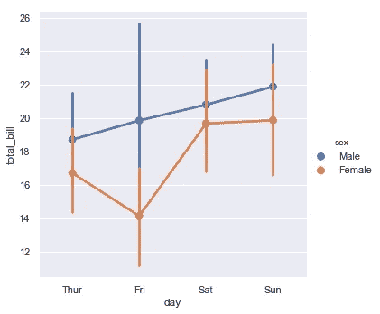

# 使用 Seaborn 通过数据可视化分析数据

> 原文：<https://towardsdatascience.com/analyze-the-data-through-data-visualization-using-seaborn-255e1cd3948e?source=collection_archive---------7----------------------->

## 使用不同的图来可视化数据，并学习何时使用这些图。

数据可视化是任何数据分析的重要组成部分。它有助于我们认识变量之间的关系，也有助于我们发现哪些变量是重要的，或者哪些变量会影响预测的变量。


Explorative data analysis

在机器学习模型中，当训练任何模型时，你需要首先找到哪些特征是重要的，或者结果依赖于哪些特征。这可以通过数据分析和数据可视化来实现。

我们将学习如何可视化不同类型的数据，我们可以从图中推断出什么，以及何时使用它们。

[Seaborn](https://seaborn.pydata.org/tutorial.html) 是一个建立在 [matplotlib](https://matplotlib.org/) 之上的库。它很容易使用，可以很容易地与 Numpy 和 pandas 数据结构一起工作。

我们将使用 seaborn name `tips`提供的内置数据集。

```
import numpy as np
import pandas as pd
import matplotlib.pyplot as plt
import seaborn as sns
```

# 加载数据集

```
tips = sns.load_dataset("tips")
tips.head()
```


Tips dataset head

我们可以看到性别、吸烟者、日期和时间是分类数据。total_bill、tip 和 size 是数字数据。

我们将检索一些公共信息，如给定数值数据的最小值、最大值、唯一值和计数。

```
tips.describe()
```


Descriptive statistics of numerical data.

现在我们将使用图来推断不同变量之间的关系。

# 单变量图

这些图基于单个变量，显示了给定变量的唯一值的频率。

## 柱状图

```
sns.distplot(tips['tip'], kde=False, bins=10);
```


Histogram

箱值越大，结果越准确。


Histogram for bins=30

我们可以看到数据集中出现的不同 tip 值的计数，并推断大多数 tip 在 2 和 4 之间。

## 肯纳密度估计(KDE)

```
sns.distplot(tips['tip'],hist=False, bins=10);
```


Kernel density estimate of tip

KDE 是一种估计连续随机变量的概率密度函数的方法。当你需要知道变量的分布时，就会用到它。

# 二元图

当您需要找出两个变量之间的关系以及一个变量的值如何改变另一个变量的值时，可以使用这种类型的图。根据变量的数据类型，使用不同类型的图。

## [统计](https://seaborn.pydata.org/tutorial/relational.html)数据类型

## 散点图

```
sns.relplot(x="total_bill", y="tip", data=tips);
```


Scatterplot

`relplot`的默认绘图类型是散点图。它显示了两个变量之间的关系。所以，如果需要找到两个变量之间的相关性，可以使用散点图。

在给定的例子中，我们可以看到，如果`total_bill`在 10-20 之间，那么小费通常会高于 2。

我们还可以在散点图中添加第三个变量，使用不同颜色或形状的点。

```
sns.relplot(x="total_bill", y="tip", hue="smoker", data=tips);
```


scatterplot for 3 variables

## 线图

该图类似于散点图，但它不是点，而是通过排列 x 轴上表示的变量值来显示连接所有点的线。

```
sns.relplot(x="total_bill", y="tip", kind="line", data=tips)
```


Lineplot

正如我们所看到的，相对于总账单，小费的分布过于随意。我们可以推断，小费并不太依赖于 total_bill 的值。

因为线图按照 total_bill 排列行，然后连接点，所以我们可以禁用排序。

```
sns.relplot(x="total_bill", y="tip", sort=False, kind="line", data=tips)
```


lineplot sort false

情节太混乱了，我们无法在这张图表中做出准确的推断。

对于大型数据集，该图需要时间，因为首先需要排序。

## [分类](https://seaborn.pydata.org/tutorial/categorical.html)数据类型

## 散点图

```
sns.catplot(x="sex", y="tip", data=tips);
```


categorical scatterplot

我们可以看到，不管`gender`如何，大部分提示都集中在 2 和 4 之间。

使用 seaborn 中的属性`kind`可以制作不同类型的散点图。

第三个变量可以在 seaborn 中使用属性`hue`。

```
sns.catplot(x="day", y="total_bill", hue="sex", kind="swarm", data=tips);
```


scatterplot using hue and kind

要在 x 轴上表示的类别按照熊猫类别排序。如果你想要你的需求顺序，你可以使用 seaborn 中的`order`属性。

```
sns.catplot(x="smoker", y="tip", order=["No", "Yes"], data=tips);
```


scatterplot using order

## 箱线图

箱线图(或盒须图)以一种便于变量之间或分类变量水平之间比较的方式显示定量数据的分布。它可以在一个图中给出数据集`.describe`中提供的所有统计数据。如果数据集太大，值的范围太大，那么它会根据四分位函数将一些值显示为异常值。


boxplot description

```
sns.catplot(x="day", y="total_bill", kind="box", data=tips);
```


boxplot

阴影框表示 25-四分位数和 75-四分位数之间的值。阴影框中的水平线表示中间值。底部和顶部的两条水平线分别代表最小值和最大值。圆点表示基于四分位间距函数计算的异常值。使用这些图表，我们可以在一个图表中比较不同类别的值。我们可以从给定的图表中推断出 total_bill 的金额在周末比平日高。

要在箱线图中使用第三个变量

```
sns.catplot(x="day", y="total_bill", hue="sex", kind="box", data=tips);
```


Boxplot using the third variable

我们可以从一张图中获得如此多的信息。在这张图表中，我们可以看到女性的平均总账单金额总是少于男性。因此，我们可以说`total_bill`的数量依赖于`sex`。

## 小提琴情节

该图用于可视化数据的分布及其概率密度。这张图表是箱线图和密度图的组合。因此，如果你需要找到频率分布以及箱线图，而不是小提琴图。


Violin plot description

```
sns.catplot(x="day", y="total_bill", hue="sex",
            kind="violin", data=tips);
```


violin plot

在星期五，我们可以看到女性的账单总额比男性的账单总额少得多。

## 点图

散点图通过散点图点的位置来表示数值变量集中趋势的估计值，并使用误差线来表示该估计值周围的不确定性。点图仅显示平均值和这些平均值周围的误差率。它们提供的信息不多，但很容易发现基于不同类别的变量的变化。

```
sns.catplot(x="day", y="total_bill", hue="sex", kind="point", data=tips);
```



Point plot

使用这个图，很容易找到 total_bill 按天的变化。随着周末的到来，男性的总账单会上升，而女性的总账单会在周五下降，周六会上升，周日基本保持不变。

这些图可用于各种数据分析，我们可以推断关于不同变量之间关系的信息，并有助于从数据集中提取更重要的特征。