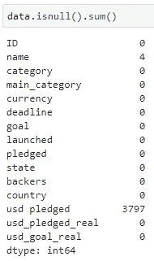
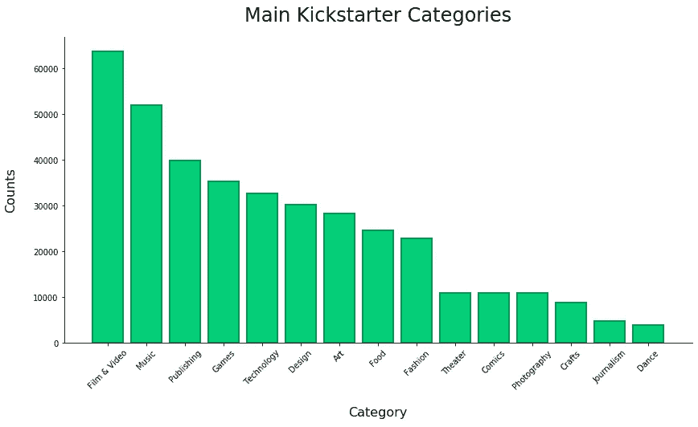

# 分析 38 万 Kickstarter 活动

> 原文：<https://towardsdatascience.com/analyzing-380k-kickstarter-campaigns-10649bbf4e91?source=collection_archive---------30----------------------->

在今天的帖子中，我想做一些不同的事情。最近，他们都专注于数据科学的某个领域，但今天我想做一个基本的探索性分析，总结一下我过去谈论的所有内容。

Photo by [Kaboompics .com](https://www.pexels.com/@kaboompics?utm_content=attributionCopyText&utm_medium=referral&utm_source=pexels) from [Pexels](https://www.pexels.com/photo/working-in-a-group-6224/?utm_content=attributionCopyText&utm_medium=referral&utm_source=pexels)

而你，我的读者朋友，这将是对你的款待。不，我不会给你巧克力棒，但我有更好的东西——在我的 GitHub 个人资料上有完整的分析笔记本。

我将使用的数据集可以在[这个链接](https://www.kaggle.com/kemical/kickstarter-projects)上找到。你不必跟着编码，但是嘿，**为什么不呢？**我故意不在谷歌上搜索任何关于这个数据集的探索性分析，因为，嗯，我想给你一些原创的东西。前所未见的东西。在这个过程中，也许我会犯一个灾难性的错误，这个错误可以通过做一些研究来避免，但是我喜欢生活在边缘。

事不宜迟，让我们开始吧！

# 一些基本统计数据

数据集导入后，首先我想看看数据是什么样的，至少是前几行(*希望您可以轻松阅读*):

Head of Kickstarter Dataset

好吧，15 栏，没什么疯狂的。需要以某种方式管理大量文本数据。在本文中，我不会开发任何预测模型，所以没有必要为*标签编码*而抓狂，但一些行动将是必要的。

调用 ***。数据集上的形状*** 产生以下结果:

没错。数据量不错，差不多 **380K 行**！我必须说有很多战役。天知道这些数据收集了多少年——应该以后再探索。这里我要检查的最后一件事是**缺失值**:

哇，这是我见过的最完整的数据集之一。很奇怪，活动名称怎么会是空的，这真的没有意义。对于第二个缺失的属性，***USD _ pleated***，数据集的文档说明它表示质押列的“*美元转换(由 Kickstarter 完成的转换)。*“没什么好担心的，至少可以说。

# 现在是图表时间

该是我最喜欢的部分了——数据可视化。承认吧，你不喜欢看表格数据。这很正常。人类并不打算这样做。即使是你，数据科学家，或者有抱负的数据科学家，也应该知道，在你专业工作的某些方面，你需要向你的上级展示你的成果。

浏览一大堆只有表格数据的幻灯片对你来说绝对是一个好方法**不要得到你一直想得到的提升**，所以，让我们看看如何制作一些好看的可视化效果。我已经在我以前的一篇文章中讨论过这个问题:

 [## 使用 Matplotlib 实现惊人可视化的 5 个步骤

### Matplotlib 烂透了。默认情况下。以下是对此的处理方法。

towardsdatascience.com](/5-steps-to-amazing-visualizations-with-matplotlib-ca61f0ec5fec) 

## 按年份列出的活动数量

我想展示的第一件事是每年活动的数量，如果你读过前面的部分，这不会让你感到惊讶。380，000 次活动听起来确实很多，所以我预计至少需要 5-7 年的时间跨度。

我已经决定声明一个用于绘制条形图的自定义函数(*，因为我觉得我会在这个分析*中做很多次):

Bar Chart Function — [https://gist.github.com/dradecic/97652676c6d228ed571c0ed67dc0eeb2](https://gist.github.com/dradecic/97652676c6d228ed571c0ed67dc0eeb2)

现在制作这种可视化并不是最困难的任务——但是请记住，数据集中没有单独的年份列，所以您将需要使用 **lambda** 函数的魔力来从***launch***属性中提取它们。代码如下:

Years Bar Chart — [https://gist.github.com/dradecic/0b827e5f3a4a74cc7dd198c4b3fdc8b5](https://gist.github.com/dradecic/0b827e5f3a4a74cc7dd198c4b3fdc8b5)

这是图表(*最后，天哪*):

啊，当 **Matplotlib** 图表看起来不像是用 Matplotlib 制作的时候，真是太好了。如果你做的那些看起来还是很糟糕，参考我上面链接的[文章](/5-steps-to-amazing-visualizations-with-matplotlib-ca61f0ec5fec)。此外，这个官方 Kickstarter 绿色在条形图上看起来真的很好。

## 按国家列出的活动数量

现在是时候使用同一个***make _ bar _ chart***函数来可视化 ***country*** 属性了——因此来看看这些活动是从哪里来的(*我感觉好像有一个国家来统治它们所有的*)。
我相信你有能力让这个函数自己调用，你只需要把“*已启动*”改为“*国家*”，并根据你的意愿调整标题和轴标签。

一旦你做了调整，点击 SHIFT 和回车键，看看魔术在行动:

我的假设没有错。美国有差不多 30 万个竞选活动。这没什么不好，但这让我想知道为什么其他国家没有参与进来。

## 探索活动类别

现在让我们再次使用***make _ bar _ chart***函数来查看特定类别有多少个活动—attribute***main _ category***。与前面的图表一样，我不会编写函数调用的代码，因为您只需要更改属性名称和标题(*，如果您愿意的话*)。

貌似**电影&视频**，旁边还有**音乐**在 Kickstarter 上很受欢迎。舞蹈活动最少，但这并不意味着它们的整体成功率最低——这将在一分钟内进行探讨。

## 活动持续时间

但在此之前，我想了解一下这些活动的平均持续时间。为此，我需要做一些编码，因为没有活动持续时间的数据。为了计算它，我将从属性*中减去属性 ***【已启动】*** 的值，然后将结果保存为两者之间天数的整数表示。*

*听起来像一个简单的计划，所以让我们执行它。我已经使用 python***zip***函数同时迭代两个数组(*或系列*)。代码如下:*

*Duration Attribute Creation — [https://gist.github.com/dradecic/436539fceeeca338c3ed803b4412a231](https://gist.github.com/dradecic/436539fceeeca338c3ed803b4412a231)*

*这里均值和中值真的很接近，但是标准差感觉怪怪的。这需要进一步探索。我已经打印出了**持续时间最长的 10 个活动**，得到了一些有趣的结果:*

**

*由此看来，第一次运动开始于 1970 年 1 月 1 日，这显然没有意义。我决定过滤掉任何持续超过 100 天的活动(其中 7 天是)。*

*现在，我还声明了一个绘制直方图的函数，因为我想可视化这个连续变量的分布:*

*Histogram Function and Call — [https://gist.github.com/dradecic/229903b0a35198a2650cdf652e4722f3](https://gist.github.com/dradecic/229903b0a35198a2650cdf652e4722f3)*

**

*在这里，您可以看到—看起来大约 20 万个活动持续了一个月，两个月之后似乎会有一个高峰—大约 4 万个活动。*

*现在让我们来看看好东西。到目前为止，这很容易，现在是我用更长的代码，但也是更惊人的可视化来抨击你的时候了。我相信你，我的读者朋友，我知道如果你花时间一行一行地阅读代码，你将能够理解一切。*

## *按类别探索营销活动的成功*

*首先，数据集需要以某种方式改变。存在一个属性— ***state*** —它代表了活动的状态，您可能不会相信！其中一些还在进行中(*好吧至少在 2018 年初是这样的*，所以那些会被过滤掉。然后，我将替换属性中的值，因此最终它的编码是这样的:*

*   *0:活动不成功*
*   *1:活动很成功*

*用 Python 完成这个任务并不困难，但是在完成之后，还需要做一些其他的修改和调整。在下面的代码片段中了解更多信息:*

*Success vs. Failure chart — [https://gist.github.com/dradecic/a34b36a2f9c56495d2e382a0cd1b17c3](https://gist.github.com/dradecic/a34b36a2f9c56495d2e382a0cd1b17c3)*

*执行这个代码单元将会产生这个惊人的可视化效果:*

**

*简而言之，它以百分比的形式显示了每个类别中有多少活动失败(*深绿色*)以及有多少活动成功(*浅绿色*)。从这里可以清楚地看到， ***手艺*** 和**技术**是大忌(大多数情况下*)，而**剧场**和**舞蹈**看起来大有可为。**

## **活动目标与承诺分析**

**让我们更深入地了解一下，看看每个单独的活动类别中，设定为活动目标的平均金额(*嗯，中位数*)与实际获得的金额。再次强调，实现这一点需要一些代码，但我相信你:**

**Money Goal vs. Pledged — [https://gist.github.com/dradecic/e469bffddcbf13d6ff502f7c57f978a4](https://gist.github.com/dradecic/e469bffddcbf13d6ff502f7c57f978a4)**

****

**上图的结论仍然成立——**舞蹈**和**戏剧**似乎仍然是最有希望的竞选类别。**

## **标题探索**

**现在让我们讨论一下今天将要绘制的最终图表。我敢于进一步探索头衔，探索特定头衔长度组的平均所得金钱(*中值再一次*)。**

**在 ***的帮助下，我将标题长度分成了 10 个分位数。qcut*** 功能:**

**Obtained Money per TItle group — [https://gist.github.com/dradecic/a4477c8e18b91baf022fc0b8fbc3c4fa](https://gist.github.com/dradecic/a4477c8e18b91baf022fc0b8fbc3c4fa)**

**这是最终的图表:**

****

**看起来，如果他们想筹集一些资金，活动应该尽可能地描述他们的标题— *谁会说？***

# **最后的话**

**有一点是肯定的——这不是一个详尽的探索性数据分析项目。但是我已经介绍了足够多的基础知识，所以我的读者朋友，你可以自己进一步探索。**

**也许你想开发一个预测模型，它将能够确定一个给定的活动是否会成功。也许你想通过 NLP 进一步分析竞选标题。也许这对你来说已经足够了。不管是哪一种，我肯定你能想出下一步该怎么做。**

**现在该说再见了，但只是一小会儿。感谢阅读…**

**By [GIPHY](https://giphy.com/gifs/UQaRUOLveyjNC/html5)**

***喜欢这篇文章吗？成为* [*中等会员*](https://medium.com/@radecicdario/membership) *继续无限制学习。如果你使用下面的链接，我会收到你的一部分会员费，不需要你额外付费。***

** [## 通过我的推荐链接加入 Medium-Dario rade ci

### 作为一个媒体会员，你的会员费的一部分会给你阅读的作家，你可以完全接触到每一个故事…

medium.com](https://medium.com/@radecicdario/membership)**