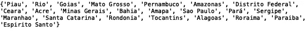

# 分析亚马逊野火数据

> 原文：<https://towardsdatascience.com/analyzing-amazon-wildfire-data-a4f9122a8877?source=collection_archive---------22----------------------->


Photo by [Pixabay](https://www.pexels.com/@pixabay) on [Pexels](https://www.pexels.com/photo/backlit-breathing-apparatus-danger-dangerous-279979/)

由于气候变暖，亚马逊雨林的野火越来越令人担忧。在这里，我们将探索和分析巴西政府提供的巴西火灾数据集。数据在[这里](https://www.kaggle.com/gustavomodelli/forest-fires-in-brazil)可用。

> 在数据科学中，探索数据通常是构建预测模型的第一步。探索性数据分析包括总结数据集的特征。这包括关于数据特征的统计摘要，如平均值、标准差、分布和记录数。

第一步是用 python 导入 pandas 包，并将数据读入 pandas 数据框。您可以将熊猫数据框想象成数据表或 excel 电子表格。

```
import pandas as pddf = pd.read_csv(“amazon.csv”, encoding = “ISO-8859–1”)print(df.head())
```

前五行的输出是:


如你所见，数据包括年份、巴西州、月份、野火数量和日期。我们可以从计算每个州的火灾平均数开始分析。我们在熊猫身上使用了“分组”方法:

```
df = df.groupby(‘state’)[‘number’].mean().reset_index()print(df)
```


Mean Number of fires for each state

我们也可以使用 python 中的“seaborn”包来实现这一点:

```
import seaborn as snsbar = sns.barplot(df['state'], df['number'], color = "red")
bar.set_xticklabels(df['state'], rotation=45)
```


Mean Number of fires for each state

我们还可以查看每个州火灾数量的标准偏差:

```
df = df.groupby(‘state’)[‘number’].mean().reset_index()
bar = sns.barplot(df['state'], df['number'], color = "black")
bar.set_xticklabels(df['state'], rotation=45)
```


Standard Deviation in Number of fires for each state

我们还可以查看各州火灾数量的分布情况:


我们可以看到森林火灾数量的分布是长尾的。巴西各州的情况也是如此。

如果我们想要查看单个状态的集合，我们可以如下操作:

```
print(set(df['state'].values))
```

当被执行时，其给出:



The unique set of states

这在您有一个大型数据集并希望分析特定的数据段或数据组时尤其有用。在这种情况下，我们只有 22 个州，现在让我们称它们为类别。有些情况下，您可能有数百万行，并且对一组可能只有 5 个值的类别感兴趣。手动查看 excel 文件来计算类别的数量是非常困难的。此外，您可以查看每个类别有多少数据可用:

```
from collections import Counter 
print(Counter(df['state'].values))
```


The number of rows/records for each state

小警告:对于大于 1 GB 的数据集，pandas 非常慢，最好使用其他工具进行分析。其他工具包括 Spark clusters、Hadoop 和 Hive。因为这些工具需要大量的时间来学习和设置其他替代方法，包括将数据分成几批，使用 pandas，以及使用 numpy 数组。

建立精确预测模型的一个好方法是找到将整个数据集分成具有相似属性的聚类的方法。如果我们希望查看单个州的数据，比如说“罗赖马”，我们可以过滤数据框:

```
df = df[df['state'] == 'Roraima']
df = df.head().reset_index()
df.drop('index')
print(df.head())
```


我们还可以通过绘制罗赖马州 1 月份的野火数量与年份的对比图，来寻找任何给定月份和州的野火数量的规律:

```
import matplotlib.pyplot as plt
df = df[df['month'] == 'Janeiro']
plt.plot(df['year'], df['number'])
plt.xlabel('Year')
plt.ylabel("Number of Wildfires")
plt.title("Wildfires in Roraima in the month of January")
```


您还可以针对不同的州和月份执行此分析:


这将为您的模型构建过程提供信息。一个有趣的方法是为每个州和每个月建立一个模型。这不是唯一的前进道路，但探索性数据分析的目的是了解您的数据，并随后从特征工程和模型构建中获得灵感。

在下一篇文章中，我们将使用 python 机器学习包“sklearn”中的随机森林算法建立一个预测模型。

感谢您的阅读！