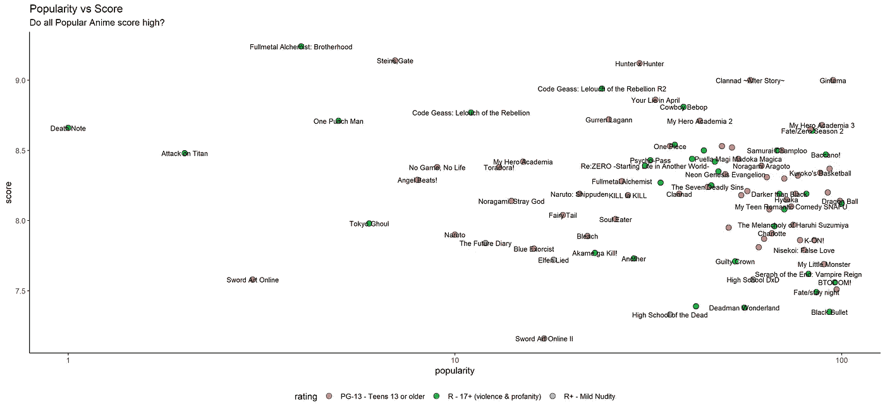

# 分析 R 中的动漫数据

> 原文：<https://towardsdatascience.com/analyzing-anime-data-in-r-8d2c2730de8c?source=collection_archive---------16----------------------->


如果你是一个动漫迷，那么你会喜欢我在 R 中做的这个分析。这个数据来自于 [MyAnimeLis](https://myanimelist.net/) t 网站，是 R for Data Science 社区发起的 Tidy Tuesday 计划的一部分。你可以从[这里](https://github.com/rfordatascience/tidytuesday/blob/master/data/2019/2019-04-23/tidy_anime.csv)下载这个数据的整洁版本。他们每周发布有趣的数据集，社区分享他们的分析，大多使用 Tidyverse 软件包，这是一个很好的学习资源。我还建议关注大卫·罗宾逊的 [YouTube 频道](https://www.youtube.com/user/safe4democracy)。他每周都会上传新的视频，在视频中他分析了来自 Tidy Tuesday 的新数据集，你可以从他那里学到很多很酷的东西。

## 加载库

像往常一样，我们将加载一些库。

```
library(tidyverse)# Data manipulation and visualization
library(scales)# Converting data values to units
library(patchwork) # For Patching multiple ggplots together
```

## 数据的读取和初步调查

使用 **read_csv** 函数，我可以通过为**文件**参数提供到数据集的链接，直接从网站读取数据。加载数据后，让我们使用**视图**功能来查看数据

```
tidy_anime <- read_csv(file="[https://raw.githubusercontent.com/rfordatascience/tidytuesday/master/data/2019/2019-04-23/tidy_anime.csv](https://raw.githubusercontent.com/rfordatascience/tidytuesday/master/data/2019/2019-04-23/tidy_anime.csv)")View(tidy_anime)
```


如您所见，这是一个巨大的数据集，我不需要所有的列来进行分析。如果你看第一张截图，你会看到每个动画 ID 都被复制了。这是因为 MyAnimeList 网站上的每部动漫都被归类在不同的流派下。因此，每部不同类型的动漫都有一行，因此出现了重复。同样的问题也出现在**制作人**和**工作室**栏目，因为一部动漫可以有多个制作人和工作室

```
tidy_anime <- tidy_anime%>%
select(-c(title_synonyms,synopsis,background,related,genre,studio,producer))
```

要删除这些列，我只需将它们包装在一个 **"-"** 中，这是一种取消选择的方式。

```
unique_anime <- tidy_anime%>%
distinct()%>%
filter(!is.na(title_english))View(unique_anime)
```

然后我们使用 **distinct** 函数，这样我们就可以为每一行获得一个唯一的动画 ID。我只对那些有英文标题的感兴趣，所以我删除了所有没有英文标题的。现在让我们再看一下数据。


不错！现在我们在每一行都有一个唯一的动漫 ID。我们现在可以开始分析我们的数据。

## 分析和可视化

如果你们中的任何一个人是动漫迷，那么你应该知道动漫电视剧和动漫电影不应该被放在一起比较。两者应该在各自的范畴内进行比较。为此，我们将进一步将这些数据分为电视和电影类别

```
tv_anime <- unique_anime%>%filter(type=="TV")
tv_plot <-tv_anime%>%
  mutate(graph_name=paste0(title_english," (",premiered,")"))%>%
  top_n(-20,wt=popularity) %>% 
  ggplot(aes(reorder(graph_name,desc(popularity)),popularity,colour=title_english))+
  geom_point(show.legend = FALSE)+
  geom_segment(aes(x=graph_name,xend=graph_name,y=0,yend=popularity),show.legend = FALSE)+
  coord_flip()+
  theme_classic()+
  labs(x="",y="Popularity",title = "Top 20 Most Popular Anime TV Shows")
```

让我们一步一步地看这段代码:

*   我只过滤电视节目的日期
*   在我的图中，我还想看看它们何时开始，所以我使用 **mutate** 函数创建了一个新列— **graph_name** 。在 mutate 函数中，我使用了 **Paste0** 函数来组合 **title_english** 和 **premiered** 列
*   然后我用 **top_n** 函数得到了最受欢迎的 20 部动漫。请注意，我使用了-20，因为这将获得 20 个最低值，而且因为这是一个基于排名的值，最低值意味着最受欢迎
*   然后我使用标准的 **ggplot** 函数来绘制我们的 x 和 y 轴值。我在 x 轴上使用了 **reorder** 函数，因为我想根据流行度值对它进行排序
*   我正在创建一个棒棒糖图，为此，我需要将**几何点**和**几何段**组合在一起以获得我的结果。**几何点**绘制点，而**几何段**绘制线
*   **coord_flip** 使其垂直和其他标准功能来标记情节和改变主题的外观。


这没什么奇怪的。所有这些节目都非常受欢迎，但值得注意的一件有趣的事情是，所有这些节目目前都没有播出，因此像 **Once Piece** 和**漂白剂**这样的节目也没有播出。让我们来看看目前正在播放的最受欢迎的节目

```
tv_anime_airing <- unique_anime%>%filter(type=="TV",airing=="TRUE")
tv_plot_airing <-tv_anime_airing%>%
  mutate(graph_name=paste0(title_english," (",premiered,")"))%>%
  top_n(-20,wt=popularity) %>% 
  ggplot(aes(reorder(graph_name,desc(popularity)),popularity,colour=title_english))+
  geom_point(show.legend = FALSE)+
  geom_segment(aes(x=graph_name,xend=graph_name,y=0,yend=popularity),show.legend = FALSE)+
  coord_flip()+
  theme_classic()+
  labs(x="",y="Popularity",title = "Top 20 Most Popular Anime TV Shows")+
  theme(axis.text.y.left = element_text(size = 12))
```

代码和以前一样。我对目前正在播放的节目的过滤做了一点调整


啊！**一块**放在当前正在播放的节目的顶部。我很惊讶**一拳第二季**和**袭提坦第三季(下)**不在这里。收集这些数据时，它们可能还没有播出。我只看过这些**中的**暴民惊魂记 100** 。**我们也来看看评分最高的动漫吧。


嗯，有些令人失望的是，这些动漫中的大多数甚至没有超过 8 分。接下来，我有兴趣看看哪些流行动漫得分高，它们与这些动漫的得分人数有什么关系

```
tv_anime %>% 
  filter(popularity <= 50) %>%
  mutate(title_english = str_replace(title_english, "Code Geass: Lelouch of the Rebellion", "Code Geass")) %>%
  ggplot(aes(score, scored_by)) + 
  geom_point(shape=21,aes(fill=title_english,size=members)) + 
  geom_text(aes(label = title_english ), check_overlap = T, show.legend = F, size = 3, hjust = 1) + 
  xlim(c(6, 10)) +
  scale_y_log10()+
  labs(title = "Which popular anime also score high?", 
       subtitle = "Top 50 anime shown based on popularity",
       y = "Number of users that scored",
       x = "Score (1-10)") +
  theme_classic()+
  theme(legend.position = 'none',aspect.ratio = 0.5)
```


**死亡笔记**再次置顶。我会假设像**死亡笔记**、**攻击泰坦**和**剑术在线**这样的动漫有一个真正忠诚的粉丝群，他们会去网站为他们评分。像 **Once Piece** 这样的节目已经播出了相当长一段时间，但相对而言，很少有人获得它的评分。

现在让我们来看看流行度与分数。有没有哪部热门动漫没得高分，反之亦然。

```
tv_anime%>%
  filter(popularity<=100) %>% 
  ggplot(aes(popularity,score,fill=rating))+
  geom_point(shape=21,size=3,alpha=0.8)+
  geom_text(aes(label=title_english),size=3,check_overlap = TRUE)+
  scale_x_log10()+
  theme_classic()+
  scale_color_brewer(palette = 'Set1')+
  theme(legend.position = "bottom")+
  labs(title = "Popularity vs Score",subtitle = "Do all Popular Anime score high?")
```



所以最受欢迎的动漫肯定得分最高。虽然图表中充满了 PG-13 级的节目，但得分最高的动画肯定是 R-17+。有点惊讶的是，《我的赫拉学院》第二季&第三季没有第一季那么受欢迎，尽管它们的收视率都比第一季高。

最后，我想比较一下前 20 名最受欢迎的成员和最受欢迎的人。

```
**most_members** <- tv_anime%>%
  top_n(20,wt=members) %>%
  mutate(graph_name=paste0(title_english," (",premiered,")"),graph_name=fct_reorder(graph_name,members))%>%
  ggplot(aes(graph_name,members,fill=graph_name))+
  geom_bar(stat = 'identity',width=0.5,show.legend = FALSE,color='black')+
  coord_flip()+
  theme_classic()+
  scale_y_continuous(limits = c(0,1700000),labels = comma)+
  geom_text(aes(label=comma(members)),size=3)+
  labs(x="",y="Rank",title = "Top 20 Most Members")**most_favorite**<-
  tv_anime%>%
  top_n(20,wt=favorites) %>% 
  mutate(title_english=fct_reorder(title_english,favorites))%>%
  ggplot(aes(title_english,favorites,fill=title_english))+
  geom_bar(stat = 'identity',width=0.5,show.legend = FALSE,color='black')+
  coord_flip()+
  theme_classic()+
  scale_y_continuous(limits = c(0,150000),labels = comma)+
  geom_text(aes(label=comma(favorites)),size=3,hjust=1,fontface='bold')+
  labs(x="",y="Favourites",title = "Top 20 Most Favorite")**most_scored**<-
  tv_anime%>%
  top_n(20,wt=scored_by) %>% 
  mutate(title_english=fct_reorder(title_english,scored_by))%>%
  ggplot(aes(title_english,scored_by,fill= title_english))+
  geom_bar(stat = 'identity',width=0.5,color='black',show.legend = FALSE)+
  coord_flip()+
  theme_classic()+
  scale_y_continuous(limits = c(0,1500000),labels = comma)+
  geom_text(aes(label=comma(scored_by)),size=3,hjust=1,fontface='bold')+
  labs(x="",y="Favourites",title = "Top 20 Most Scored by")most_favorite + most_members+ most_scored + plot_layout(widths = 20)
```


很明显，拥有最多成员的动漫会有更多人给它打分。我从未在我的动画列表上为一部动画打分，但我认为你需要成为这部动画的一员才能为它打分。**最喜欢的**是一个不同的故事。这可以潜在地突出具有最忠实的粉丝基础的动画，这些粉丝如此喜爱该动画以至于他们将它添加到他们的最爱中。

# 结论

我希望你觉得这个分析很有趣。如果你想分析动画电影，你可以使用相同的代码，但唯一的区别是只过滤电影而不是电视。