# 分析 Billboard 的说唱排行榜

> 原文：<https://towardsdatascience.com/analyzing-billboards-top-rap-charts-f7dee52532a8?source=collection_archive---------22----------------------->

从小到大，我身边都是说唱音乐。店面、汽车收音机和电视扬声器发出的刺耳声音是所有不同海岸的声音汇集在一起。这种对嘻哈音乐的不断接触和我受保护的亚洲成长环境让我讨厌它，我花了一部分青少年时光沉浸在经典摇滚中。

这并没有持续很长时间。

在我高中的第一年，我被介绍给新鲜的说唱行为，如丹尼布朗，运行珠宝，和索尔威廉姆斯。我被重新介绍给像坎耶·韦斯特和图帕克这样的童年旧爱。嘻哈音乐占据了我的世界，我的品味在大学期间也慢慢变得更好了。在被介绍给 Geto 男孩后，我对南方说唱产生了一种近乎不自然的痴迷。这个地区结合了我对身临其境讲故事的热爱，不仅有我可以跟着跳舞的节拍，还有黑暗制作，就像我童年时喜欢的朋克音乐和我小时候可以听的一小部分“可接受”音乐中常见的爵士乐影响。南方是实验的温床，我想传播这个福音。

从那以后，我的大部分工作都围绕着既古老又新颖的南方嘻哈音乐。我不断发现新的艺术家和声音从南方的每一个缝隙里传出来。我认为南方在主流音乐中很大程度上被低估了，只是在过去的三年里才看到了复兴。像 A$AP Rocky 这样的艺术家对孟菲斯传奇人物托米·怀特三世进行了采样，并尝试了由得克萨斯州自己的 DJ Screw 开创的切碎和拧紧制作。Cardi B 在她的热门专辑《侵犯隐私》中收录了 Project Pat 的《小鸡头》。一个$AP Ferg 在他的单曲《平凡的简》中重新构思了三个 6 黑手党的地下热门歌曲《Slob On My Nob》。甚至在最近，Lil Nas X 的“老城路”在复兴“乡村说唱”方面取得了巨大的成功，德克萨斯的 UGK 在几十年前就以他们独特的南方鼻音和勇敢的乐器开创了这一潮流。

我决定通过查看 [Billboard 从 1990 年到 2018 年的顶级说唱歌曲排行榜](https://www.billboard.com/charts)来验证这个理论。为了简洁起见，我决定省略他们的 R & B 图。根据 airplay，每首歌曲都被确定为全国第一，直到 2012 年，流媒体数字和数字下载被加入到标准中。我编辑了我的列表，只从每首歌曲中选取艺术家，并找到他们来自的州及其相应的海岸，这意味着我排除了任何不是来自美国的艺术家。如果他们出生在德克萨斯州，但他们的事业和成功却源于纽约，那么他们就是来自纽约的东海岸艺术家。使用世界地图集上这张方便的地图可以区分海岸。

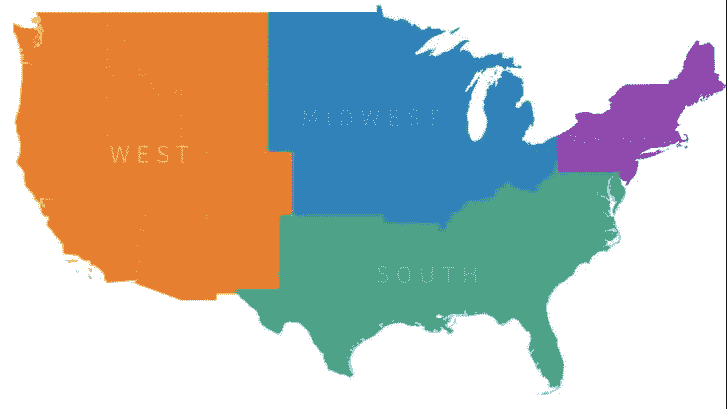

Image courtesy of World Atlas

我每年还会拿出副本。因此，如果梅西·埃丽奥特在一年内三次排名第一，我只统计了一次，以免进一步扭曲数据。在接下来的几年里，我会把她算作第一名。这是关于艺术家，而不是歌曲。

总而言之，我查阅了 291 行数据。我找到了 1990 年到 2018 年的 191 位独特的艺术家。在研究的最后，我还发现自己在调查一个完全不同的问题。

我决定先问一个最简单的问题:这些艺术家来自哪个地区？结果令我吃惊。

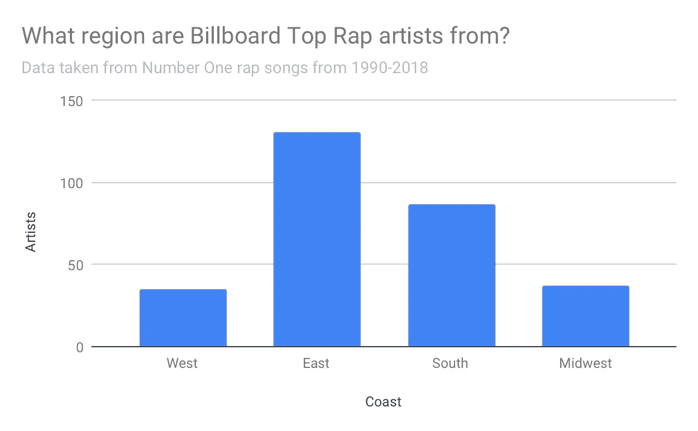

查看 28 年的数据，就近 300 首歌曲中的第一名而言，南方紧随东海岸之后(再次记住，每年都有重复的艺术家被淘汰)。我决定看看十年来沿海趋势是如何变化的。

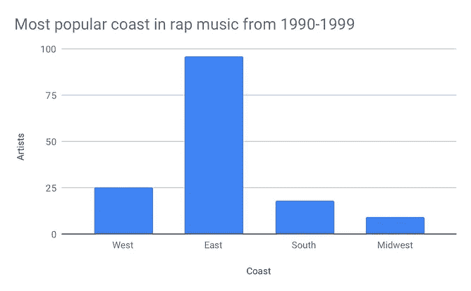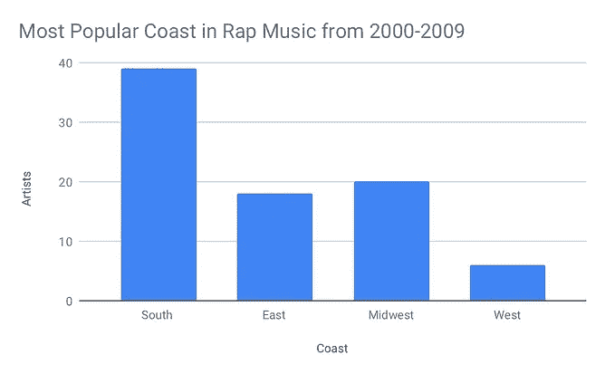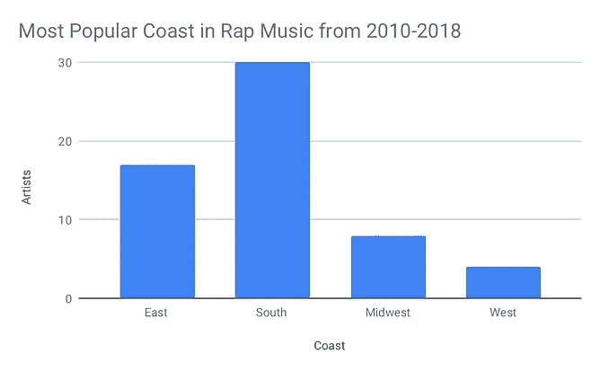

有趣的是，从 2000 年开始，南方实际上主导了排行榜。回顾我的数据，奥特卡斯特和耐莉在 2000 年代早期都有好几年的冠军单曲。考虑到当时的音乐氛围，这是有意义的。南方大量生产有趣的、适合跳舞的热门歌曲，挤满了舞厅，手机扬声器里响起铃声。最重要的是，南方有独特的声音和来自各州的艺术家，相比之下，其他沿海地区有独特的音乐中心，如纽约和加利福尼亚。我想看看每年有哪些州入选，我把它编成了一个有趣的 gif！越黑暗的州，越多的顶级艺术家来自那里。

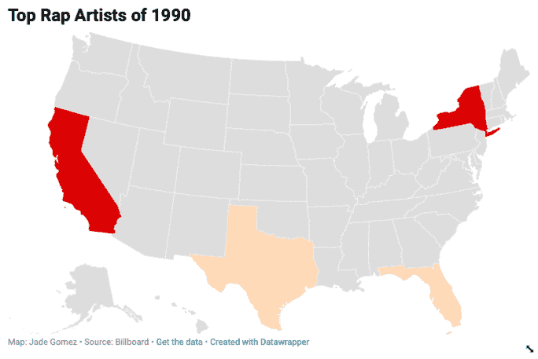

在 90 年代，纽约和加州是游戏的主要参与者，但加州在 00 年代初开始淡出。随着 1996 年图派克·夏库尔和 1997 年臭名昭著的 B.I.G .死亡后海岸战争的停止，他们各自的州在排行榜上的统治也不约而同地结束了，加州更甚于纽约州。随着 21 世纪的到来，更多的佛罗里达、乔治亚和德克萨斯艺术家加入了排行榜。由于纽约州和加利福尼亚州一直位居榜首，我想看看在我观察的 28 年中各州代表的多样性。

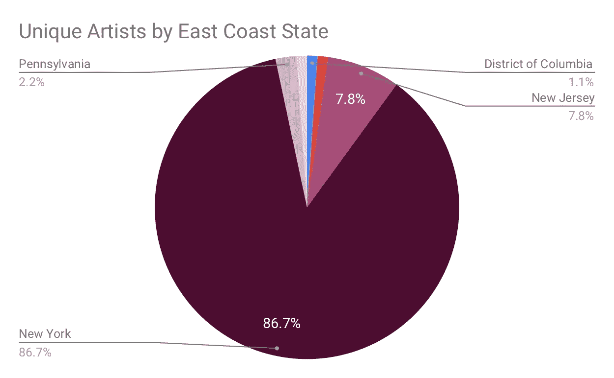

正如我所料，纽约是东海岸说唱游戏中最大的玩家。对于 hip hop 的发源地，我不期待少一点。它也是一个非常大的州，是东海岸的文化中心。另一方面，南方有更多的变化。

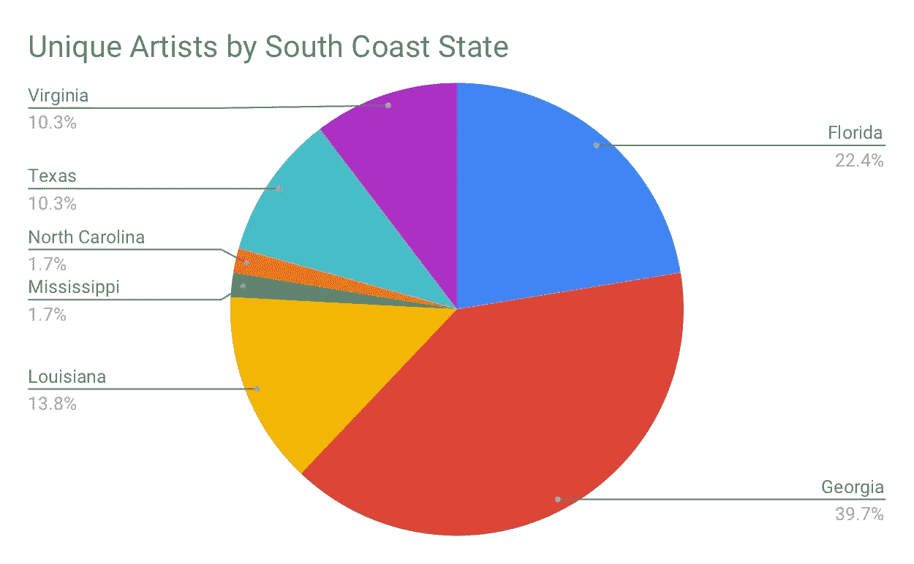

佐治亚州是一个明显的主要参与者，因为亚特兰大是一个交通和文化中心，有一个大型机场，地理位置便利，正好位于其他州的中间。作为一个文化中心，佛罗里达很像佐治亚州，并且是许多适合跳舞的音乐的故乡，因为它靠近加勒比群岛，所以继续占据排行榜的主导地位。南方和它所有的州共享各种各样的声音和文化。西海岸？没有那么多。

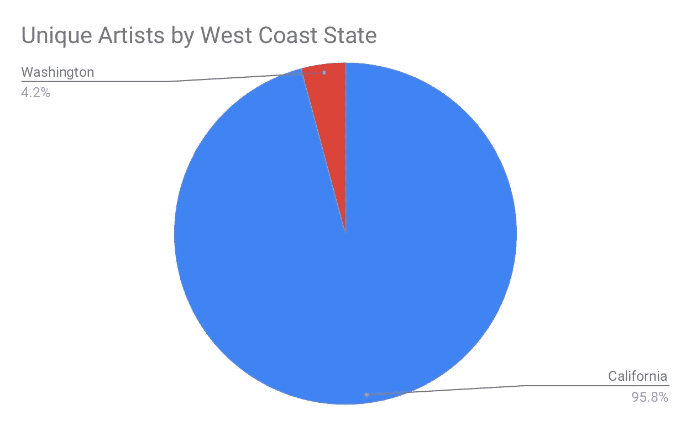

在这种情况下，饼状图不能公正地显示数据。西海岸 24 位独特的艺术家中，只有一位不是来自加州，那就是华盛顿自己的麦克摩尔。其余的艺术家都来自加州。虽然令人震惊，但我并不感到惊讶，因为加州是一个包含大部分沿海地区的大州。也许更深入地看图表，我们可能会发现稍微多一点的州变化，但是为了这个故事的目的，我们只看排名第一的热门歌曲。

我的发现让我想到了我的最后一个假设:随着数字媒体和下载的兴起，观众听的新音乐还不够多。在 90 年代，有几年见证了 20 多位独特的艺术家轮流争夺令人垂涎的第一名。2014 年，有四个。四位独特的艺术家。在测试这个理论时，我并没有完全错。

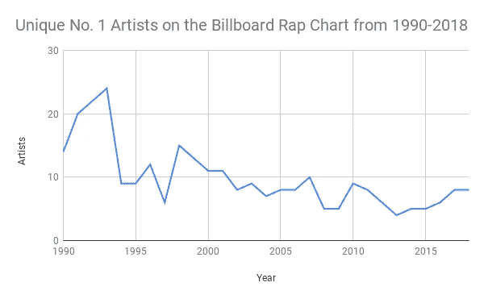

以下是按十年细分的数据，让我们看得更清楚一些:

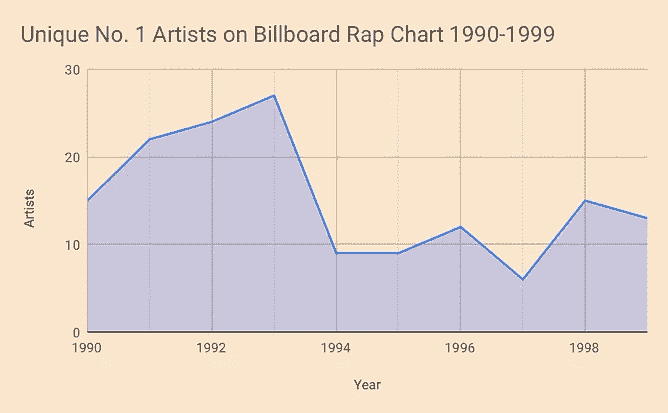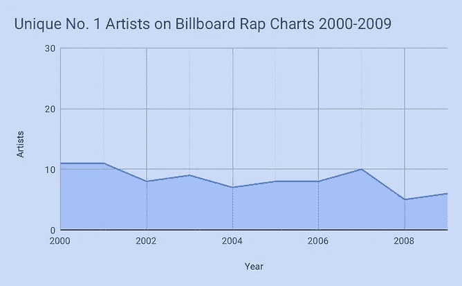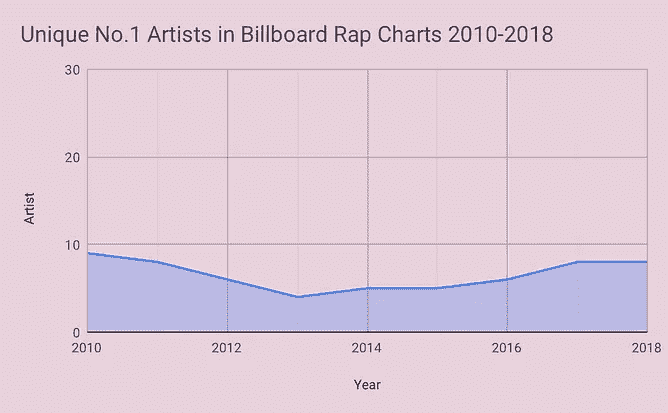

这种下降令人痛心，尤其是当我知道每周有多少美妙的音乐从这个国家的每一个地方传出来。发生了什么事？那个，我回答不了。作为音乐爱好者，当我们的手机上有源源不断的音乐可供收听时，我们可能会感到精疲力竭。这也可以从电台作为一种可靠的听音乐方式的衰落中得到启示。当时，音乐可以通过物理媒体和广播电台获得。电台有更大的动机来提高音量以保持听众的兴趣。然后，盗版音乐在 21 世纪初成为一种普遍现象，Limewire 和 Napster 等客户让人们更容易在自己的时间通过电脑访问音乐。便携式音乐播放器带来了 CD 和唱片，现在你可以随时随地把几乎无穷无尽的音乐放在口袋里。当具有互联网功能的智能手机进入市场时，那些 iPods 和 Zunes 被塞进抽屉，mp3 文件开始在我们的桌面上堆积数字灰尘。现在对多样化的刺激减少了，广播电台每小时播放蕾哈娜或德雷克的同一首歌更容易了。它把钱放进了他们的口袋。

我记得我是一个年轻的，易受影响的 11 岁的孩子，偶然发现了纽约另类摇滚宝藏 101.9 RXP。他们从不在一个小时内演奏同一位艺术家两次，我听到了从《新秩序》到《红辣椒乐队》再到当地乐队的所有音乐。周日，我会听 DJ Rich Russo 的任何音乐，他会在只有几百名 Twitter 粉丝的新兴纽约乐队中演奏布鲁斯·斯普林斯汀。DJ 们成了我的朋友。他们真诚地接受请求，并在编程中抓住机会。他们最后一次广播的那天令人心碎，我再也没有过同样的广播经历。然而，那个电台启发了我去利用互联网。我得自己去找这音乐。

我从事这项工作的目的是为了找出南方是否出现在说唱排行榜上，最终我意识到这并不重要。排名第一的点击率只能量化受欢迎程度。重要的是，我们都找到了对我们说话的音乐，不管它是不是每小时通过广播电台播放，或者在 Youtube 的最深处找到。让我们更加自觉地支持我们热爱的艺术家。

今天找一个新的艺人来听，告诉一个朋友！买张 CD！去看表演！让音乐重新变得有趣。