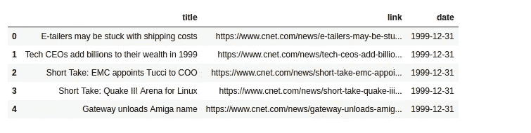
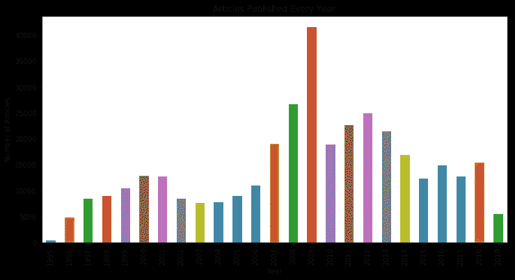
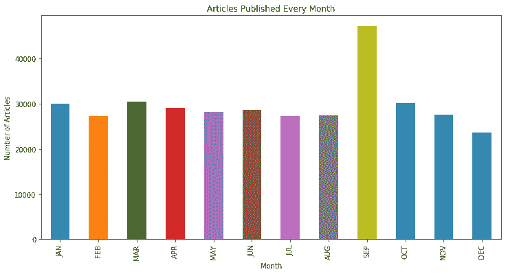
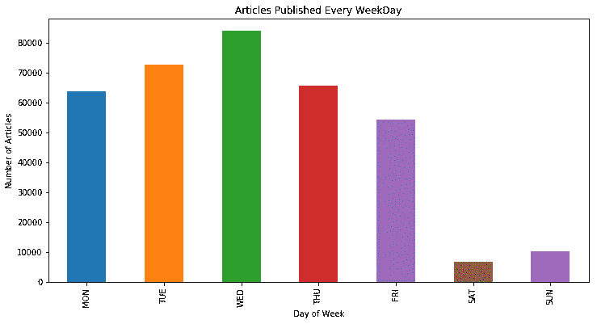
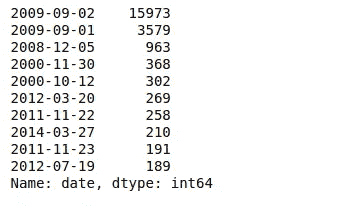
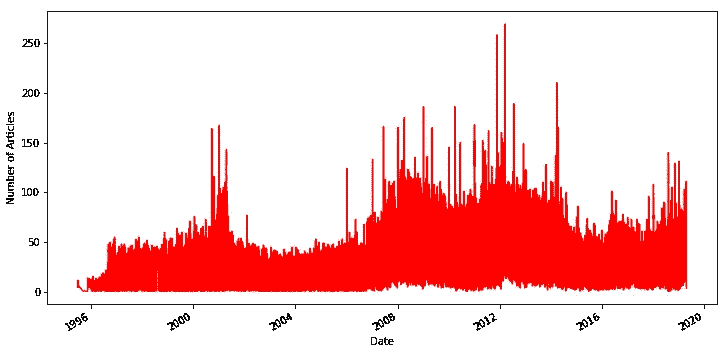

# 分析 CNET 的标题

> 原文：<https://towardsdatascience.com/analyzing-cnets-headlines-3f350bb97cd4?source=collection_archive---------17----------------------->

## 使用 Python 和熊猫探索 CNET 上发布的新闻


Photo by [M. B. M.](https://unsplash.com/@m_b_m?utm_source=medium&utm_medium=referral) on [Unsplash](https://unsplash.com?utm_source=medium&utm_medium=referral)

我写了一个爬虫从 CNET 的网站地图中抓取新闻标题，并决定对其进行一些探索性分析。在这篇文章中，我将向你介绍我的发现、一些异常现象和一些有趣的见解。如果你想直接进入，你可以在找到代码[。](https://github.com/sagunsh/cnet_analysis)

**履带**

爬虫使用 [Scrapy](https://scrapy.org/) 编写，这是一个用 Python 编写的开源网络爬行框架。有一个选项可以将数据转储到 csv 或 json 文件中，只需对命令稍作修改。你可以在我的 [GitHub repo](https://github.com/sagunsh/cnet_analysis) 中找到代码和命令。是时候深入分析了。

**装载和清洗数据**

第一步是加载数据，然后清理数据，为分析做好准备。

```
import numpy as np
import pandas as pd
import matplotlib.pyplot as plt
%matplotlib inlinedf = pd.read_csv('cnet_data.csv')df.head()
```



df.head()只输出数据帧的前 5 行。这里我们有 3 列:标题，链接和日期。这里明智的做法是将 date 列中的值转换为 datetime 对象。这将使访问年，月，日，工作日更容易。

```
df['date'] = pd.to_datetime(df.date, format='%Y-%m-%d')
```

注意:df.date 与 df['date']相同。只要列名是有效的变量名，就可以使用点(.)，否则您将需要使用 df['列名']

数据集最常见的问题之一是空值。让我们从数据帧中删除标题为空的行。

```
df = df[pd.notnull(df['title'])]
```

现在我们可以开始分析了。

**分析**

让我们按日期分析文章发表的频率。

```
ax = df.groupby(df.date.dt.year)['title'].count().plot(kind='bar', figsize=(12, 6))ax.set(xlabel='Year', ylabel='Number of Articles', title="Articles Published Every Year")plt.show()
```

上面几行代码按年份对记录进行分组，并绘制计数。代码中的一切似乎都是不言自明的。我们可以将`kind`参数设置为其他值，如 line 表示线图，barh 表示水平条。查看[文档](https://pandas.pydata.org/pandas-docs/stable/reference/api/pandas.DataFrame.plot.html)了解更多详情。



我们可以为月份和工作日绘制类似的图表。

```
ax = df.groupby(df.date.dt.month)['title'].count().plot(kind='bar')
months = ['JAN',  'FEB', 'MAR', 'APR', 'MAY', 'JUN', 'JUL', 'AUG', 'SEP', 'OCT', 'NOV', 'DEC']ax.set_xticklabels(months)
ax.set(xlabel='Month', ylabel='Number of Articles', title="Articles Published Every Month")plt.show()
```



```
ax = df.groupby(df.date.dt.weekday)['title'].count().plot(kind='bar')days_of_week = ['MON', 'TUE', 'WED', 'THU', 'FRI', 'SAT', 'SUN']
ax.set_xticklabels(days_of_week)
ax.set(xlabel='Day of Week', ylabel='Number of Articles', title="Articles Published Every WeekDay")plt.show()
```



*   2009 年发表的文章数量最多，1995 年最少。
*   九月份发表的文章数量最多。
*   除了九月，其他月份发表的文章数量几乎相同。
*   星期三是一周中最忙的一天。
*   不出所料，周末发表的文章数量很少。

```
df['date'].value_counts().head(10)
```



有趣的是，2009 年 9 月 2 日有 15000 多篇文章，前一天有 35000 多篇。这可能是为什么我们在之前的图表中看到 9 月和 2009 年以相当大的优势赢得比赛的原因。

让我们忽略前 5 个结果，绘制一个图表来显示按日期发布的文章的分布。

```
ax = df['date'].value_counts()[5:].plot(color='red', figsize=(12,6))
ax.set(xlabel='Date', ylabel='Number of Articles')
plt.show()
```



我仍然很好奇 2009 年 9 月 2 日发生了什么，导致如此大量的文章被发表。我们来看看当天出现在头条上的主导关键词。

```
from wordcloud import WordCloud
stopwords = set(open('stopwords.txt').read().split(','))
wc = WordCloud(stopwords=stopwords)
wordcloud = wc.generate(' '.join(df[df.date=='2009-09-02']['title'].apply(str)))plt.imshow(wordcloud, interpolation='bilinear')
plt.axis('off')
plt.show()
```


苹果似乎在当天的新闻中占据主导地位。我们可以在词云中看到 Mac，Apple，iTunes 这样的关键词。

```
wordcloud = wc.generate(' '.join(df['title'].apply(str)))
plt.imshow(wordcloud, interpolation='bilinear')
plt.axis('off')
plt.show()
```


纵观整个数据框架，头条新闻被谷歌、苹果、微软和脸书占据，这是意料之中的。

我们还可以统计一些热门关键词在头条中的出现次数。

```
keywords = ['microsoft', 'apple', 'facebook', 'google', 'amazon', 
            'twitter', 'ibm', 'iphone', 'android', 'window', 'ios']for kw in keywords:
    count = df[df['title'].str.contains(kw, case=False)].title.count()
    print('{} found {} times'.format(kw, count))microsoft found 12918 times
apple found 17762 times
facebook found 6342 times
google found 13409 times
amazon found 4162 times
twitter found 3340 times
ibm found 3178 times
iphone found 11543 times
android found 5801 times
window found 6063 times
ios found 3199 times
```

这是对 CNET 头条新闻的基本分析。你可以在我的 [github repo 这里](https://github.com/sagunsh/cnet_analysis)找到笔记本和数据。

随便玩玩，看看能不能在数据里找到什么有趣的东西，如果我漏掉了什么，就告诉我。

喜欢这篇文章吗？在我分享类似内容的 [Twitter](https://twitter.com/sagunsh) 上找到我。