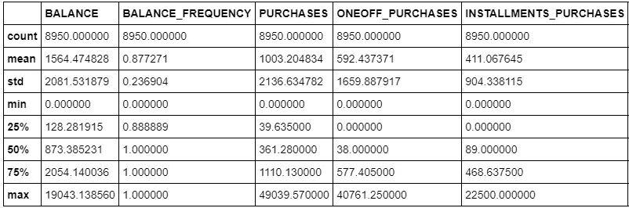
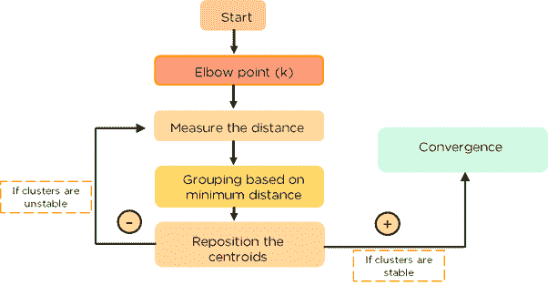
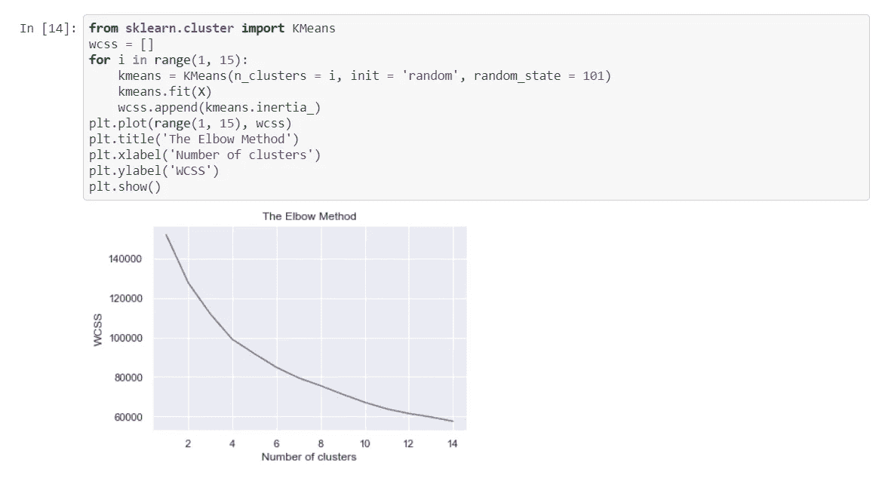
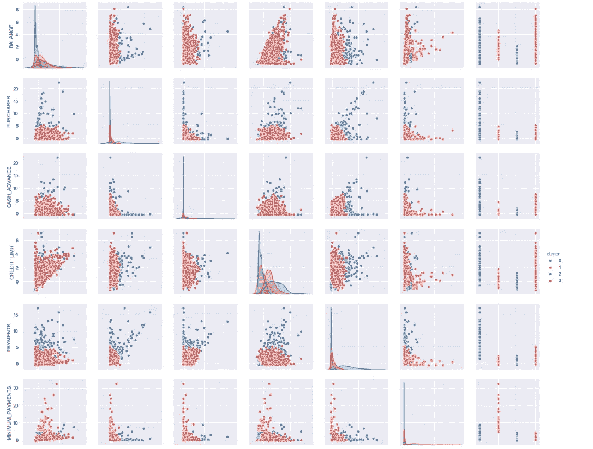
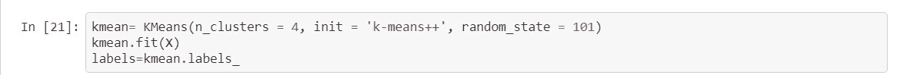
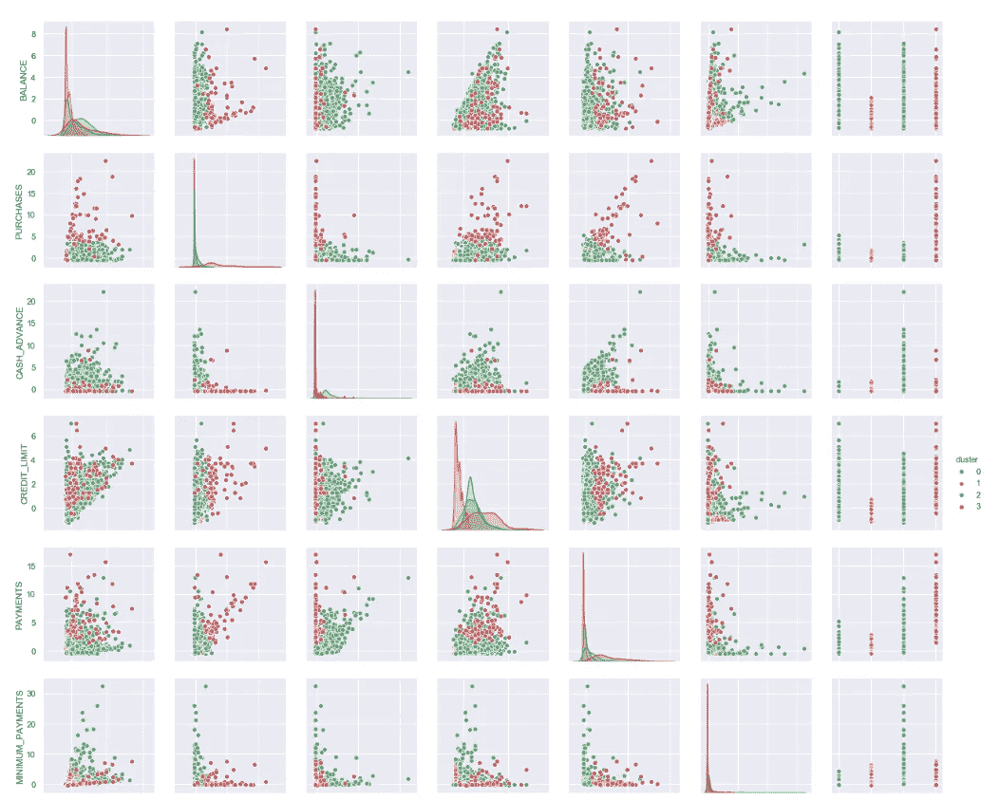
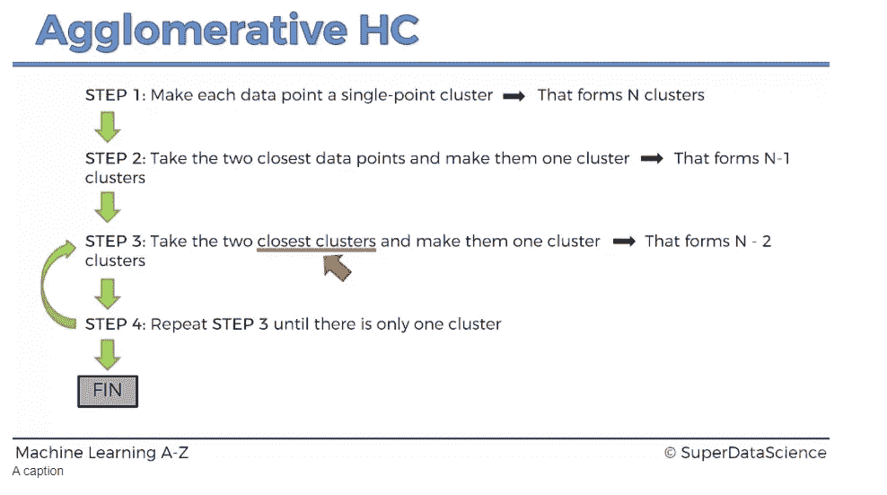
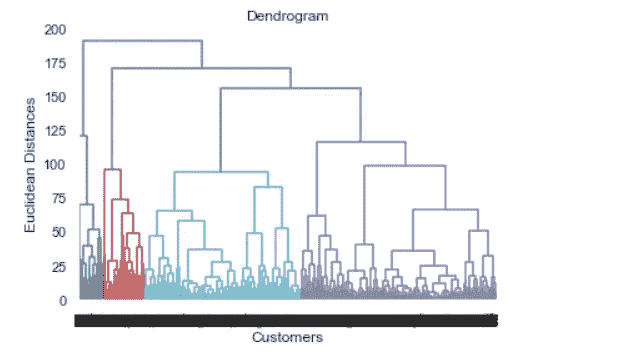
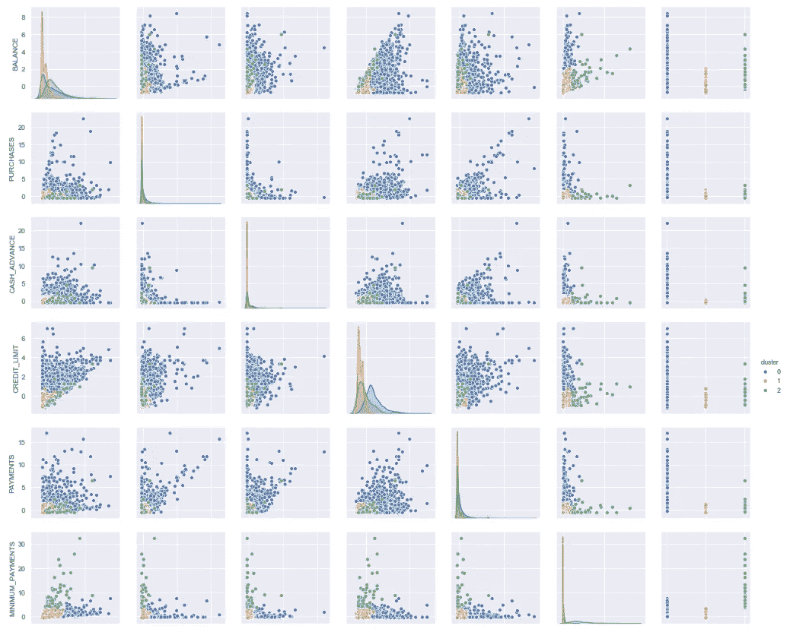
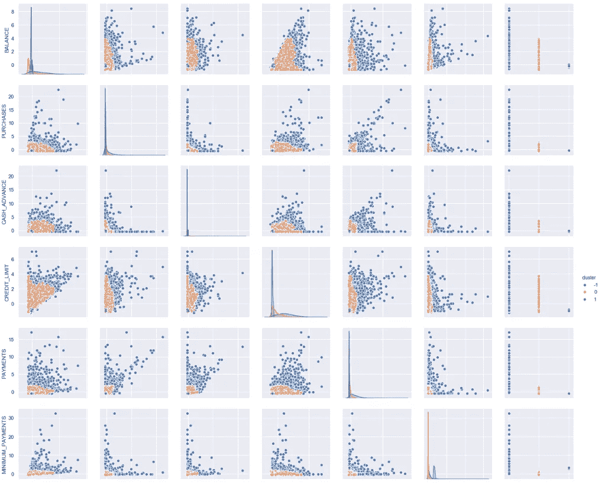

# 使用聚类分析分析信用卡购买模式

> 原文：<https://towardsdatascience.com/analyzing-credit-cards-kmeans-581565208cdb?source=collection_archive---------17----------------------->

## 使用各种聚类模型来评估信用卡购买模式，然后为客户提供建议

Photo by [rupixen](https://unsplash.com/@rupixen?utm_source=medium&utm_medium=referral) on [Unsplash](https://unsplash.com?utm_source=medium&utm_medium=referral)

## 问题简介

在深入研究各种聚类方法之前，让我们简短地看一下我们在这里试图解决的问题。随着时间的推移，一家信用卡公司支持其拥有的各种客户的数据。该公司收集了与客户相关的各种事实的数据，如他们的余额、购买量、预付现金、信用额度等。该团队的任务是从数据中获得有意义的见解，然后制定战略，使公司能够锁定客户并增加信用卡销售额，从而增加收入。

在绘制了简短的数据集描述后，我们注意到数据如下所示:

Partial Data Description of the Credit Card dataset

我们首先分析各种聚类方法，然后向客户提供我们的建议。让我们先简单了解一下聚类和 K 均值。

## 集群简介

聚类是对一组对象进行分组的任务，使得同一组(称为簇)中的对象比其他组(簇)中的对象更相似(在某种意义上)。聚类处理数据分组，将一对相似的数据点放在同一个聚类中。因此，数据点之间匹配的相似性的概念在聚类中起着重要的作用。集群是平面的或分层的，使用 scikit-learn 的集群包( *sklearn.cluster* )在 Python 中实现。
扁平聚类将帖子分成一组簇，这些簇之间没有关联。目标是创建内部相似但与其他集群不同的集群。在层次聚类中，聚类的数量不需要预先指定，而是取决于树状图。创建了一个集群层次结构。

让我们首先实现 K-Means 聚类方法，然后评估有哪些建议。

## k 均值聚类

如上所述，K-Means 聚类是一种平面聚类，我们可以用一组聚类数来初始化模型。K-Means 模型的工作原理是选择 K 个质心，然后根据最小数据点对数据点进行分组，然后重新定位质心，直到实现收敛，前提是聚类是稳定的。

K-Means working. Source: [Anirudh Sharma’s answer on Quora](https://www.quora.com/What-is-the-k-Means-algorithm-and-how-does-it-work/answer/Anirudh-Sharma-555)

现在，让我们绘制一个肘形图来评估最佳的集群数量应该是多少。肘形图，也称为 Scree 图，是一种给出关于簇的信息的图。肘图:

The Elbow Plot

所以，看上面的图，我们假设我们分析的最佳聚类数是 4。现在，使用 4 个聚类，并应用 K-Means 聚类，我们的结果是:

Clusters plotted against the various variables

对于上面的 K-Means 聚类，我们使用随机初始化方法。随机初始化的问题是，每次运行时，类内平方和都会改变，因为质心是随机选择的。这被称为 [**随机初始化陷阱**](https://medium.com/datadriveninvestor/k-means-clustering-6f2dc458cce8) ，应该避免。为了避免这种情况，只需使用 k-means++初始化方法，该方法使用固定点作为质心，因此可以得到更好的结果。

K-Means++ Initialization

使用 K-Means init 方法的聚类可视化如下所示:

Visualization for K-Means Init Method

我们可以看到 K-Means++初始化方法确实比 random init 方法工作得更好。

## 分层聚类

转到其他类型的聚类方法，我们可以观察层次聚类方法。该方法不需要预先指定聚类，而是通过使用树状图来选择聚类。树状图是一种描述聚类分布方式的图表。分层聚类从其聚类中的每个数据点开始，并继续组合聚类，直到达到单个聚类。然而，为了阻止单个聚类的形成，通常使用树状图标准，该标准将不与水平线交叉的最长边作为最小距离标准。任何穿过这条线的聚类都将在最终模型中被选择。

> 这里需要注意的一点是，K-Means 聚类旨在减少距离，而层次聚类试图减少聚类中的方差。因此，HC 提供了更好和更清晰聚类，尽管它们不是最佳的，因为它们没有被距离分开。

Agglomerative HC Working Source: [Machine Learning A-Z](https://www.udemy.com/course/machinelearning/learn/lecture/5922118#questions) by Kirill Eremenko

通过使用 scikit-learn.cluster 包中的 AgglomerativeClustering()，可以在 python 中实现层次聚类。我们分析的树状图如下:

Dendrogram for the Credit Card dataset

从上面我们知道，我们可以选择集群的数量为 3。在这样做之后，使用上面的方法，我们可以观察到集群看起来像:

The behavior of various clusters across various variables

## 基于密度的聚类

基于密度的聚类方法基于根据聚类的不同密度来分布点。DBScan 聚类是一种聚类方法，它使用基于密度的方法，而不是 K-Means 和 HC 中基于距离的聚类。DBSCAN 的全称是带噪声应用的基于密度的空间聚类。将 DBSCAN 方法拟合到信用卡数据集，然后可视化聚类，我们得到:

Visualization for DBSCAN Clustering

> 通过查看上面的 DBSCAN 分析，可以更清楚地观察到，在这种情况下，聚类具有更非线性的形状，因此，当数据不是线性可分的时，应该使用这些类型的聚类方法。

## 来自数据的营销洞察

以下是营销策略的一些输入:

高余额，高购买量 —这些人购买了昂贵的东西，但他们也有更高的余额来支持这些购买。他们也支付了大笔款项，可能成为市场研究的目标。

**高余额，低购买**(较高的购买值)——这些人有较高的余额，但购买量较低，有中等或较高的信用额度，并提取大量现金预付款。

**中等余额，中等购买量** —这些客户没有低余额或高余额，也没有大额或小额购买，但他们做的一切都处于中等水平。

**节俭型客户**(低余额、低购买量)——这些客户购买量最小，因为他们的信用额度也很低，这意味着他们不经常购买。因此，可以假设这些客户流失了，可以设计营销策略来减少这种流失。

因此，着眼于这四个群体的营销策略可以非常有效地解决这个问题。

## 聚类方法的利与弊

K-Means:这些方法简单易懂，适应性强，适用于小型或大型数据集，但是我们需要选择聚类的数量

**HC 凝聚聚类**:这些中的最优聚类数可以由模型本身获得，并且可以用树状图进行实际可视化，但是该模型不适用于大型数据集。'

请在我的 [Github](https://github.com/dhruvsharmaokstate/MachineLearning) 上找到这个项目的完整实现。