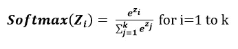

# 分析神经网络中不同类型的激活函数——选择哪一种？

> 原文：<https://towardsdatascience.com/analyzing-different-types-of-activation-functions-in-neural-networks-which-one-to-prefer-e11649256209?source=collection_archive---------9----------------------->

在构建*神经网络*时，我们需要做出的强制性选择之一是使用哪个*激活函数*。事实上，这是一个不可避免的选择，因为*激活函数*是*神经网络*学习和逼近变量之间任何复杂和连续关系的基础。它只是增加了网络的非线性。

任何神经元(输入层神经元除外)计算输入的加权和，加上一些偏差，然后对其应用*激活函数*。在谈论更多关于*激活函数*之前，让我们先看看为什么需要它。

> **补充说明**
> 
> 本文假设读者对神经网络的概念、前向和后向传播、权重初始化、优化算法等有基本的了解。如果你不熟悉，我建议你关注我的其他关于这些主题的文章。
> 
> [神经网络中的前向传播——简化的数学和代码版本](/forward-propagation-in-neural-networks-simplified-math-and-code-version-bbcfef6f9250)
> 
> [为什么更好的权重初始化在神经网络中很重要？](/why-better-weight-initialization-is-important-in-neural-networks-ff9acf01026d)
> 
> [为什么梯度下降还不够:神经网络优化算法综合介绍](/why-gradient-descent-isnt-enough-a-comprehensive-introduction-to-optimization-algorithms-in-59670fd5c096)

# 需要激活功能

参考下面的具有两个隐藏层的神经网络，输入层和输出层。该网络适用于三元类分类问题。

考虑在该网络中不使用激活函数的情况，则从隐藏层 1 计算的输入的加权和将被直接传递到隐藏层 2，它计算输入的加权和并传递到输出层，它计算输入的加权和以产生输出。输出可以表示为

因此，输出只是权重和输入的线性变换，不会给网络增加任何非线性。因此，这个网络类似于一个 ***线性回归模型*** ，它只能处理变量之间的线性关系，即一个能力有限的模型，不适合图像分类、物体检测、语言翻译等复杂问题。

所以没有激活功能的神经网络

1.  只能代表变量之间的线性关系。
2.  不成立*普适近似定理。*

# 流行的激活功能

有许多可用的激活功能。因为激活函数只是一个数学函数，所以你也可以想出自己的激活函数。常用的激活功能有

1.  物流的
2.  双曲正切
3.  整流线性单位
4.  泄漏 ReLu

# 逻辑激活功能

这是一条带有等式的“S”形曲线

范围从 0 到 1。它也被称为*乙状窦激活*功能。输入的加权和作为输入应用于它。

对于一个大的正输入，它导致一个大的正输出，倾向于触发，对于大的负输入，它导致一个大的负输出，倾向于不触发。

激活函数的导数有助于反向传播期间的计算。在反向传播期间，计算损耗 w.r.t .参数的导数。逻辑函数的导数

物流激活功能的问题:

## 1.饱和问题

如果一个神经元达到其最大或最小峰值，则称其饱和。

当 **f(x) = 0 或 1** 时饱和，则 **f'(x) = f(x)(1- f(x)) = 0**

**我们为什么关心饱和度？**

参考下面的神经网络，其中假设权重 w211 需要在反向传播期间使用梯度下降更新规则来更新。

如果 h21 是 1，那么它的导数就是 0。所以权重 w211 没有任何更新，这个问题被称为**消失梯度问题。**重量梯度消失或降至零。

因此，使用逻辑激活函数，饱和神经元可能导致梯度消失，因此网络拒绝学习或以非常小的速率保持学习。

## 2.不是以零为中心的函数

零线(x 轴)两侧质量相等的函数称为零中心函数。换句话说，在以零为中心的函数中，输出可以是负的，也可以是正的。

在逻辑激活函数的情况下，输出总是正的，并且输出总是仅向一侧(正侧)累积，因此它不是以零为中心的函数。

**为什么我们会关心以零为中心的函数？**

让我们假设权重 w311 和 w312 需要在反向传播期间使用梯度下降更新规则来更新。

**h21** 和 **h22** 由于逻辑激活功能将始终为正。w312 和 w312 的梯度值可以是正的或负的，这取决于公共部分的值。

因此，连接到同一神经元的所有权重的梯度要么是正的，要么是负的。因此，在更新规则期间，这些权重只允许在某些方向上移动，而不是在所有可能的方向上移动。这使得优化更加困难。

这就好比你只能向左和向前移动，不能向右和向后移动，那么你就很难到达你想要的目的地。

理解了这一点，让我们指出与逻辑激活功能相关的**问题**

1.  饱和的逻辑神经元导致梯度 ***消失*** 。
2.  它不是一个 ***以零为中心的*** 函数，
3.  由于 e^x，它是高度 ***计算密集型*** 这使得收敛速度较慢。

# 2.双曲正切

它类似于*逻辑激活*功能，有一个数学方程

输出范围从-1 到 1，零轴两侧的质量相等，因此是 ***零居中*** 功能。所以 *tanh* 克服了*逻辑*激活函数的非零中心问题。因此，优化变得比*逻辑*相对容易，并且总是优先于*逻辑*。

但是，一个 *tanh* 激活的神经元可能导致*饱和*并导致*消失梯度*问题*。*

*tanh* 激活函数的导数

**发布**与 *tanh* 激活功能:

1.  饱和的 *tanh* 神经元导致 ***渐变消失*** 。
2.  因为 e^x，它是高度计算密集型的。

# 3.整流线性单位

由于其简单性，它是最常用的函数。它被定义为

如果输入是正数，函数返回数字本身，如果输入是负数，函数返回 0。

*ReLu* 激活函数的导数为

**ReLu 激活功能的优点**

1.  容易 ***计算*** 。
2.  对于输入的加权和的正值， ***不饱和*** 。

因为简单， *ReLu* 在 CNN 中被用作标准的激活函数。

但是， *ReLu* 并不是一个以零为中心的函数。

**ReLu 激活功能的问题**

*ReLu* 定义为 *max(0，w1x1 + w2x2 + …+b)*

现在考虑一种情况 *b(偏置*)呈现(或初始化为)大的负值，然后输入的*加权和接近 0，并且*神经元*未被激活。这意味着 *ReLu* 激活神经元 ***现在死亡*** 。这样， ***多达 50%*** 的 *ReLu* 激活神经元可能**在训练阶段**死亡。*

为了克服 T21 的这个问题，有两个解决方案

1.  将*偏置(b)* 初始化为较大的正值。
2.  使用 ReLu 的另一种变体，称为**泄漏 ReLu** 。

# **4。泄漏的 ReLu**

提出修复 *ReLu* 的 ***濒死神经元*** 问题。它引入了一个小斜率来保持神经元的更新有效，其中输入的*加权和*为 ***负*** 。它被定义为

如果输入是一个*正*数，函数返回该数本身，如果输入是一个*负*数，那么它返回一个按 0.01 缩放的*负*值(或任何其他小值)。

LeakyReLu curve

*LeakyReLu* 的导数为

**leaky relu 的优点**

1.  正负区域都没有 ***饱和*** 问题
2.  神经元 ***不会死*** 因为 **0.01x** 确保至少有一个小的梯度流过。虽然权重的变化很小，但经过几次迭代后，它可能会从其原始值出来。
3.  容易 ***计算*** 。
4.  接近*零点功能。*

# *Softmax 激活功能*

*对于*分类*问题，输出需要是包含不同类别的不同概率值的概率分布。对于二元分类问题，*逻辑*激活函数工作良好，但对于*多类*分类问题则不然。所以 ***Softmax*** 用于*多类*分类问题。*

**softmax* 激活功能也是一种 s *igmoid* 功能。顾名思义，这是 *max* 函数的*“软”*风格，它不是只选择一个最大值，而是为最大元素分配分布的最大部分，其他较小元素获得分布的某一部分。*

**

*Softmax equation*

**Softmax* 通常是输出层的首选，我们试图在输出中获得不同类别的概率。它应用于输出层中获得的输入加权和。*

***需要 Softmax 激活功能***

*考虑这样一种情况，对于一个三元分类问题，我们在输出层中有[2.4，-0.6，1.2]的预激活输出。预激活输出可以是任何实数值。*

*现在，如果我们通过取一个值并除以所有值的总和来直接计算每一类的概率。然后我们得到概率[0.57，-0.14，0.12]。因为概率永远不会是负的，所以这里不接受类别 2 的预测概率。因此，我们在输出层使用 *softmax* 激活函数来解决多类分类问题。*

*如果输入值为负，那么 *softmax* 也会返回正值，因为 e^x 总是给出正值。*

# *结尾注释:现在更喜欢哪一个？*

*理解了所有的激活函数，现在有趣的问题是使用哪一个？*

*嗯，基于场景的激活功能选择没有硬性规定。决策完全取决于问题的性质，即你试图近似的关系具有一些性质，基于这些性质，你可以尝试不同的激活函数，并选择一个有助于更快收敛和更快学习过程的函数，或者可以根据你选择的不同评估参数。*

*   *根据经验，您可以从 **ReLu** 开始作为通用近似器，如果 **ReLu** 不能提供更好的结果，则切换到其他函数。*
*   *对于 **CNN** ， **ReLu** 被视为标准激活功能，但如果它遭遇**死神经元**则切换到 **LeakyReLu** 。*
*   *永远记住 **ReLu** 应该只用于**隐藏 层。***
*   *对于**分类**， **Sigmoid 函数(Logistic，tanh，Softmax)** 及其组合工作良好。但同时可能会遭遇**消失渐变问题**。*
*   *对于 **RNN，****tanh**激活功能是首选的标准激活功能。*