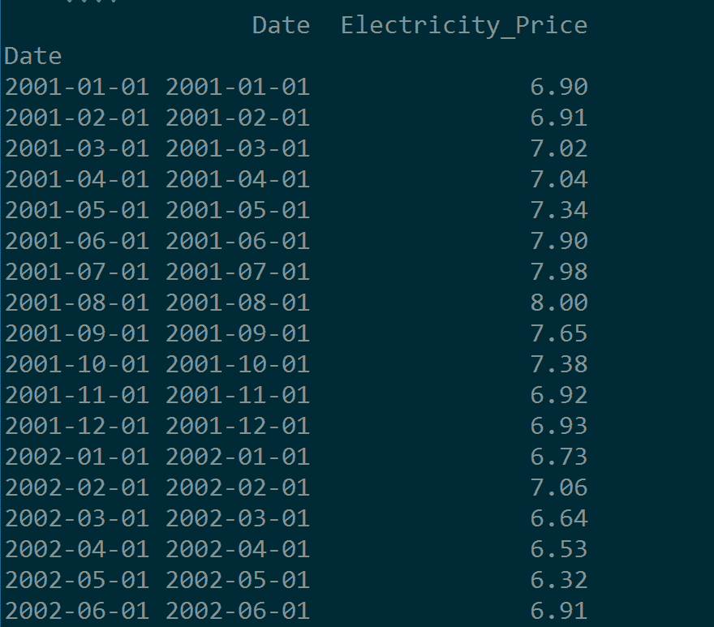
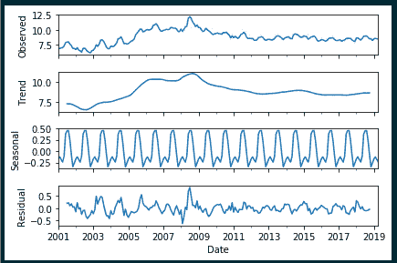
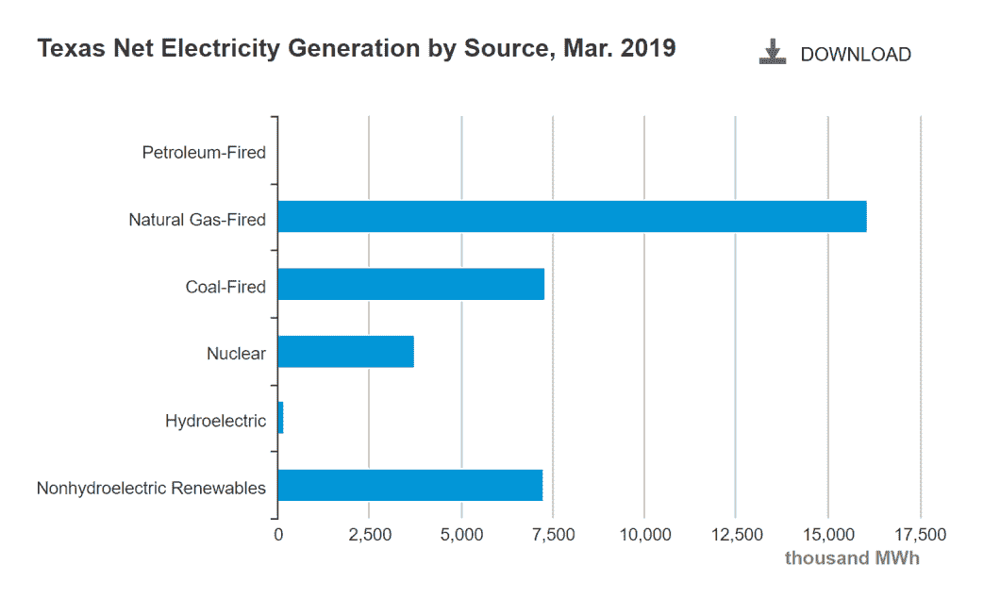
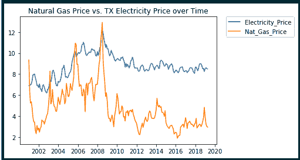
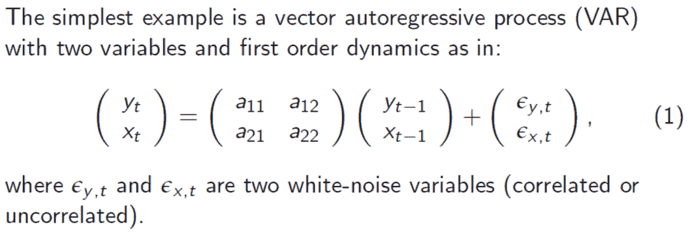
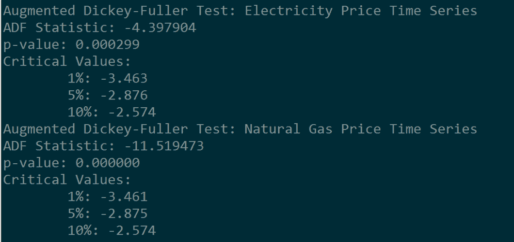
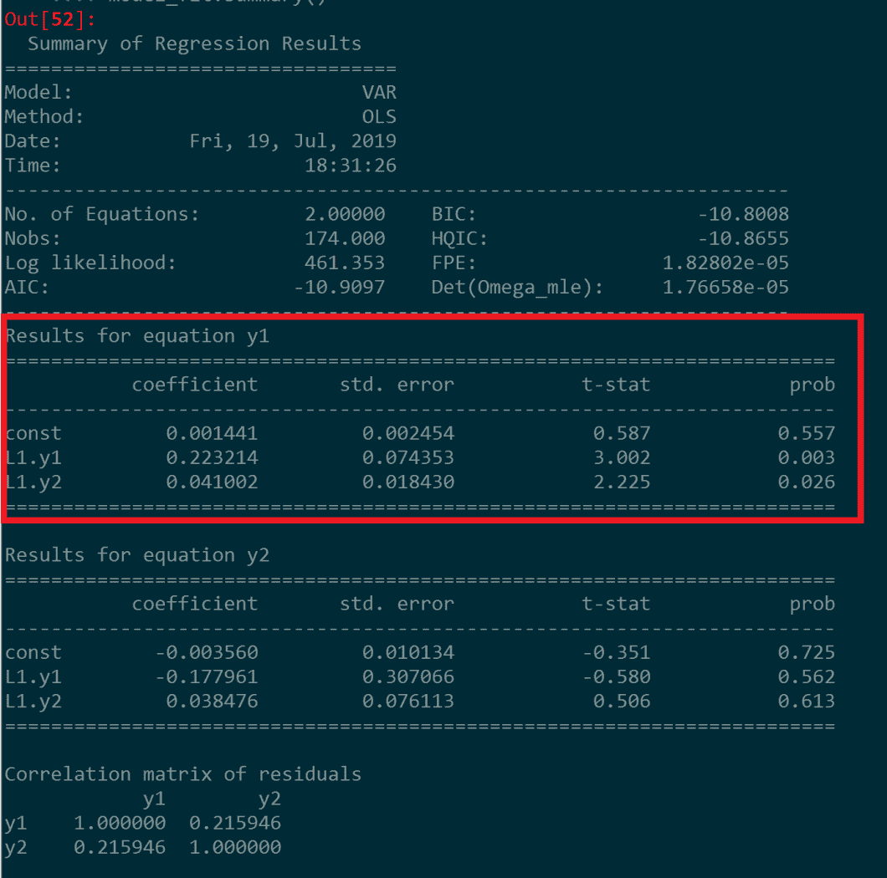
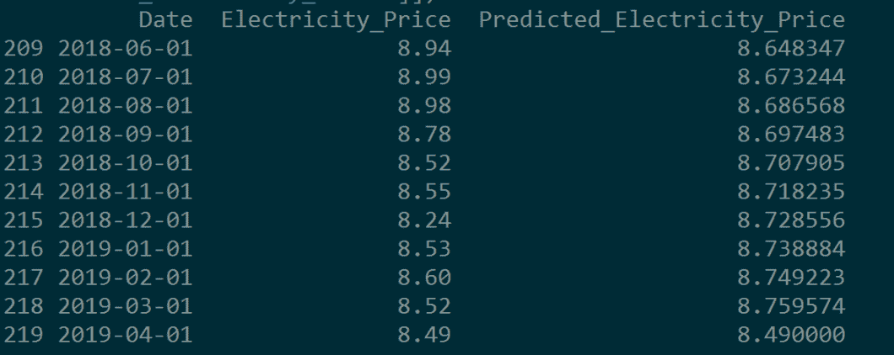
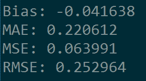

# 用 VAR 模型预测 Python 中的电价时间序列数据

> 原文：<https://towardsdatascience.com/analyzing-electricity-price-time-series-data-using-python-time-series-decomposition-and-price-4cd61924ef49?source=collection_archive---------12----------------------->

## 向量自回归模型的时间序列分解和预测速成班

在过去的几年里，我处理过一些涉及时间序列分析和预测的项目，但是我总是发现这个主题对于初学者来说有些难以理解，因为缺乏全面的 Python 教程。因此，为了纠正这一点，这篇文章带领初学者通过时间序列分析，使用能源信息管理局的 API 提供的德克萨斯州每月电价数据。具体来说，本教程涵盖了时间序列分解和向量自回归(VAR)建模，以预测德克萨斯州的电价。

首先，简单介绍一下能源信息署(EIA)的背景。EIA 是美国能源部的一个分支，负责收集和分析能源相关数据，包括石油和天然气、煤炭、核能、电力和可再生能源。通过其[开放数据应用编程接口(API)](https://www.eia.gov/opendata/) ，用户可以直接将 EIA 时间序列数据拉入 Python 进行分析。

**关于在 Python 中设置 EIA API 访问的更多背景，请查看本教程:**[**https://techrando . com/2019/06/26/how-to-use-the-energy-information-administration-EIA-application-programming-interface-API-and-pull-live-data-directly-into-Python-For-analysis/**](https://techrando.com/2019/06/26/how-to-use-the-energy-information-administration-eia-application-programming-interface-api-and-pull-live-data-directly-into-python-for-analysis/)

在本分析中，我们将把德克萨斯州的电价时间序列放入 Python 进行分析，如下所示:

*Snapshot of the time series data for electricity prices, pulled via the EIA API*

首先，让我们看看月度电力数据是否显示了季节性和趋势。为此，我们使用 statsmodels.tsa.seasonal 包中的季节性分解()函数。该函数将时间序列分解为其核心部分:趋势、季节性和随机噪声。代码及其输出显示如下:

*Time Series Decomposition: Monthly Electricity Prices in TX*

那么上面的情节是什么意思呢？如果我们仔细观察分解的季节性成分，我们可以验证一个合乎逻辑的趋势:在德克萨斯州的夏季，电价飙升。对于任何一个在盛夏去过德克萨斯州的人来说，那里酷热难当，没有空调几乎无法居住(我知道，我住在休斯顿)。因此，更多的空调导致更多的用电量，从而导致更高的电价。

此外，每年年初左右，电价会出现第二次小幅上涨。这可能是由于天气足够凉爽，德州人求助于加热他们的家，办公室等。由于德州大部分地区冬天的天气相当温和，所以这种价格上涨明显不如夏天的电价上涨明显。

现在，我们已经使用时间序列分解进行了一些初步分析，我们希望确定是否可以使用另一个预测时间序列作为代理来预测电价。为了了解什么因素会影响电价，让我们先来看看德克萨斯州的电力是如何产生的。美国能源情报署在其网站上提供了德克萨斯州电力来源的分类，如下图所示:

*Image courtesy of* [*https://www.eia.gov/state/?sid=TX#tabs-4*](https://www.eia.gov/state/?sid=TX#tabs-4)

根据上述图表，截至 2019 年 3 月，天然气似乎是德克萨斯州发电的主要来源，燃煤和可再生能源并列第二。

虽然我们分析的电力数据可以追溯到 2001 年，上面的细分数据是从 2019 年 3 月开始的，但为了简单起见，我们假设天然气是过去 15-20 年德克萨斯州发电的主要来源之一。因此，我们将通过 EIA API 提取天然气价格的时间序列，并与德克萨斯州电价时间序列进行对比:

*Plotted Natural Gas Prices and Electricity Prices over Time*

天然气价格时间序列似乎有更多的变化(高点特别高，低点特别低)，但在大多数情况下，两个时间序列的趋势似乎非常相似。事实上，我们很有可能使用天然气价格作为代理来估算 TX 电价。

这提出了一个有趣的问题-使用一个时间序列的滞后值以及其他时间序列集的滞后值来预测未来值。解决此类问题的一种方法叫做向量自回归，或 VAR。VAR 是自回归(或 AR)模型的扩展，在生成预测时使用多个变量。VAR 模型因其在分析经济和金融时间序列时的灵活性而非常受欢迎，并且非常适合预测。

下图给出了带有两个变量和一阶动力学的 VAR 方程的分解。这是一个非常简单的线性方程，其中 t-1 时刻的 x 值和 y 值用于预测 t 时刻的 x 值和 y 值。由于变量 x 依赖于变量 y，反之亦然，因此使用一个方程组来共同考虑它们。基本上，VAR 模型通过使用多个相关时间序列的滞后数据来预测未来值。

*VAR equation for two variables and first-order dynamics: Image courtesy of*[*http://www.ams.sunysb.edu/~zhu/ams586/VAR_Lecture2.pdf*](http://www.ams.sunysb.edu/~zhu/ams586/VAR_Lecture2.pdf)

**如果你想了解更多的背景知识，华盛顿大学提供的以下讲义对 VAR 模型背后的数学进行了深入的描述:**[**【https://faculty.washington.edu】**](https://faculty.washington.edu/)**。**

**此外，芝加哥大学布斯商学院在以下演讲中对风险值建模进行了高度概括:**[**https://faculty . Chicago Booth . edu/Jeffrey . Russell/teaching/time series/讲义/notes5.pdf**](https://faculty.chicagobooth.edu/jeffrey.russell/teaching/timeseries/handouts/notes5.pdf)

与大多数经济计量分析一样，VAR 模型的运行有几个要求。首先，过去的时间序列需要是静态的，即时间序列的统计属性，包括均值、方差和自相关，需要随时间保持不变。因此，显示季节性或趋势的时间序列不是静止的。

有几种方法可以让模型静止。它们如下:

1.  差分时间序列。数据差分或多或少是计算每个数据点的瞬时速度，或时间序列从一个值到下一个值的变化量。
2.  转换时间序列。这可以通过对数据应用对数或幂变换来实现。

接下来，为了使风险值模型发挥作用，采样频率(即每日、每月、每年的数据)需要相同。如果不是，则需要使用插补/线性插值等方法将数据转换成相同的频率。

在下面的代码中，每个时间序列都使用 numpy 自然对数函数进行转换，然后按一个间隔进行差分:

为了检验时间序列现在是否是平稳的，我们使用扩展的 Dickey Fuller 检验。扩展的 Dickey-Fuller 检验检验单位根存在于时间序列中的零假设(即，如果单位根存在于时间序列中，那么它不是平稳的)。要成功确定时间序列是平稳的，测试必须返回小于. 05 的 p 值。在下面的 Python 代码中，我们对转换后的差分时间序列运行了扩展的 Dickey-Fuller 测试，确定它们都是平稳的(对于电力和天然气时间序列，返回的 p 值分别为. 000299 和 0):

*Outputs for the Augmented Dickey-Fuller Test for the electricity price time series and the natural gas price time series, respectively*

现在，我们已经使我们的两个时间序列平稳，是时候将数据拟合到 VAR 模型中了。下面的 Python 代码成功构建了模型并返回了结果摘要，其中我们对训练/验证集使用了 95/5%的拆分:

*VAR Model Summary, with y1=Electricity Price Time Series, and y2=Natural Gas Price Time Series*

在上面的模型总结中，我们真正想要关注的是 y1 的等式，其中 y1 根据其自身的滞后值和滞后天然气价格来估计德克萨斯州的电价。

存在与滞后电价数据(L1.y1)和滞后天然气价格数据(L1.y2)相关联的 t 统计量和 p 值。t 统计将数据与零假设下的预期结果进行比较。如果样本结果正好等于零假设，则 t 统计量为 0。或者，t 统计值越高，我们就越有可能拒绝零假设。基本上，t 统计值越高，两个变量之间的相关性就越大。

每个 t 统计量都有一个相应的 p 值。p 值也用于拒绝零假设。p 值越低，反对零假设的证据越强。通常，小于 0.05 的 p 值用于确定统计显著性。

**有关 t-统计和 p-值的更多信息，请查看以下链接:**[**https://blog . minitab . com/blog/statistics-and-quality-data-analysis/what-are-t-values-and-p-values-in-statistics**](https://blog.minitab.com/blog/statistics-and-quality-data-analysis/what-are-t-values-and-p-values-in-statistics)

记住所有这些信息，让我们来解释方程 y1 的模型总结的结果。

对于滞后电价变量，t 统计量为 3.002，p 值为 0.003-显然，电价时间序列的滞后值会影响时间序列的未来值，我们可以拒绝零假设。

天然气价格时间序列的滞后值也很有希望，t 统计值为 2.225，p 值为 0.026，远低于统计意义的临界值，并且明确表明天然气时间序列中的滞后值会影响电价时间序列中的未来值。

现在我们已经建立了一个模型，是时候生成预测并与测试/验证集中的实际数据进行比较了。需要注意的是，为了理解电价预测，数据必须是无差异的和反向转换的。以下代码执行非差分和反向转换操作，并计算与评估模型性能相关的预测指标，包括预测偏差、平均绝对误差、均方误差和均方根误差:

*Actual electricity price vs. VAR-model predicted electricity price, predicted out 10 months (after un-differencing and back-transformation)*

*Accuracy metrics for the forecast: forecast bias, mean absolute error, mean squared error, and root mean square error*

这里的结果看起来很有希望！VAR 似乎相当准确地估计了电价。预测偏差度量为-0.041638，表明模型有过度预测或预测过高的趋势。平均绝对误差、均方误差和均方根误差也相当低，这很好。根据平均绝对误差(MAE ),预测值和实际值之间的平均偏差为 0.22 美元。

**有关时间序列预测模型指标的更多背景信息，请查看以下链接:**[**https://machinelingmastery . com/time-series-forecasting-performance-measures-with-python/**](https://machinelearningmastery.com/time-series-forecasting-performance-measures-with-python/)

本教程到此结束。感谢您的阅读！

**此分析的完整脚本可通过 Github 获得:**[**https://Github . com/kperry 2215/electricity _ price _ time _ series _ analysis/blob/master/analyze _ monthly _ electricity _ data . py**](https://github.com/kperry2215/electricity_price_time_series_analysis/blob/master/analyze_monthly_electricity_data.py)

**查看我的其他一些与能源相关的 Python 教程:**

**自动化油气递减曲线分析:**[**https://techrando . com/2019/07/03/how-to-automate-decide-curve-analysis-DCA-in-python-using-scipys-optimize-curve _ fit-function/**](https://techrando.com/2019/07/03/how-to-automate-decline-curve-analysis-dca-in-python-using-scipys-optimize-curve_fit-function/)

**分析开源 FracFocus 数据以获得完井见解:**[**https://techrando . com/2019/07/14/using-public-available-frac focus-data-and-python-matplotlib-function-to-visualize-oil-and-gas-companies-completions-strategies-in-the-二叠纪盆地/**](https://techrando.com/2019/07/14/using-publicly-available-fracfocus-data-and-pythons-matplotlib-function-to-visualize-oil-and-gas-companies-completions-strategies-in-the-permian-basin/)

*原载于 2019 年 7 月 19 日*[*http://techrando.com*](https://techrando.com/2019/07/19/analyzing-electricity-price-time-series-data-using-python-time-series-decomposition-and-price-forecasting-using-a-vector-autoregression-var-model/)*。*