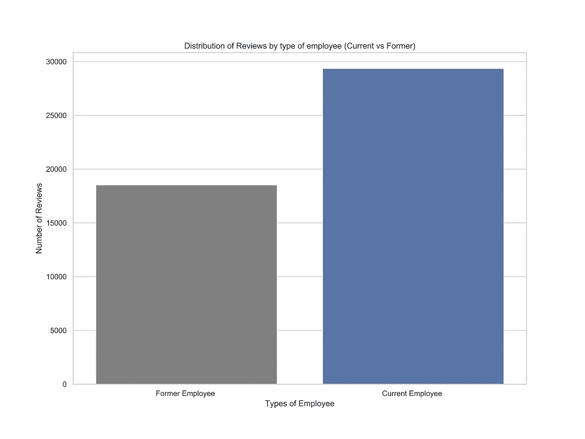
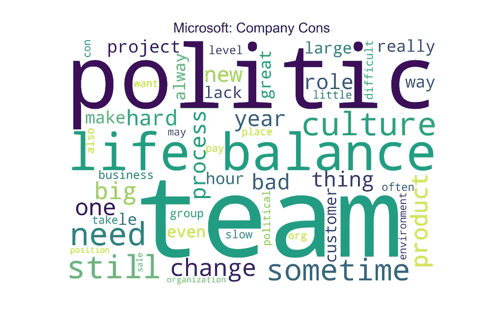

# 分析员工评论:谷歌 vs 亚马逊 vs 苹果 vs 微软

> 原文：<https://towardsdatascience.com/analyzing-employee-reviews-google-vs-amazon-vs-apple-vs-microsoft-4dc3c036666b?source=collection_archive---------0----------------------->


## 值得为哪个公司工作？

# 概观

无论是因为他们提供高薪、奢侈津贴的能力，还是他们令人兴奋的使命宣言，很明显，像谷歌和微软这样的顶级公司已经成为人才磁铁。客观地说，仅谷歌每年就收到超过 200 万份工作申请。

为顶级科技公司工作是许多人的梦想，这当然是我很长一段时间的梦想，但我们不应该问自己“为这些公司工作真的值得吗？”有谁比他们自己的员工更能帮助我们回答这个问题呢？在这篇文章中，我将带你浏览我对谷歌、微软、亚马逊和苹果员工评价的分析，并试图发现一些有意义的信息，希望这些信息能在我们决定值得为哪家公司工作时有所启发。

我将从描述我如何清理和处理数据开始，然后借助一些可视化来谈谈我的分析。我们开始吧！！

[](https://medium.com/@avourakis/membership) [## 通过我的推荐链接加入 Medium-Andres Vourakis

### 阅读安德烈斯·沃拉基斯(以及媒体上成千上万的其他作家)的每一个故事。您的会员费直接支持…

medium.com](https://medium.com/@avourakis/membership) 

# 数据

## 数据收集

用于这项分析的员工评论数据是从 [Kaggle 数据集](https://www.kaggle.com/petersunga/google-amazon-facebook-employee-reviews)下载的，它来自 glass door——一个现任和前任员工匿名评论公司及其管理层的网站。该数据集包含超过 6.7 万条谷歌、亚马逊、脸书、苹果和微软的员工评论。

这些评论分为以下几类:

1.  **指数**:指数
2.  **公司**:公司名称
3.  **位置**:该数据集是全球性的，因此它可能包括括号中的国家名称[即“安大略省多伦多(加拿大)”]。但是，如果位置在美国，那么它将只包括城市和州[即“洛杉矶，加利福尼亚州”]
4.  **发布日期**:格式如下年月日
5.  **职位**:该字符串还包括审核人在审核时是“现任”还是“前任”员工
6.  **总结**:员工考核的简短总结
7.  **赞成**:赞成
8.  **缺点**:缺点
9.  **总体评分**:1-5 分
10.  **工作/生活平衡评分**:1–5 分
11.  **文化和价值观评分**:1–5 分
12.  **职业机会评级**:1–5
13.  **薪酬&福利等级**:1–5
14.  **高级管理层评级**:1–5
15.  **有帮助的评论统计**:统计有多少人认为该评论是有帮助的
16.  **链接到评论**:这将为您提供包含评论的页面的直接链接。然而，这种联系很可能会过时

以下是表格形式的数据:


Preview of data in tabular form (Not showing the last two columns)

## 数据清理

在做了一些基本的数据探索之后，我决定做以下事情来为我的分析准备数据:

*   只包括谷歌，亚马逊，微软和苹果的员工评论。尽管脸书和网飞有大量的综述，但加在一起，它们只代表了不到 4%的数据集，所以为了简单起见，我决定将它们排除在分析之外。
*   “链接”和“给管理层的建议”专栏被删除了，因为我认为它们不会像其他专栏那样有见地。
*   删除了“日期”列中缺少值的行。
*   创建了一个名为“Year”的新列，包含进行评审的不同年份。
*   以下各列中缺少值的行将被删除:“公司”、“年份”、“总体评分”和“职位”。
*   删除了所有列中都缺少值的行。
*   包含数值的列被转换为适当的数据类型。

# 洞察力和分析

## 哪家公司评论最多？

我从可视化我选择的 4 家公司的员工评价的分布开始我的分析。


**解读:**我们可以清楚地看到，亚马逊拥有最多的员工评论(超过 25000)。这很好，因为这可能意味着我们将看到各种观点的良好融合。虽然谷歌的员工评论数量最少，但它仍然足够大，足以让它与其他公司相比。

让我们来看看这些评价是如何在各个公司中分布的。


**解释:**如我们所见，有十年的员工评估可用，但它们只持续到 2018 年。

*   微软:大多数评论都是过去 4-7 年的
*   谷歌:大多数评论都是过去 4 年的
*   **亚马逊:**大多数评论都是过去 3-4 年的
*   **苹果:**大多数评论都是过去 2-4 年的

基于这些观察，并考虑到这些公司每年发展和变化的速度，我决定继续分析过去 4 年(2015 年至 2018 年)的员工评估，因为我认为它们是最相关的。

## 谁在复习？

现在我们已经知道我们要处理多少评论，让我们弄清楚是谁写的。这个问题可以用许多不同的方法来回答，我的第一个方法是找出评审者的职称，下面是前 5 名的样子:

```
Anonymous Employee               21910
Software Engineer                  930
Specialist                         648
Software Development Engineer      618
Warehouse Associate                585
```

不幸的是，大部分职位都被贴上了“匿名员工”的标签。考虑到很多时候公司对同一份工作的称谓略有不同，我决定不再深究。相反，让我们看看有多少评审者是现任和前任员工



正如我们所看到的，大多数评论来自当前的员工，但为了获得更多的洞察力，让我们看看每个公司的分布情况:


**解读:**再一次，我们看到大多数对每家公司的评论都是来自现在的员工。这些是在试图解读数据时想到的一些想法:有大量来自当前员工的评论是一件好事还是意味着更多的偏见？也许，有更多前员工的评论可以给我们一些我们不常读到的关于这些公司的见解。让我们继续…

## 哪家公司综合评分最高？

让我们来看看过去几年(2015 年至 2018 年)每家公司的平均总体评分是如何变化的


**解读:**我们可以看到，自 2015 年以来，除了苹果，每家公司的平均综合评分都没有下降。谷歌在这四家公司中拥有最高的平均综合评分，并且在过去的几年里一直保持这种状态。让我们来谈谈每家公司的趋势:

*   **谷歌:**似乎从 2016 年开始略有减少。
*   **微软:**从 2015 年开始缓慢增长
*   **苹果:**好像在慢慢减少。
*   **亚马逊:**从 2015 年到 2017 年急剧增长。

## 哪家公司能更好地平衡工作和生活？

让我们看看这些公司在允许员工拥有工作之外的生活方面做得有多好:


**解读:**谷歌的工作生活平衡评分最高(超过 4 星)，微软紧随其后。在提供良好的工作生活平衡方面，亚马逊似乎有所欠缺。

## 哪家公司的文化价值观更好？

让我们看看员工如何评价他们公司的核心原则和理念:


**解读:**谷歌的文化价值观评分最高，苹果排名第二(超过 4 星)。亚马逊在 4 个等级中排名最低，但仅略高于 3.5 星。

## 哪个公司的职业机会比较好？

他们在帮助你推进职业发展方面有多出色？


**解读:**谷歌对职业机会的评分最高(超过 4 星)。考虑到这家公司有多大，他们正在使用多少种不同类型的技术，这并不奇怪。苹果的评分最低，仅略低于 3.5 星。

## 哪家公司福利待遇更好？

让我们看看这些公司在员工福利方面做得如何。


**解读:**谷歌的福利/津贴评分最高，超过 4.5 星。苹果和微软似乎也提供了很好的好处，但亚马逊有点不足。

## 哪个公司的高层管理比较好？

领导力是管理层的一项重要职能，让我们看看这些公司是如何评价高级管理层的领导力的:


**解读:**谷歌的高级管理层获得最高评级，但仅略低于 4 星，与其他评级相比是最低的。亚马逊对高级管理层的评价最低。

## 每个公司的优点是什么？

让我们用文字云来探索一下专业人士的评论:


以下单词在所有 4 家公司中都很常见(非常频繁)，但不包括在单词云中:利益、公司、文化、环境、好、伟大、很多、机会、人、工作和工作。

这些词在试图找出这些公司的优秀之处时都很重要，但我决定省去它们，以便为其他频繁出现的关键词腾出空间，这些关键词可能对每个公司更独特/更有见解。以下是员工喜欢他们公司的几个方面:

*   **谷歌:**额外津贴、聪明人、免费食物和高薪。
*   **亚马逊:**学习的能力，他们的团队，聪明的人和管理。
*   苹果公司:员工折扣、产品、团队、有趣的环境和良好的培训。
*   **微软:**聪明的人、产品、薪酬、技术和他们的团队。

## 每个公司的缺点是什么？

让我们使用单词云来研究一下反对意见:



以下单词在所有 4 家公司中都很常见(非常频繁)，但不包括在单词云中:company、get、lot、management、manager、people、time 和 work。

这些词在试图找出是什么让这些公司变得糟糕时都很重要，但我决定不考虑它们，以便为其他频繁出现的关键词腾出空间，这些关键词可能对每个公司更独特/更有洞察力。以下是员工不喜欢公司的几个方面:

*   谷歌:他们的团队、艰苦的工作、项目、办公室政治以及缺乏工作与生活的平衡
*   **亚马逊:**缺乏工作与生活的平衡，工作时间和文化。
*   **苹果:**工作生活平衡的缺失，零售店，顾客，薪酬。
*   **微软:**办公室政治、工作与生活缺乏平衡、他们的团队、努力工作和文化

# 结论

通过分析，我们发现谷歌不仅拥有最高的整体平均评分(低于 4.4 星)(截至 2018 年)，而且在工作生活平衡、福利/津贴、文化价值观、高级管理和职业机会方面也排名第一。微软排名第二，总体平均评分略高于 4 星，但苹果似乎有更好的高层管理和文化价值观，并提供更好的福利/津贴。除了就业机会，亚马逊几乎在所有类别中都排在最后。

我们还了解到，尽管有评级，但总的来说，员工发现他们公司缺乏工作与生活的平衡是有问题的。此外，单词云显示，所有 4 家公司的首要缺点是管理、人员(其他员工)和工作本身。这三个缺点也是人们辞职的主要原因之一。

我们应该问自己的是，知道谷歌有多受欢迎，为什么在我们分析的 4 家公司中，它的评论最少？是因为它的员工数量最少还是我们遗漏了什么？

我当然想到了许多其他问题，但必须指出，这绝不是详尽的分析。

尽管如此，我希望这篇文章是有见地的，并且您会受到启发来扩展这一分析，或者使用您的数据科学技能来研究不同的感兴趣的主题。如果你想看代码，所有的代码都被仔细地记录在这个 [Jupyter 笔记本](https://github.com/avourakis/Employee-Reviews-Analysis)上。

请在评论中告诉我你的想法和反馈。有什么事情你会做得不一样吗？我可以使用哪些其他数据作为分析的一部分？

此外，如果你希望支持我成为一名作家，可以考虑[注册成为❤️](https://medium.com/@avourakis/membership)的媒体成员