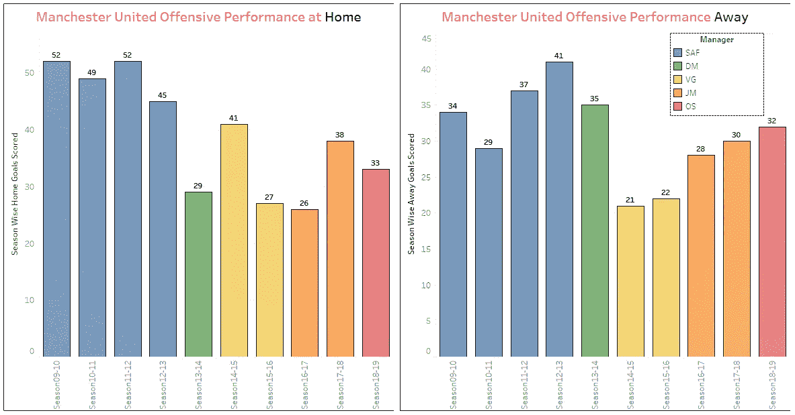
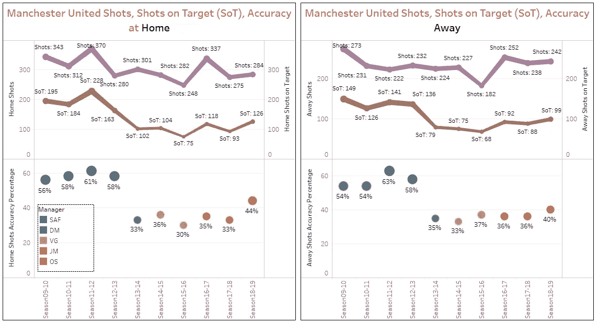
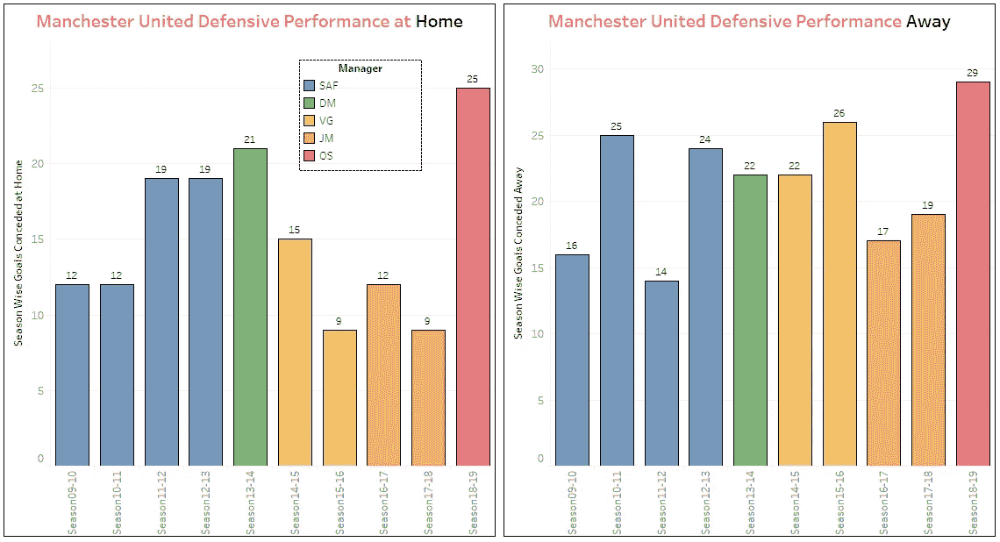
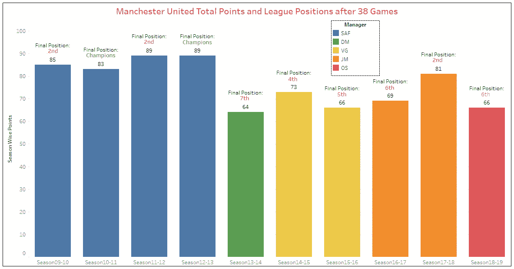
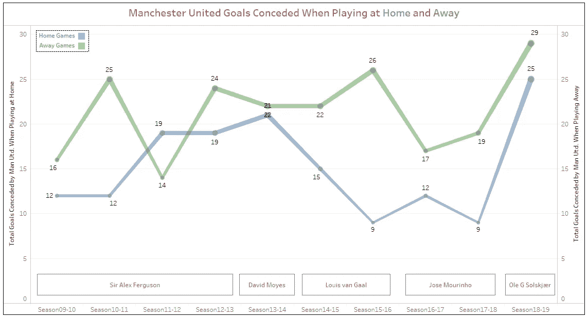

# 用 Python 分析英超数据及用 Tableau 可视化

> 原文：<https://towardsdatascience.com/analyzing-english-premier-league-data-with-python-and-visualization-using-tableau-21d343bc57dd?source=collection_archive---------17----------------------->


Photo by [Nathan Rogers](https://unsplash.com/es/@nathanjayrog?utm_source=medium&utm_medium=referral) on [Unsplash](https://unsplash.com?utm_source=medium&utm_medium=referral)

由 M.P.Karthick、 [Janmejay Singh](https://medium.com/@janmejay23) 和 [Pritam Kumar Patro](https://medium.com/@pritam.iifm) 出版

数据科学家和数据本身一样优秀。因此，为了获得可操作的见解，使用正确格式的数据集和正确的变量非常重要。体育分析是一个新兴领域，其中数据驱动的见解用于制定战略。在本教程中，我们将探索使用 Python 的数据分析和使用 Tableau 的可视化。我们将使用的 python 库是 pandas、os、glob 和 regex。

我们将使用的数据集是发布在 http://www.football-data.co.uk/[的英超联赛数据集。我们分析了从 2009 年 10 月到 2018 年 19 月的 10 个 EPL 赛季的数据。使用这些数据集将帮助我们学习数据整理和转换过程，这在 iris 和 mpg 等内置数据集上是不可能的。](http://www.football-data.co.uk/)

**提问:**

我们希望从数据集中了解并得出以下见解:

如何追加不同季节的数据，创建主数据集？

如何整理和转换主数据集？

曼联各个赛季的进攻表现如何？

曼联各个赛季的防守表现如何？

曼联在不同的主教练手下表现如何？

在穆里尼奥的领导下，曼联是一支防守型球队吗？

**加载库和模块:**

```
import pandas as pdimport osimport globimport re
```

[Pandas](https://pandas.pydata.org/) 是一个开源库，为 python 编程语言提供了易于使用的数据结构和数据分析工具。python 中的 **OS** 模块提供了与操作系统交互的功能。这个模块属于 python 的标准实用程序模块。该模块有助于提供一种使用操作系统相关功能的[便携方式](https://docs.python.org/2/library/os.html)。

**glob** 模块根据 UNIX shell 使用的规则找到所有与指定模式匹配的[路径名。但是，这些结果以任意顺序返回。正则表达式是构成搜索模式](https://docs.python.org/2/library/glob.html)的[字符序列。Python 通过库支持正则表达式。正则表达式模式通过 Python 中的 **re** 模块导入。RegEx 可用于检查字符串是否包含指定的搜索模式。](https://www.w3schools.com/python/python_regex.asp)

**数据整理和转换**

在将数据集导入 Python 环境之前，我们将确保 CSV 格式的 10 个季节的数据表位于运行 Python 程序的同一个文件夹中。

我们发现数据集中缺少我们分析所需的两个重要变量。我们需要“赛季”变量来产生赛季洞察力，需要“经理”变量来理解曼联在不同经理下的表现。我们从[英超](https://www.premierleague.com/)网站上获得了这 10 个赛季的主教练名单，数据集已经按赛季排列好了。因此，我们将把这两列添加到数据集中，稍后将它们追加到一个数据表中。

```
man=["SAF","SAF","SAF","SAF","DM","VG","VG","JM","JM","OS"]a=glob.glob("season*.csv")b=[]for i in a:c=re.search(r"\d{2,}",i).group()b.append(c)
```

**追加数据集:**

EPL 的数据集是季节性的。当我们对数据集进行初步观察时，我们没有发现任何缺失值。当我们跨赛季匹配变量时，从 2012-13 赛季开始出现了新的变量。我们只保留了我们在分析和可视化方面感兴趣的变量。

```
count=0for i,j,k in zip(a,b,man):dataL=pd.read_csv(i)dataL.insert(0,"season",j)dataL.insert(0,"manager",k)if count==0:data.to_csv("dataL.csv",mode="a",index=False)count=count+1else:dataL.to_csv("dataL.csv",mode="a",index=False,header=False)
```

使用上面的代码，我们在工作文件夹中得到一个名为 dataL.csv 的数据表，其中包含所有 10 个赛季，包括赛季和经理列。

由于我们只分析与曼联相关的数据，我们删除了所有与其他俱乐部相关的数据。因此，我们已经使用 python 成功地清理和转换了数据，现在可以进行可视化了。

```
dataMU1=pd.read_csv(“dataL.csv”)dataMU2=dataMU1.loc[(dataMU1[‘HomeTeam’] == ‘Man United’) | (dataMU1[‘AwayTeam’] == ‘Man United’)]dataMU2.to_csv(“finaldataManUtd.csv”)
```

**创建 Tableau 仪表板**

Tableau 是一个强大的数据可视化工具，有助于以仪表板和工作表的形式创建可视化效果。tableau 的好处是它有点击和拖动的选项，这使得编程技能较低的人可以制作出令人惊叹的可视化效果。我们开发的 tableau 仪表板非常具有交互性，让您挑选感兴趣的见解。我们只分析了数据集中的一些变量。还有更多变数，比如犯规次数，黄牌数量等等。如果你感兴趣的话，可以去探索一下。

 [## Tableau 公共

### 编辑描述

public.tableau.com](https://public.tableau.com/profile/pritam.kumar.patro#!/vizhome/ManUnitedComparison/Dashboard9) 

**对比曼联各个赛季的进攻表现**

很多参数可以用来评估一支球队的进攻表现。我们使用进球数(主客场)、总射门数和目标变量进行分析。当我们绘制跨赛季的进球时，我们可以看到，自从 2012-13 赛季结束弗格森爵士退役以来，曼联的进攻表现已经不一样了。弗格森爵士执教下(2009-10 赛季至 2012-13 赛季)的平均主场进球是 49.5 个，相比之下，范加尔和穆里尼奥分别为 34.0 和 32.0 个。类似的趋势也可以在客场进球中观察到。



投篮命中率(命中目标的投篮次数/总投篮次数)是决定一个队能否赢得比赛的重要因素之一。另一项[分析](https://bitterandblue.sbnation.com/2013/1/17/3880454/a-look-at-shots-on-target-epl)显示，与那些仅仅比对手创造更多投篮机会的球队相比，命中率更高的球队获胜的概率明显增加。我们的分析表明，自从弗格森爵士退役以来，曼联的射门准确率明显下降，从未越过 50%。



**对比曼联各个赛季的防守表现**

与进攻表现不同的是，防守表现对于不同主帅手下的曼联来说差别并不大。上赛季(2018–19)出现了近 10 个赛季以来最差的防守表现。



**曼联在不同主帅手下表现如何？**

毫无疑问，曼联在弗格森爵士手下的表现是最好的。比较整个赛季的联赛积分和联赛排名给了我们清晰的叙述。在弗格森爵士之后，下一个最佳教练是穆里尼奥，81 分，2017-18 赛季亚军。



**曼联在穆里尼奥手下是防守型球队吗？**

何塞·穆里尼奥的足球哲学与其他顶级教练不同。他的比赛风格已经被证明能够在对抗最好的球队时取得好成绩。但它也被认为是防御性的和无聊的。这篇博客还认为，随着职业生涯的发展，他变得更加具有防御性。如爆炸图所示。在穆里尼奥的带领下，曼联的防守表现比其他教练都要好。当我们比较进攻表现的时候，这和其他曼联经理类似，比如大卫·莫耶斯和路易斯·范加尔。



希望这能帮助你对你喜欢的体育相关数据进行基本的分析和可视化。Python 语法非常简明易懂。Tableau 是最好的用户友好的可视化工具之一。上面给出的所有可视化都可以用 python 来完成，但是我们想讨论一下这两个神奇的工具，并展示使用它们是多么容易！