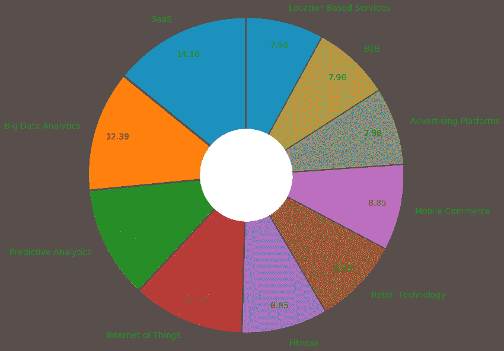

# 分析数据和人工智能初创公司的特征和全球分布

> 原文：<https://towardsdatascience.com/analyzing-global-distribution-of-data-science-and-ai-startups-through-angellist-database-30a89168a6b2?source=collection_archive---------24----------------------->


我喜欢初创公司，也喜欢人们可以做什么来让这个世界变得更好。而且，由于我在数据和人工智能领域工作，我对探索 AngelList 上的数据和人工智能初创公司更感兴趣。从 AngelList 收集数据并不简单，因为它不会让您一次导出超过 100 条记录。因此，我应用了多个过滤器，如 Type="Startup "，" Market="Big Data Analytics "，" Data Science "，" Big Data "，" Machine Learning，Predictive Modeling "，" Computer Vision "，" Natural language Processing "，" Neural Networks "，" Deep Learning "，" Reinforcement Learning "，然后排除了重复的过滤器，因为这些过滤器的结果在一些操作中有重叠。我 26 次得到不到 100 条记录，因此创建了 26 条。csv 文件。最后，我合并了这些。csv 文件合二为一。csv 文件，并随后在数据帧中添加了标题。

```
sed 1d companies*.csv > startup.csv
```

这是对初始数据集的一瞥。

```
df=pd.read_csv("startup.csv",names=["Name","Profile URL","Signal","Joined","Location","Market","Website","Employees","Stage","Total Raised"])
```


我对该数据集进行了处理，将“Joining”拆分为“Joining_Year”和“Joining_Month ”,并删除了“Joining ”,在 Year 前面附加了“20 ”,使用以下命令删除了重复的行。

```
df.drop_duplicates(keep=False,inplace=True)
df[['Joining_Month','Joining_Year']]=df.Joined.str.split("'",expand=True)
df.drop(['Joined'], axis=1, inplace=True)
df['Joining_Year'] = ('20' + df['Joining_Year'])
df.head()
```


使用 python 的计数器，我用下面的代码找出了 10 大创业市场。

```
from collections import Counter
c=Counter(df.Market)
histo=c.most_common(10)
freq={}
for item,count in histo:
    freq[item]=count
explode = (0.05,0.05,0.05,0.05,0.05,0.05,0.05,0.05,0.05,0.05)
plt.pie([float(v) for v in freq.values()], labels=[(k) for k in freq],
           autopct='%.2f',startangle=90, pctdistance=0.85, explode = explode,radius=3,textprops={'fontsize': 14})centre_circle = plt.Circle((0,0),0.90,fc='white')
fig = plt.gcf()
fig.gca().add_artist(centre_circle)
plt.tight_layout()
plt.show()
```



Top 10 Startup Markets in Data/AI. We see SaaS is the leader followed by ‘Big Data Analytics’, ‘Predictive Analytics’ and ‘IoT’.

类似地，我努力寻找这些创业公司的多种属性，你可以找到如下的环形图。


Distribution of number of employees across startups. ‘nan’ indicates that number was not specified in the AngelList database for these companies.


Top 10 cities across the world for DS/AI startups, note 7 are in the USA with the exception of Berlin and London. ‘nan’ indicates that city was not specified in the AngelList database for these companies.


Distribution of funds raised across the startups. ‘nan’ indicates that funds raised was not specified in the AngelList database for these companies.


Distribution of the stages of the startup. As we see majority are in ‘nan’ stage, this indicates that stage was not specified in the AngelList database for these companies. Amongst the valid stages, most startups are in seed stage, which makes sense, as initially startups struggle to get funded.

贴完这篇文章，我想到了在 2013 年之前和之后的时代描绘全球各地的创业公司。为此，我使用了以下代码。我从 IGIS 地图上下载了“continentsshp31.shp”。此外，为了在地图上绘制这个数据帧，我需要每个城市的经度和纬度，这是我使用 geopandas 计算的。

```
#install the following libraries# !pip3 install geopandas
# !pip3 install descartes
# !pip install geopyimport matplotlib.pyplot as plt
import geopandas
from geopy.geocoders import Nominatim
world = geopandas.read_file("continentsshp3147/continentsshp31.shp")
geolocator = Nominatim(user_agent="ds")# code to retrieve latitude and longitude
from geopy.extra.rate_limiter import RateLimiter# 1 - convenient function to delay between geocoding calls. I did this in groups of 100 as the service was getting timed out. Later, I combined all slices.geocode = RateLimiter(geolocator.geocode, min_delay_seconds=1)# 2- - create location column
df_100=df[:100]
df_100['location'] = df_100['Location'].apply(geocode)# 3 - create longitude, latitude, altitude from location column (returns tuple)
df_100['point'] = df_100['location'].apply(lambda loc: tuple(loc.point) if loc else None)# 4 - split point column into latitude, longitude and altitude columns
df_100[['latitude', 'longitude', 'altitude']] = pd.DataFrame(df_100['point'].tolist(), index=df_100.index)# combine the slices with latitude and longitude
df_new = pd.concat([ df_100,df_101_200,df_201_300,df_301_400,df_401_497])
df_new = df_new.sample(frac=1).reset_index(drop=True)
df_new.head()
```

产生的数据帧如下所示。


下一步是获取几何格式的数据。方法是将 Pandas 数据框架转换为 geo-data 框架，这需要原始数据框架、[坐标参考系统(CRS)](http://geopandas.org/projections.html) 和新数据框架的几何参数。为了适当地格式化几何图形，我们需要将经度和纬度转换成*点*(我们从上面的 shapely 中导入点)，所以让我们传递熊猫数据帧，并使用 *EPSG:4326* CRS 获得经度和纬度。

```
from shapely.geometry import Point, Polygon
crs={'init': 'epsg:4326'}
geometry=[Point(xy) for xy in zip(df_new["longitude"],df_new["latitude"])]geo_df=gpd.GeoDataFrame(df_new,crs=crs,geometry=geometry)
fig, ax = plt.subplots(figsize=(20, 20))
world.plot(ax=ax,alpha=0.4,color='grey')geo_df[(geo_df['Joining_Year']).astype(str).astype(int)>2013].plot(ax=ax,markersize=20,color='green',marker="o",label="2014-2018")geo_df[(geo_df['Joining_Year']).astype(str).astype(int)<=2013].plot(ax=ax,markersize=20,color='red',marker="^",label="2010-2013")plt.legend(prop={'size':15})plt.title("Global distribution of DS/AI Startups joining AngelList before and after 2013")
```

结果图如下所示。我们看到(如右边绿色部分)在 2014-2018 年间，很少有创业公司出现在非黄金创业区。此外，世界上大多数人看起来缺乏创业精神。创业文化主要集中在美国、英国和欧洲的一些地方。


我还绘制了另一个 geopandas 地图，以查看筹集资金的全球分布和密度。


从这个数据集中可以得出更多的见解。如果你对使用这个数据集感兴趣，我已经在 kaggle 链接上上传了这个([https://www . ka ggle . com/shilpbhattacharyya/data ai-startups-dataset-from-angellist](https://www.kaggle.com/shilpibhattacharyya/dataai-startups-dataset-from-angellist))——敬请访问。