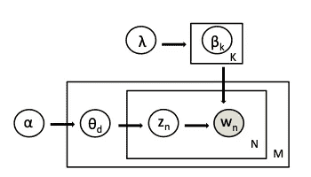
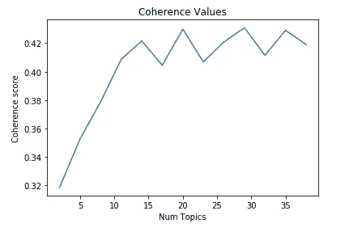
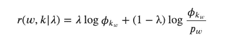
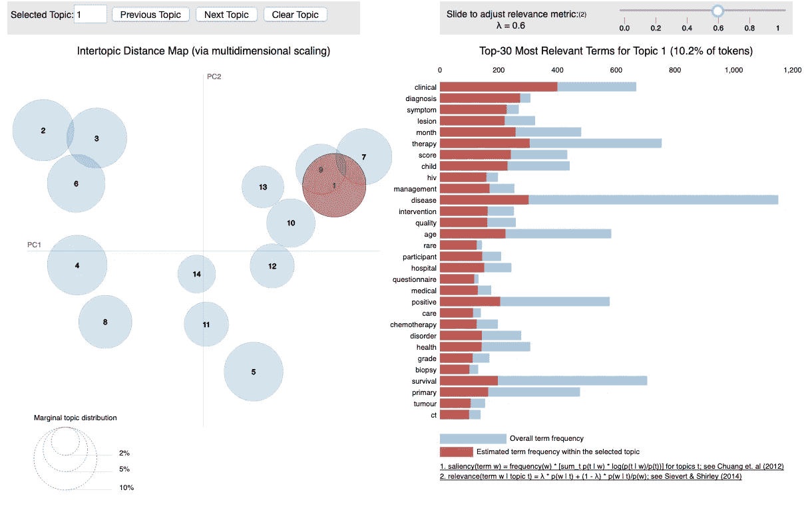
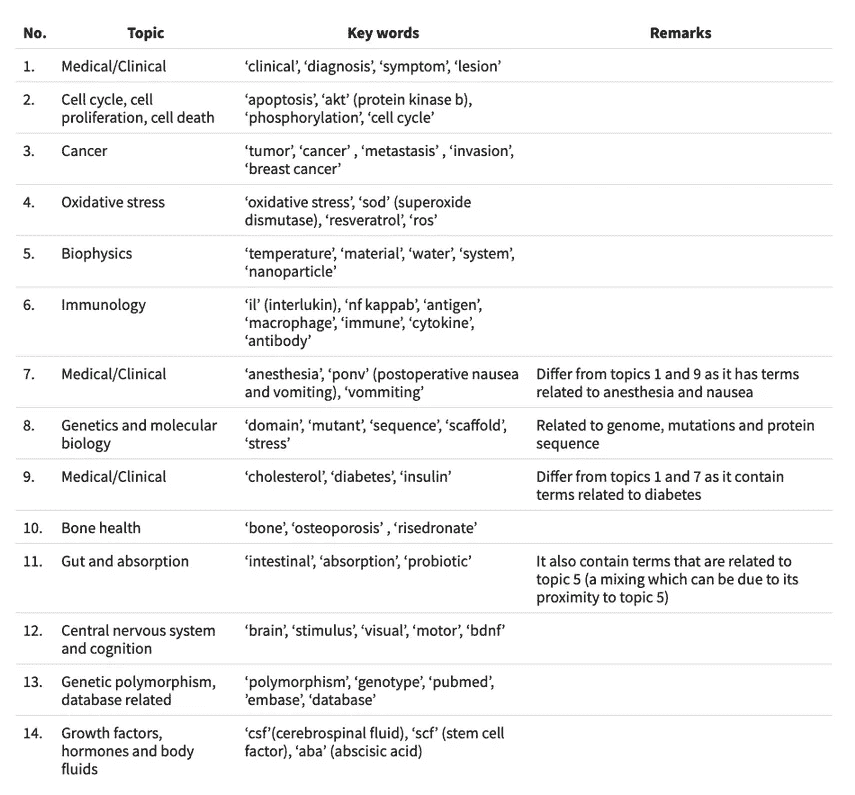

# 分析被撤回的生物医学文献中隐藏的主题

> 原文：<https://towardsdatascience.com/analyzing-hidden-themes-in-the-retracted-biomedical-literature-15314a150d9d?source=collection_archive---------30----------------------->

在我之前的[博客文章](/on-retractions-in-biomedical-literature-1565e773559e)中，我讨论了生物医学和生命科学文献中涉及撤稿的各种参与者。有一个问题引起了我的兴趣，但没有得到回答——这些被撤回的出版物中有哪些研究主题？在这篇博文中，我试图用主题建模来回答这个问题。

主题建模是从语料库或文档集中发现、组织和理解文本信息。这是一种无监督的学习方法，其中主题模型学习未标记文档中的主题。它基于这样的假设，即每个主题都由单词组组成，每个文档都是主题的集合。因此，语料库中潜在的或隐藏的主题可以通过收集频繁共现的词来发现。

有许多主题建模技术可用。这里，我使用了一种最流行的技术，潜在狄利克雷分配(LDA)。

LDA 是文档集合的生成概率模型。它基于狄利克雷分布，这是一种多项式分布的分布，并假设文档是潜在主题的概率分布，主题是单词的概率分布。LDA 回溯并发现构成语料库的不同主题以及每个主题在文档中出现的数量。

从数学上讲，这种生成过程可以解释如下:



这样的图表被称为图版符号。*由于媒介不允许下标，请遵循图表或提供的等式中的符号，或者在我的* [*网站*](https://bhumikabhatt.org/analyzing-hidden-themes-in-retracted-biomedical-literature.html#analyzing-hidden-themes-in-retracted-biomedical-literature) *上阅读这篇帖子。从具有参数λ的狄利克雷分布中，我们获得了主题𝑘∈1 的单词分布..𝐾，这代表了𝛽𝑘。这里，每个主题是一个𝑁-dimensional 向量(𝑁是词汇量的大小),根据𝛽.分布，它具有主题𝑘中每个单词的概率根据具有参数𝛼的第二狄利克雷分布，我们绘制了每个文档𝑑∈1 的主题分布..𝑀，这代表了𝜃𝑑.因此，对于每个文档，我们有一个𝐾-dimensional 向量，根据主题的分布，它具有每个主题的概率(𝐾是主题的数量)。为每个单词定位𝑛∈1..𝑁在文件中给来自𝜃.的𝑧𝑛画了一个题目然后，我们使用与主题赋值𝛽𝑧𝑛相对应的𝛽来生成单词。由于 LDA 知道这些词，它打算找到𝑧、𝛽和𝜃.*

简而言之，LDA 工作如下:首先，我们指定语料库中我们期望的主题𝐾的数量。然后 LDA 为每个文档中的每个单词随机分配主题。接下来，它查找语料库中的每个单词，并检查该特定主题在文档中出现了多少次，以及该特定单词在指定主题中出现了多少次。根据结果，它为这个特定的单词指定一个新的主题，这样反复下去，直到主题有意义为止。最终还是由用户来解读题目。

这篇博文将描述从我的撤稿文献语料库中提取潜在主题的以下步骤。

1.  数据预处理
2.  构建 LDA 模型
3.  形象化

正如我在之前的博客文章中提到的，这些数据是从 PubMed 获得的，包含 6485 篇被撤稿的出版物。对于当前的分析，我只使用了这些出版物的摘要。关键词可用于确定任何摘要的主题，但在可用的数据集中，84%的摘要没有关键词，这促使我从摘要中提取主题。

# **数据预处理:**

这一步涉及数据清理，在任何文本挖掘任务中都至关重要。我将此细分为 3 个步骤:

## 一.词汇化

这一部分涉及词性(POS)标记，以过滤名词、专有名词或形容词。我忽略了其他词类，如动词和副词，因为它们似乎对我当前的任务不重要。产生的单词然后被词条化，这意味着只有单词的词根形式被保留。我使用了非常棒的 Python 库 spaCy 来做这个处理。

```
*# load spacy and return english language object*
nlp**=**spacy**.**load('en_core_web_sm')

**def** **lemmatization**(doc, allowed_pos**=**['NOUN','ADJ','PROPN']):

    ``` filtering allowed POS tags and lemmatizing them```

    retracted_corpus**=**[]
    **for** text **in** doc:
        doc_new **=** nlp(text) 
        retracted_abstract**=**[]
        **for** token **in** doc_new:
            **if** token**.**pos_ **in** allowed_pos:
                retracted_abstract**.**append(token**.**lemma_)
        retracted_corpus**.**append(retracted_abstract)
    **return** retracted_corpus

abstract_lemmatized **=** lemmatization(doc,allowed_pos=['NOUN','ADJ','PROPN'])
```

这些是科学文档，有时仅用空格断句并不是最佳选择(例如，公式或等式可能使用=或+等其他字符)。因此，在一个额外的步骤中，我使用了一个不同的文本分割实现，它使用了 NLTK 的一些功能，NLTK 是另一个用于自然语言处理(NLP)的 Python 库。

```
**from** nltk.tokenize **import** RegexpTokenizer
*# tokenizer that splits only in the selected symbols or space*
tokenizer**=**RegexpTokenizer('\s+|[<>=()-/]|[±°å]',gaps**=**True)

**def** **remove_punctuation**(text):
    updated_abstract**=**[]
    **for** doc **in** text:
        sent**=**' '**.**join(doc)
        updated_abstract**.**append(tokenizer**.**tokenize(sent))
    **return**(updated_abstract)

abstract_processed **=** remove_punctuation(abstract_lemmatized)
```

## 二。删除停用词

在自然语言处理中，一个相当常规的任务是去除停用词，或者没有足够含义来区分一个文本和另一个文本的常用词，例如“a”、“the”、“for”等等。为此，我使用了 NLTK 的停用词库。它包含 179 个单词。因为在生命科学和生物医学研究语料库中有更多的词，如“证明”、“记录”、“研究者”等。，没有区分单词，我将额外的单词(我在当前语料库中找到的)添加到停用词表中，使其长度为 520 个单词。此外，在这一步，我把所有的字母都小写了，这是为了避免算法把“read”和“Read”当成两个不同的单词。

```
**def** **remove_stopwords**(doc):
    retracted_corpus**=**[]
    **for** text **in** doc:
        retracted_abstract**=**[]
        **for** word **in** text: 
            word**=**word**.**lower()
            **if** word **not** **in** nltk_stopwords:
                retracted_abstract**.**append(word)
        retracted_corpus**.**append(retracted_abstract)
    **return** retracted_corpus

abstract_no_stop **=** remove_stopwords(abstract_processed)
```

## 三。制作二元模型

生命科学文献经常包含诸如“细胞周期”和“蛋白磷酸酶”的二元模型。当单独考虑两个单词时，这些双字表达的意思并不明显。因此，我决定使用 python 库 Gensim 来收集二元模型，这是另一个用于自然语言处理的伟大的 python 库。该步骤提供二元模型和单元模型，其中二元模型是根据语料库中出现频率的特定条件来选择的。

```
*#using gensim to construct bigrams*
**from** gensim.models.phrases **import** Phrases, Phraser
bi_phrases**=**Phrases(abstract_processed, min_count**=**5, threshold**=**10)
bigram **=** Phraser(bi_phrases)

*#provides unigrams and bigrams*
**def** **dimers**(doc):
    updated_abstract**=**[]
    **for** text **in** doc:
        di **=** bigram[text]
        updated_abstract**.**append(di)
    **return** updated_abstract

abstract_bigram **=** dimers(abstract_no_stop)
```

在这之后，我删除了所有只有数字或者少于 2 个字符的内容。

```
**def** **abstract_bigram_clean**(doc):
    retracted_corpus**=**[]
    **for** text **in** doc:
        retracted_abstract**=**[]
        **for** word **in** text:
            **if** **not** word**.**isdigit() **and** len(word)**>**1:
                retracted_abstract**.**append(word)
        retracted_corpus**.**append(retracted_abstract)
    **return** retracted_corpus

abstract_clean **=** abstract_bigram_clean(abstract_bigram)
```

从这些处理步骤中，我获得了列表的列表，每个列表包含来自单个摘要的单词。为了说明语料库的复杂性，在语料库中有 35，155 个独特的单词，语料库本身包含 6，000 多个摘要。

# 构建 LDA 模型

在构建模型之前，我们需要将我们的语料库(所有文档)以矩阵形式呈现。为此，我准备了一本字典，其中每个独特的单词都被分配了一个索引，然后用它来制作一个文档术语矩阵，也称为单词袋(BoW)。我使用 Gensim 来执行所有这些任务。此外，有 11，998 个单词只出现一次。我删除了它们，因为它们不表示模型将检测到的任何模式。此外，在超过 20%的文档中出现的任何单词都被删除，因为它们似乎不局限于少数主题。

```
*# create a dictionary* 
**from** gensim.corpora **import** Dictionary
dictionary **=** Dictionary(abstract_clean)
dictionary**.**filter_extremes(no_below**=**2, no_above**=**0.2)

*# convert the dictionary into the bag-of-words (BoW)/document term matrix*
corpus **=** [dictionary**.**doc2bow(text) **for** text **in** abstract_clean]
```

为了构建 LDA 模型，我们需要提供语料库中我们期望的主题数量。这可能很棘手，需要多次反复试验，因为我们不知道有多少主题。估计这个数字的一种方法是通过计算一致性度量，这是一种对主题模型计算的主题质量进行评级的分数，从而区分好的主题模型和坏的主题模型。

相干性度量按以下四个步骤计算:

*   分割——其中单词集 *t* 可以被分割成单词子集 *S*
*   概率计算——其中基于参考语料库计算单词概率 *P*
*   确认措施—确认措施使用两组 *S* 和 *P* 来计算成对 *S* 的协议𝜙
*   汇总—最后，所有确认汇总成一个一致性值 *c* 。

为了找到语料库中主题的最佳数量，可以用不同数量的主题建立多个 LDA 模型。从这些模型中，人们可以选择具有最大分数的主题值，并结束一致性值的快速增长。进一步增加主题的数量可能会导致许多关键字出现在不同的主题中。Gensim 库提供了一致性度量的实现。

```
*# instantiating an lda model*
LDA **=** gensim**.**models**.**ldamodel**.**LdaModel 

*#computing coherence for different LDA models containing different number of topics* 
**def** **calculate_coherence**(dictionary, corpus, texts, start, stop, step):
    coherence_scores**=**[]
    **for** num_topics **in** range(start,stop,step):
        model**=**LDA(corpus**=**corpus, id2word**=**dictionary,    num_topics**=**num_topics)
        coherence_lda**=**CoherenceModel(model**=**model, texts**=**texts, dictionary**=**dictionary, coherence**=**'c_v')
        coherence**=**coherence_lda**.**get_coherence()
        coherence_scores**.**append(coherence)
    **return** coherence_scores

coherence_scores **=** calculate_coherence(dictionary**=**dictionary, corpus**=**corpus, texts**=**abstract_clean, start**=**2, stop**=**40, step**=**3)
```

在相干值图中，我们可以观察到高度几乎相同的多个峰。第一个高峰出现在 14 点。



我决定用 14 个主题建立我的 LDA 模型。

```
lda_model_abstract **=** LDA(corpus**=**corpus,id2word**=**dictionary, num_topics**=**14, random_state**=**10,chunksize**=**6485,passes**=**100)
```

# 形象化

这是阅读和理解从 LDA 和 pyLDAvis 那里获得的主题的关键一步。pyLDAvis 是用于主题的交互式可视化的 python 包。它源自 LDAvis，LDAvis 是一个基于 web 的可视化工具，用于使用 LDA 估计的主题。

pyLDAvis 提供了两个可视化面板:左边的面板以二维圆圈的形式显示主题。通过计算主题间的距离来确定圆圈的中心，然后使用多维标度将它们投影到二维上。因此，密切相关的主题更接近。此外，圆圈区域代表主题的总体流行程度。因此，圆圈越大，语料库中的主题越普遍。右侧面板显示了左侧面板中所选主题的关键术语的条形图。重叠的条形用红色表示各种术语的特定主题频率，用灰色表示语料库范围内的频率。因此，右边的面板帮助我们找到主题的含义。两个面板的链接方式是，在左侧面板中选择一个主题会在右侧面板中显示其重要术语。此外，选择右侧面板上的术语时，会显示其在所有主题中的条件分布。pyLDAvis 中一件有趣的事情是它在一个叫做相关性的主题中对术语进行排序的方法。相关性是一个词的概率及其提升的对数的加权平均值。提升被定义为术语在主题中的概率与其在语料库中的边际概率的比率。带有权重参数 *λ* 的术语 *w* 与主题 *k* 的相关性可以数学定义为:



其中𝜙𝑘𝑤是𝑤∈1 项的概率..𝑉代表话题𝑘∈1..𝐾，其中𝑉是语料库的词汇中的术语数量；𝑝𝑤是语料库中术语𝑤的边际概率。𝜆介于 0 和 1 之间。它决定了相对于与𝑤.相关联的提升，给予主题𝑘中的术语𝑤的概率的权重当𝜆=1 出现时，术语按照其主题特定概率的降序排列。当𝜆=0 时，术语根据它们的寿命排列在一个主题中。pyLDAvis 提供了一个用户界面来调整𝜆.对于解释主题，我保留了𝜆=0.6，这也是从用户研究中获得的最优值。

您可以在下面查看当前分析的可视化效果。请查看我的[博客](https://bhumikabhatt.org/analyzing-hidden-themes-in-retracted-biomedical-literature.html#analyzing-hidden-themes-in-retracted-biomedical-literature)来看看和玩互动可视化。



获得了以下主题(按其流行程度降序排列):



# 结论:

首先，使用 LDA 的主题建模显示了主题 1-9 和 12 的主题特定术语的良好解析/分离，除了主题 5，我发现主题解释相当容易。但是对于其他主题的解释是困难的，因为许多不相关的术语出现在一个主题中，这表明主题模型在语料库中拾取了噪声或特殊的相关性。选择更多的主题并没有给主题解释带来任何改进。重要的是，由于语料库不大(只有大约 6000 篇文章)，只包含摘要(短文本)和 23，157 个词汇，这可能是为什么在某些情况下主题模型会产生噪音的原因。

第二，主题 1 至 7 显示了相似的主题流行度，范围从 10.2%到 7.9%的令牌。因此，表明这些主题中的大部分在收回文献的语料库中是同等重要或普遍的。

总之，尽管数据集很小，但 LDA 可以在收回的文献中找到 14 个主题，主要包括医学、细胞周期和增殖、癌症、免疫学、氧化应激、遗传学、中枢神经系统和认知。可以说 LDA 是一个非常强大的工具，它提供了一种简单快速的方法来探索语料库中的模式或主题。

这个分析的源代码可以在我的 [Github](https://github.com/bbhatt001/Topic-model) 存储库中找到。这篇文章最初发表在我的[博客](https://bhumikabhatt.org/analyzing-hidden-themes-in-retracted-biomedical-literature.html#analyzing-hidden-themes-in-retracted-biomedical-literature)。请随意参观。

1.  布雷博士、Ng 博士和乔丹博士，2003 年。潜在狄利克雷分配。机器学习研究杂志，第 3 期(一月)，第 993–1022 页。
2.  罗德，m .，两者，a .和欣内堡，a .，2015 年 2 月。探索话题连贯性测量的空间。《第八届 ACM 网络搜索和数据挖掘国际会议论文集》(第 399-408 页)。ACM。
3.  西沃特和雪莉，2014 年。LDAvis:一种可视化和解释主题的方法。交互式语言学习、可视化和界面研讨会论文集(第 63-70 页)。