# 使用亚马逊转录和理解分析历史演讲

> 原文：<https://towardsdatascience.com/analyzing-historical-speeches-using-amazon-transcribe-and-comprehend-636f39a0726a?source=collection_archive---------22----------------------->

## 使用 Python 和 AWS 服务的快速简单的 NLP 教程

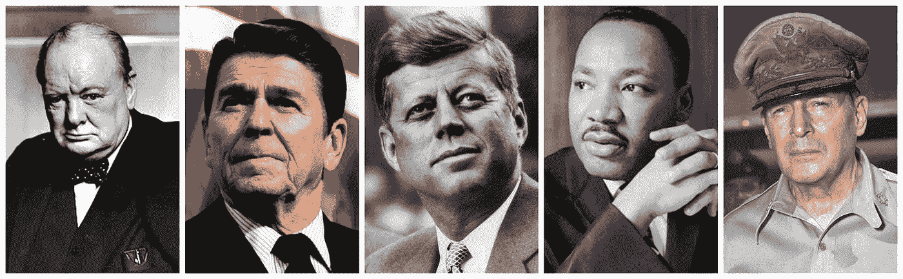

FIgure 1\. From left to right: Winston Churchill, Ronald Reagan, John F. Kennedy, Martin Luther King and General Douglas MacArthur.

# 1.介绍

半个多世纪前，试图让计算机理解我们的语言是人工智能(AI)研究人员面临的首批挑战之一。最近几年，它在一个被广泛称为自然语言处理(NLP)的领域里大受欢迎。翻译、语音识别、boots 和许多其他工具和应用程序是我们生活的一部分，并且以某种方式利用了与 NLP 相关的某种算法或模型。如果你正在做一个软件项目，你可能需要使用工具来处理 NLP。学习基本理论和如何使用传统库需要时间，所以我们在这里介绍一种使用 AWS 提供的服务分析音频文件的简单方法。

## **目标:**

本文的目标是使用 Python 和 boto3 展示两个 AWS NLP 工具，Amazon transcriptor 和 Amazon understand。我们将使用 Youtube-dl 从 Youtube 下载一些历史演讲，将其转录为文本并进行情感分析。我们还将音频转录与原始转录进行比较，以评估亚马逊转录所用模型的相似性和一致性。

# 2.选择演讲

我们将使用从 Youtube 上下载的五篇历史演讲来说明上述工具的潜力。你可以在这篇由 Brett & Kate McKay 发表的关于男子气概艺术的[文章中找到历史和演讲的原始转录。选定的演讲如下:](https://www.artofmanliness.com/articles/the-35-greatest-speeches-in-history/)

## **A)** [**温斯顿·丘吉尔《我们将在沙滩上战斗》**](https://www.youtube.com/watch?v=s_LncVnecLA) **:**

1940 年 7 月 4 日，温斯顿·丘吉尔去下议院发表了历史上最勇敢也是最重要的演讲之一。德国军队迅速征服了欧洲，法国已经落入希特勒的控制之下，英国军队不得不从敦刻尔克战役中撤退。通过这次演讲，丘吉尔号召英国人民放弃一切投降的机会，抗击纳粹的威胁，成为第二次世界大战历史的转折点。

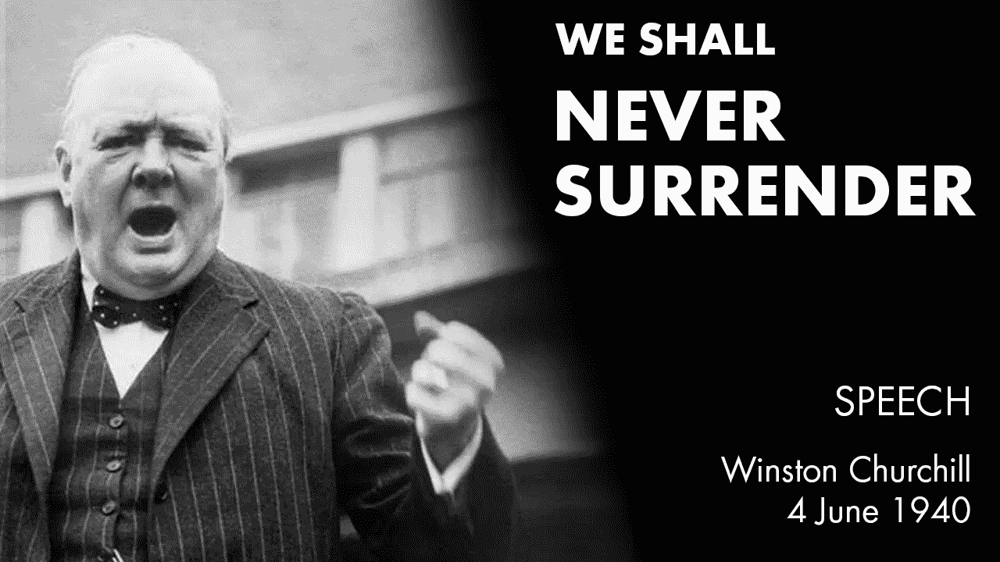

Figure 2\. Winston Churchill ““We Shall Fight on the Beaches”

## **B)** [**罗纳德·里根，《在勃兰登堡门的演讲》**](https://www.youtube.com/watch?v=5MDFX-dNtsM&t=6s) **:**

1987 年 6 月 12 日，美国前总统罗纳德·里根在勃兰登堡门前与苏联领导人米哈伊尔·戈尔巴乔夫并肩呼吁结束冷战，向世界展示了他的领导力和自由。

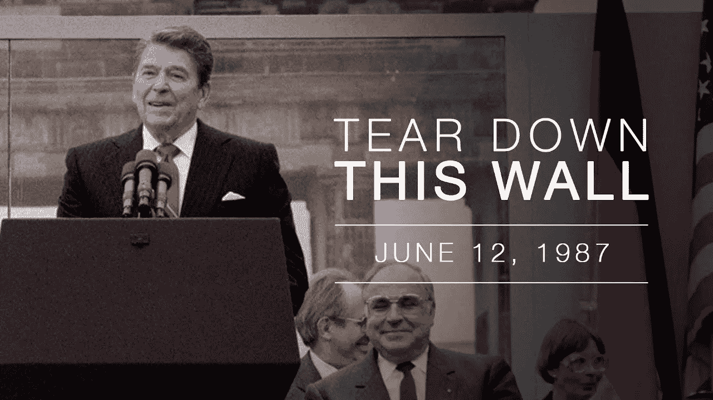

Figure 3\. Ronald Reagan, “Remarks at the Brandenburg Gate”

## **C)** [**马丁·路德·金《我有一个梦想》**](https://www.youtube.com/watch?v=I47Y6VHc3Ms) **:**

马丁·路德·金部长是美国五六十年代民权运动的主要领导人。在 1963 年的华盛顿游行中，他发表了著名的“我有一个梦想”的演讲，呼吁白人和黑人之间的和平与尊重。

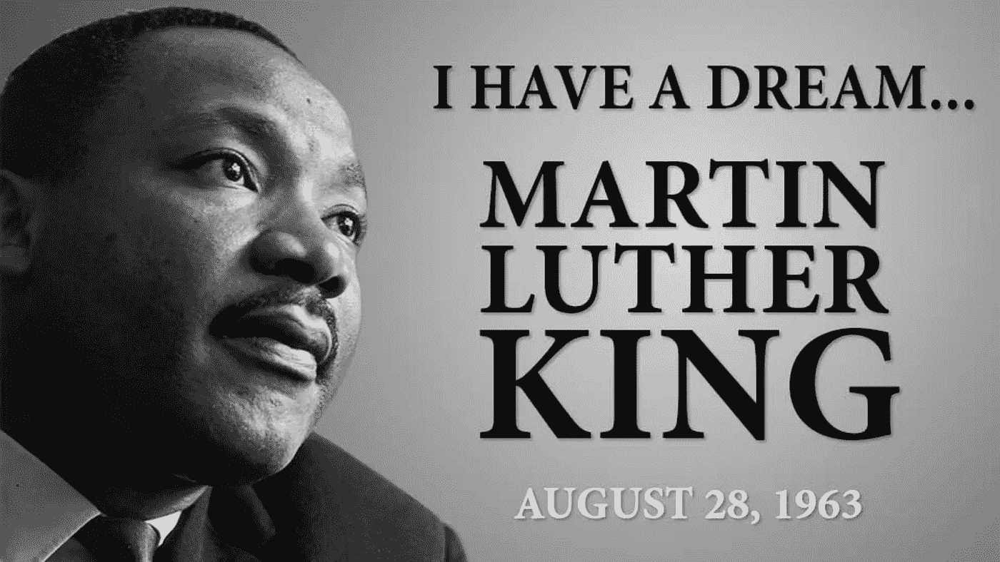

Figure 4\. Martin Luther King Jr., “I Have a Dream”.

## **D)** [**道格拉斯·麦克阿瑟将军，“职责、荣誉、国家”**](https://www.youtube.com/watch?v=_42_aLGkRpg&t=19s) **:**

历史上很少有美国人能在军事生涯成就方面接近道格拉斯·麦克阿瑟将军。他参加过三次战争，体现了军事领袖的责任和荣誉。他在西点军校的最后演讲是一首爱国主义颂歌，是对为自由而牺牲的士兵的敬意。

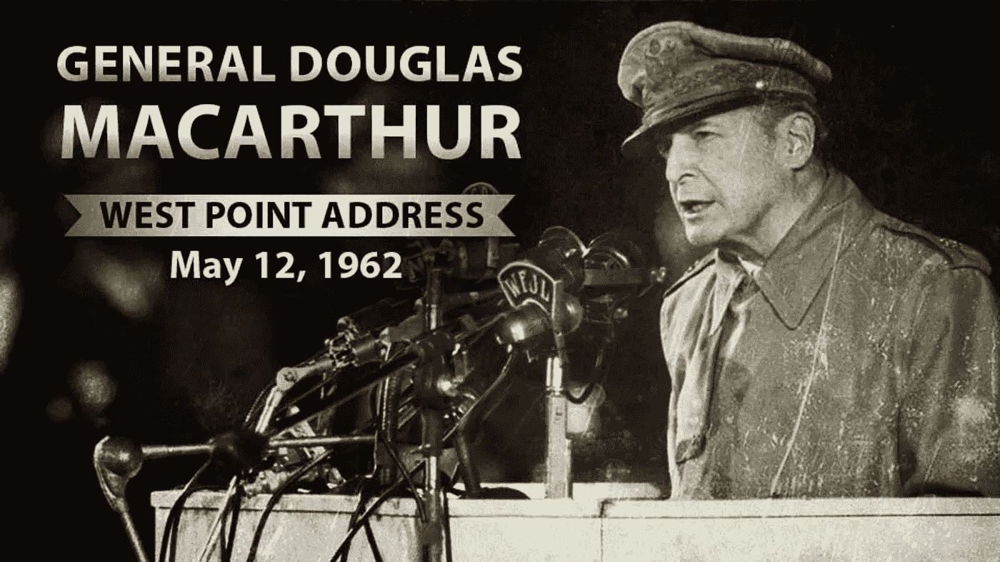

Figure 5\. General Douglas MacArthur, “Duty, Honor, Country”.

## **E)** [**约翰·肯尼迪《登月决定》**](https://www.youtube.com/watch?v=QAmHcdwKgtQ) **:**

美国前总统约翰·肯尼迪是现代史上最伟大的演说家之一，1961 年 5 月 25 日在休斯顿的一次活动中，他向全国和全世界传达了美国和人类登月的目标。在我们的历史上，很少有项目像太空竞赛和登月这样对科学和现代社会产生如此大的影响。

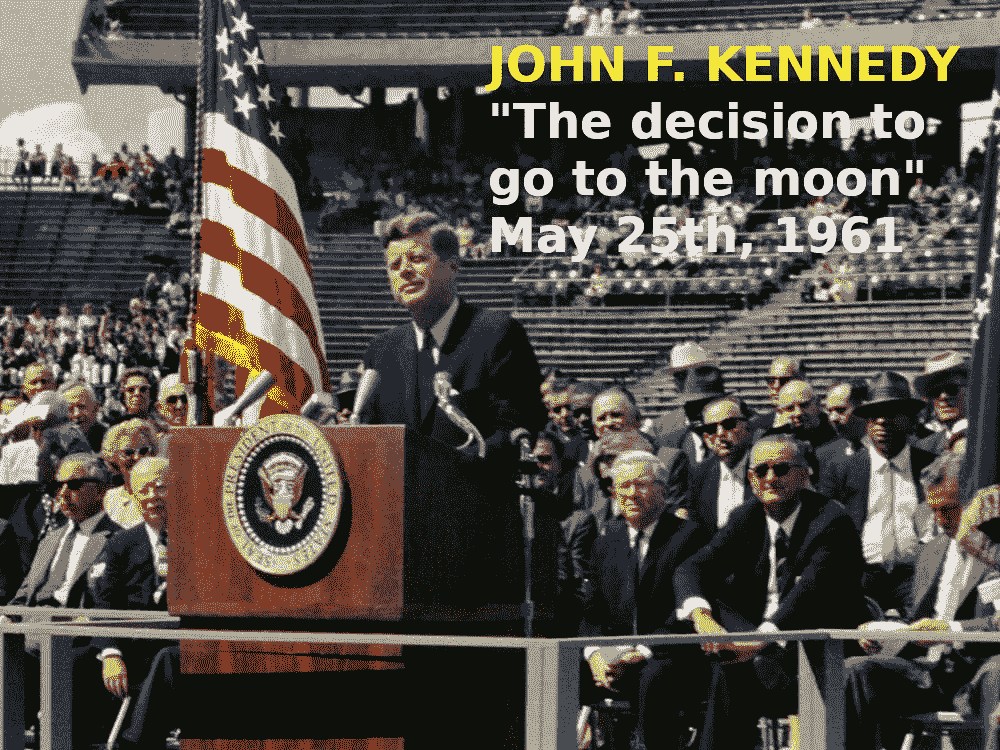

Figure 6\. John F. Kennedy, “The Decision to Go to the Moon”.

# 3.分析的要求和工具

要遵循本教程，您需要以下内容:

a)安装了以下库的 python 3:[boto 3](https://pypi.org/project/boto3/)、 [pandas](https://pypi.org/project/pandas/) 、 [matplotlib](https://pypi.org/project/matplotlib/) 、 [seaborn](https://pypi.org/project/seaborn/) 、 [spacy](https://pypi.org/project/spacy/) 和 [wmd](https://pypi.org/project/wmd/) 。

AWS 上的活跃账户；

c)安装并配置好 AWS 命令行界面([**)AWS CLI**](https://docs.aws.amazon.com/cli/latest/userguide/cli-chap-install.html))；

d)[**Youtube-DL**](https://github.com/ytdl-org/youtube-dl)**安装。**

## ****重要提示****

**为了增加这篇文章的可读性和理解性，我决定只展示分析中最重要的代码块，但是你可以在我的[**GitHub**](https://github.com/GabrielSGoncalves/nlp_aws)**r[epository](https://github.com/GabrielSGoncalves/nlp_aws)上的 [Jupyter 笔记本](https://github.com/GabrielSGoncalves/nlp_aws/blob/master/NLP_with_AWS_services.ipynb)上找到所有细节，包括完成这些情节的代码。****

## ****Youtube-DL****

****为了从 Youtube 下载音频文件，我们将使用一个名为[**Youtube-**](https://github.com/ytdl-org/youtube-dl)**DL**的命令行工具。安装之后，你可以在终端上输入下面描述的命令，并输入任何 Youtube 视频的 URL 来下载它。Youtube-DL 是用 Python 开发的，GitHub 上的社区正在积极开发。****

```
**# To download the video file to your local folder **youtube-dl <youtube_video_url>**# To download the audio file in mp3
**youtube-dl -x --audio-format "mp3" <youtube_video_url>`****
```

## ****boto3 和 AWS 服务****

****Boto3 是 AWS 为用户访问其服务而开发的 Python SDK。它调用 AWS API，有两种类型的服务访问:**客户端**和**资源**。客户端是低级服务访问，响应是 JSON 格式(Python 字典)。资源是以面向对象的方式构造的高级服务访问。基本上，您可以使用两种类型的服务访问中的任何一种，而与您需要在 AWS 上执行的任务无关，但是一般来说，可以使用较少的代码行来使用 Resource。有关 boto3 的更多信息，请查看 [Ralu Bolovan 的精彩文章](https://realpython.com/python-boto3-aws-s3/)。我们将在 Jupyter 笔记本上使用 Python 进行所有的分析，boto3 对于工作流来说是必不可少的。****

## ****亚马逊转录****

****为了将我们的音频转换成文本，我们将使用[亚马逊转录](https://aws.amazon.com/transcribe/?nc1=h_ls)，这是一项 AWS 服务，为位于 S3 桶上的音频文件提供自动语音识别。它支持 9 种不同的语言和一些变体:美国英语、英国英语、澳大利亚英语、法语、加拿大法语、美国西班牙语、es 西班牙语、意大利语、巴西葡萄牙语、德语、韩语、印地语、印度口音英语和现代标准阿拉伯语。Amazon transcribe 接受 4 种格式的文件(mp3、mp4、wav 和 flac ),并能够识别音频中的多个扬声器，为每个扬声器返回相应的转录。如果您在 S3 存储桶上有一个音频文件，您可以简单地使用它的 URL 在 AWS 转录控制台上创建一个转录作业。但是当我们用 Python 进行分析时，我们将使用 boto3 调用 AWS API 来调用转录作业。****

## ****亚马逊理解****

****[亚马逊理解](https://aws.amazon.com/comprehend/?nc1=h_ls)是在 AWS ML/AI 套件上找到的服务，它为你提供了各种各样的功能，让你从你的文本中获得洞察力，像情感分析、标记化和实体识别以及文档分类。我们将使用这一工具对我们的文稿进行情感分析，试图捕捉在上述每一篇演讲中发现的全球信息。****

## ****空间****

****[Spacy](https://spacy.io/) 是一个 Python 的 NLP 库，提供了一组已经为 9 种不同语言训练好的模型。它建立在 Cython 的基础上，可以轻松地与其他机器和深度学习库集成，如 TensorFlow，PyTorch，scikit-learn 和 Gensim，所以它真的很高效，很容易使用。Spacy 被不同的[公司和项目](https://spacy.io/universe)广泛使用，并在全球拥有越来越多的用户。****

# ****4.执行分析****

## ****从 Youtube 下载视频****

****我们分析的第一步是从 Youtube 下载引言中提到的五个演讲的音频文件。为了组织我们的分析并使其可重复，我们将创建一个 Pandas 数据框架来存储分析过程中生成的数据。****

****首先，我们创建了一个字典，将每个发言者的名字作为关键字，将各自的 Youtube URLs video 作为值 **(1)** 。接下来，我们遍历这些值并执行 **youtube-dl** 命令，使用 *os.system* 将每个文件下载到我们的本地文件夹 **(2)** 。在步骤 **(3)** 中，我们从字典中创建 Dataframe，并用每个下载文件的名称创建一个新列 **(4)** 。****

## ****亚马逊转录音频转录****

****现在我们已经有了用于分析的音频文件，我们只需要把它上传到一个 S3 桶中，然后转录成文本。在步骤 **(5)** 中，我们使用 boto3 创建了一个新的 S3 桶，并将音频文件上传到其中 **(6)** 。为了启动自动语音识别，我们需要位于新 S3 存储桶上的每个文件的路径。因此，通过使用 S3 路径约定，我们为每个文件定义了路径，并将其保存到我们的数据帧 **(7)** 。在步骤 **(8)** 中，我们创建了一个名为 *start_transcription* 的函数来使用 boto3 调用 AWS API，并为每个语音迭代调用它 **(9)** 。我们还在函数 *start_transcription* 上定义了将结果作为 JSON 文件输出到我们的 S3 桶上。****

## ******使用 spaCy 将音频转录与原文进行比较******

****当亚马逊转录工作完成后，你可以通过读取保存在 S3 桶 **(10)** 上的 JSON 文件来访问结果。为了评估 Amazon Transcribe 生成的转录的质量，我们将使用存储在 JSON 文件 **(11)** 中的原始文本。最初的文字记录是从[男子气概的艺术](https://www.artofmanliness.com/articles/the-35-greatest-speeches-in-history/)文章上提供的链接复制的，新的行字符被删除。原始文本的一些部分被删除，以与音频内容完全匹配，因为一些部分不是完整的语音。在进行任何文本比较之前，我们将删除停用词、标点符号、代词，并对标记进行词条化 **(12)** 。为了建立文本之间的相似性，我们将使用[空间方法](https://spacy.io/usage/vectors-similarity)进行语义相似性 **(13)** 。这不是文本的字面比较，因为它是基于 [Word2vec](https://en.wikipedia.org/wiki/Word2vec) 的，这意味着我们在比较每个单词在整个句子/文本中的百分比。****

****单词向量相似性的结果绘制在图 7 中。我们可以看到，根据这一指标，我们可以说亚马逊转录在将音频转录为文本方面做得很好，因为所有转录与原始转录的相似度超过 99%。****

****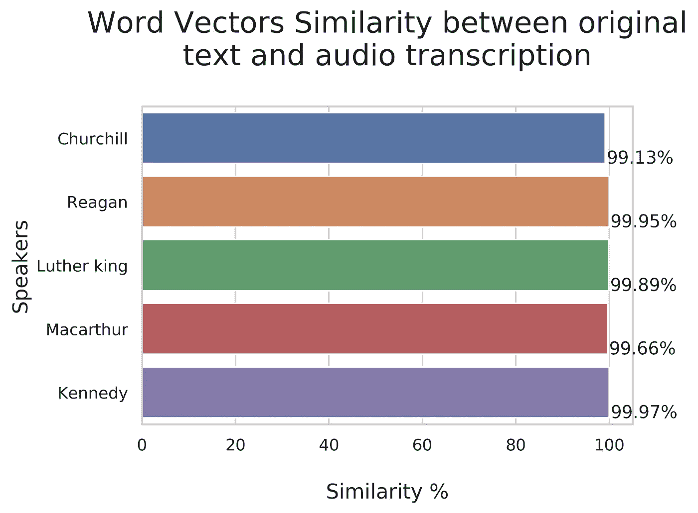****

****Figure 7\. Word Vectors similarity for the speeches.****

****由于词向量的相似性是基于文本上每个词的表示，所以它会给我们一种两个文本相似的错觉。为了更好地衡量文本差异，我们将使用[单词移动距离](https://spacy.io/universe/project/wmd-relax)来比较原始转录和使用 Amazon Transcribe 生成的转录。为了估计这个距离，我们需要库 [wmd](https://github.com/src-d/wmd-relax) ，它可以与空间 **(14)** 集成。有关评估文本相似性的更多信息，请看看阿德里安·锡格河的[伟大的文章](https://medium.com/u/78c2edcb86f7?source=post_page-----636f39a0726a--------------------------------)。****

****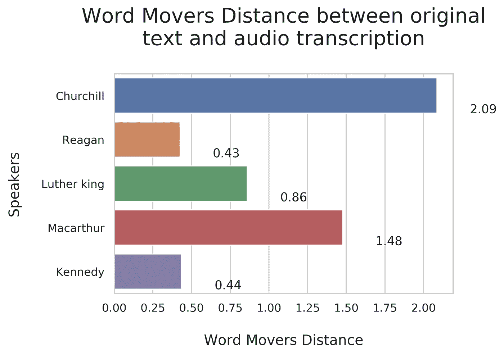****

****Figure 8\. Word Movers Distance for each analyzed speech.****

****正如我们在图 8 中看到的，有一些转录显示原始和音频转录之间的距离更大，丘吉尔和麦克阿瑟的演讲是最明显的。****

****为了将原始抄本的结构与 Amazon Transcribe 生成的结构进行比较，我们将使用名为 [displacy](https://spacy.io/usage/visualizers) **(15)** 的 spaCy 可视化工具进行实体识别。****

****Displacy 提供了单词及其各自类别的可视化标识，使得比较文本的结构更加容易(图 9)。****

****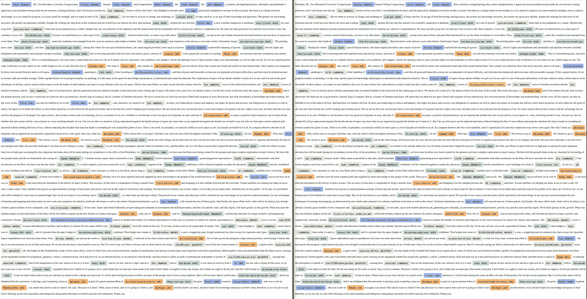****

****Figure 9\. SpaCy entity recognition visualizer. On the left Kennedy’s original transcription, and on the right the one generated using Amazon Transcribe.****

****通过查看 displacy 创建的可视化效果，我们发现了一些不一致之处，尤其是在丘吉尔和麦克阿瑟演讲的音频转录上。似乎音频的质量和演讲者的措辞对转录的质量有影响。当我们听里根和肯尼迪的演讲时，我们可以注意到音频的质量更高，文字更清晰，因此原始和自动转录之间的 WMD 更小，这意味着亚马逊转录模型可以显示更好的性能。****

## ****使用亚马逊理解进行情感分析****

****在我们分析的最后一部分，我们将使用 Amazon understand 对演讲进行情感分析。如前所述，AWS 提供了一个预先训练的模型，您可以使用它来返回 4 种不同情绪的百分比:积极、消极、混合或中性。为了执行情感分析，我们只需要提供字符串形式的文本和语言。Amazon understand 强加的一个[限制是可以分析到 5000 字节的文本大小(翻译成包含 5000 个字符的字符串)。由于我们要处理大于这个限制的文本副本，我们创建了 start _ intensive _ job 函数，该函数将输入文本分割成更小的块，并使用 boto3 为每个独立的部分调用情感分析。然后将结果汇总并作为字典返回 **(16)** 。因此，我们在每个扬声器的音频转录上使用了这个功能，并保存在我们的数据帧上以供进一步分析 **(17)。**](https://docs.aws.amazon.com/pt_br/comprehend/latest/dg/guidelines-and-limits.html)****

****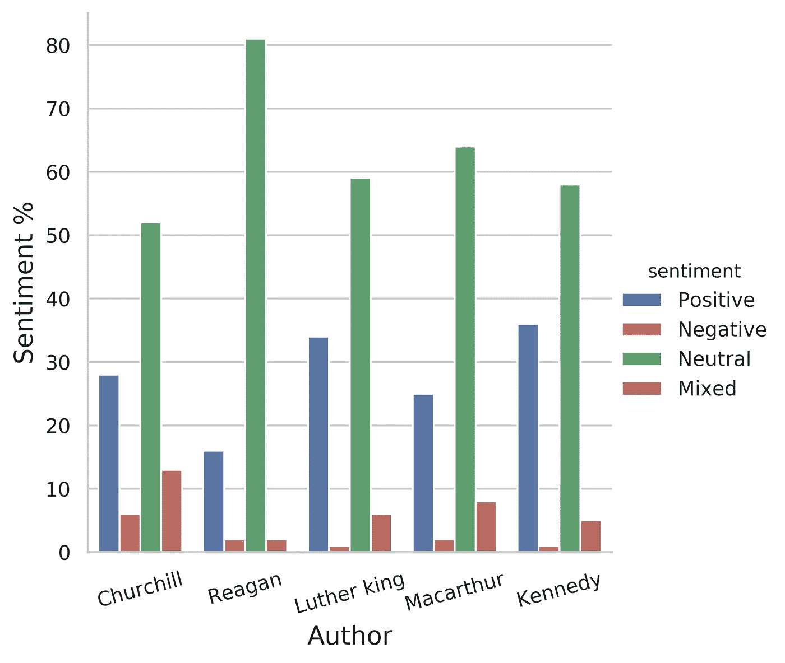****

****Figure 10\. Barplot for Sentiment Analysis for each historical speech.****

****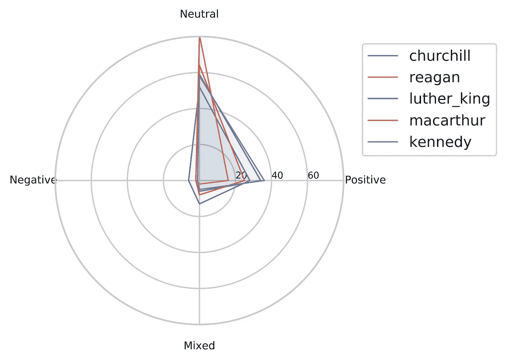****

****Figure 11\. Radarplot for Sentiment Analysis for each historical speech.****

****图 10(柱状图)和 11(雷达图)显示了对每个所选语音的情感分析结果。似乎中性句子在所有演讲中是最普遍的，其次是肯定、混合和否定。丘吉尔的演讲似乎是负面百分比最高的一个，而肯尼迪的演讲是最正面的。****

# ****5.结论****

****AWS 提供了一组 ML/AI 工具，使用 boto3 进行 API 调用可以轻松访问和集成这些工具。****

****当音频质量良好时，亚马逊转录似乎是一致的，如里根和肯尼迪的演讲，但当音频不清晰时，表现往往不好，如丘吉尔的演讲。****

****Amazon understand 提供了一种从文本中提取情感的简单方法，如果能看到它与其他 NLP 工具和其他模型相比的结果，那就太好了。****

# ****非常感谢你阅读我的文章！****

*   ****你可以在我的[个人资料页面](https://medium.com/@gabrielsgoncalves) **找到我的其他文章🔬******
*   ****如果你喜欢并且**想成为中级会员**，你可以使用我的 [**推荐链接**](https://medium.com/@gabrielsgoncalves/membership) 来支持我👍****

# ****更多资源****

****[](https://medium.com/datadriveninvestor/the-brief-history-of-nlp-c90f331b6ad7) [## 自然语言处理的简史

### 在这篇文章中，我们将了解一个非常有趣的研究领域，叫做自然语言处理…

medium.com](https://medium.com/datadriveninvestor/the-brief-history-of-nlp-c90f331b6ad7) [](https://www.artofmanliness.com/articles/the-35-greatest-speeches-in-history/) [## 历史上最伟大的 35 次演讲|男子气概的艺术

### 这些著名的演讲在黑暗时期振奋人心，在绝望中给人希望，精炼人的性格，激励勇敢的人…

www.artofmanliness.com](https://www.artofmanliness.com/articles/the-35-greatest-speeches-in-history/) [](https://realpython.com/python-boto3-aws-s3/) [## Python、Boto3 和 AWS S3:揭秘——真正的 Python

### 亚马逊网络服务(AWS)已经成为云计算的领导者。其核心组件之一是 S3，即对象存储…

realpython.com](https://realpython.com/python-boto3-aws-s3/) [](/a-short-introduction-to-nlp-in-python-with-spacy-d0aa819af3ad) [## Python 中的自然语言处理简介

### 自然语言处理(NLP)是数据科学最有趣的子领域之一，数据科学家是…

towardsdatascience.com](/a-short-introduction-to-nlp-in-python-with-spacy-d0aa819af3ad) [](/word-distance-between-word-embeddings-cc3e9cf1d632) [## 单词嵌入之间的单词距离

### 单词移动距离(WMD)被提出用于测量两个文档(或句子)之间的距离。它利用了 Word…

towardsdatascience.com](/word-distance-between-word-embeddings-cc3e9cf1d632) [](https://medium.com/@adriensieg/text-similarities-da019229c894) [## 文本相似度:估计两个文本之间的相似程度

### 读者注意:Python 代码在最后是共享的

medium.com](https://medium.com/@adriensieg/text-similarities-da019229c894)****