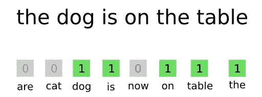

# 分析贾斯廷·特鲁多的演讲

> 原文：<https://towardsdatascience.com/analyzing-justin-trudeaus-speeches-3ba2690ad57a?source=collection_archive---------22----------------------->


Photo by [sebastiaan stam](https://unsplash.com/@sebastiaanstam?utm_source=medium&utm_medium=referral) on [Unsplash](https://unsplash.com?utm_source=medium&utm_medium=referral)

# 基本原理

加拿大正在进入 2019 年选举季，有迹象表明这将是一个有争议的事件。

一方面，总理特鲁多的自由派在过去 4 年里推动了几项改革，从大麻合法化到买断管道。另一方面，在过去的一年中，反对派驱逐自由党的能量显著增加。保守派和 NDP 选择了新的领导人，绿党的支持率也在上升。

然而，当加拿大人反复思考选举谁担任国家最高职位时，只有几种方法可以分析候选人是否适合担任总理:

*   社交媒体:候选人的账户有多活跃？它们诱人吗？
*   辩论:候选人与其他政党平台的互动如何？他们对手的政治策略有哪些重大漏洞？
*   第三方分析:候选人提出的哪些政策客观上是最好的？

这些分析候选人的方法对于维护加拿大的民主至关重要；他们为个人选择符合他们理想的最佳候选人提供了一种方法。

在很大程度上，这些分析渠道运行良好，并且非常容易使用。不幸的是，政客们的一个方面，尤其是在职者，往往被这些更受欢迎的分析平台所忽略。

演讲。首相的官方讲话是了解政府政策和首相总体情绪的绝佳窗口。这些演讲可以用来全面理解首相的动机和首相自上次选举以来提出的政策。

作为一个刚刚年满 18 岁的人，我终于有幸在联邦选举中投票。由于没有主要的工具来分析贾斯廷·特鲁多总理的演讲，我被激励去创建自己的工具。

# 方法

**网页抓取**

总理办公室发布了总理在 https://pm.gc.ca/en/news/speeches[演讲的所有文字记录。我必须克服的第一个挑战是将所有的演讲下载成一种格式，以便用于进一步的分析。](https://pm.gc.ca/en/news/speeches)

输入网页抓取。Web 抓取脚本以编程方式解析来自特定网站的文本，并将其呈现为可通过附加代码进一步操作的格式。对我来说，这是收集特鲁多总理所有演讲的最佳方式。

最初，我决定使用 Selenium，它允许用户控制一个可以与 Javascript 交互的浏览器驱动程序。在下面的代码示例中，我指示 Chrome 驱动程序遍历列表中的所有文章，并通过 CSS 选择器和 XPATHS 的组合来提取日期、标题和语音副本。

```
**for** article **in** article_list:
   article.click()

   time.sleep(3)

   # Getting title
   title = article.find_element_by_xpath("//h1[@class = 'field-content']")
   print(title.text)  

   # Getting date
   date = article.find_element_by_class_name("date-display-single")
   print(date.text)

   # Getting place
   place = article.find_element_by_xpath("//div[@class = 'inline-date']")
   print(place.text)

   # Getting speech
   speech_div = browser.find_elements_by_xpath("//span[@lang = 'EN-CA']")

   **for** p **in** speech_div:
      print(p.text)
```

不幸的是，我遇到了硒的问题。在演讲网站上，每份文稿都隐藏在一个可扩展的 HTML `div`中。上面的 Selenium 脚本无法处理这个问题。

相反，我决定采用 AJAX 抓取方法。首先，我注意到每个演讲都是使用 AJAX 下载的，并带有唯一的 ID。其次，我发现这个 ID 可以在可扩展的 div 上的 teaser 中找到。使用来自 teaser 的 ID，我使用 requests 库以编程方式下载了所有演讲，使用 BeautifulSoup 解析了文本中的重要信息，并将所有信息保存在 MongoDB 数据库中。以下是 AJAX 抓取脚本的一部分，它使用 AJAX 请求来下载演讲:

```
**def fetch_speech_details**(speech_id: str) -> str:

    # AJAX requests link. Replaced ID with speech_id collected from teaser
    url = 'https://pm.gc.ca/eng/views/ajax?view_name=news_article&view_display_id=block&view_args={id}'
    url = url.format(id = speech_id)

    # Get the speech
    res = requests.get(url, headers=headers)
    res.raise_for_status()

    # Convert to proper form using BeautifulSoup
    data = res.json()
    html = data[1]['data']
    soup = BeautifulSoup(html, 'html.parser')

    # Select the speech content
    body = soup.select_one('.views-field-body')
    speech_text = body.get_text()

    **return** str(speech_text)
```

**清洁**

我采取了几个步骤来清理这些支离破碎的演讲稿:

*   记号化:记号化是指将文本分成称为记号的片段的实践。在这个特别的项目中，我将演讲标记成单个的单词，但是我也可以将演讲标记成句子。此外，我将每个标记转换成小写以确保一致性。这是使用 spacy 库完成的。


An example of tokenization

*   ngram:ngram 是指文本样本中的一系列 *n* 项。在这个项目中，我尝试将上述标记转换为单字(一个单词)、双字(两个单词)和三字(三个单词)。ngram 函数在 NLTK 库下可用。
*   词汇化:这个过程移除单词的屈折词尾，以到达词根或词汇。比如‘学习过’和‘正在学习’都有‘学习’的引理。通过单词的词条化，我们能够到达基础并减少句子之间的差异。同样重要的是要注意，词汇化并没有粗暴地砍掉动词的词尾(也称为词干)；相反，它使用语法规则来获得基本单词。这个步骤使用了 NLTK 库中的 WordNet lemmatizer 函数。


Examples of lemmatization. Note how grammar rules are used to arrive at the stem of the word rather than simply cutting off the end of the word (‘ed’, ‘es’, ‘ing’).

*   停用词移除:在任何语言中，都有一些极其常见的词，它们不会给句子带来任何额外的意义。例如，句子“Billy 在上学前吃煎饼”可以转换为非停用词句子“Billy 在上学前吃煎饼”。删除停用词有助于简化后面模型的计算，如词袋，同时仍保留句子的含义。停用字词的移除是使用 NLTK 库执行的。

**情绪分析**

情感分析是指破译一个给定句子是肯定的、否定的还是中性的过程。如果有足够的标签数据可用，朴素贝叶斯模型可以用来预测一个句子是否有总体积极或消极的情绪；然而，缺乏情感的标记语音语料库阻止了这种方法。

相反，我使用了 Vader perspection 库，它优雅地提供了一个用于自动情感分析评分的 API。复合分数与积极、中性和消极分数一起提供；复合分数有助于确定文章的整体情绪。

以下是用于分析演讲中情绪的代码示例:

```
# Getting sentiment score of each speech
**def sentiment_score**(speech):
    # Initializing analyzer object
    analyzer = SentimentIntensityAnalyzer()

    # Outputting and returning speech sentiment score
    score = analyzer.polarity_scores(speech)
    print("Speech: ", speech)
    print("Score: ", score)

    **return** score
```

**话题分析**

主题分析采取了几个步骤，因为我必须训练自己的模型，而不是利用 API:

*   创建单词袋模型:机器学习算法有一个共同的缺点——模型只能对向量或数列起作用。当然，这不是文本的自然表示，因此将文本转换为特征向量是自然语言处理中不可或缺的任务。将文本转换为特征向量的一种方式是通过单词袋模型。这个机制需要几个步骤。首先，必须创建一个语料库或词典；在我的项目中，我使用了特鲁多总理的演讲令牌的全部集合作为字典。第二，模型必须记录字典中所有不同类型的词汇，并给每个单词一个特定的 ID。最后，每篇演讲都要根据词汇表进行评分。为这个项目的每个演讲打分是一个相对简单的任务:我只是简单地计算每个单词-ID 组合出现的次数。这里有一个简单的图表来解释单词袋模型的创建。



An example of a bag-of-words representation

*   潜在狄利克雷分配(LDA)模型的创建:LDA 模型是目前存在的最有用的主题模型之一。本质上，LDA 基于文本序列在每个主题中的特定出现的概率来确定文档属于特定主题的概率。例如，如果单词“环保主义”和“管道”在主题 1 中出现的概率很高，并且如果文档包含“环保主义”和“管道”的多次出现，则该文档成为主题 1 文档的概率很高。关于 LDA 模型工作原理的更漂亮、更深入的解释，请访问[这篇文章](https://medium.com/@lettier/how-does-lda-work-ill-explain-using-emoji-108abf40fa7d)。在我的项目中，这个模型是基于所有演讲的单词袋模型建立的。


Each topic has a few words that contribute to a high probability of having that topic. Finding those words in a document increases the probability of the document having that topic ([source](https://medium.com/@connectwithghosh/topic-modelling-with-latent-dirichlet-allocation-lda-in-pyspark-2cb3ebd5678e))

*   预测:有了最终构建的模型，我们可以通过单词袋模型将每个语音转换为特征向量，并使用 LDA 预测主题。与 k-means 不同，LDA 给出的是文档属于某个主题的概率，所以肯定比 k-means 更模糊。这意味着预测输出是主题及其各自概率的列表。

最后，所有的观点和话题都存储在 MongoDB 数据库中。

# 结果和分析

由于这个项目是我的第一个 NLP 项目，我尝试了许多分析技术。其中一个是单词云:它代表了在演讲中发现的所有单词，每个单词的大小与其频率相对应。这里有几个单词云的例子:


Wordcloud for speech on National Inquiry into Missing and Murdered Indigenous Women and Girls


Wordcloud for remarks on New Zealand mosque shooting


Wordcloud for all speeches

虽然它们看起来很吸引人，但是这些文字云是一个很好的分析来源。例如，最终的 wordcloud 给了我们一些启示:

*   强调自己是加拿大人:当然，作为加拿大总理，提到“加拿大”或“加拿大人”的次数并不奇怪。
*   土著人:鉴于加拿大与土著人交往的历史充满了悲剧和特鲁多总理的和解政策，与土著人有关的词语的出现频率表明，特鲁多一直在集中努力试图纠正过去的错误。
*   《时代》杂志:有趣的是，特鲁多的讲话表明，他的政策更关注“今天”和过去(“几年前”)，而不是未来，特别是考虑到特鲁多竞选时对未来持乐观态度。他的官方演讲和竞选承诺可能不会像预期的那样一致！

我还研究了平均每场演讲的代币数量。这是所有演讲的标记数量的直方图(x 轴是标记数量，y 轴是演讲数量)


这种分布大致正常，平均约为 1750 个单词。平均语速为 150 字/分钟，也就是说平均发言时间大约为 12 分钟。对于大多数官方演讲来说，这个长度是合理的，但竞选演讲肯定会更短，大约 5-7 分钟。

我还想检查各种情感分数的分布。以下是我使用情感分析脚本编译的直方图集合:


在很大程度上，这些演讲似乎有一种中立评分的趋势。然而，正如在复合分数分布中所看到的那样，还有几个正分数超过负分数的例子。此外，似乎有更多的积极意义大于消极意义的演讲。

总的来说，特鲁多的演讲风格反映了他在政府中乐观的竞选承诺。

我想分析的情绪的另一个方面是情绪随着时间的变化。我创建了一个小线图来研究任何趋势:


这里有几点需要注意:

*   在很大程度上，特鲁多总理的讲话是积极的，这可以从绿色积极情绪线相对于红色消极情绪线的优势看出。
*   从 3 月到 4 月，特鲁多演讲中的负面性明显增加。此时总理办公室卷入[SNC-拉瓦林事件](https://en.wikipedia.org/wiki/SNC-Lavalin_affair)，可能间接影响了特鲁多的讲话风格
*   随着选举的临近，乐观情绪增加了。这可能表明，随着选举的临近，特鲁多正在回归他之前对加拿大积极前景的战略。

最后主要分析特鲁多演讲中的主题。在一个 5 主题的 LDA 结构中，我的脚本输出了以下主题:


主题 0-2 似乎更倾向于一个土著主题，主题 3 与加拿大身份更相关，主题 4 与环境保护主义相关。

然后，脚本系统地检查每篇演讲，并记下每篇演讲出现这些话题的概率。例如，关于失踪和被谋杀的土著妇女和女孩的全国调查的演讲有 0.997 的概率有主题 0，这从直觉上讲是有道理的。

总的来说，结果非常成功。

# 结论

这是我参与过的最复杂的项目之一，通过它我学到了很多东西。在这个项目之前，自然语言处理和 LDA 是我一无所知的术语；然而，分析总理的演讲帮助我将我的知识扩展到机器学习的这个领域。

此外，我通过 MongoDB 学习了大量新技术和技能，从 NLTK 这样的包到非关系数据库管理。老实说，如果不是这样一个深入的项目，这些技术我永远也学不会。

正是通过像语音分析这样高度复杂的项目，我受到启发，学习新的技术和技能。此外，这个项目是巩固我已经知道的技能的一个极好的方式。在探索新技能时，我强烈推荐基于项目的学习。

只有一个月的时间来完成这个项目，优先顺序迫使我放弃了以下组件，这些组件可以将这个项目向前推进一步:

*   创建一个脚本，用一个命令运行所有功能
*   收集更多的演讲:出于某种原因，我的脚本很难收集到超过 10 个演讲。这可能是因为“显示更多”按钮会拉更多的发言。
*   用二元模型和三元模型做更多的实验:我真的对二元模型和三元模型如何影响我的 LDA 模型的准确性很感兴趣，所以我会继续用它做实验。

总的来说，这是一个非常有趣和具有挑战性的项目，我将继续尝试。该项目的源代码可以在这里找到如果你想试验我的分析。加拿大的任何人，请在十月投票！