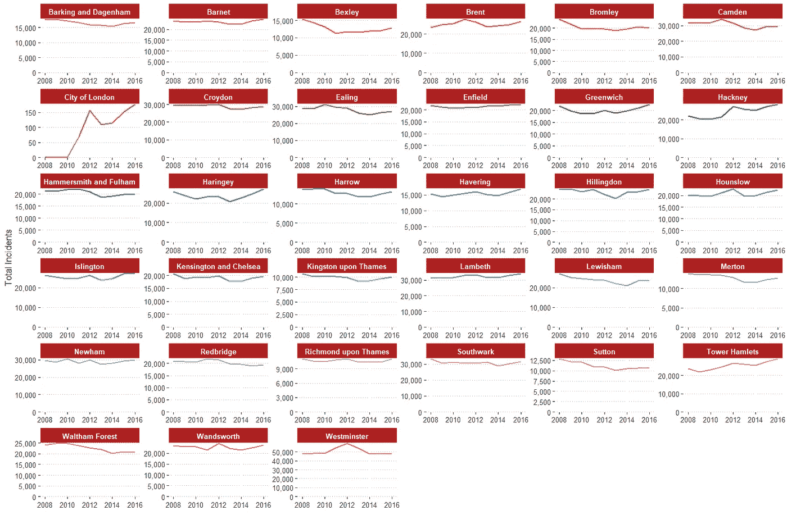

# 伦敦犯罪数据分析

> 原文：<https://towardsdatascience.com/analyzing-london-crimes-data-in-r-aee4658f79fe?source=collection_archive---------12----------------------->


我在研究伦敦的犯罪数据集。分析和可视化比我预期的要好得多，所以我想我还不如写一篇关于它的文章。我在试验 bigquery 时获得了这些数据，但是你也可以从 Kaggle 上的[这里](https://www.kaggle.com/jboysen/london-crime)下载。让我们从加载库和数据开始。

```
library(tidyverse) ## For data wrangling and visualization 
library(lubridate) ## To work with dates
library(ggpubr)    ## Extra visualizations and themes
library(patchwork) ## Patch visualizations together
library(hrbrthemes)## extra themes and formatting
library(scales)    ## For formatting numeric variables
library(tidytext)  ## Reordering within facets in ggplot2
library(pier)      ## Make interactive piecharts in R
library(ggalt)     ## Extra visualizationslondon_crimes <- read_csv("C:\\Users\\ACER\\Downloads\\bq-results-20190830-212006-dh1ldd1zjzfc.csv",trim_ws = TRUE) %>% 
  mutate(Date_Column = dmy(Date_Column))
```

加载完库之后，我使用了 **read_csv** 函数，并给了它一个文件在我电脑上的路径，设置 **trim_ws** 为 TRUE 以防有任何空白并删除它，然后使用 **mutate** 函数将 **Date_Column** 更改为 Date 类型，使用的是**Lubridate**包中的 **dmy** 函数。

为了得到一个概览，我将想象一下这些年来整体犯罪事件是如何变化的。让我们浏览一下代码:

```
london_crimes %>% 
  group_by(Year = floor_date(Date_Column,unit = "year")) %>%   
  summarise(Incidents=sum(total_incidents,na.rm = TRUE)) %>%   
  ungroup() %>%                                                 mutate(pct_change= (Incidents-lag(Incidents))/lag(Incidents),
         pct_change=replace_na(pct_change,0)) %>%   
  ggplot(aes(Year,Incidents))+               
  geom_bar(stat="identity",fill="firebrick",color="black")+        
  geom_line(color="steelblue",size=1.5,linetype="dashed")+     
  geom_text(aes(label=percent(pct_change)),vjust=-1,color="black",face="bold")+  geom_text(aes(label=comma(Incidents)),vjust=1,fontface="bold",color="white")+ 
  scale_y_comma(expand = c(0,0),limits = c(0,800000))+         
  scale_x_date(breaks = "year",date_labels ="%Y")+             
  theme_classic()+                                             
  labs(title = "Total Incidents over the years")
```

*   为了获得年度分析，我们按日期列分组，并使用 **floor_date** 函数将其四舍五入，然后使用**summary**函数获得每年的事件总数
*   每次 **group_by** 操作后，取消**分组**总是一个好的做法，以删除分组上下文
*   然后，我们使用 **mutate** 函数创建一个新列— **pct_change** ，它基本上是使用 **lag** 函数计算每年之间的百分比变化
*   整理好数据后，我们使用 ggplot2 制作一个标准的条形图。由于 ggplot2 不允许组合图表显示百分比增长线图，我只是使用了 **geom_line** 函数来绘制趋势线，并用百分比变化值对其进行注释


如果我们只是比较 2008 年和 2016 年，你会认为犯罪事件几乎没有变化，但实际上这是 2014 年的最低水平，此后一直在增长。现在让我们在区一级分析我们的数据。

让我们来看一个简单的柱状图，看看区一级的事故总数。如果你熟悉 Tidyverse 元包，那么下面这些应该不难理解。

```
london_crimes %>%                                     
  group_by(borough) %>% 
  summarise(Incidents=sum(total_incidents)) %>% 
  ungroup() %>% 
  ggplot(aes(reorder(borough,Incidents),Incidents))+
  geom_bar(stat = "identity",aes(fill=borough),color="black")+
  coord_flip()+
  scale_y_comma()+
  geom_text(aes(label=comma(Incidents)),hjust=1)+
  theme_classic()+
  theme(legend.position = "none")+
  labs(x=" ",y=" ",title = "Total Incidents for boroughs from 2008-2016 ")
```


我不熟悉伦敦的地理，但 Westminister 遥遥领先。我谷歌了一下，发现 Westminister 是伦敦人口最密集的地区之一。

这些年来这些区的犯罪率有什么变化？

为此，我将 2016 年的数据与 2014 年的数据进行比较，而不是与 2008 年进行比较，因为 2014 年的犯罪事件最低，与 2016 年进行比较可能会显示一些有趣的变化。

```
london_crimes %>% 
  group_by(borough) %>%  summarise(Incidents_2014=sum(total_incidents[year(Date_Column)==2014]),         Incidents_2016=sum(total_incidents[year(Date_Column)==2016])) %>% 
  ungroup() %>% 
  mutate(Pct_Change=(Incidents_2016-Incidents_2014)/Incidents_2016)    %>%      
  ggplot(aes(reorder(borough,Pct_Change),Pct_Change))+                       
  geom_bar(stat = "identity",aes(fill=borough),color="black")+               
  coord_flip()+
  scale_y_continuous(labels = percent_format())+                             
  geom_text(aes(label=percent(Pct_Change)),hjust=1)+
  theme_classic()+
  theme(legend.position = "none")+                                           
  labs(x=" ",y="Percentage Change ",title = "Percentage Change in Incidents from 2014-2016")
```

*   我们再次按区对数据进行分组，并计算两个条件和——Incidents _ 2004 和 Incidents_2016，并计算两者之间的百分比差异，以查看每个区的变化
*   然后，像以前一样，按照标准程序绘制柱状图，根据从最高到最低的百分比变化重新排序


*   伦敦金融城的最高比例有点失真，因为它的犯罪事件数量很少
*   令人惊讶的是，Westminister 是倒数第二名，尽管它在所有事故中排名第一。至少，它没有经历相当大的增长。

我想知道每一个行政区在哪一年经历了有史以来最高的犯罪事件数量，以及哪一年有最多的行政区经历了最高的犯罪事件数量。

```
london_crimes %>% 
  group_by(borough,Yearly=floor_date(Date_Column,unit = "year")) %>% 
  summarise(Incidents=sum(total_incidents)) %>%
  ungroup() %>% 
  group_by(borough) %>%
  filter(Incidents==max(Incidents)) %>%  
  ungroup() %>% 
  mutate(borough_max_year = paste0(borough,"-","(",year(Yearly),")")) %>%                                                                    
  ggplot(aes(reorder(borough_max_year,Incidents),Incidents))+
  geom_col(aes(fill=borough_max_year),color="black")+
  scale_y_comma()+
  coord_flip()+
  geom_text(aes(label=comma(Incidents)),hjust=1)+
  theme_classic()+
  theme(legend.position = "none")+
  labs(title = "Max Incidents for each Borough",x="Borough and year of max Incidents ",y="Incidents")
```

*   我们首先按照年份和行政区进行分组，然后根据行政区和相应年份的每个组合获得事故总数
*   因为我想根据事件筛选每个区的最大年份，所以我按区对数据进行分组，然后筛选每个区的事件值等于其最大值的地方。这也将显示该值的年份
*   为了直观起见，我创建了一个新列— **borough_max_year** ，它基本上是使用 **paste0** 函数将**year**和 **Incidents** 列串联起来的版本。剩下的是我用来可视化柱状图的相同代码。


现在，我们可以看到每一个区在哪一年经历了最高数量的犯罪事件，但我现在将制作另一个可视化效果，以查看哪一年最多的区经历了最高数量的犯罪事件。

```
london_crimes %>% 
  group_by(borough,Yearly=year(floor_date(Date_Column,unit = "year"))) %>% 
  summarise(Incidents=sum(total_incidents)) %>%
  ungroup() %>% 
  group_by(borough) %>%    
  filter(Incidents==max(Incidents)) %>%  
  ungroup() %>% 
  count(Yearly,sort = TRUE,name = "Boroughs_with_max_incidents") %>%  ggplot(aes(reorder(Yearly,Boroughs_with_max_incidents),Boroughs_with_max_incidents))+
  ggalt::geom_lollipop(aes(color=factor(Yearly)),point.size = 10)+
  scale_y_comma()+
  coord_flip()+
  geom_text(aes(label=Boroughs_with_max_incidents),hjust=0.5,color="white",fontface="bold")+
  theme_classic()+
  theme(legend.position = "none")+
  labs(title = "Number of boroughs that experienced their highest ever incidents",x="Year",y=" ")
```

*   使用和以前一样的代码，我增加了一个额外的步骤，计算每年的行政区数量
*   厌倦了条形图，我使用了 **ggalt** 包中的 **geom_lollipop** 函数来绘制棒棒糖图


*   因此，2016 年拥有最多的行政区，尽管 2016 年在 2008 年和 2012 年之前的犯罪事件总数方面排名第三

我现在要检查每个区的犯罪事件的总体趋势。

```
london_crimes %>% 
  group_by(Year=floor_date(Date_Column,unit = "year"),borough) %>% 
  summarise(Incidents=sum(total_incidents,na.rm = TRUE)) %>% 
  ggplot(aes(Year,Incidents))+
  geom_line(aes(color=borough),size=0.75,style="--")+
  theme_pubclean()+
  scale_y_comma()+
  expand_limits(y=0)+
  facet_wrap(~borough,scales = "free")+
  labs(y="Total Incidents",x=" ")+
  theme(legend.position = "none",strip.background = element_rect(fill="firebrick"),strip.text=element_text(color = "white",face="bold"))
```



我原以为这将是一个非常混乱的图表，但结果比我预期的要好很多。从 2014 年到 2016 年，我们可以大致看到大多数行政区的总体增长趋势。

**让我们来看看每个主要类别在犯罪事件总数中所占的比例，以及它们的长期趋势。**

```
**# Piechart**london_crimes %>% 
  group_by(major_category) %>% 
  summarise(Incidents=sum(total_incidents,na.rm = TRUE)) %>% 
  ungroup() %>% 
  mutate(color=RColorBrewer::brewer.pal(9, 'Spectral')) %>%
  select(label=major_category,value=Incidents,color) %>%
  pier() %>% 
  pie.size(inner=70, outer=100, width = 600, height = 450) %>%
    pie.header(text='Crimes', font='Impact', location='pie-center') %>%
    pie.subtitle(text='by major category')%>%
    pie.tooltips()**# Trend over time**london_crimes %>% 
  group_by(Yearly=floor_date(Date_Column,unit = "year"),major_category) %>% 
  summarise(Incidents=sum(total_incidents,na.rm = TRUE)) %>% 
  ggplot(aes(Yearly,Incidents))+
  geom_line(aes(color=major_category),size=0.75)+
  theme_pubclean()+
  scale_y_comma()+
  expand_limits(y=0)+ # making sure that the yaxis for every facet starts at 0 otherwise the trend may look misrepresentitive
  facet_wrap(~major_category,scales = "free")+
  labs(y="Total Incidents",x=" ")+
  theme(legend.position = "none",strip.background = element_rect(fill="firebrick"),strip.text=element_text(color = "white",face="bold"))
```

*   我在这里使用了 **pier** 包来绘制一个交互式饼图，因为我总是发现在 ggplot2 中绘制像样的饼图比实际需要的要复杂一些
*   **pier** 要求栏目只需标注“标签”、“数值”和“颜色”
*   趋势图的代码与行政区的代码相同。唯一的区别是我用 **major_category** 变量替换了 **borough** 变量
*   请注意，我使用了 **expand_limits(y=0)** 参数来确保每个线图中的 y 轴都从 0 开始，否则，它们看起来会有点失真


*   从 2014 年到 2016 年，**盗窃和处理**以及**针对人身的暴力**等主要贡献者出现了显著增长
*   似乎奇怪的是，2008 年后就没有发生过**性犯罪**和**欺诈或伪造**。可能是因为这些罪行后来被记录在不同的类别下

现在我想看看不同的行政区在每个主要类别中的排名。我将只关注前 40%的地区，因为在一个多面图中可视化所有的行政区看起来非常混乱。

```
london_crimes %>% 
  group_by(major_category,borough) %>% 
  summarise(Incidents=sum(total_incidents)) %>% 
  filter(Incidents>quantile(Incidents,0.6)) %>% #filtering for only the top 40% to make the plot more readable
  ungroup() %>% 
  mutate(borough=reorder_within(borough,Incidents,major_category)) %>%                                                            ggplot(aes(borough,Incidents))+
  geom_bar(aes(fill=borough),stat = "identity",color="black")+
  coord_flip()+
  scale_x_reordered()+       
  scale_y_comma()+
  geom_text(aes(label=comma(Incidents)),hjust=1)+
  theme_classic()+
  theme(legend.position = "none")+
  facet_wrap(~major_category,scales ="free")+
  labs(x=" ",y=" ",title = "Top 40% Boroughs by Incidence",subtitle = "Segmented by Major Category")+
  theme(legend.position = "none",strip.background = element_rect(fill="firebrick"),strip.text=element_text(color = "white",face="bold"))
```

*   在分组和总结之后，我保留分组上下文，使用**分位数**函数过滤每个主要类别下前 40%的行政区
*   然后，我使用 **tidytext** 包中的 **reorder_within** 函数，根据犯罪事件对每个主要类别下的行政区进行重新排序。这样做的原因是为了在每个主要类别方面内对条形图进行排序


另外，我想看看每个大类中哪些是主要的小类。

```
london_crimes %>% 
  group_by(major_category,minor_category) %>% 
  summarise(Incidents=sum(total_incidents)) %>%
  ungroup() %>% 
  mutate(minor_category=reorder_within(minor_category,Incidents,major_category)) %>%
  ggplot(aes(minor_category,Incidents))+
  geom_bar(aes(fill=minor_category),stat = "identity",color="black")+
  coord_flip()+
  scale_x_reordered()+
  scale_y_comma()+
  geom_text(aes(label=comma(Incidents)),hjust=1)+
  theme_classic()+
  theme(legend.position = "none")+
  facet_wrap(~major_category,scales ="free")+
  labs(x=" ",y=" ",title = "Incidents by Minor Category",subtitle = "Segmented by Major Category")+
  theme(legend.position = "none",strip.background = element_rect(fill="firebrick"),strip.text=element_text(color = "white",face="bold"))
```


*   所以大部分都是骚扰、袭击和盗窃案件。我猜在 2008 年后，性犯罪被归入对人身的暴力。
*   看起来商业和个人财产相对来说被抢劫了很多。虽然**盗窃和处理有很多潜在的重叠，但是抢劫**和**入室盗窃**。

# 结论

尽管数据集性质严峻，但我在探索它的过程中获得了很多乐趣。也有可能进行更多的探索性分析。你可以对伦敦最安全的行政区进行分析，或者深入挖掘小类事故。