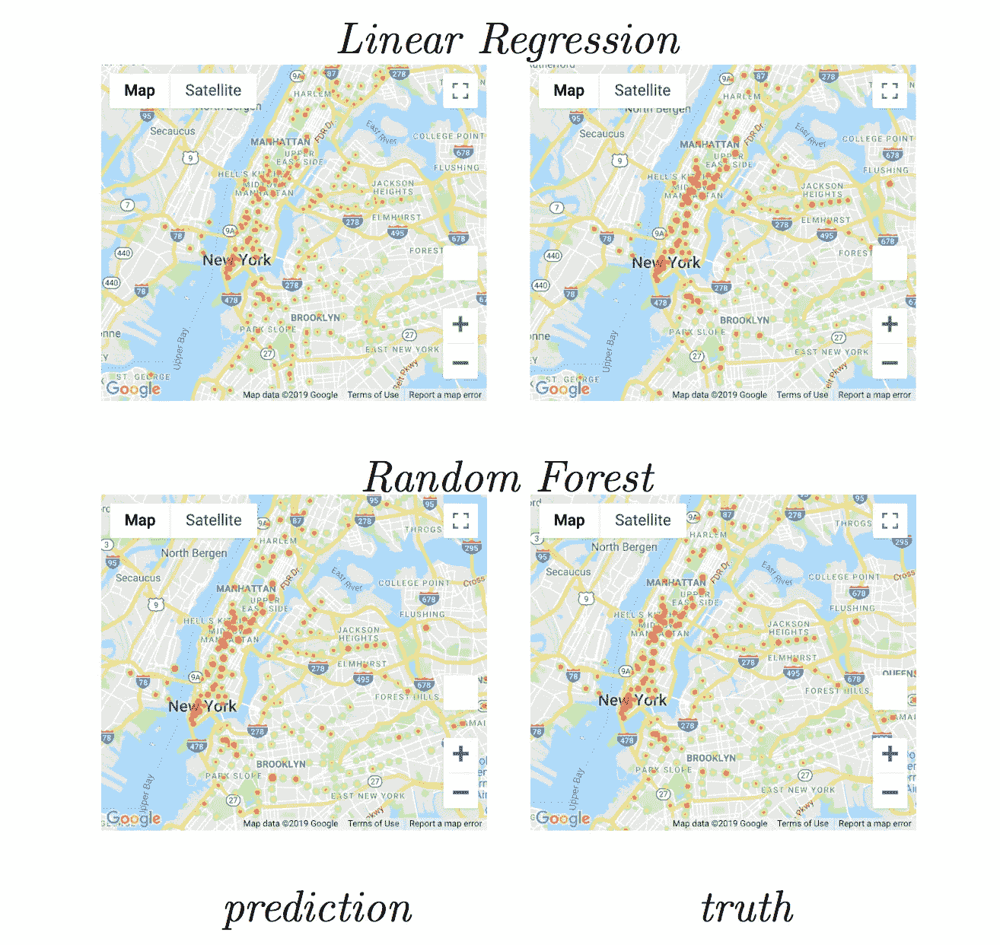
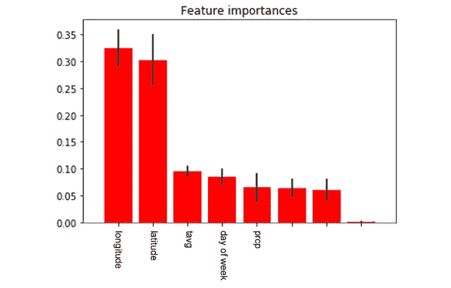

# 分析纽约市的交通方式

> 原文：<https://towardsdatascience.com/analyzing-modes-of-transportation-in-new-york-city-dfb4a1726ac4?source=collection_archive---------12----------------------->

*这项工作由坎贝尔·韦弗、吴宇舟和雷汉·拉苏尔完成，是康奈尔理工大学*****数据科学课程的一部分。****

# ****简介****

**对大都会运输管理局(MTA)来说，预测给定纽约市地铁站的乘客数量是一个关键挑战。
因此，我们旨在解决以下挑战:给定一周中的某一天、一个站点位置和附加数据(例如天气、特殊事件)，他们预计会有多少人？**

**这种分析和预测的目的是让 MTA 为不可预见的情况做好准备。例如，在罗斯福岛最近举行的樱花节期间，地铁站出现了大拥堵，这使许多人面临窒息或踩踏的危险。**

**使用我们的机器学习模型，MTA 将能够预测不同天气条件下每个地铁站的预期人数，并考虑到特殊事件。这将允许他们先发制人的安排，以避免任何危险的情况。**

**这项工作侧重于 2018 年的数据。**

# **分析**

## **数据选择**

****地铁数据**来自 [MTA 十字转门数据](http://web.mta.info/developers/turnstile.html)。尽管这些数据比我们需要的更复杂，但是我们能够执行彻底的数据清理，使其对我们的分析有用。**

**该数据由所有纽约地铁站十字转门的入口和出口计数器组成，每 4 小时采集一次。**

**我们使用这个数据集来分析天气和特殊事件对地铁使用的影响。**

***数据集大小:1000 万行，11 列***

****

****从[谷歌地图 API](https://developers.google.com/maps/documentation/geocoding/) 获得的位置数据**。这被用来提取从 MTA 数据获得的台站的纬度和经度，因为这些数据只包含台站名称，而不包含它们相应的位置坐标。**

****从[城市自行车出行历史](https://www.citibikenyc.com/system-data)中获得的城市自行车数据**。数据集由 2018 年期间每次骑自行车的信息组成，包括行程持续时间、开始&结束时间、日期和车站、车站位置(纬度/经度)和一些用户信息。**

**我们使用这个数据集来分析天气和特殊事件对自行车骑行的影响。**

***数据集大小:1100 万行，7 列***

****

****从[国家环境信息中心](https://www.ncdc.noaa.gov/cdo-web/datasets#GHCND)获得的**天气数据。数据集由 2018 年纽约市不同站点的气候数据组成，包括站点位置(纬度/经度)和各种气候参数，例如，温度、降水量和降雪量。**

***数据集大小:28000 行，33 列***

****

**活动数据:吸引大量人群(从而导致地铁乘客高峰)的特殊活动有许多不同的形式。因此，很难找到包含所有这些事件的历史信息的现有数据集。在我们分析事件对交通数据的影响时，我们集中在 161st St. Yankee Stadium 站的乘客量和 Yankee 主场时间表之间的关系。为了获得扬基队的赛程信息，我们使用开源 python 包装器来访问 MLB 的 API。**

## **数据清理**

****地铁数据**使用以下步骤进行清理:**

****

*   **每天每个十字转门的总进出数据**
*   **每天每个站点的总进出数据**
*   **使用 z 得分> 3 移除异常值**

**这产生了一个干净的数据集，包含 136000 行，比我们开始时的 1000 万行减少了很多。**

****位置数据**用于使用站名填写每个站的位置坐标(纬度/经度)。**

****

****CitiBike 数据**非常大，因为每行仅代表一次骑行记录。为了节省时间和空间，我们把数据过一遍，收集每个站的数据。我们将站名、id 和位置存储到字典中以备后用。此后，我们通过计算每日乘车人数和平均乘车时长来压缩数据。因此，我们获得了每天每个站点的自行车使用数据。**

****天气数据**使用以下步骤进行清理:**

*   **仅提取纽约市数据**
*   **填写 *TAVG* 栏**
*   **将缺失值填写为 0**
*   **小写列保持一致**

**这产生了一个干净的数据集，从 28000 行减少到 365 行，一年中每天一行。**

****

## **数据分析**

**下雨会影响地铁的使用吗？**

****

**distribution of subway usage for rainy vs non-rainy days**

****零假设(H0):**
雨天和非雨天的地铁使用量没有区别**

****交替假设(HA):**
雨天和非雨天的地铁使用量是有区别的**

**每个类别有两个分布，我们猜测这与周末和工作日有关。我们用下面的图来证实。**

****

**看起来有两种不同的多雨和不多雨的分布，但是我们不能确定这种差异是偶然的还是有统计学意义的。因此，我们对该数据执行非参数 **Mann Whitney U-test** ，因为样本是独立且非正态分布的。**

***p 值*出来是 0.0218，小于我们 *p 临界值*的 0.05。因此，我们可以拒绝零假设，并得出结论**雨天和非雨天的地铁使用存在差异。****

**我们通过绘制雨天和非雨天的地铁使用热图来证实这种差异。**

****

****下雨会影响 CitiBike 的使用吗？这是一个更简单的问题，因为人们本能地不太可能在雨天骑自行车。我们通过绘制雨天和非雨天的 CitiBike 使用热图证实了这一点。****

****

****地铁和城市自行车的乘客量每月都有变化吗？为了回答这个问题，我们绘制了 subway 和 CitiBike 每月的使用情况。****

****

**看起来在炎热的月份，地铁乘客量是最低的，因为人们在那些日子里避免乘坐地铁，而更喜欢骑自行车或步行。**

****特殊事件对地铁使用有何影响？在体育比赛或音乐会等受欢迎的活动当天，靠近活动场地的地铁站的乘客量会增加，这是很直观的。在许多情况下，这种影响很难量化，因为许多地铁站可以服务于同一个场地，从而将这种影响分散到不同的交通枢纽。此外，许多一次性事件，如音乐会，只产生一天的数据，并且很少重复，留给我们的样本量很小，无法建立我们的直觉。最后，收集纽约市许多不同类型的活动和场所的历史数据是一项艰巨的任务。我们选择通过关注 161 ST . Yankee Stadium(Yankee Stadium 附近唯一方便的地铁站)Yankee 主场比赛对地铁乘客量的影响来分析乘客量和事件之间的关系。****

****

**通过绘制该车站一年的乘客数据，一些事情立即变得显而易见。首先，有一个规律周期，即工作日的客流量较高(每天约 10，000 人)，周末的客流量较低(约 5，000 人)。突然，大约在 4 月 2 日，在洋基主场揭幕战的当天，每天的乘客量开始变成穿插着超过 15，000 名乘客的常规高峰。这种情况会持续到洋基的球季在 10 月结束，届时上座率会回复到先前的水平。**

**通过把我们的电视台数据分成有洋基主场比赛的日子和没有主场比赛的日子，我们立刻看到了不同。当有主场比赛时，平均每天的观众人数是 18，000，当没有主场比赛时，观众人数下降到 10，000。通过观察当有洋基主场比赛时和没有比赛时车站乘客的分布，很明显这些来自不同的分布。**

****

**同样，我们分析了 2018 年罗斯福岛地铁交通。2018 年 4 月 21 日地铁使用量有一个明显的峰值，对应的是罗斯福岛樱花节。**

****

# **预测模型**

**我们使用了两种机器学习模型来根据位置和天气信息预测车站的客流量:**

*   **线性回归**
*   **随机森林**

**我们使用以下测量技术来评估性能:**

*   **[平均绝对误差(MAE)](https://en.wikipedia.org/wiki/Mean_absolute_error) —误差绝对值的平均值**
*   **[均方根误差(RMSE)](https://en.wikipedia.org/wiki/Root-mean-square_deviation) —均方误差的平方根**

****

**Performance of different models**

**从表中我们可以看出，与线性回归模型相比，随机森林模型具有更好的性能。由于站点位置对客流量的影响不能用线性表示，因此线性模型很难准确预测。**

**为了可视化这些预测，我们创建了预测值与实际值的热图。我们可以清楚地看到，随机森林模型优于线性回归模型:**

****

**我们还研究了不同特征对乘客量的重要性。**

********

**经度和纬度对日客流量影响最大。这是有道理的，因为不同的社区有不同的人口，这是公共交通使用的最重要的因素。**

**平均温度表明了一个普遍的天气状况和一年中的季节。所以也是一个重要的特点。**

**在工作日和周末，运输使用情况不同，显示为一周中的某一天。**

**降水也会影响乘客量，但与其他因素相比，它的影响较小。**

# **进一步的改进**

**可以采取以下步骤来改进这项工作:**

*   **使用具有更丰富特征的更高级的机器学习模型，例如，我们可以将事件信息作为特征的一部分，以获得更好的预测结果**
*   **包括出租车和优步/Lyft 数据，以分析它们如何受到天气和事件的影响**
*   **使用多年的数据捕捉年度趋势**