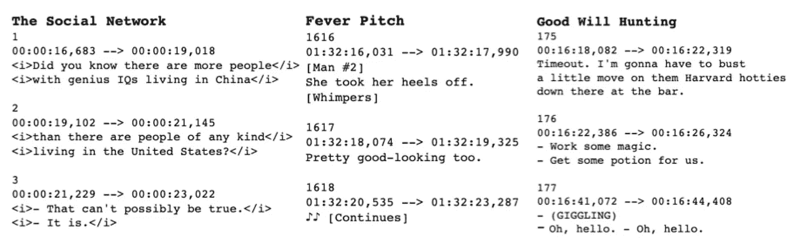

# 用 Python 分析电影对话速度

> 原文：<https://towardsdatascience.com/analyzing-movie-dialog-speed-with-python-79a8a8a286e8?source=collection_archive---------27----------------------->

当大卫·芬奇在执导《社交网络》时，他带着秒表去了阿伦·索尔金的家，记录了索尔金阅读剧本的时间。然后，他记下了每个场景的时间，并在拍摄这部杰作时严格遵守这些场景时间。听到这个轶事后，我决定自己从分析的角度来看看这部电影的对话。

为了开始我的调查，我首先收集数据。我发现了一个叫做 YIFY 字幕([https://yts-subs.com/](https://yts-subs.com/))的网站，它提供电影编辑用来给电影添加字幕的文件。这些特定的文件称为 SRT 文件，甚至有自己独特的。srt 扩展。看一些例子。srt 文件，很明显它们遵循一种严格的格式，包含:
1。字幕编号
2。格式为 START_TIME → END_TIME 的场景时间，时间格式为 hh:mm:ss:ffff
3。副标题的文本



我需要删除文本中的一些元素(html 标签、圆括号和方括号中的场景描述符、音乐符号),所以我编写了函数 clean_text 来帮助清理文件。

```
def clean_text(line):

    clean = line.strip().replace('</i>', '').replace('<i>','').replace('- ', '')
    clean = re.sub('\(.*\)','', clean)
    clean = re.sub('\[.*\]','', clean)
    clean = re.sub('♪', '', clean)

    return clean
```

通过几个辅助函数，我遍历了文件中的每一行，获得了以秒为单位的累积电影时间和说话的字数。解析每个的最终输出。srt 文件是一个具有两列的数据帧，一列用于累计时间，一列用于累计说出的单词。

为了有一个比较《社交网络》的电影基础，我还收集了一些波士顿同行的数据:
善意狩猎
狂热程度
战士
消失的婴儿
爱国者日
逝者
乡野圣徒
神秘河
小镇

所有的。srt 文件被解析，数据在干净、统一的数据帧中，然后我继续进行可视化。随着时间的推移，绘制每部电影的字数突出了社交网络，因为它具有最多的单词和最陡的斜率(对应于每秒的单词数)。


据传，芬奇花了 99 次拍摄才对《社交网络》的开场感到满意。将窗口缩小到前 600 秒会进一步提高对话速度。


利用每部电影的最终长度和字数，我还计算了每秒的平均字数。


最后，我又添加了 15 部电影来增加样本量，并绘制在下面。即使像《超级坏蛋》和《婚礼傲客》这样有大量对话和快嘴演员的电影，社交网络仍然保持领先。


感谢阅读！对于那些感兴趣的人，我已经把我用来进行这种分析的笔记本和。我的 GitHub 页面上的 srt 文件([https://github.com/eonofrey/movie_word_counts](https://github.com/eonofrey/movie_word_counts))。谢了。要获得所有媒体文章的完整访问权限，请点击[此处](https://eonofrey.medium.com/membership)！