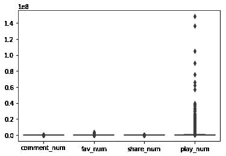
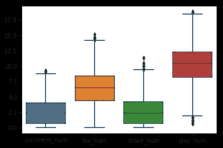
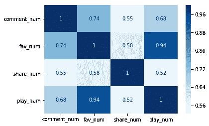
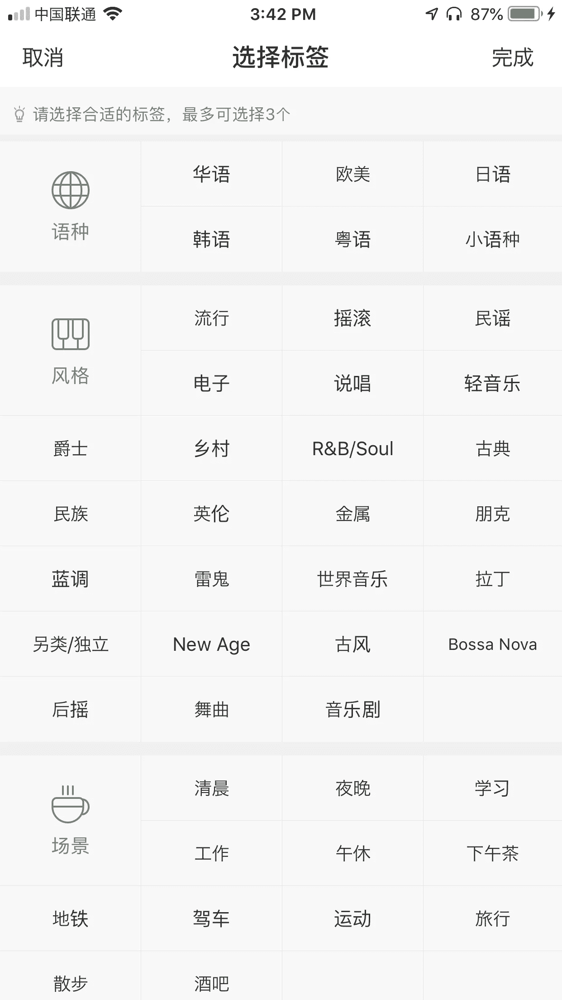
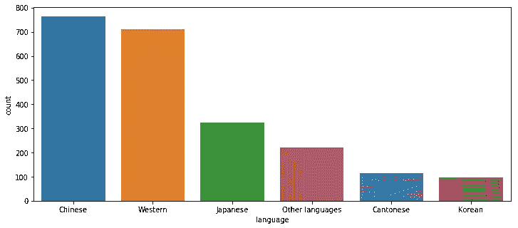
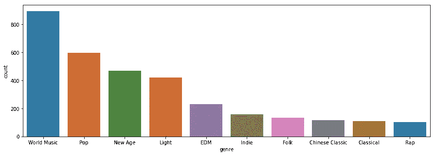
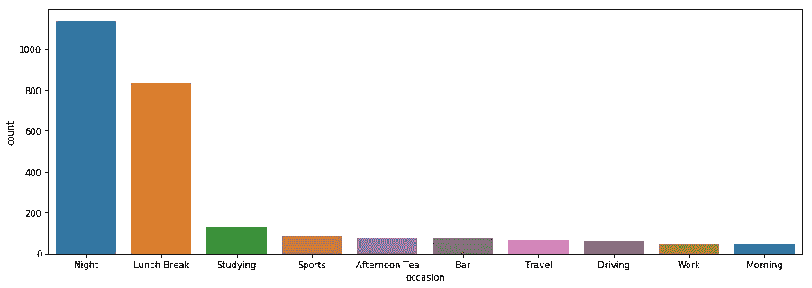
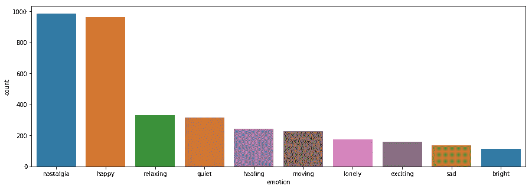
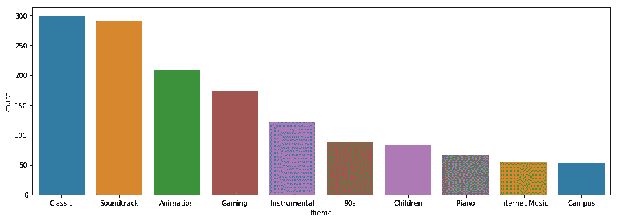

# 分析网易音乐-第一部分:播放列表

> 原文：<https://towardsdatascience.com/analyzing-netease-music-part-i-playlist-968f43fc7fc5?source=collection_archive---------30----------------------->

## 中国人听什么样的音乐？


Netease Music Logo

网易音乐([https://music.163.com/](https://music.163.com/))，一个中国版的 Spotify，是一个音乐应用程序，允许用户播放、下载和参与来自世界各地的音乐。网易的月活跃用户数超过 7000 万，与酷狗音乐、酷我音乐和 QQ 音乐并列中国音乐应用前四。此外，它是四款应用中唯一一款非腾讯的应用。

网易音乐的受众呈现出一些有趣的特征。根据该公司的报告以及 QuestMobile 的数据，该应用的用户更年轻，男性比例更高，并经常与社区互动。用户不仅比其竞争对手更频繁地打开和使用该应用，而且他们也倾向于留下大量评论。事实上，网易音乐中的评论已经成为其一大看点。人们会发布有趣的笑话、心碎的故事，甚至向他们的秘密情人表达自己的感受，并要求其他听众竖起大拇指，这样他/她就可以看到了。在网易音乐的一次推广活动中，它在杭州的地铁站和火车上发表了点赞数最高的评论。这一创意活动是该应用程序的巨大成功，并进一步确立了其作为最具“社交”属性的音乐应用程序的地位。


The comment promotional campaign

与西方同行类似，大多数听众将使用播放列表作为存储他们喜爱的歌曲以及发现新事物的方式。在网易音乐中，用户可以“播放”该列表，“收藏”该列表以供将来收听，“评论”该播放列表，并在应用程序内或微信/微博中“分享”该播放列表。在本文中，我将单独查看播放列表的一些指标。在接下来的几篇文章中，我还将探索关于单首歌曲的指标以及这些歌曲的评论。

## 如何获取数据

所有的数据都可以在网站上公开获得，并使用我个人构建的爬虫收集。爬虫基本遵循从主页发现播放列表，从播放列表发现歌曲，然后从播放列表和歌曲下载评论的逻辑。爬虫仍在积极开发中。如果你对学习如何爬行感兴趣，请在下面留下评论，我会写一篇关于爬行的文章。

## **数据大小**

下面进行的分析使用了 6000 个播放列表的样本。这些列表要么是在主页上推荐的，要么与那些热门播放列表有些关联，所以这些列表往往有更多的参与。

## 探索数字变量

首先，我们将查看数据集的数值。如前所述，参与度指标是“收藏”、“评论”、“分享”和“播放”。数据集还有一个“song_num”变量，它描述了播放列表中歌曲的数量。由于默认的 Pandas describe()使用 float 类型并在表中留下许多 0，我们可以使用 applymap()函数更改输出的格式，使它更漂亮。

```
df[['comment_num', 'fav_num', 'share_num', 'play_num','song_num']]
.describe()
.applymap(lambda x: format(x, '.0f'))
```


describe() result

从这里我们可以看到，评论和分享的中位数是 10。“fav”的号码是 663，播放号码是 36k。粗略地说，一个播放列表需要播放 4000 次才能获得“分享”或“评论”。这表明评论和分享功能并不常用。请注意，这里的“评论”适用于整个播放列表，它不同于评论一首更受欢迎的歌曲。

为了直观地显示这些指标，我们可以使用一个方框来绘制这些列。然而，由于所有四列的数据都有很大的偏差，直接绘制它们不会产生好的结果。下图并没有真正告诉我们什么，因为 x 轴非常大，没有显示足够多的“长尾”播放列表的细节。

```
sns.boxplot(data = df[['comment_num', 'fav_num', 'share_num', 'play_num']], orient='v')
```



Boxplot without normalization

为了使这种偏斜数据正常化，我们可以使用对数函数来做一个快速而肮脏的把戏。如果你想了解更多细节，请阅读这篇文章。

[https://becoming human . ai/how-to-deal-with-skewed-dataset-in-machine-learning-AFD 2928011 cc](https://becominghuman.ai/how-to-deal-with-skewed-dataset-in-machine-learning-afd2928011cc)

```
sns.boxplot(
data = df[['comment_num', 'fav_num', 'share_num', 'play_num']]
       .applymap(lambda x: math.log(x+1)), orient='v')
```



Boxplot with normalization

归一化后，我们可以看到所有四个指标都遵循相对正态分布。

## 变量之间的相关性

播放次数多的播放列表也有很多评论吗？这似乎是一个明显的正相关，但看看这个数字如何滚动出来仍然很有趣。

```
corr = df[['comment_num', 'fav_num', 'share_num', 'play_num']].corr()
sns.heatmap(corr, 
        xticklabels=corr.columns,
        yticklabels=corr.columns,
        cmap = 'Blues',
        annot = True)
```

我们可以使用 pandas 的 corr()函数来获得相关图，并使用 seaborn 来绘制相关图。注意，您可以使用 *cmap* 参数来改变图形的颜色。对于关联热图，基于单一颜色的图表会更有效，因为它更清楚地显示了数字比较。



有意思的是，播放号和收藏号的相关性最强。这是有意义的，因为在他们可以保存播放列表之前，需要有大量的人在听它，收藏它意味着他们将来会听它。评论与其他指标的相关性较弱。由于评论数和分享数与其他两个相比要小得多，很可能这些指标中有较高比例的“噪声”,因此导致相关性较弱。

另一方面，股票数量的相关性更弱。尽管仍有很强的正相关性，但这个数字并不那么确定。也许一个原因是，共享播放列表的意义不同于播放它或喜欢它。通过演奏或收藏，听众可以独立地欣赏音乐。通过对播放列表进行评论，听众可以与作者和喜欢该播放列表的其他人进行互动。然而，通过共享播放列表，这意味着听众在社交上参与音乐，并致力于向他们的朋友推荐该列表。也许一个人会在白天分享一个经典的摇滚播放列表，然后在晚上循环播放“我知道你是个麻烦”?

## 探索其他变量

我们可以看的另一个有趣的列是“tag_list”。当用户创建播放列表时，用户最多可以选择 3 个标签。这些标签包括语言、流派、合适的场合、情感和主题。对于那些不懂中文的人，我创建了一个翻译文件来将这些标签翻译成英文。



Tag selection page at Netease Music App

在将标签列表展开成一个带标签的标签列表后，我们可以绘制每个标签的直方图。虽然样本量很小，但数据也许能显示出网易音乐听众音乐偏好的一些有趣趋势。

**语言**



Language count plot

在语言方面，中国音乐仍然是最主要的类别，但西方音乐(主要是英语)紧随其后。日语也占据了播放列表的相当一部分。

**流派**



Genre count plot

就流派而言，除了很难精确定义的“世界音乐”之外，流行音乐是最受欢迎的一类，因为人们不知道还能选择什么。“新时代”和“轻音乐”都很放松，占据了第三和第四位。这可能会令人惊讶，因为这些音乐在西方世界并不流行。尽管 EDM 和 Rap 最近在年轻一代中很受欢迎，但它们在播放列表中所占的比例仍然相对较小。

**场合**



Occasion count plot

对于场合，夜晚和午休是两个占主导地位的标签。这与我们上面确定的“轻音乐”趋势相一致，因为人们在这两个时间段倾向于听到更多的“舒缓”音乐。同样值得注意的是，对于“流行”列表，列表创建者可能不会为其选择“场合”标签。

**情感**



Emotion count plot



Theme count plot

排在前两位的情绪是“怀旧”和“开心”。与“悲伤”和“孤独”列表的低数量相比，人们似乎更倾向于制作积极情绪的播放列表。就主题而言，由于数量很少，很难确定一个趋势。值得注意的是，动画和游戏具有很强的代表性，表明“动漫”文化在中国仍然蓬勃发展。

总体而言，与西方世界相比，网易音乐听众的口味更“清淡”。观众作为一个整体已经接受了一套不同的音乐。

## 有趣的事实

*   播放次数最多的播放列表播放次数达 1.48 亿，是一个收录了最佳 intros 的英文歌曲集。榜单第一首是《五百里》。
*   评论最多(10k)的播放列表是 90 年代中国动画片的配乐集。

好了，这一次到此为止。下一篇文章，我会在播放列表数据上探索一些机器学习的方法，尝试基于文本数据和歌曲数据来预测类别。