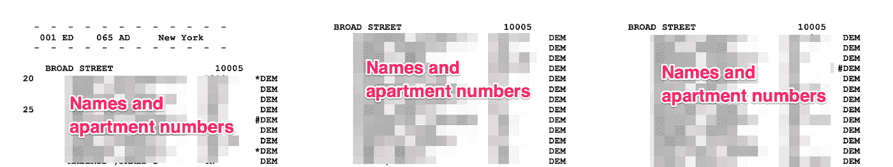
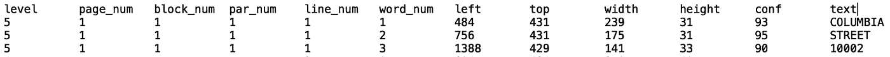
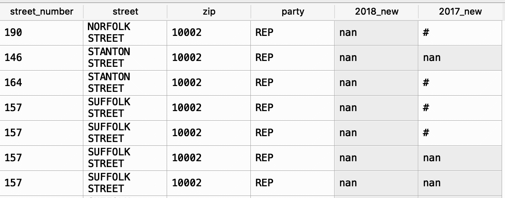
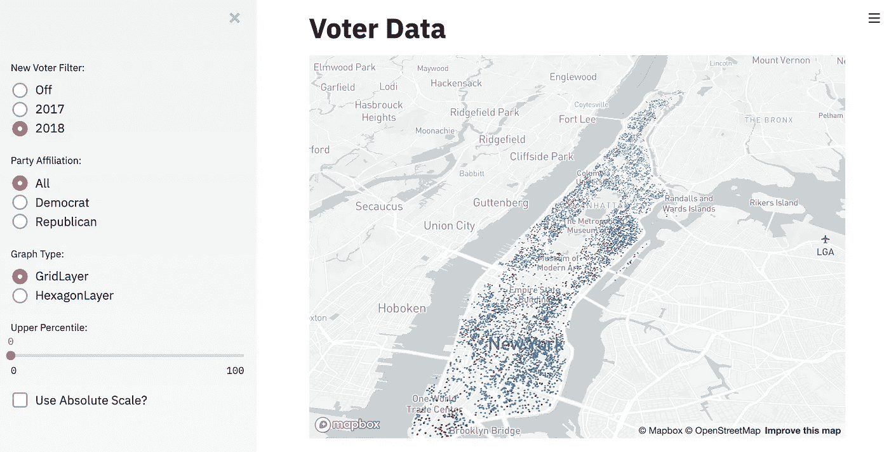
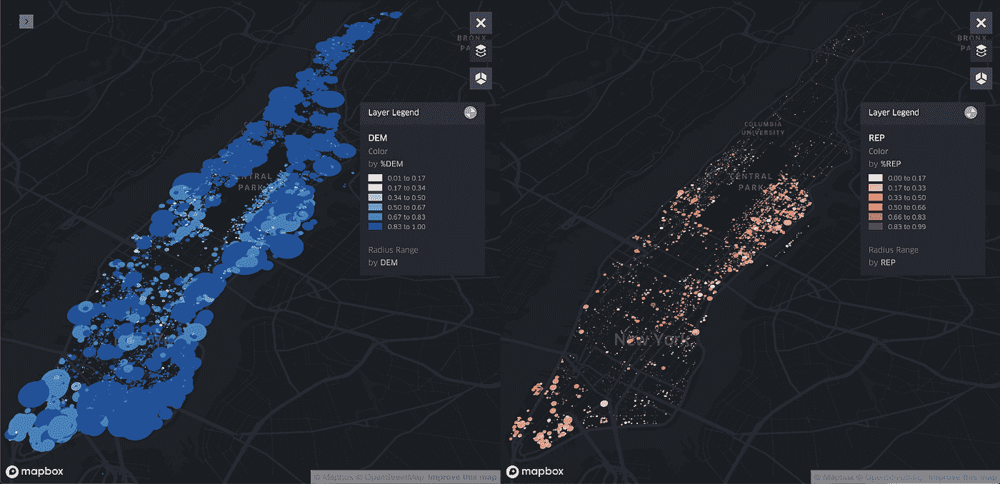
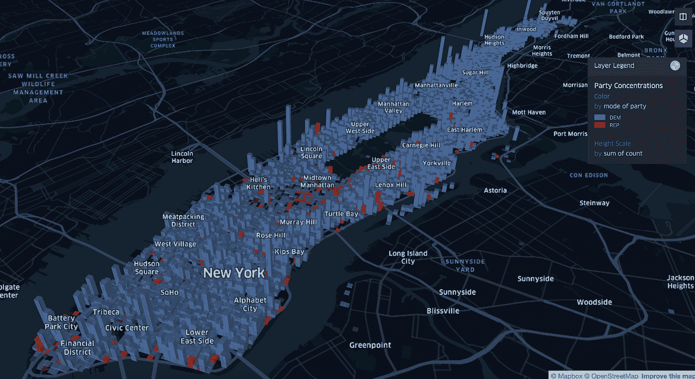
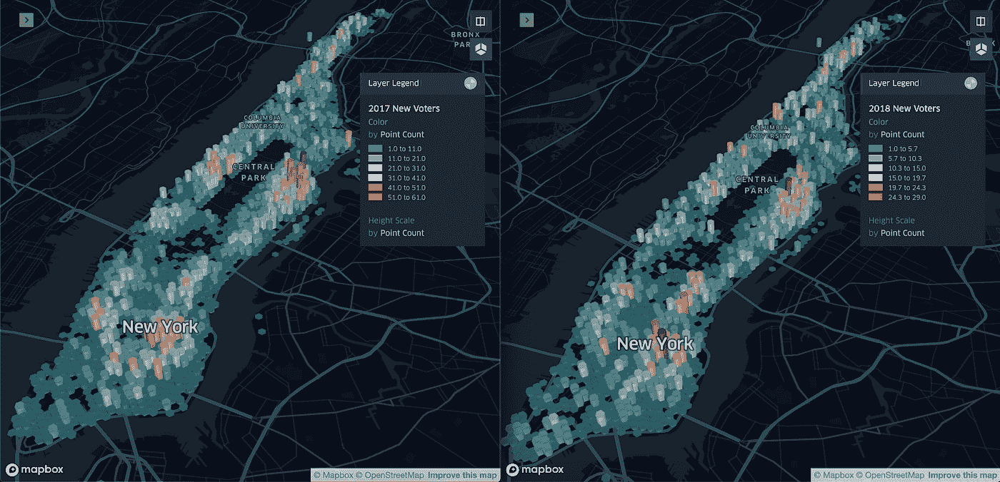

# 分析曼哈顿一百万选民的记录

> 原文：<https://towardsdatascience.com/analyzing-one-million-voter-records-in-manhattan-3a4787b8a83b?source=collection_archive---------26----------------------->

## 对曼哈顿选民构成的独特观察

如果你能立即想象整个城市的政治归属，下至每一个公寓和登记投票的人，会怎么样？有点令人惊讶的是，纽约市在 2019 年初将这一点变成了现实，当时纽约市选举委员会决定在网上发布**460 万选民记录，由** [**《纽约时报》**](https://www.nytimes.com/2019/04/26/nyregion/voter-registration-nyc-online.html) 报道。这些记录包括全名，家庭住址，政治派别，以及你在过去 2 年中是否登记过。根据此[条](https://www.wnyc.org/story/new-york-city-board-elections-posted-all-voters-names-addresses-and-party-affiliations/)的原因是:

> 委员会官员表示，他们的印刷供应商无法及时制作足够的选民登记册，供候选人在 2 月份开始收集请愿书签名，这就是他们在网上发布信息的原因。

所以这成了其间的‘权宜之计’。尽管正如纽约市 BOE 发言人瓦莱丽·瓦兹奎·迪亚兹在同一篇文章中所说:

> 不管你有没有意识到，纽约的选民数据是公开的。

虽然一个城市心血来潮公开 460 万份选民个人记录的想法令人深感不安，我打算在另一篇文章中讨论这一点，但可视化这些数据的机会引起了我的兴趣。对于大多数公共数据集，你可能能够访问的最细的数据集可能是[人口普查区](https://en.wikipedia.org/wiki/Census_tract)级别，但是纽约市刚刚展示了世界上最独特的数据集之一！现在第一次有了一个数据集来可视化大量超粒度选民数据，包括按地区划分的政治派别集中度，在某些地区是否有协调一致的努力来登记新选民，以及占主导地位的政党在多大程度上是人们可以理解的。

最终我决定尝试并发表这篇文章，原因有二:

***1。公共官员需要更好地考虑在线发布这样一个大规模数据集的潜在后果***

在这种情况下，一个半技术人员花了几个周末的空闲时间来下载、转换和搜索数百万条记录。我不仅做到了这一点，而且在谷歌上获得积分后，我能够以大约 30 美元的价格对超过 100 万条记录进行地理编码。在这个数字时代，隐私需要放在首位，而不是事后才想到。

**②*。总的来说，这些数据提供了新的、独特的见解，对很多人都很有价值***

我确实相信这个数据集(在建筑层面可视化/分析)可以提供独特的见解，同时维护我自己和其他纽约居民的隐私。

总的来说，我发现确实存在政党主导的集中区域，而且政党主导的集群遍布整个城市。我还发现，新选民登记高度集中在字母城和上东区等地区，一些集群的登记人数比其他集群高 5 倍。本文的其余部分将涵盖将大约 600 个 pdf 转换成可用数据集的方法、观察到的独特比较的三种可视化，以及对进一步研究提出建议的结论。

# 方法学

现在，仅仅因为数据可用并不意味着它是可访问的，数据发布的方式证明了这一点。让我们来看看下面经过编辑的原始 PDF:

Redacted sample of the PDF pages

从数据科学的角度来看，这绝对是一场噩梦。许多原因中的几个:

1.  它在 PDF 中显示为每页三个“表格”,因此 excel/其他程序不会像您预期的那样使用它。它或多或少会爆炸，并在随机单元格中生成随机条目，因此不适合简单的复制/粘贴
2.  数据重叠(街道名称与名称重叠),因此没有简单的方法来分隔列
3.  像街道号这样的数据点最初只陈述一次
4.  列/新页面可以从没有数据开始(例如，第二列没有街道号码),因此需要有一种方法来记住“最近”的元素
5.  它只有地址，为了在地图上可视化，您需要纬度/经度数据

由于我是 Python 爱好者，我立即开始尝试使用各种现有的库，如 [PyPDF2](https://pypi.org/project/PyPDF2/) 来尝试读取数据，但是很明显 PDF 的格式不允许这样做。在陷入死胡同的最初几个小时后，我陷入了困境，开始重新思考我的策略。如果我不能使用页面上现有的数据结构，我需要找到一种方法来完全隔离和重建页面上的每个单词。

输入光学字符识别(“OCR”)。使用 [Pytesseract](https://github.com/madmaze/pytesseract) 库，我改变了策略，告诉我的程序每一页都是图像而不是 PDF 页面。事实上，只需要一行代码:

> text = pytesseract.image_to_data(第页)

为您提供页面上几乎每个元素的坐标:

Output of Pytesseract using image_to_data

一旦我确认了这一点，接下来的问题就是如何使用这些位置来构造一个自定义的分隔符来遍历每一页。不幸的是，由于 Pytesseract 选择的分组方式，前几列中的大部分都不起作用，但据我所知，“左”、“上”、“宽”和“高”的信息是准确的。所以对于我的程序，我基本上利用了以下逻辑:

*   将页面作为图像阅读
*   隔离左侧的数据表
*   使用左/上位置来确定行/列分组
*   制作一个数据框架，其中包含街道号、姓名、邮政编码等单独的列。
*   对中间和右侧的数据表执行上述步骤
*   移到下一页

公平地说，我不得不处理许多细微差别和边缘情况，OCR 的结果并不完美(我将在结论中详细讨论)。然而，经过一两天的修补，我能够在大约 30 分钟内成功地迭代通过我的第一个 250 页的 PDF，并将其转换成一个完全可利用的数据表！

Sample view of our newly converted dataset

现在是有趣的部分，我如何把它翻译成实际的地图？我有地址，但是我不能实际映射它们，除非我能以某种方式找到每个地址的纬度/经度坐标。当我查看我成功转换的唯一曼哈顿地址时，它达到了近 100，000 个唯一地址，因此手动完成这一部分是不可能的。幸运的是，谷歌不仅有一个反向地理编码 API，而且我发现了一个名为 [Geopy](https://github.com/geopy/geopy) 的奇妙的 python 库，它让我可以轻松地创建一个函数，用不到 20 行代码对地址列表进行地理编码。

About 20 lines of code can geocode nearly any address

由于我从未使用过谷歌的云平台，我从 300 美元的免费信用开始，这有助于抵消大约 330 美元的总成本。在我的免费积分和奇思妙想的鼓舞下，我让我的程序在接下来的 12 个小时内执行，为几乎所有相应的地址返回一组漂亮的经纬度坐标。在将它与聚合数据集连接起来并进行一些数据清理之后(见结论)，是时候决定如何可视化它了。

可视化大规模数据集不是一件容易的事情，除了找到一个可以处理几十万行的可视化库之外，您还需要考虑可视化数据集的技术，以便最终结果对底层数据来说是有意义和真实的。我最初开始在机器学习社区使用一个奇妙的新项目，名为 [Streamlit](https://streamlit.io/) ，但最终决定我不想创建一个仪表板，因为太多的杂物会分散注意力(绘制数据)。

First Attempt with Streamlit, Great for Creating Dashboards for Active Analysis!

最终，我选择了优步可视化团队制作的名为 [Kepler.gl](https://kepler.gl/) 的图形库。开普勒使用 [Mapbox](https://medium.com/u/5691029a1e6a?source=post_page-----3a4787b8a83b--------------------------------) 作为底层地图提供商，不仅在处理大型数据集方面做了惊人的工作，而且即使对于不编码的人也非常容易访问。在尝试了一些不同的技术、滤镜和图层设计后，我决定选择下面三个最有影响力的。

# 选民的绝对优势

我想看的第一件事是'*孤立地看每个聚会浓度是什么样的*'？我想这样做有两个原因:

1.  为了看看我提取的数据是否大致接近报道的党派优势(民主党已经占了大约 68%的投票人口)
2.  为了清楚地识别集中区域，没有一方由于偏斜而控制地图

为了做到这一点，我在地图上创建了每个政党的双重视图，根据给定区域中的点的集中程度(该区域中注册选民的密度)创建了半径宽度，然后根据 avg 创建了连续的量化色标。双方所占面积中的建筑百分比。

Democratic (left) concentrations compared to Republican (right)

正如我们在地图对比中看到的那样，曼哈顿确实是压倒性的民主，许多倍数更集中在像哈莱姆区(曼哈顿北部)这样的地区。毫不奇怪，他们往往也是大多数建筑中的大多数选民，正如你在地图上看到的深蓝色。从共和党方面来看，很明显，从原始数据来看，他们占少数，而在他们拥有大量集群的地区，民主党人通常仍占主导地位(由浅红色和深红色显示)。与其他地区相比，上东部地区，如鲁诺山、海龟湾和约克维尔确实显得高度集中。林肯广场和金融区周围的人群似乎也较少，尽管要稀疏得多。

# 选民的混合优势

现在我们已经检查了原始的政党优势，让我们试着合并到一张地图上。这里的想法是试图显示政党集中的主导领域，同时也保持人口的相对规模。为了做到这一点，我创建了一个网格样式的层，使用了 0.2 公里(约 0.06 英里)半径内的聚会总数。然后我会为每个网格创建一种颜色，基于在该区域找到的最频繁的聚会。我的假设是，即使民主党控制了曼哈顿，也可能有共和党控制的地区。下面是结果:

Party dominance in clustered areas

正如我们所看到的，这并不令人惊讶，因为民主党主导了地图，即使是在上东区这样的共和党人最集中的地区。似乎确实有一些主题区域，如中央公园的东南区域，但最终在同等规模的民主集中度下，几乎没有优势。

# 新选民登记

我特别好奇的一件事是，曼哈顿的选民登记是否集中在某些地区。pdf 包括 2017 年和 2018 年登记的选民数据，所以我决定看看可以收集到哪些见解。总的来说，我能够捕获大约 55，000 名新注册的选民，所以我决定将新选民聚集在 0.2 公里(~0.12 英里)的集群中。曼哈顿本身只有大约 2.3 英里宽，所以选择一个对你所代表的区域有意义的比例尺是很重要的。起初，我试图像上面的双地图一样将政党分开，但令人惊讶的是，在新民主党人和共和党人登记的地区，我看到的变化很小。相反，我决定将两党的新登记者结合在一起，并从总体上看 2017 年与 2018 年的新选民。

2017 New Voters (left) compared to 2018 New Voters (right)

正如我们所看到的，有两个新选民登记非常集中的地区——上东区的鲁诺山/约克维尔地区，东村的字母城周围地区。很难从中收集到任何明确的见解，但这种集中很有趣，因为地图上红色区域的新选民集中程度几乎是绿色区域的 5 倍。有几种方法可以潜在地解释这一点——也许这些地区相对于其他地区来说，由更多的新移民组成；或者，这可能反映了社区集中努力鼓励选民登记。

# 结论

这是一个非常有趣的项目，但是我还需要强调一些关于分析的免责声明。首先也是最重要的，像我这样使用 OCR 在准确性方面有很大的折衷。我的最终数据集被精简为大约 750，000 条聚合记录，其中大部分是由于 OCR 读取错误而不得不丢弃的数据(例如/“100 Orange Street”可能会读作“T0O 0range $treet”)。

因为像街道号码和名称这样的数据在某些情况下只出现一次，程序以这种方式误读它们最终会导致纬度/经度坐标找不到或不正确。我尽我最大的判断，试图扔掉明显不正确的大量数据，但我知道这个数据集并不完美，可能无法 100%代表现实。虽然数据可能是准确的，但我没有完美的验证方法，因为这是一个人的操作。

我很乐意看到城市思考如何创建像这样更开放的数据集。虽然我对纽约市发布数据集的方式感到失望，但我认为汇总层面的基础数据对许多相关方来说都有巨大的价值。这不仅有助于研究人员更好地了解选民趋势，还可能极大地促进与[选区划分](https://en.wikipedia.org/wiki/Gerrymandering)和[选区划分](https://en.m.wikipedia.org/wiki/Redistricting)等问题相关的研究。

进一步的研究可以纳入其他数据集，如美国人口普查数据，以了解诸如地区选民参与度或刺激选民登记的社会经济混合等情况。我也没有想象像布鲁克林或共和党或民主党以外的其他政党这样的地区，所以这些地区也仍然是未开发的领域。我相信，深入研究这些领域会发现更多关于纽约选民构成的独特发现。我希望这能有所帮助，并给每个人提供思考的食粮——感谢您花时间通读，并在下面自由发表您的想法或问题！