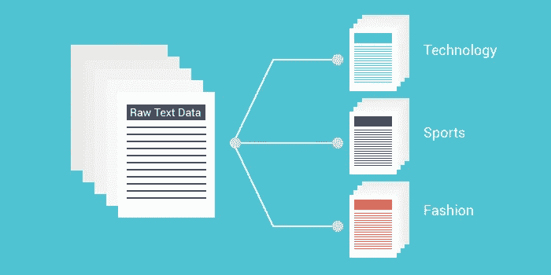
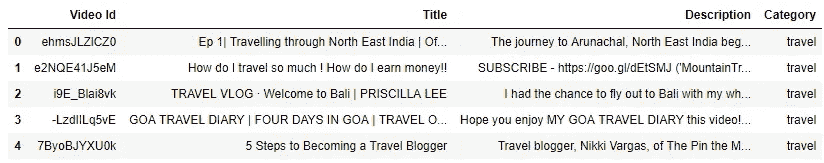
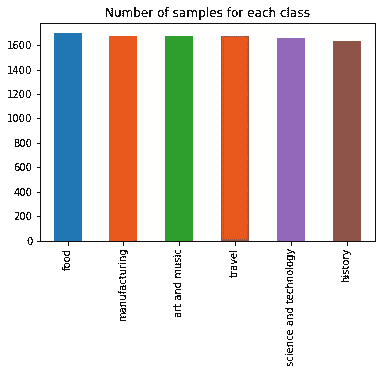

# Youtube 数据上的文本分类技术分析

> 原文：<https://towardsdatascience.com/analyzing-text-classification-techniques-on-youtube-data-7af578449f58?source=collection_archive---------13----------------------->



文本分类是自然语言处理所要解决的一个经典问题，它指的是分析原始文本的内容并确定其所属的类别。这类似于有人读了罗宾·夏尔马的书，把它归类为‘垃圾’。它有广泛的应用，如情感分析，主题标记，垃圾邮件检测和意图检测。

今天，我们将进行一项相当简单的任务，使用不同的技术(朴素贝叶斯、支持向量机、Adaboost 和 LSTM)并分析其性能，根据视频的标题和描述将视频分类为不同的类别。这些类别被选择为(但不限于):

*   旅游博客
*   科学与技术
*   食物
*   制造业
*   历史
*   艺术和音乐

事不宜迟，就像一个刚刚开始园艺的中年父亲会说，“让我们把手弄脏吧！”。

## 收集数据

当处理像这样的定制机器学习问题时，我发现收集自己的数据非常有用，如果不是简单地令人满意的话。对于这个问题，我需要一些关于属于不同类别的视频的元数据。如果你有点笨，我欢迎你手动收集数据并构建数据集。然而我不是，所以我会用 **Youtube API v3** 。它是由谷歌自己创建的，通过一段专门为我们这样的程序员编写的代码与 Youtube 进行交互。前往[谷歌开发者控制台](https://console.developers.google.com/)，创建一个示例项目并开始。我选择这样做的原因是，我需要收集成千上万的样本，我发现使用任何其他技术都不可能做到这一点。

> 注意:Youtube API，像谷歌提供的任何其他 API 一样，基于配额系统工作。根据你的计划，每封邮件每天/每月都有固定的配额。在我的免费计划中，我只能向 Youtube 发出大约 2000 次请求，这造成了一点问题，但我通过使用多个电子邮件帐户克服了这个问题。

API 的文档非常简单，在使用了超过 8 个电子邮件帐户来补偿所需的配额后，我收集了以下数据并将其存储在一个. csv 文件中。如果你想在你的项目中使用这个数据集，你可以在这里 **下载 [**。**](https://github.com/agrawal-rohit/Text-Classification-Analysis/blob/master/Collected_data_raw.csv)**



Collected Raw Data

> 注意:你可以自由探索一种被称为**网络抓取**的技术，它被用来从网站中提取数据。Python 有一个名为 *BeautifulSoup* 的漂亮库用于同样的目的。然而，我发现在从 Youtube 搜索结果中抓取数据的情况下，对于一个搜索查询，它只返回 25 个结果。这对我来说是一个障碍，因为我需要大量的样本来创建一个准确的模型，而这并不能解决问题。

## 数据清理和预处理

我的数据预处理过程的第一步是处理丢失的数据。因为丢失的值应该是文本数据，所以没有办法估算它们，因此唯一的选择是删除它们。幸运的是，在总共 9999 个样本中，只存在 334 个缺失值，因此它不会影响训练期间的模型性能。

“视频 Id”列对于我们的预测分析并不真正有用，因此它不会被选为最终训练集的一部分，所以我们没有任何预处理步骤。

这里有 2 个重要的栏目，即— **标题**和**描述**，但它们都是未经加工的原文。因此，为了过滤掉噪声，我们将遵循一种非常常见的方法来清理这两列的文本。这种方法分为以下几个步骤:

1.  **转换成小写:**执行这一步是因为大写对单词的语义重要性没有影响。“travel”和“Travel”应该被同等对待。
2.  **删除数值和标点:**数值和标点中使用的特殊字符($，！等等。)无助于确定正确的类别
3.  **删除多余的空格:**这样每个单词都由一个空格分隔，否则在标记化过程中可能会出现问题
4.  **记号化成单词:**这指的是将一个文本串分割成一个“记号”列表，其中每个记号是一个单词。例如，句子“我有巨大的二头肌”将转换为[“我”、“有”、“巨大”、“二头肌”]。
5.  **去除非字母单词和“停用词”:**“停用词”指的是 and、the、is 等单词，这些单词在学习如何构造句子时很重要，但对我们的预测分析没有用处。
6.  **词汇化:**词汇化是一种非常棒的技术，可以将相似的单词转换成它们的基本含义。例如，单词“flying”和“flyed”都将被转换成它们最简单的意思“fly”。


Dataset after text cleaning

“现在文字干净了，万岁！让我们开一瓶香槟庆祝吧！”

不，还没有。即使今天的计算机可以解决世界问题，玩超逼真的视频游戏，但它们仍然是不懂我们语言的机器。因此，我们无法将文本数据原样提供给我们的机器学习模型，无论它有多干净。因此，我们需要将它们转换成基于数字的特征，这样计算机就可以构建一个数学模型作为解决方案。这就构成了**数据预处理步骤**


Category column after LabelEncoding

由于输出变量(' Category ')也是分类的，我们需要将每个类编码为一个数字。这叫做*标签编码*。

最后，让我们关注一下每个样本的主要信息—原始文本数据。为了从文本中提取数据作为特征并以数字格式表示它们，一种非常常见的方法是**将它们矢量化**。Scikit-learn 库包含用于此目的的“TF-IDF 矢量器”。 **TF-IDF** (词频-逆文档频率)计算每个词在多个文档内部和跨文档的频率，以识别每个词的重要性。

## 数据分析和特征探索

作为一个额外的步骤，我决定显示类的分布，以便检查样本数量的不平衡。



此外，我想检查使用 TF-IDF 矢量化提取的特征是否有意义，因此我决定使用标题和描述特征为每个类找到最相关的单字和双字。

```
# USING TITLE FEATURES# 'art and music':
Most correlated unigrams:
------------------------------
. paint
. official
. music
. art
. theatre
Most correlated bigrams:
------------------------------
. capitol theatre
. musical theatre
. work theatre
. official music
. music video# 'food':
Most correlated unigrams:
------------------------------
. foods
. eat
. snack
. cook
. food
Most correlated bigrams:
------------------------------
. healthy snack
. snack amp
. taste test
. kid try
. street food# 'history':
Most correlated unigrams:
------------------------------
. discoveries
. archaeological
. archaeology
. history
. anthropology
Most correlated bigrams:
------------------------------
. history channel
. rap battle
. epic rap
. battle history
. archaeological discoveries# 'manufacturing':
Most correlated unigrams:
------------------------------
. business
. printer
. process
. print
. manufacture
Most correlated bigrams:
------------------------------
. manufacture plant
. lean manufacture
. additive manufacture
. manufacture business
. manufacture process# 'science and technology':
Most correlated unigrams:
------------------------------
. compute
. computers
. science
. computer
. technology
Most correlated bigrams:
------------------------------
. science amp
. amp technology
. primitive technology
. computer science
. science technology# 'travel':
Most correlated unigrams:
------------------------------
. blogger
. vlog
. travellers
. blog
. travel
Most correlated bigrams:
------------------------------
. viewfinder travel
. travel blogger
. tip travel
. travel vlog
. travel blog# USING DESCRIPTION FEATURES# 'art and music':
Most correlated unigrams:
------------------------------
. official
. paint
. music
. art
. theatre
Most correlated bigrams:
------------------------------
. capitol theatre
. click listen
. production connexion
. official music
. music video# 'food':
Most correlated unigrams:
------------------------------
. foods
. eat
. snack
. cook
. food
Most correlated bigrams:
------------------------------
. special offer
. hiho special
. come play
. sponsor series
. street food# 'history':
Most correlated unigrams:
------------------------------
. discoveries
. archaeological
. history
. archaeology
. anthropology
Most correlated bigrams:
------------------------------
. episode epic
. epic rap
. battle history
. rap battle
. archaeological discoveries# 'manufacturing':
Most correlated unigrams:
------------------------------
. factory
. printer
. process
. print
. manufacture
Most correlated bigrams:
------------------------------
. process make
. lean manufacture
. additive manufacture
. manufacture business
. manufacture process# 'science and technology':
Most correlated unigrams:
------------------------------
. quantum
. computers
. science
. computer
. technology
Most correlated bigrams:
------------------------------
. quantum computers
. primitive technology
. quantum compute
. computer science
. science technology# 'travel':
Most correlated unigrams:
------------------------------
. vlog
. travellers
. trip
. blog
. travel
Most correlated bigrams:
------------------------------
. tip travel
. start travel
. expedia viewfinder
. travel blogger
. travel blog
```

## 建模和培训

我们将分析的四个模型是:

*   朴素贝叶斯分类器
*   支持向量机
*   Adaboost 分类器
*   LSTM

数据集被拆分为训练集和测试集，拆分比例为 8:2。标题和描述的特征被独立计算，然后被连接以构建最终的特征矩阵。这用于训练分类器(除了 LSTM)。

对于使用 LSTM，数据预处理步骤与前面讨论的非常不同。这是它的流程:

1.  将每个样本的标题和描述组合成一个句子
2.  **将组合句子标记为填充序列:**将每个句子转换为标记列表，为每个标记分配一个数字 id，然后通过填充较短的序列并截断较长的序列，使每个序列具有相同的长度。
3.  对“Category”变量进行一次性编码

LSTM 的学习曲线如下所示:


LSTM Loss Curve


LSTM Accuracy Curve

## 分析性能

以下是所有不同分类器的精度-召回曲线。要获得额外的指标，请查看 [**完整代码**](https://github.com/agrawal-rohit/Text-Classification-Analysis/blob/master/Text%20Classification%20Analysis.ipynb) **。**


在我们的项目中观察到的每个分类器的等级如下:

**LSTM > SVM >朴素贝叶斯> AdaBoost**

LSTMs 在自然语言处理的多个任务中表现出了优异的性能，包括这个任务。LSTMs 中多个“门”的存在允许它们学习序列中的长期依赖性。深度学习 10 分！

支持向量机是高度鲁棒的分类器，它们尽最大努力寻找我们提取的特征之间的相互作用，但是学习到的相互作用与 LSTMs 不一致。另一方面，朴素贝叶斯分类器认为特征是独立的，因此它的性能比支持向量机稍差，因为它没有考虑不同特征之间的任何交互作用。

AdaBoost 分类器对超参数的选择非常敏感，因为我使用了默认模型，所以它没有最佳参数，这可能是性能差的原因

我希望这对你和对我一样有益。完整的代码可以在我的 Github 上找到。

[](https://github.com/agrawal-rohit) [## agrawal-rohit —概述

### 拥有 3 年以上项目工作经验的初级数据科学家和软件开发人员。高度熟练的机器…

github.com](https://github.com/agrawal-rohit) 

再见