# 使用熊猫分析疾病控制中心(CDC)的癌症数据，第 1 部分

> 原文：<https://towardsdatascience.com/analyzing-the-center-for-disease-control-cdc-cancer-data-using-pandas-part-1-64e30fdeb1fb?source=collection_archive---------37----------------------->


Photo by [Miguel Á. Padriñán](https://www.pexels.com/@padrinan) on [Pexels](https://www.pexels.com/photo/awareness-cancer-design-pink-579474/)

虽然癌症药物开发和治疗的研究多年来取得了进展，但癌症每年仍夺去成千上万人的生命。尽管如此，随着对数据的访问、计算能力和最先进的机器学习工具的增加，癌症研究进展的潜力继续增长。

在本帖中，我们将探索[疾病控制中心癌症数据集](https://www.cdc.gov/cancer/uscs/dataviz/download_data.htm)。该数据集包括脑瘤、各州癌症类型、种族、年龄等信息。在这篇文章中，我们将探索“大脑旁站点”。' TXT '数据。

我们从导入熊猫图书馆和阅读开始。TXT '文件转换成熊猫数据帧。每一列都用“|”分隔，所以我们也适当地设置分隔参数“sep”。我们还可以指定需要分析的列，并显示前五行数据，以了解列类型和值:

```
df = pd.read_csv("BRAINBYSITE.TXT", sep="|")
df = df[['AGE', 'BEHAVIOR', 'COUNT', 'POPULATION', 'SEX', 'YEAR', 'SITE"]]
print(df.head())
```

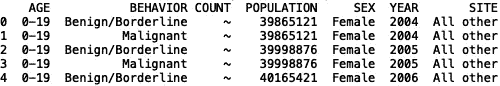

“计数”列包含一些我们可以删除的缺失值:

```
df = df[df['COUNT'] != '~']
df.reset_index(inplace=True)
print(df.head())
```

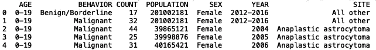

为了开始我们的分析，我们可以生成“计数”列的直方图，以可视化所有类别的肿瘤分布:

```
import seaborn as sns
import matplotlib.pyplot as plt#settings for the histogram plot
sns.set(font_scale = 2)
plt.ylim(0, 80)
plt.xlim(0, 10000)df['COUNT'] = df['COUNT'].astype(int)
df['COUNT'].hist(bins=1000)
```

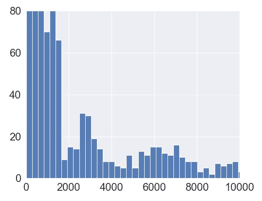

Distribution in Tumor Counts

我们还可以在重叠图上查看女性和男性肿瘤数量的直方图:

```
#define female and male data frames
df_female = df[df['SEX'] == 'Female']
df_male = df[df['SEX'] == 'Male']#overlay histograms
df_female['COUNT'].hist(bins=1000)
df_male['COUNT'].hist(bins=1000).set_title('Male and Female')
```

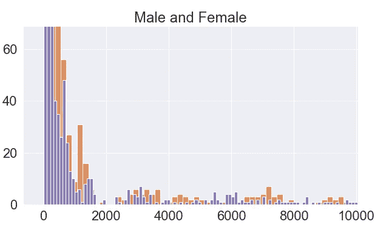

Overlay of distributions in tumor counts for males and females

我们可以进行更细致的分析，观察给定年份(假设“年份”=2004 年)女性和男性的肿瘤数量分布:

```
df_female = df[df['SEX'] == 'Female']
df_female = df_female[df_female['YEAR'] ==  '2012-2016']
df_female.loc[:, 'COUNT'] = df_female['COUNT'].astype(int)
df_female['COUNT'].hist(bins=1000).set_title('Female ')
```

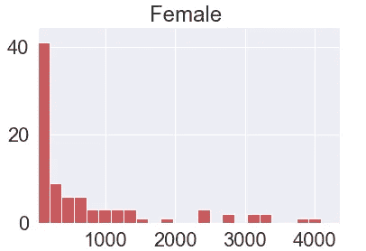

Distribution in tumor counts for females between 2012–2016

```
df_male = df[df['SEX'] == 'Male']
df_male = df_male[df_male['YEAR'] == '2012-2016']
df_male.loc[:, 'COUNT'] = df_male['COUNT'].astype(int)
df_male['COUNT'].hist(bins=1000).set_title('Male')
```

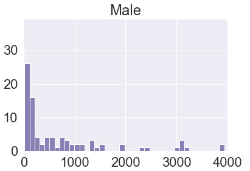

Distribution in tumor counts for males between 2012–2016

接下来，我们可以生成“原油价格”与“年份”的散点图。在这里，我们还将调整散点图点的大小，以便大小和色调与“计数”成比例。我们还过滤数据帧以获得对应于 0.1 以上的“部位”=“间变性星形细胞瘤”、“行为”=“恶性”和“粗制率”的行。对于女性，我们有:

```
df_female = df[df['SEX'] == 'Female']
df_female = df_female[df_female['SITE'] == 'Anaplastic astrocytoma']
df_female = df_female[df_female['BEHAVIOR'] == 'Malignant']#remove baseline value present in each year
df_female = df_female[df_female['CRUDE_RATE'] > 0.1]sns.scatterplot(df_female["YEAR"], df_female["CRUDE_RATE"], sizes = (1000, 1500), size =  df_female["COUNT"], alpha = 0.8,hue = df_female["COUNT"])
```

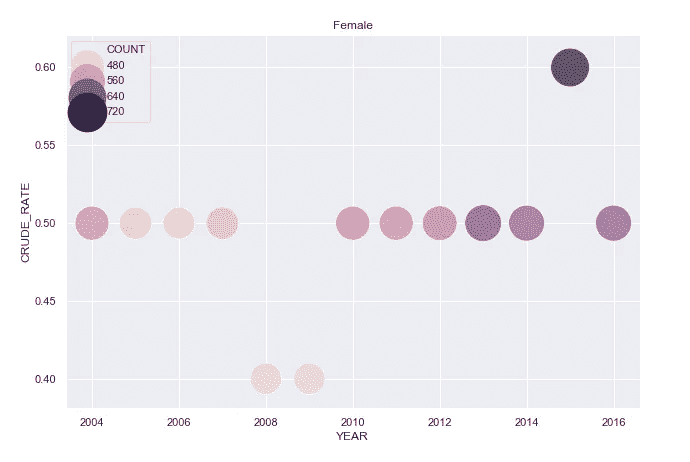

Scatter plot of ‘CRUDE_RATE’ vs ‘YEAR’ of Anaplastic astrocytoma in females

我们也可以看看这个雄性的图:

```
df_male = df[df['SEX'] == 'Male']
df_male = df_male[df_male['SITE'] == 'Anaplastic astrocytoma']
df_male = df_male[df_male['BEHAVIOR'] == 'Malignant']#remove baseline value present in each year
df_male = df_male[df_male['CRUDE_RATE'] > 0.1]
sns.scatterplot(df_male["YEAR"], df_male["CRUDE_RATE"], sizes = (1000, 1500), size =  df_male["COUNT"], alpha = 0.8,hue = df_male["COUNT"])
```

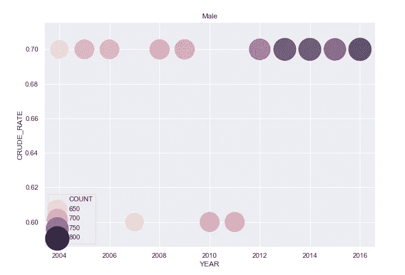

Scatter plot of ‘CRUDE_RATE’ vs ‘YEAR’ of Anaplastic astrocytoma in males

如你所见，2004 年至 2016 年间，女性和男性间变性星形细胞瘤的粗发病率都有所上升。还值得注意的是，男性患这种脑瘤的比率高于女性。尝试生成其他肿瘤类型的散点图，看看女性和男性之间是否有任何有趣的差异。

接下来，我们可以从这些数据列中生成一些统计数据。我们可以定义一个函数，输出分类变量的唯一值集，并计算该值在数据中出现的次数:

```
from collections import Counter
def get_unqiue_values(feature):
    print("{} Unique Set: ".format(feature), set(df[feature]))
    print("{} Count: ".format(feature), dict(Counter(df[feature])))get_unqiue_values('SEX')
```

当我们使用“性别”字段调用“get_unqiue_values”函数时，输出显示每个“性别”类别的唯一值列表以及每个值在数据中出现的次数。

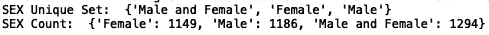

Uniques set of ‘SEX’ values and their frequencies

我们可以对“行为”做同样的事情:

```
get_unqiue_values('BEHAVIOR')
```

输出是“行为”类别的唯一值的列表，以及每个值在数据中出现的次数。

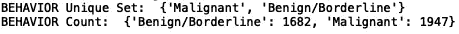

Uniques set of ‘BEHAVIOR’ values and their frequencies

对于“站点”类别:

```
get_unqiue_values('SITE')
```

输出显示了“SITE”列的唯一值列表以及每个值在数据中出现的次数。

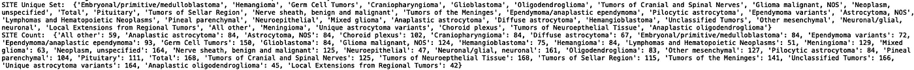

Unique set of ‘SITE’ values and their frequencies

与该数据集中的其他分类变量相比，存在相对更多的唯一“位置”值。我们可以通过查看五个最常见(最频繁出现)的值来缩小范围:

```
from collections import Counter
def get_unqiue_values(feature):
    print("{} Unique Set: ".format(feature), set(df[feature]))
    print("{} Count: ".format(feature), dict(Counter(df[feature]).most_common(5)))
get_unqiue_values('SITE')
```

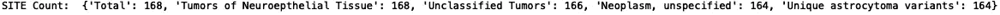

Most common ‘SITE’ values

将这些数据可视化可能比盯着字典更有用一些。为此，我们可以更新函数“get_unqiue_values ”,使其返回 10 种最常见脑瘤的字典:

```
def get_unqiue_values(feature):
    print("{} Unique Set: ".format(feature), set(df[feature]))
    print("{} Count: ".format(feature), dict(Counter(df[feature]).most_common(5)))
    result = dict(Counter(df[feature]).most_common(10))
    return result
```

接下来，我们迭代“站点”频率字典，并将键和值存储在数据框中:

```
key_list = []
value_list = []
for key, value in get_unqiue_values('SITE').items():
    key_list.append(key)
    value_list.append(value)
site_df = pd.DataFrame({'SITE': key_list, 'Count':value_list} )
```

最后，我们使用 seabon 定义一个条形图对象，并设置 x 轴标签:

```
ax = sns.barplot(x=site_df.SITE, y=site_df.Count)
ax.set_xticklabels(site_df.SITE, rotation=30)
```

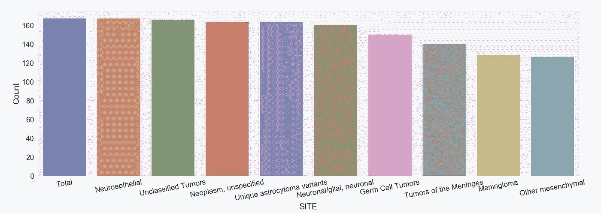

The frequency of tumor types

在‘BRAINBYSITE’有更多值得探索的地方。TXT '数据，但现在我们将结束我们的分析。在接下来的几篇文章中，我将继续探索[疾病控制中心癌症数据集](https://www.cdc.gov/cancer/uscs/dataviz/download_data.htm)中提供的一些其他数据集。在那之前，你可以自己在其他数据集上重复这个分析。这篇文章中显示的代码可以在 [GitHub](https://github.com/spierre91/medium_code) 上找到。祝好运，机器学习快乐！