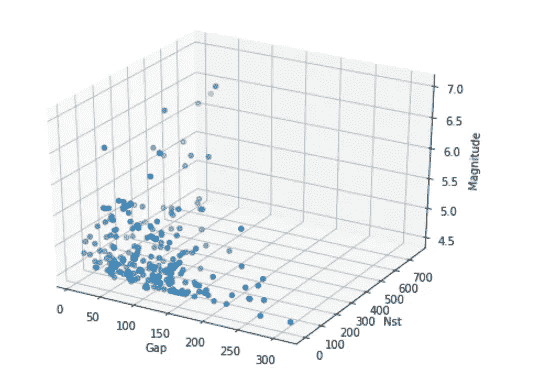

# 分析美国地震以确定可能的地震风险。

> 原文：<https://towardsdatascience.com/analyzing-the-earthquakes-in-usa-to-determine-the-possibly-risky-to-quakes-hotels-2a9ff162e747?source=collection_archive---------14----------------------->


Photo by [Sunyu Kim](https://unsplash.com/@mauveine?utm_source=medium&utm_medium=referral) on [Unsplash](https://unsplash.com?utm_source=medium&utm_medium=referral)

曾经想过，如果有一个预测系统，可以在地震袭击我们脚下的地面之前准确地预测地震，死亡人数和几座摩天大楼、住宅、酒店的破坏将大幅减少，因此我们可以逃离自然的最大灾难之一，地震将不再成为一个人死亡的原因。

假设，你去了美国太平洋沿岸的一个海滨城市，并入住了一家酒店。现在，你正在欣赏海景，突然你感觉到一个脆弱的震动，酒店，可能是一座摩天大楼像玩具一样倒塌了，现在你想知道如果你知道在这些地震严重的地方哪些酒店需要仔细检查和升级抗震设备，你不会只受用户评级的影响而选择这家酒店入住。

但是，通过当今非常强大的数据科学工具的进步，有可能确定发生地震的可能性很高的地方，通过那个地方，人们可以很容易地获取附近商业场所的数据，包括商业场所、公寓或任何东西，以测量风险因素和结构强度，为它们配备抗震设备并升级它们，从而确保居民和游客的安全。

# 那么，我们要做什么？高层次概述:

所以，现在，问题对我们来说是清楚的。我们需要分析地震记录，必须确定地震发生率较高的地点，并确定因其位置而可能处于危险中的酒店。考虑到这个问题，让我们采取有条不紊的方法来解决这个问题。我们将按照约翰·罗林斯博士提出的方法来解决这个问题。

首先，让我们从某个数据提供商那里获取一个包含美国地震数据的数据集，开始处理这些数据。在获取阶段完成后，让我们继续清理获取的数据集，方法是删除不必要的列，用有意义的内容替换空值或无效值，并通过用不规则范围规范化值来使所有列同等重要。

现在我们分析数据框的不同列以及它们与其他列的关系。简而言之，为了便于分析，我们现在试图找到列值之间的关系。在这个过程中，我们使用了几个 Python 可视化库和包来支持我们的发现。

现在，我们对整个数据框进行分组，以搜索出现频率独特的位置。

接下来，我们将继续收集记录地震事件最频繁的地方的地理编码纬度和经度。我们将把这个纬度和经度数据传递给我们的街道级信息提供程序，以获取一个包含不同商业场所信息的结果集，包括记录的场所附近的酒店信息。

# 选择地震和街道级数据提供商并请求数据:

在我们深入分析之前，我们需要大量的数据和信息。在数据科学领域，选择可靠且价格合理的数据提供商是至关重要的。我们必须确保提供给我们的数据是高效、可靠、使用灵活、可修改和定制的。事实上，如果是人工审核，而不是自动生成，准确性和可靠性会提高。

所以，考虑到所有的事情，我决定和美国地质调查局(USGS)一起收集地震数据。 [USGS](https://earthquake.usgs.gov/earthquakes/search/) 提供了非常直观、易用、可靠的 API 和 web 门户服务，在输出格式、指定感兴趣的区域等方面提供了灵活性。美国地质勘探局是一个政府运营的研究中心，他们提供的数据是免费的，非常可靠，因为大多数数据在注册前都经过了人工审查。API 请求链接不需要任何身份验证。

因此，我们指定我们感兴趣的地区为美国，选择我们感兴趣的时间段为 2010 年至 2019 年，输出格式为逗号分隔值(CSV ),然后点击搜索以获得结果。我们可以使用 API 来请求数据。请求 URL 的格式如下所示。

```
import requests
usgs_request_url = ‘[https://earthquake.usgs.gov/fdsnws'](https://earthquake.usgs.gov/fdsnws')
usgs_request_url+=’/event/1/query.geojson?starttime=2010–04–20%2000:00:00&endtime=2019–04–27%2023:59:59'
usgs_request_url+=’&maxlatitude=50&minlatitude=24.6&maxlongitude=-65&minlongitude=-125&minmagnitude=2.5&orderby=time&limit=2000'requests.get(usgs_request_url).json()
requests
```

我已经下载了一个格式化的 CSV 数据框架来使用。可以按照链接:[https://S3 . Amazon AWS . com/swastiknath group/seismic _ results . CSV](https://s3.amazonaws.com/swastiknathgroup/Earthquake_results.csv)下载文件，在自己的笔记本或其他任何 python 环境下使用。

获取数据后，我们使用 pd.read_csv()函数从 CSV 文件创建一个 Pandas Dataframe，并使用 pd.drop()函数删除所有不必要的列，该函数提供要作为 list 对象删除的列，作为 drop 函数的输入参数。

我还决定使用 [Foursquare API](http://developer.foursquare.com) 来获取美国各地商业场所的街道信息，包括我感兴趣的地方。他们的 API 使用起来非常便宜，有很好的文档记录并且可靠。每次连接到 Foursquare 服务器并请求数据时，您都必须验证您的 API 请求 URL。身份验证的格式如下:

```
#credentials for communicating with Foursquare API:
CLIENT_ID= 'your client id'
CLIENT_SECRET = 'your client secret'
VERSION = integer date of version.
```

一旦我们提取完地震数据，我们将定义一个 python 函数，将 USGS 地震数据集返回的纬度和经度列表作为输入，并使用该数据搜索易受地震影响的地方附近的酒店。自定义函数 whats _ nearby 也从 JSON 响应和 Pandas 数据框中检索数据，以更好地表示这些值。

```
#custom function for requesting street-level business information #from foursquarefrom progressbar import ProgressBar, Bar, Percentage
pbar = ProgressBar(widgets=[Percentage(), Bar()], maxval=300).start()

import requests
def whats_nearby(latitudes, longitudes, radius = 15000):
  nearby_places_list1 = []

  status = 'EXECUTION STARTED, PLEASE WAIT ->'
  for lat, lng in zip(latitudes, longitudes):
    for i in range(len(latitudes)):
        pbar.update(i+1)
    pbar.finish()
    query_url = '[https://api.foursquare.com/v2/venues/search?&query=hotel&client_id={}&client_secret={}&v={}&ll={},{}&radius={}&limit={}'.format(](https://api.foursquare.com/v2/venues/search?&query=hotel&client_id={}&client_secret={}&v={}&ll={},{}&radius={}&limit={}'.format()
            CLIENT_ID,                       
            CLIENT_SECRET, 
            VERSION, 
            lat, lng, 
            15000, 
            100)
    response = requests.get(query_url).json()['response']['venues']

    nearby_places_list1.append([(r['name'], 
                          r['location']['lat'], 
                          r['location']['lng'],
                          r['location']['formattedAddress']) for r in response])
  vulnerable_places = pd.DataFrame(item for nearby in nearby_places_list1 for item in nearby)
  vulnerable_places.columns = ['Venue', 'Venue Latitude', 'Venue Longitude', 'Address']

  return vulnerable_places
```

# 分析变量和它们之间的关系曲线:

现在让我们尝试理解特征集的变量之间的关系，以理解单个变量对地震测量的影响。

想象一下，尽管机器学习、监督、非监督和深度强化学习过程取得了很大进步，但是什么一直在机器学习模型和完全准确的地震预测之间建立障碍？自然和由自然生成的数据是非常不规则的，并且不能被精确地映射成数学关系，尽管自然的每个元素都是由算法驱动的，但是它们理解起来非常非常复杂，并且对于机器学习模型来说是不规则的、不可靠的。每个训练有素的机器学习模型都试图以最简单的方式将特征集与目标细胞进行映射。我们建立了一个深度神经网络来正确预测地震，但仍然没有预期的那么好。

让我们想象一下地震能量波的均方根速度与震级之间的关系。我们使用 Seaborn 包，它是基于 Matplotlib 构建的，可以自动生成具有最高可信度的线性回归图。这是一个很大的特点，它根据回归线显示了曲线的偏差。在均方根与幅度的关系中，我们看到两者之间存在线性关系，尽管线的两侧存在极小的偏差。由于自然的不规则性，这些偏差可以忽略。

```
sns.regplot(x= earth_quake_encoded['rms'], y= earth_quake_encoded['mag'], data = earth_quake_encoded, color = 'purple')
```


Regression plot between Root Mean Square Speed and Magnitude

现在，让我们想象地震波破裂的深度与震级之间的关系。由于自然的不规则性导致的偏差量很小的回归线。

```
import seaborn as sns
reg_plot_depth_mag = pd.DataFrame(columns =['Depth', 'Magnitude'])
reg_plot_depth_mag['Depth'] = earth_quake_encoded['depth'].values
reg_plot_depth_mag['Magnitude'] = earth_quake_encoded['mag'].valuessns.regplot(x=reg_plot_depth_mag['Depth'], y = reg_plot_depth_mag['Magnitude'], data = reg_plot_depth_mag, color = 'blue')
```


Regression plot between Magnitude and Depth.

现在是时候将从记录到震中的水平距离与震级之间的关系曲线可视化了。回归图显示了具有高偏差的线性回归线，基本上意味着两个变量之间的非线性。

```
sns.regplot(x= earth_quake_encoded['dmin'], y = earth_quake_encoded['mag'], data = earth_quake_encoded, color = 'crimson')
```


Regression plot between Horizontal distance vs. Magnitude

现在让我们通过可视化来验证数据集。让我们看一下测量星等误差与星等之间的散点图，以获得对数据集的信心，我们决定也绘制回归线。结果是我们所期望的。回归线就其斜率而言是负的，并且具有最小的偏差，这确实意味着，如果测量量值的误差增加，则实际量值减小。

```
sns.regplot(x = earth_quake_encoded['magError'], y=earth_quake_encoded['mag'], color = 'orange')
```


Negative Regression plot between Magnitude and error in measuring magnitude

我们现在想看一下时间框架，基本上是相对于时间连续绘制震级。我们使用 Pandas Series.from_csv 创建一个系列对象，并使用 Matplotlib 的 pyplot 脚本层直接绘制它。在绘制之前，我们确保正确理解了每一列的数据类型。脚本层足够智能，可以相对于选定的时间段以较小的比例(为了更好的可视化)绘制幅度。

```
time_vs_mag_bar = pd.DataFrame(columns = {'time', 'mag'})
time_vs_mag_bar['time'] = usa_earthquakes['time']
time_vs_mag_bar['mag'] = usa_earthquakes['mag']
time_vs_mag_bar.to_csv('time_vs_mag.csv')dates = mpl.dates.date2num(time_vs_mag_bar['time'].values)
plt.plot_date(dates, usa_earthquakes['mag'])
```


Time-frame representation of magnitude vs. time

```
from pandas import Series
series = Series.from_csv('usa_earth_quakes.csv', header=0)
series.plot(style='-')
plt.show()
```


Pandas Series plotting of continuous time-frame plotting of magnitude(in a smaller scale) vs. time.

我们现在希望在三维空间中可视化数据集，以便更好地反映沿每个轴的变化。因此，我们使用 Matplotlib 的 mpl_toolkits.mplot3d 包的 Axes3D 函数绘制深度、均方根、震级和记录站之间的角度间隙、记录事件所需的站数和震级的三维示意图。

```
from mpl_toolkits.mplot3d import Axes3D
fig = plt.figure(figsize = (8, 6))
ax = fig.add_subplot(111, projection = '3d')
ax.set_xlabel('Depth')
ax.set_ylabel('RMS')
ax.set_zlabel('Magnitude')
ax.scatter(usa_earthquakes['depth'], usa_earthquakes['rms'], usa_earthquakes['mag'])
plt.show()
```


3-dimensional representation of Depth vs. RMS vs. Magnitude

```
fig = plt.figure(figsize = (8, 6))
ax = fig.add_subplot(111, projection = '3d')
ax.scatter(usa_earthquakes['gap'], usa_earthquakes['nst'], usa_earthquakes['mag'])
ax.set_xlabel('Gap')
ax.set_ylabel('Nst')
ax.set_zlabel('Magnitude')
plt.show()
```



3-dimensional representation of angular gap vs. number of stations vs. magnitude

# 看看代表美国易受地震影响地区的不同地图:

从检索到的地震数据中，我们获取纬度、经度和地名(使用 Regex 模式获得)。我们使用一个叫做 Folium 的 python 映射库。Folium is 使用 Leaflet.js 创建高度交互式的地图。因此，此时我们在以美国为中心的地图中绘制纬度和经度，并使用一个名为 HeatMap 的 folio 插件来生成一个热图，沿地图显示整个美国的漏洞频率。由于是交互式的，热图会随着缩放级别而变化。我们还可以使用另一个名为 FastMarkerCluster 的功能，以一种整洁的方式可视化地震重灾区。FastMarkerCluster 也是交互式的。它们随着缩放级别折叠和展开。

```
heat_quake_map = folium.Map(location=[usa_earthquakes['latitude'].mean(), 
                                usa_earthquakes['longitude'].mean()], 
                                zoom_start=4)
latlons = usa_earthquakes[['latitude', 'longitude']].values.tolist()
from folium.plugins import HeatMap
HeatMap(latlons).add_to(heat_quake_map)
heat_quake_map
```


Heat map showing earthquake heavy regions around USA.

```
from folium.plugins import MarkerCluster
from folium.plugins import FastMarkerCluster
usa_quake_map = folium.Map(location=[usa_earthquakes['latitude'].mean(), 
                                usa_earthquakes['longitude'].mean()], 
                                zoom_start=4)usa_quake_map.add_child(FastMarkerCluster(usa_earthquakes[['latitude', 'longitude']].values.tolist()))
usa_quake_map
```


Map showing the clusters of recorded earthquakes and their location in USA.

# 分析酒店数据:

前面我们看到了如何使用 Foursquare 获取街道级别的数据。因此，在我们获取完酒店数据后，现在是分析从 Foursquare API 返回的附近酒店数据集的时候了。现在，我们删除空值，只需使用'就可以按唯一的酒店名称对值进行分组。数据框的酒店名称列上的“unique()”方法。我们通过简单地使用“获得每个记录位置附近酒店的发生频率(“易受攻击事件”)。“value_counts()”方法。首先，我们返回显示酒店及其易受攻击事件的数据框。

```
num = fx['Venue'].value_counts()
vulnerables = num.rename_axis('business_name').reset_index(name='Vulnerable Occurrence')
vulnerables
```


Pandas Dataframe showing the hotel names returned by Foursquare API which are frequently nearby to the recorded earthquake events.


Hotels with their respective Vulnerable occurrences in a horizontal bar chart.

```
needs_attention = vulnerables
needs_attention.set_index('business_name', inplace = True)
needs_attention.plot(kind = 'barh', width = 0.8, edgecolor = 'black', color = 'tomato')
fig = plt.figure(figsize = (20, 10))
plt.show()from folium.plugins import MarkerCluster
from folium.plugins import FastMarkerCluster
vulnerable_business_map = folium.Map(location = [usa_earthquakes['latitude'].mean(), 
                                usa_earthquakes['longitude'].mean()], tiles = 'OpenStreetMap',
                                zoom_start=4)
vulnerable_business_map.add_child(FastMarkerCluster(fd_grouped[['Venue Latitude', 'Venue Longitude']].values.tolist()))folium.Circle([usa_earthquakes['latitude'].mean(),usa_earthquakes['longitude'].mean()], radius=1500000, color='red', opacity = 0.6, fill=False).add_to(vulnerable_business_map) 
folium.Circle([usa_earthquakes['latitude'].mean(),usa_earthquakes['longitude'].mean()], radius=2000000, color='red', opacity = 0.6, fill=False).add_to(vulnerable_business_map) 
folium.Circle([usa_earthquakes['latitude'].mean(),usa_earthquakes['longitude'].mean()], radius=2500000, color='red', opacity = 0.6, fill=False).add_to(vulnerable_business_map)from folium.plugins import HeatMap
latlons = usa_earthquakes[['latitude', 'longitude']].values.tolist()
HeatMap(latlons).add_to(vulnerable_business_map)
vulnerable_business_map
```


Hotels that requires attention and nearby to the earthquake events on the heat map validating the result.

# 聚集酒店:

聚类是一种无监督的学习过程，它基于某些相似性分割或聚集未标记的数据集。因此，这里我们将使用 KMeans 作为一种聚类算法，它功能强大但使用简单。它基本上从数据集中选取 k 个质心，并根据距质心的平均 Minkowski 距离将它们动态分配到一个聚类中，直到算法收敛。

这里，我们将数字 5 指定为要将数据分割成的簇的数量。我们像这样使用 ScikitLearn 包:

```
from sklearn.cluster import KMeans
cluster_list = fx.set_index('Venue')
cluster_list
num_clusters = 5
clusters = cluster_list.drop('Address', 1)
kmeans_cls = KMeans(n_clusters = num_clusters, random_state = 0).fit(clusters)
kmeans_cls.labels_
```

我们现在删除 hotels 数据集的标签，并将其作为输入提供给 KMeans，以获得聚类标签。最后，我们将聚类标签与它们各自的酒店名称连接起来，并使用颜色索引将它们绘制在叶子地图上，以便更好地可视化聚类。

```
cluster_list['Cluster Labels'] = kmeans_cls.labels_
cluster_list.reset_index(inplace = True)
cluster_list
```


Dataframe showing the hotels, their location data and above all, cluster labels.

```
import matplotlib.cm as cm
import matplotlib.colors as colors
lat_usa = 37.09
lng_usa = -95.71
mapping_earthquake_cluster = folium.Map(location = [lat_usa, lng_usa], zoom_start = 4)

cluster_in = [int(i) for i in cluster_list['Cluster Labels']]

x = np.arange(num_clusters)
ys = [i + x + (i*x)**2 for i in range(num_clusters)]
colors_array = cm.rainbow(np.linspace(0, 1, len(ys)))
rainbow = [colors.rgb2hex(i) for i in colors_array]markers_colors = []
for lat, lon, poi, cluster in zip(cluster_list['Venue Latitude'], cluster_list['Venue Longitude'], cluster_list['Venue'], cluster_in):
    label = folium.Popup(str(poi) + ' Cluster ' + str(cluster), parse_html=True)
    folium.CircleMarker(
        [lat, lon],
        radius=10,
        popup=label,
        color=rainbow[cluster-1],
        fill=True,
        fill_color=rainbow[cluster-1],
        fill_opacity=0.7).add_to(mapping_earthquake_cluster)
mapping_earthquake_cluster
```


Folium Map showing the clustered hotels.

# 商业方法:

从商业的角度来说，我们可以说，这个项目将有助于政府城市管理部门，如市政公司或不同的测量师。另一方面，该项目对于不同酒店或企业的利益相关者来说非常有用，以确定他们的酒店或企业是否需要注意抗震设备的升级或结构强度的评估。

[要查看完整的代码和它是如何实现的，请点击这里查看我的谷歌合作笔记本](https://colab.research.google.com/drive/1dSSeETsTHjygomwY2mDOM7tDx8zArP4X)。

结束。和平！

> “我们是我们的思想造就了我们；所以小心你的想法。文字是次要的。思想活着；他们旅行很远。”
> 
> ~斯瓦米·维威卡难达。