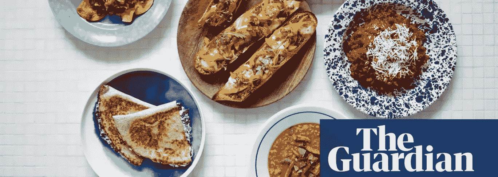
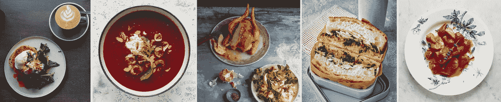
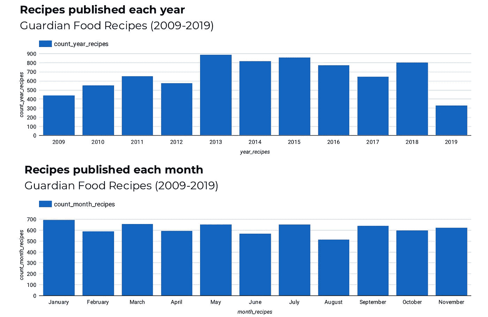
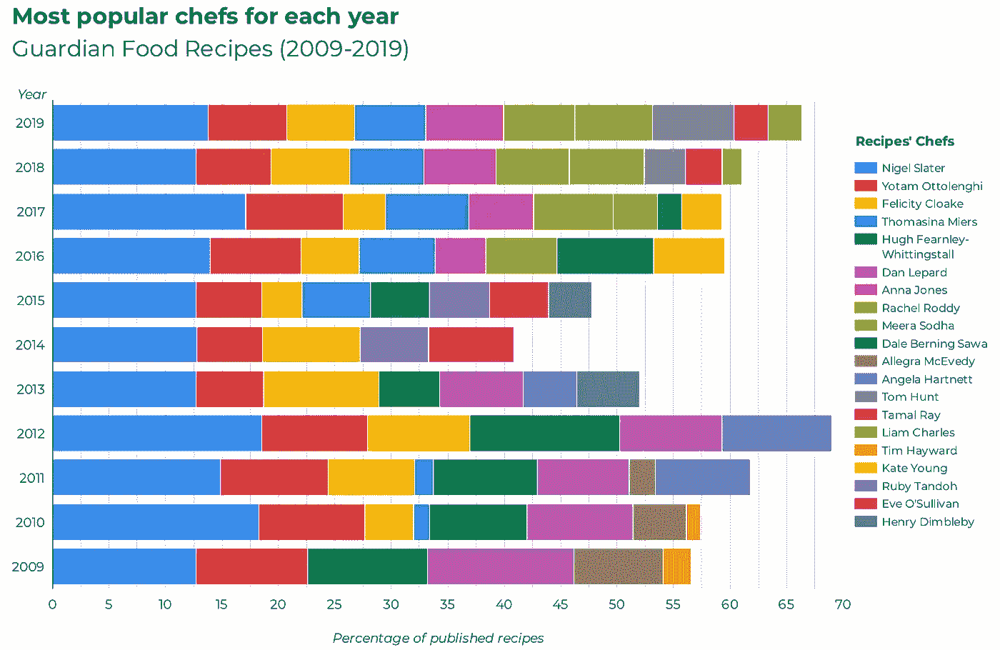
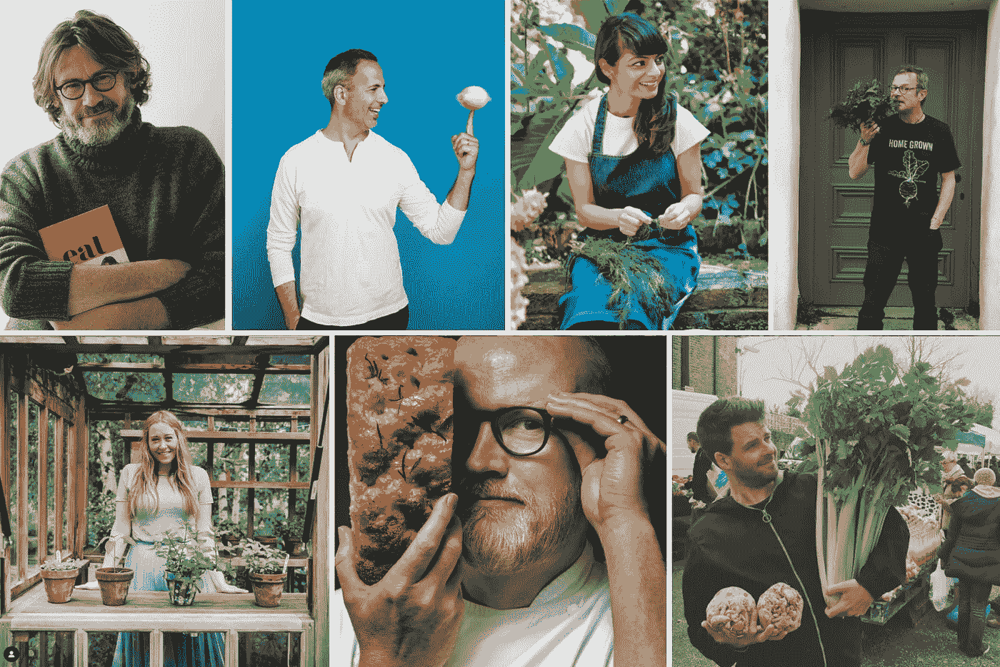
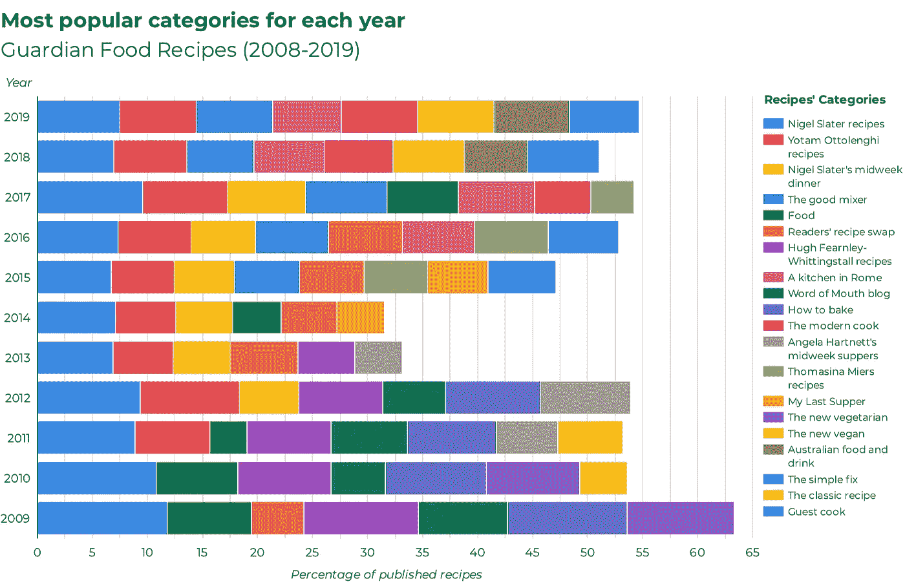
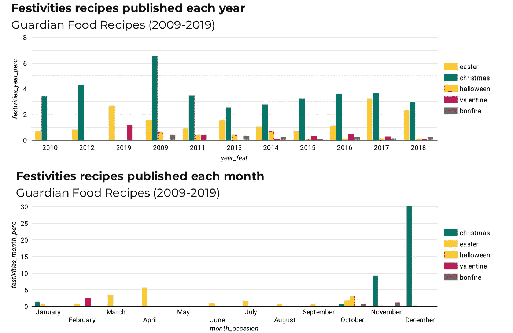
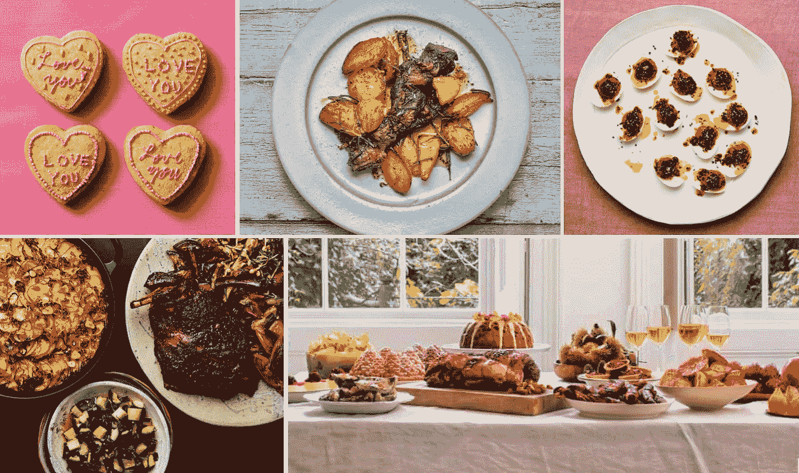
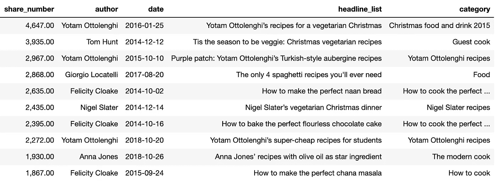
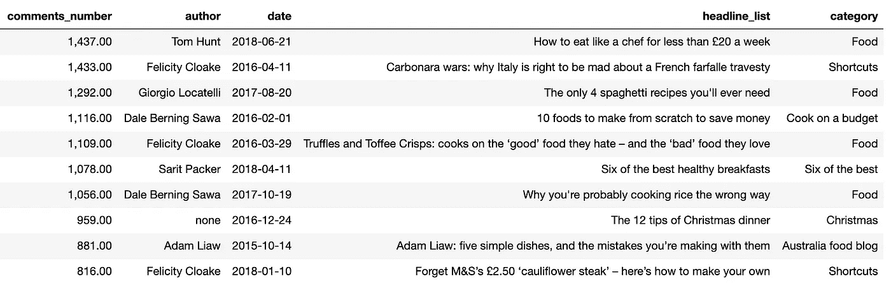

# 卫报食谱(第 1 部分):探索性数据

> 原文：<https://towardsdatascience.com/analyzing-the-guardian-food-recipes-from-2009-to-2019-11b83e12efdf?source=collection_archive---------25----------------------->

## 第 1 部分:探索性数据分析——卫报食谱

The Guardian Food Recipes by [TheGuardian](https://medium.com/u/946be635acde?source=post_page-----11b83e12efdf--------------------------------)

# 介绍

《卫报》每天都会公布名厨的食谱。报纸的美食版为美食爱好者、业余厨师、饥饿的学生或疲惫的父母提供了新菜肴的灵感。它邀请业余厨师探索无限的烹饪世界，接触新的食材和风味，学习烹饪技术或为庆祝盛宴寻找灵感。简而言之,《卫报》的美食栏目吊起了每个读者的胃口。

然而，报纸上的烹饪文章揭示的不仅仅是食物成分。它们影响着饮食文化、消费者购买、读者饮食和传统的家庭食谱。此外，他们还充当年轻厨师的跳板，并维系着值得信赖和喜爱的厨师群体的建立。

我对网络搜集的好奇心以及对数据分析和食物的热情，自然而然地吸引我访问和探索这些报纸文章的内容。《卫报》是我开始研究时想到的第一份报纸，因此让我得以深入了解英国烹饪界。这篇文章的目的是呈现一些从 2009 年 1 月 1 日到 2019 年 6 月 16 日出版的《卫报》食物食谱的**探索性数据分析**。

如果你觉得有点饿，想在阅读的同时吃点零食，你可以在这里找到所有有趣的食谱！

British Food Recipes — Established Belfast’s poached eggs, Jeremy Fox’s beet gazpacho (photo by Lizzie Mayson), Gill Meller’s roast chicken (photo by Romas Foord), Rebecca Oliver’s smoked mackerel sandwich (photo by Jean Cazals), River Cottage Strawberries (photo by Lizzie Mayson)

# 数据和方法

在开始我的分析之前，我首先需要收集数据！这是通过使用[美汤](https://www.crummy.com/software/BeautifulSoup/bs4/doc/#)和[请求](https://2.python-requests.org/en/master/)的网页抓取完成的。因为这是我第一次体验，所以不像烤馅饼那么简单。我花了几个小时通读食谱页面的 HTML 代码，查看每个元素的存储位置。我很幸运地找到了其他媒体成员的巨大帮助，尤其是来自克里·帕克的教程和 Ritvik Kharkar 的文章。

我总共收集了 7，361 篇食谱文章，最早的一篇可以追溯到 2009 年 1 月 3 日，最近的一篇是 2019 年 6 月 16 日。在浏览食谱网址时，我特别注意检索以下七条信息:

*   出版日期
*   文章标题，或者，如果你喜欢，食谱标题
*   文章副标题，一句话描述食谱
*   文章内容、配方文本和配料表
*   作者姓名
*   评论数量和文章被分享的次数

有些文章没有关于上述要素的信息，因此，如果没有找到一个要素，将写下“无”。第二步，我删除了没有作者和字幕的食谱。

# 分析食谱

以下图表说明了为更好地理解《卫报》的烹饪遗产所采取的分析步骤。在此，我提出以下初步分析:

*   每年每月的食谱数量
*   每年最著名的五位厨师(根据出版的食谱数量)
*   每年最著名的种类(根据食谱数量)
*   为特殊场合发布的食谱的百分比
*   十个最常分享的食谱
*   评论最多的十种食谱

**每年每月的食谱数量**

下面的条形图显示了 2009 年至 2019 年期间每年发布的食谱数量，以及全年每个月的食谱数量。有趣的是，在 2012 年之后，食品食谱的出版数量有所上升，在 2013 年达到顶峰，共有 882 种食谱。此后，这一数字又略有下降，但从那时起，平均每天发布 2 个食谱。

你对 2019 年的猜测是什么？厨师们会有创意，发表比 2013 年还要多的作品吗？

The bar charts show the number of recipes published each year and each month between 2009 and 2019.

**年度五大名厨**

看看对《卫报》食谱贡献最大的五位作者，就能洞察厨师们的受欢迎程度。这一年有变化吗？有没有一个厨师得到了更多的关注，并因此获得了在自己的专栏中发表文章的特权？下面的交互图显示了每年发布食谱数量最多的五位厨师。

乍看之下，奈杰尔·斯莱特和约塔姆·奥托林吉是最负盛名的美食食谱作者，这是无可争议的。自 2009 年以来，两位厨师不断为卫报烹饪遗产做出贡献，影响人们购买、准备、烹饪、分享和食用食物的方式。更糟糕的是注意到奈杰尔·斯莱特可能像煎锅上的爆米花一样忙碌，因为他每年贡献超过 100 份食谱。因此，他超越了所有其他厨师！

另一个有趣的点是 2013 年后投稿作者的转变。从 2009 年到 2012 年，厨师丹·莱帕德和休·费恩利-惠汀斯塔定期为《卫报》撰稿。然而，自 2013 年以来，他们的贡献已经停止，让年轻的厨师接手 Top Banana。去年，2018 年，今年，米拉·索达，安娜·琼斯和汤姆·亨特加入了前五名。

The stacked bar chart shows the most popular chefs from 2009 to 2019 (per percentage of the total recipes published each year).

一些快速的事实关于上面的一些厨师！

丹·莱帕德因他惊人的糕点食谱而闻名！如果你正在寻找一个入口即化的食谱，你可能会喜欢[丹的食谱](https://www.theguardian.com/profile/danlepard)。他教授所有烘烤最漂亮、最奢华的糕点、蛋糕和面包的技巧。[休·费恩利-惠汀斯托尔](https://www.rivercottage.net/hugh-fearnley-whittingstall)因他是河边小屋的跑步者而闻名，也因他发起的与食品生产相关的环境问题运动而闻名。如果你想真正发现用季节性的、当地的和可持续的英国原料准备的典型的英国食物，那么[休·费恩利-惠汀斯托尔的食谱](https://www.theguardian.com/profile/hughfearnleywhittingstall)将会适合你！

自 2013 年以来，与《卫报》分享美食食谱的厨师名人不断更换。Meera Sodha 因其庆祝印度蔬菜的菜肴而闻名。如果你正在寻找一个去东方目的地的逃脱之旅，Meera 的食谱会让你尝一尝。安娜·琼斯因其蔬菜烹饪而闻名，这种烹饪尊重当地产品的季节性。她透露了在伦敦哪里可以找到最美味的香草作为午餐。最后，汤姆·亨特以尊重自然和人类的多样性而闻名。如果你不知道如何利用你的西兰花茎、你的棕色香蕉或吃剩的面包，那么汤姆的建议会让你大吃一惊。

Highest contributing and new chefs of the Guardian: Nigel Slater, Yotam Ottolenghi, Meera Sodha, Hugh Fearnley-Whittingstall, Anna Jones, Dan Lepard, Tom Hunt (Pictures from their own Instagram account).

**年度最佳类别**

看看每年的顶级类别，可能会发现与贡献最高的厨师有一些相似之处。这是一些厨师拥有个人食谱专栏的结果，因此他们的大部分食谱都是这样归类的。

在您与下图互动之前，我发现特别有趣的是，有些类别反映了一些全球食品和健康趋势。例如，Yotam Ottolenghi 在 2008 年至 2010 年间写的“新素食主义”类别可能引领了素食主义的当前趋势，以及越来越多的英国人减少饮食中的动物产品。致力于甜食的类别，如丹·勒帕德的“如何烘焙”和鲁比·坦多的“鲁比烘焙”直到 2015 年都在前十名之列。虽然对烘焙的热爱并没有消失，英国烘焙大赛的食谱仍然刊登在《卫报》上，但随着英格兰公共卫生部努力解决肥胖危机，它们的重要性可能在某种程度上有所下降。

The stacked bar chart shows the most popular categories from 2009 to 2019\. (Per percentage of the total recipes published each year).

英国的节日和食物

像圣诞节或复活节这样的节日与食物有着内在的联系。这些场合的菜肴都是精心挑选的。一些家庭会提前几天计划菜单，尝试一些新的食谱以及准备传统的家庭食谱！这些场合为厨师、餐馆、食品公司和食品零售商提供了一个激发业余爱好者灵感和诱惑你贪吃的绝佳机会！

下面的图表显示了各种场合的食谱(情人节、复活节、万圣节、篝火之夜、圣诞节、新年)在每年和每月公布的食谱总数中所占的百分比。

The bar chart shows the percentage of recipes for each occasion for each year, each month from 2009 to 2019\. (Per percentage of the total recipes published each year, each month)

有趣的是，圣诞节的食谱在 10 月份左右开始出版，在 12 月份占所有食谱的 30%。篝火之夜，也被称为盖伊·福克斯之夜，是英国和一些英联邦国家的传统纪念活动。这个节日在 11 月 5 日庆祝，全国各地都会燃放大型烟花和篝火。通常，家人和朋友会聚在一起享受奶酪土豆、奶油南瓜饼、松脆的太妃糖苹果或粘稠的巧克力棉花糖！

British Festivities Recipes — Liam Charles’ shortbread (photo by Yuki Sugiura), Joe Trivelli’s traditional Easter roast (photo by Jean Cazals), Yotam Ottolenghi’s deviled eggs (photo by Louise Hagger), Yotam Ottolenghi’s alternative Christmas recipes (photo by Louise Hagger), Nigel Slater’s trout tartare, turkey, pumpkin, quince pie (photo by Jonathan Lovekin).

**分享最多的 10 道菜，评论最多的 10 道菜**

看看十个分享最多的和十个评论最多的食谱，可以让你对读者的兴趣或引起读者争议的文章有一个有趣的了解。下表列出了分享和评论最多的食谱以及它们背后的作者。

毫不奇怪，最著名的厨师也是最受欢迎的。显然，读者喜欢分享他们的圣诞食谱！读者也喜欢学习技巧和诀窍，因此，“如何烹饪”食谱也很受欢迎！另外，请注意“Yotam Ottolenghi 的学生超便宜食谱”的高分享数！学生知道在哪里可以找到最好的食物，对吗？

The table shows the ten most shared recipes (by number of shares)

评论最多的食谱显示了读者对一篇文章的关注程度。这说明文章给了读者思考的食粮！看看下面的食谱和它们的评论，看看食物如何密切影响我们的情绪，有时会引起钦佩、惊讶或愤慨。

The table shows the ten most commented recipes (by number of comments)

**结论**

该结束了！:-)这篇文章探讨了 2013 年 1 月至 2019 年 6 月发表在《卫报》上的大约 7361 种食物食谱。探索这些食谱并更多地了解著名的英国厨师真是令人愉快。

如果你有兴趣看我的预处理步骤，我是如何挑选，清洗，切碎，调味并最终整理众多数据的，你可以看看我在[这里](https://github.com/audevuilli/guardian_recipes)的 GitHub 库！

**菜单上的下一道菜是什么？**

下一餐(《卫报》食品文章第二部分)将会带来更多你喜欢向其学习的厨师的风味，并展示每个季节你应该准备的食物。我将向您展示我的自然语言处理(NLP)分析的结果。做好准备，看看被切碎的食谱吧！

感谢阅读！奥德

**洗碗之前！**

我希望你喜欢这篇文章，如果你想留下任何意见，建议或想法，我真的很感激！所以，请随时伸出手来！

也非常感谢 Medium 的成员分享他们的工作，并提供有用的教程，总是让我对有用的工具和方法有新的见解！

PostScriptum:请注意，通过查看《卫报》的美食食谱，我只是为你提供了英国美食界的一个小概览，因此，可能会错过一些你喜爱的美食名人。

*我是* [*数据和植物科学家*](http://www.audevuilli.com) *在* [*垂直未来*](https://www.verticalfuture.co.uk/) *，先前在*[*WBC SD*](https://www.wbcsd.org/)*。理学硕士。在城市分析和智能城市方面，来自 UCL 的 Bartlett* [*伦敦的 CASA*](https://www.ucl.ac.uk/bartlett/casa/) *和 BSc。在食品科学中从* [*苏黎世联邦理工学院*](https://ethz.ch/en.html) *。对城市、美食、健康充满热情通过*[*Twitter*](https://twitter.com/audevuilli)*或*[*LinkedIn*](https://www.linkedin.com/in/aude-vuilliomenet-69248711a/)*联系。*