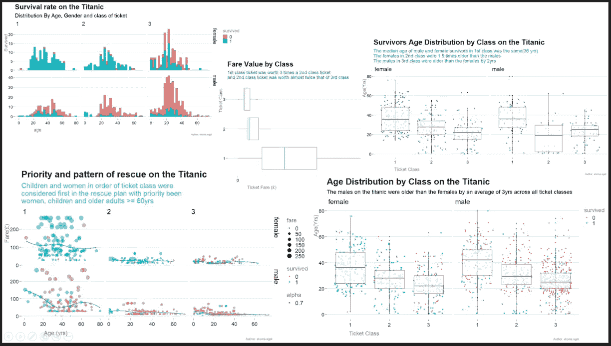
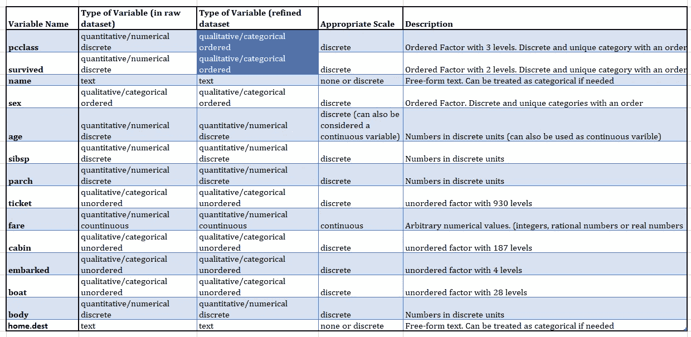
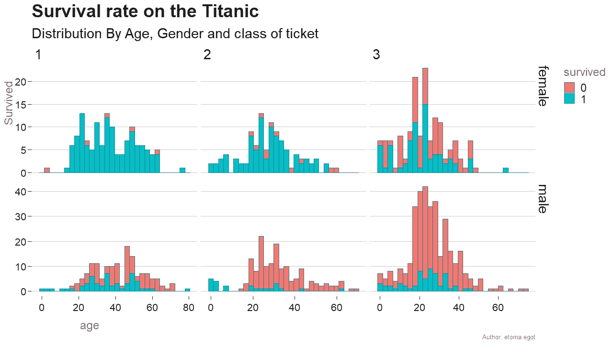
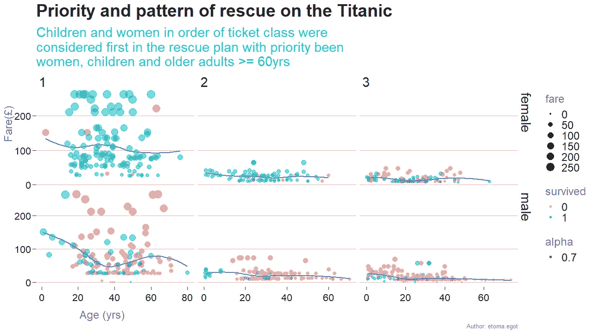
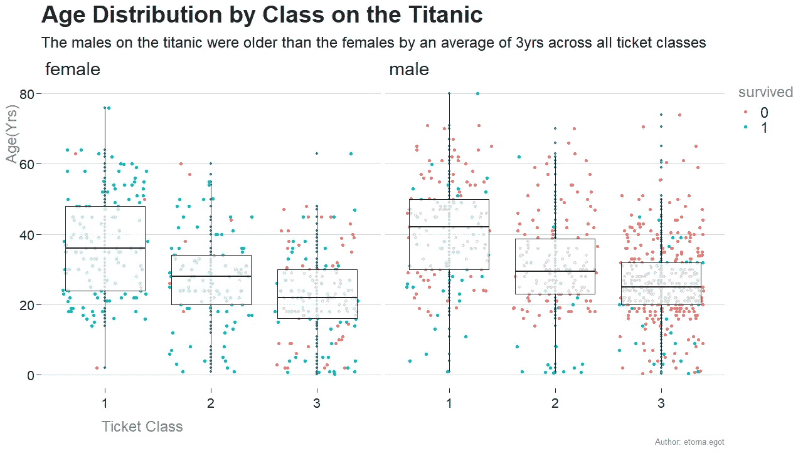
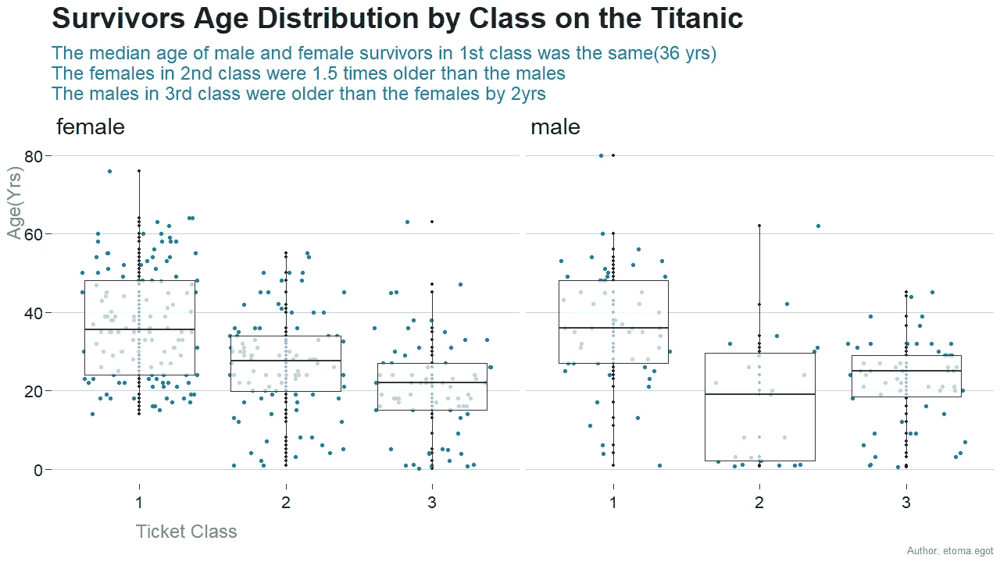
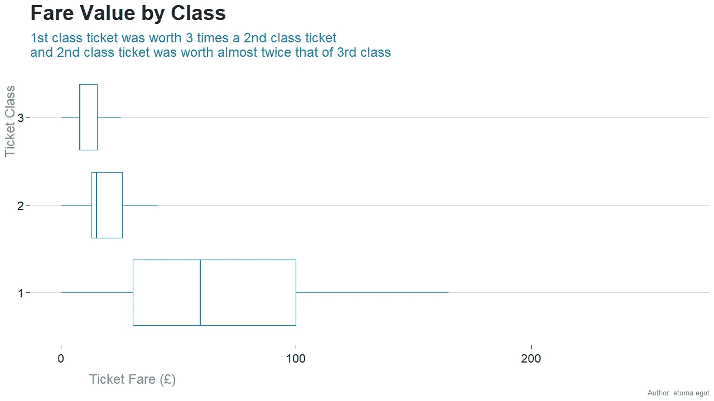

# 使用 R (ggplot2)以商业分析师的心态分析泰坦尼克号

> 原文：<https://towardsdatascience.com/analyzing-the-titanic-with-a-business-analyst-mindset-using-r-ggplot2-ee5355a4dab3?source=collection_archive---------12----------------------->

最近，我迷上了 [R 编程软件](https://www.google.com/search?rlz=1C1NDCM_enDE782DE782&ei=-kTHXLKEGbmI1fAPq62s4A4&q=r+software+programming+language&oq=R+software+program&gs_l=psy-ab.1.1.0l2j0i22i30l8.421702.427106..429975...2.0..2.528.2688.1j15j1j5-1......0....1..gws-wiz.......0i71j35i39j0i67j0i20i263j0i10.xsc4RqvVA8E)和 [Hadley Wickham](https://www.google.com/search?rlz=1C1NDCM_enDE782DE782&ei=qUbHXNL-KvuE1fAP14yumA0&q=hadley+wickham&oq=Hadley+Wickha&gs_l=psy-ab.1.0.0i67l4j0l4j0i67l2.72199.200966..206662...0.0..3.697.3723.1j9j0j2j0j3......0....1..gws-wiz.......0i71j35i39j0i10i67j0i20i263.-jhelNNRd-0) 创造的奇妙的数据可视化包( [ggplot2](https://ggplot2.tidyverse.org/) )。我的职业是商业分析师，在电子支付行业有着丰富的经验，但我对数据分析、可视化和向利益相关者传达数据充满热情。

## **撰写这篇文章的动机**

嗯，为什么是泰坦尼克号……有人可能会问？巧合的是，我决定再看一遍《泰坦尼克号》电影，但这一次是以商业分析师的心态，受到[数据分析](https://www.google.com/search?rlz=1C1NDCM_enDE782DE782&ei=kUvIXKfpDYKsa7aNGw&q=data+analysis+&oq=data+analysis+&gs_l=psy-ab.3..35i39j0l9.22562.23150..24244...0.0..0.186.605.0j5......0....1..gws-wiz.......0i71j0i67.Lt10l39lJeg)力量的启发。我第一次看这部电影时，脑海中有几个关于[泰坦尼克号](https://www.google.com/search?rlz=1C1NDCM_enDE782DE782&ei=DjXIXKeAMZHXkwWR_LC4AQ&q=Titanic+movie&oq=Titanic+movie&gs_l=psy-ab.3..0i67j0l9.1338061.1341057..1341273...0.0..1.409.1760.0j12j4-1......0....1..gws-wiz.......0i71j35i39.KmVIKVls_Fg)上发生的事情的问题，但当时没有找到答案。这一次，我受到数据分析的解决方案驱动本质的启发，决定通过在谷歌上获取无处不在的[大型数据集](https://www.google.com/search?rlz=1C1NDCM_enDE782DE782&ei=9jzHXKCYBJWO1fAPwomd8AI&q=titanic+dataset&oq=titanic+dataset&gs_l=psy-ab.3..35i39j0i67l7j0l2.1390303.1392961..1393361...0.0..3.470.2802.0j11j1j0j2......0....1..gws-wiz.......0i71j0i20i263.ikDPf222nTg)来寻找我自己问题的答案。

我从几个关于泰坦尼克号沉船事件的探索性问题开始了我的分析(我问了很多问题，我猜你们都已经知道了:)。下面的可视化仪表板在我的分析过程中实现了。



Titanic Dashboard

## 探究问题

1.  泰坦尼克号上的存活率是多少？
2.  我如何用数据来形象化泰坦尼克号上的救援人员采用的[妇女和儿童优先](https://en.wikipedia.org/wiki/Women_and_children_first)的方法？
3.  泰坦尼克号上的年龄分布是怎样的(幸存者和遇难者)？
4.  泰坦尼克号上按船票等级划分的幸存者年龄分布是怎样的？
5.  一个多世纪以前，泰坦尼克号是最贵的船，那么所有船票等级的票价是如何比较的呢？

如果你看过这部电影，那么你就来对地方了，如果你没有，那么你就是我发现的目标。也许，你会决定马上看。现在，让我们开始吧。

## 加载包和浏览数据

让我们从加载包开始，我们将使用这些包来创建用于分析的可视化。Tidyverse 软件包将有助于数据处理和绘图。

加载相关库，将保存在电脑驱动器上的[泰坦尼克号数据集](https://www.google.com/search?rlz=1C1NDCM_enDE782DE782&ei=9jzHXKCYBJWO1fAPwomd8AI&q=titanic+dataset&oq=titanic+dataset&gs_l=psy-ab.3..35i39j0i67l7j0l2.1390303.1392961..1393361...0.0..3.470.2802.0j11j1j0j2......0....1..gws-wiz.......0i71j0i20i263.ikDPf222nTg)导入 [R 工作室](https://www.google.com/search?rlz=1C1NDCM_enDE782DE782&ei=FDXIXIyzLoa5kwXLtY-wBQ&q=r+studio&oq=R+&gs_l=psy-ab.1.0.35i39l2j0i67l5j0l3.7920120.7920300..7923080...0.0..0.105.199.1j1......0....1..gws-wiz.......0i71.AJDyvSW-gtw)。

**注意**:源数据帧不包含机组人员的信息，但包含几乎 80%乘客的实际和估计年龄

```
library(tidyverse)titanic <- read.csv(file.choose())
```

检查数据集的结构(变量名和变量类型)。这一步对于确定变量是否适合绘图至关重要。

```
#Check out the structure of the dataset
summary(titanic)
str(titanic)
names(titanic)
head(titanic.df, n = 10)#Remove rows with NA
titanic.df <- filter(titanic, survived != "")
```

首先，清理数据集以移除或替换丢失的值。

数据集中的列如下所示:

*   **Pclass:** *票类(1 = 1 号，2 = 2 号；3=第三)*
*   **幸存:**幸存 *( 0 =否；1 =是)*
*   **姓名:** *乘客姓名*
*   **性别:**性别(男或女)
*   **年龄:** *乘客* *年龄*
*   **SibSp:** *船上兄弟姐妹和/或配偶人数*
*   **Parch:** *船上父母和/或子女的数量*
*   **票号:** *票号*
*   **票价:** *票价价格(英镑)*
*   **座舱:**座舱*座舱*
*   **已装船** : *装船港(C =瑟堡:Q =皇后镇:S=南安普顿)*
*   **艇** : *救生艇*
*   **车身** : *车身识别号*
*   **home.dest** : *乘客家或目的地的地址*

下一步是我们需要决定我们需要什么样的变量和合适的比例来可视化我们的数据。我使用了下面的表格分类，



## 使用 ggplot2 进行可视化

来回答我们的第一个问题，**泰坦尼克号上的存活率是多少？**

> 按班级排列(*第一、第二和第三)，幸存的女性比例分别为 97%、89%和 49%。
> 
> 按等级(*第一、第二和第三)排列，男性存活率分别为 34%、15%(约 14.6%)和 15%(约 15.2%)。

*运行* *下面的代码生成相应的可视化效果:*

```
ggplot(data = titanic.df) +
  aes(x = age, fill = survived) +
  geom_histogram(bin = 30, colour = "#1380A1") +
  #scale_fill_brewer(palette = "Accent") +
  labs(title = "Survival rate on the Titanic",
       y = "Survived",
       subtitle = "Distribution By Age, Gender and class of ticket",
      caption = "Author: etoma.egot") +
  theme_tomski() + # using a custom theme for my visualizations
#theme_bw()+ #Use the inbuilt ggplot2 them for your practice facet_grid(sex~pclass, scales = "free")#Proportion of 1st, 2nd and  3rd class women and men who survivedmf.survived <- titanic.df %>%
  filter(survived == 1)%>%
  group_by(pclass,sex)%>%
  summarise(Counts = n()
  )mf.died <- titanic.df %>%
  filter(survived != 1)%>%
  group_by(pclass,sex)%>%
  summarise(Counts = n()
  )mf.perc.survived <- mf.survived/(mf.survived + mf.died) * 100
select (mf.perc.survived, Counts)
```



Survival Rate on the Titanic

**结果解读:**

*   该图有助于确定考虑到所有三个变量(年龄、性别、机票等级)的存活率模式。
*   按班级排列(*第一、第二和第三)，幸存的女性比例分别为 97%、89%和 49%。
*   按等级(*第一、第二和第三)排列，男性存活率分别为 34%、15%(约 14.6%)和 15%(约 15.2%)。
*   在一年级和二年级的学生中，除了一年级的一名女生外，所有的孩子都活了下来。三年级的孩子死亡率更高。

对于我们的第二个问题，我如何用数据来证实泰坦尼克号上的救援人员采用的[妇女和儿童优先](https://en.wikipedia.org/wiki/Women_and_children_first)的方法？

> 救援人员首先考虑的是儿童和妇女，在所有级别中，优先考虑的是妇女、儿童和至少 60 岁的老年人。

运行代码以获得以下可视化效果:

```
titanic.df %>%
  filter(fare <= 300)%>%
  ggplot(mapping = aes(x = age, y = fare)) +
  geom_point(aes(colour = survived, size = fare, alpha = 0.7)) +
  geom_smooth(se = FALSE)+
  facet_grid(sex~pclass, scales = "free") +
  labs(title = "Priority and pattern of rescue on the Titanic",
       x = "Age (yrs)",
       y = "Fare(£)",
       subtitle = "Children and women in order of ticket class were\nconsidered first in the rescue plan with priority been\nwomen, children and older adults >= 60yrs", 

       caption = "Author: etoma.egot") +
  theme(
    plot.subtitle = element_text(colour = "#17c5c9",
                                     size=14))+
           theme_tomski()  #using a custom theme
```



Priority and pattern of rescue on the Titanic

**结果解读**

*   遵循上图中的分布结果。(票价与机票等级成正比)。抛开儿童这个事实(<=12) on the titanic were charged separate boarding fares. It seemed like the fares for children and teens seem unusually high when compared with average fares for non-children age groups. Let me know if you know why this is so.
*   Nonetheless,the bubble chart gives some other clues in regards to the pattern of rescue operations. Evidently, Women and Children first approach in order of ticket class was adopted in the rescue plans by rescuers with priority been women and children and older adults at least 60yrs across all classes.
*   Apparently little or no priority was given to male passengers by rescuers

##**注意**:我从气泡图中移除了异常票价(500)。支付这些费用的男性和女性无论如何都获救了。

我使用**箱线图**来可视化接下来的三个问题:

继续第三个问题，**泰坦尼克号上的年龄分布是怎样的(幸存者和遇难者)？**

> 总的来说，泰坦尼克号上的男性比女性平均大 3 岁。

```
titanic.df %>%
    ggplot(mapping =  aes(x = pclass, y = age)) +
  geom_point(colour = "#1380A1", size = 1) +
  geom_jitter(aes(colour = survived))+ #This generates multiple colours
  geom_boxplot(alpha = 0.7, outlier.colour = NA)+
  labs(title = "Age Distribution by Class on the Titanic",
       x = "Ticket Class",
       y = "Age(Yrs)",
       subtitle = "The males on the titanic were older than the females by an average of 3yrs across all ticket classes ",
       caption = "Author: etoma.egot") +
  theme_tomski() +   #using my own custom theme
  theme(plot.subtitle = element_text(
                                     size=18))+

  facet_wrap(.~sex)#Calculating Mean and median age by Class and Gender for adults
titanic.df %>%
    group_by(pclass, sex)%>%
  summarise(
    n = n(), #count of passengers
    Average.age = mean(age, na.rm = TRUE),
    Median.age  = median(age, na.rm = TRUE)
  )
```



Age Distribution by Class on the Titanic

**成绩解读**

*负偏态* —箱线图将显示更接近上四分位数的中位数
*正偏态* —箱线图将显示更接近下四分位数的中位数

**女**

*   大约 75%的女性(第一、第二、第三名)至少在 22 岁、20 岁和 17 岁之间。年龄中位数为 36 岁(正态分布)、28 岁(负偏态)和 22 岁(正偏态)

**男**

*   大约 75%的男性年龄至少在 30 岁、24 岁和 20 岁之间。年龄中位数为 42 岁(负偏差)、30 岁(正偏差)和 25 岁(正偏差)

**#概要:**
一般来说，在所有船票等级中，泰坦尼克号上的男性比女性平均年长 3 岁。

随后，对于第 4 个问题，**泰坦尼克号上按船票等级划分的幸存者年龄分布是怎样的？**

> 第一类中男性和女性幸存者的平均年龄相同(36 岁)
> -第二类中女性比男性大 1.5 倍
> -第三类中男性比女性大 2 岁

```
titanic.df %>%
  filter(survived ==1)%>%
  ggplot(mapping =  aes(x = pclass, y = age)) +
  geom_point(size = 1) +
  geom_jitter(colour = "#1380A1")+ 
  geom_boxplot(alpha = 0.7, outlier.colour = NA)+
  labs(title = "Survivors Age Distribution by Class on the Titanic",
       x = "Ticket Class",
       y = "Age(Yrs)",
       subtitle = "The median age of male and female survivors in 1st class was the same(36 yrs)\nThe females in 2nd class were 1.5 times older than the males\nThe males in 3rd class were older than the females by 2yrs",
       caption = "Author: etoma.egot") +
  theme_tomski() +   #using my own custom theme
  theme(plot.subtitle = element_text(colour = "#1380A1",
                                     size=18))+
  facet_wrap(.~sex)#Calculating Mean and median age by Class and Gender for adults
titanic.df %>%
  filter(survived ==1)%>%
  group_by(pclass, sex)%>%
  summarise(
    n = n(), #count of passengers
    Average.age = mean(age, na.rm = TRUE),
    Median.age  = median(age, na.rm = TRUE)
  )
```



Survivor age distribution by class on the Titanic

**结果解释**

**女性**
——年龄中位数为 36 岁(正态分布)、28 岁(负偏态)和 22 岁(正偏态)

**男性**
——年龄中位数为 36 岁(正偏)、19 岁(负偏)和 25 岁(负偏)

**#总结:**
-第一类男性和女性幸存者的平均年龄相同(36 岁)
-第二类女性比男性大 1.5 倍
-第三类男性比女性大 2 岁

最后，关于最后一个问题，**泰坦尼克号是一个多世纪前最贵的船，那么所有船票等级的票价值如何比较？**

> 头等票的价格大约是二等票的三倍，二等票的价值大约是三等票的两倍。

```
#Prepare Data, remove outliers in fare
titanic.df %>%
  filter(fare < 300)%>%
      ggplot(mapping =  aes(x = pclass, y = fare)) +
  #geom_point(colour = "#1380A1", size = 1) +
  #geom_jitter(aes(colour = survived))+
  geom_boxplot(colour = "#1380A1", outlier.colour = NA)+
  labs(title = "Fare Value by Class",
       x = "Ticket Class",
       y = "Ticket Fare (£)",
       subtitle = "1st class ticket was worth 3 times a 2nd class ticket\nand 2nd class ticket was worth almost twice that of 3rd class",
       caption = "Author: etoma.egot") +
  theme_tomski()+ #using my own custom theme 
  theme(plot.subtitle = element_text(colour = "#1380A1",size=18))+

  coord_cartesian(ylim = c(0,125))+
  coord_flip()#Calculating Mean and Median Fare by Class
titanic.df %>%
  filter(fare < 300)%>%
    group_by(pclass)%>%
  summarise(
    Average.fares = mean(fare, na.rm = TRUE),
    Median.fare  = median(fare, na.rm = TRUE)
  )#Calculating Mean and Median Fare by Class for children
titanic.df %>%
  filter(fare < 300, age <= 12)%>%
  group_by(pclass)%>%
  summarise(
    n = n(),
    Average.fares = mean(fare, na.rm = TRUE),
    Median.fare  = median(fare, na.rm = TRUE)
  )#Calculating Mean and Median Fare by Class for adults
titanic.df %>%
  filter(fare < 300, age >= 12)%>%
  group_by(pclass)%>%
  summarise(
    n = n(),
    Average.fare = mean(fare, na.rm = TRUE),
    Median.fare  = median(fare, na.rm = TRUE)
  )
```



Fare Value By Class on the Titanic

**结果解释**

*   方框图证实了机票价格与机票等级成正比。非常直观。
*   分布向右倾斜。一等舱、二等舱和三等舱的票价中位数分别为 59.4 英镑、15 英镑和 8.05 英镑。一等舱、二等舱和三等舱的平均票价分别为 82.2 英镑、21.2 英镑和 13.3 英镑。(平均票价大于中间票价)。
*   因此，这个分布的中心的更好的测量是中位数。因此，头等票的价格大约是二等票的三倍，而二等票的价值大约是三等票的两倍。
*   与同一班级的成人相比，儿童的平均票价和中位票价更高。

注:
[对于对称分布，均值在中间。因此，平均值是用于比较的适当度量。但是如果分布是偏斜的，那么平均值通常不在中间。因此，中位数是进行比较的适当标准](https://web.ma.utexas.edu/users/mks/statmistakes/skeweddistributions.html) 
我对我在 TDS 上的第一篇文章感到非常兴奋，尽管如此，如果你做过类似的分析，我仍然需要澄清，在不同的年龄组中，儿童是否真的比一些成年人付出更多，正如我的可视化气泡图结果似乎所表明的那样。

感谢阅读！。