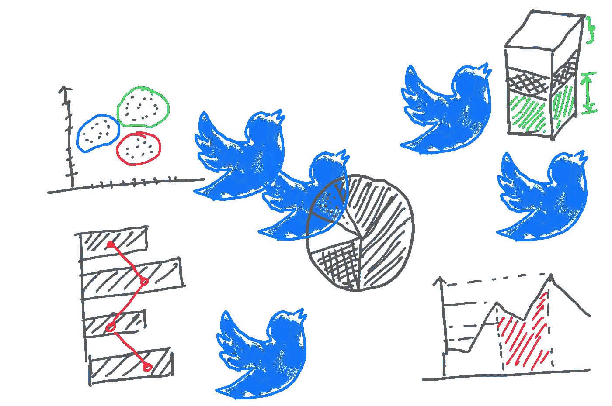
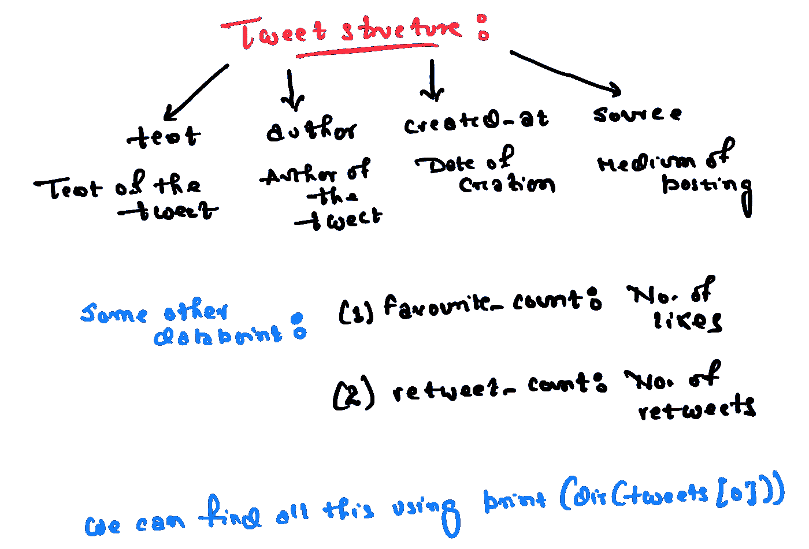
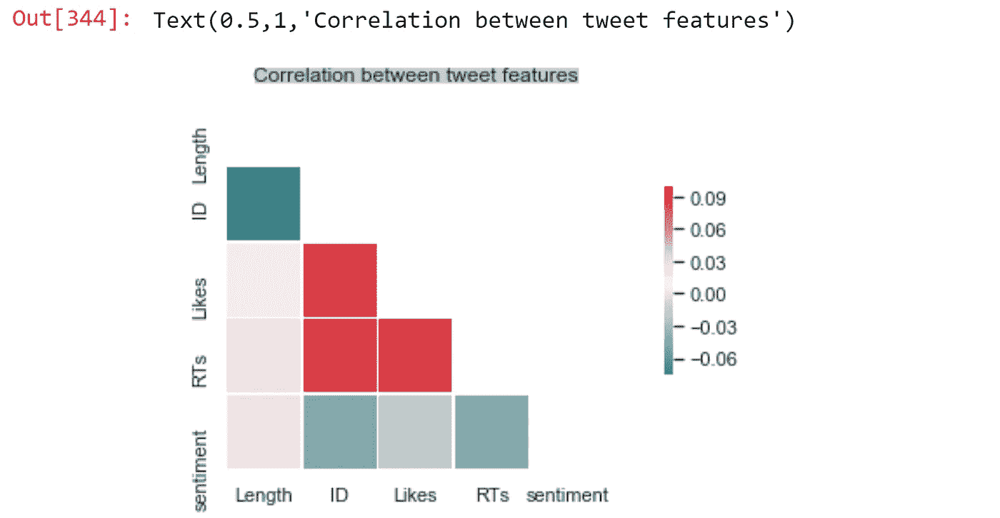
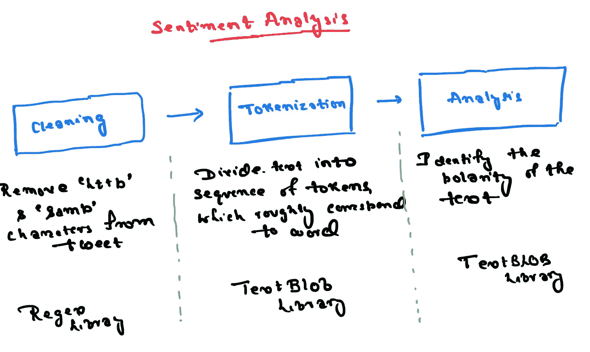
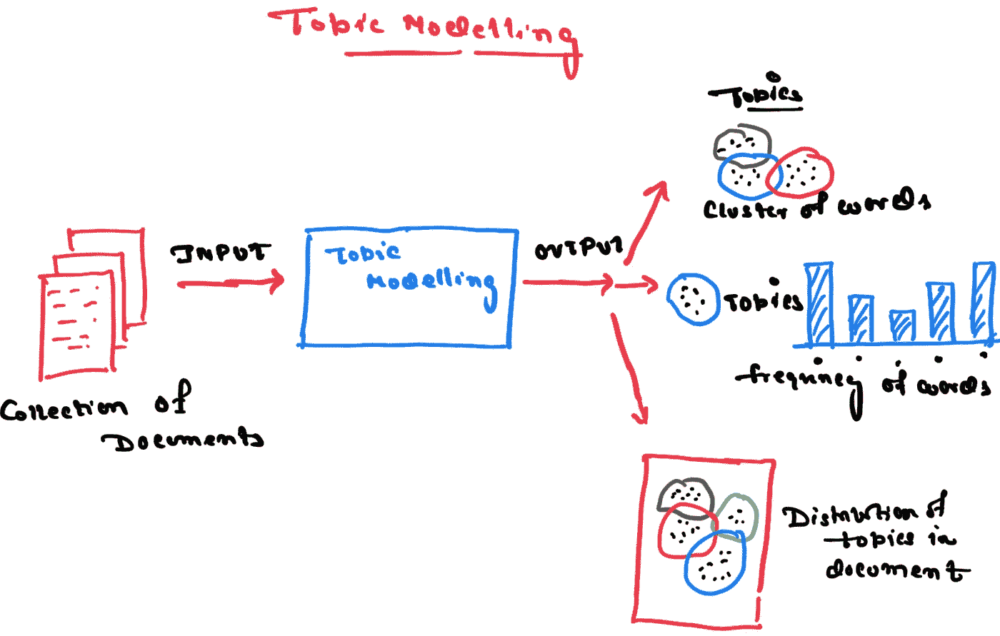
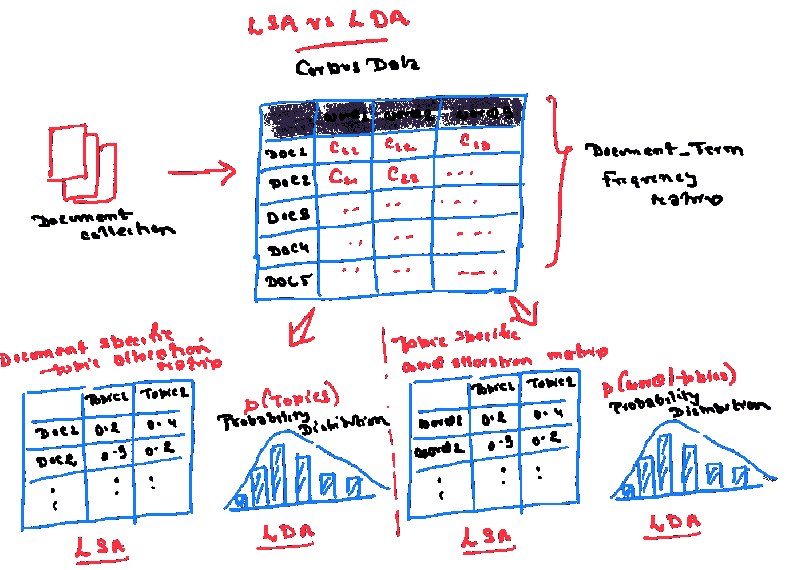
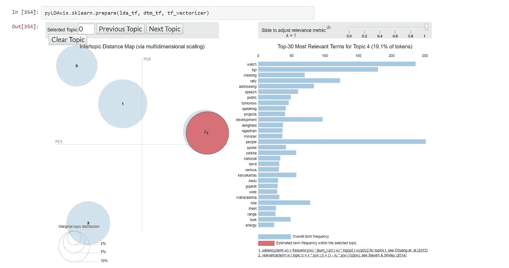

# 分析印度新当选总理的推特资料

> 原文：<https://towardsdatascience.com/analyzing-the-twitter-profile-of-indias-newly-elected-pm-b61ae0edf6a5?source=collection_archive---------15----------------------->

## 一个简单的 Python 项目



Source: Image by Author

免责声明:本博客与政治无关，只是出于学术兴趣而写。

很长一段时间以来，我想写一篇关于使用 Python 分析真实用户数据的博客，以重温我的概念并探索新的主题。

巧合的是，上周，6 亿印度人连续第二次投票选举纳伦德·莫迪为总理，莫迪是印度推特上关注最多的政治家，并有效地利用推特与选民沟通。因此，他的 Twitter 个人资料可能是一个成熟的分析数据的丰富来源。此外，分析一个政治家的声明是有趣的！

这就是为什么我决定为这个项目分析他的资料。这个博客对那些正在寻找基于真实数据的简单数据分析项目的人会有帮助。

在深入细节之前，这里是项目的关键部分:

*   在 Twitter 上创建一个开发者账户
*   使用 Tweepy 删除推文
*   创建一个熊猫数据框架
*   推文的统计分析
*   情感分析
*   词频分析
*   主题建模

# 在 Twitter 上创建一个开发者账户

我只需要在 [Twitter 开发者网站](https://developer.twitter.com/en/account/get-started)上注册并回答几个问题。Twitter 的批准大约在 2-3 小时后发出。

我们需要您的开发者帐户的以下信息:消费者密钥、消费者秘密、访问密钥和访问秘密。

# 使用 Tweepy 删除推文

[Tweepy](https://tweepy.readthedocs.io/en/latest/getting_started.html#introduction) 是一个易于使用的 Python 库，用于访问 Twitter API。

首先，让我们导入我们将使用的所有库。

```
import tweepy 
import pandas as pd
import numpy as np from IPython.display 
import display 
import matplotlib.pyplot as plt
import seaborn as sns 
from textblob import TextBlob
import re
import warnings
warnings.filterwarnings('ignore') 
%matplotlib inline
```

接下来，让我们保存所有的 Twitter 凭证。很明显我藏了我的。创建一个单独的文件来存储凭证是个好主意，但是我在同一个文件中使用了。

```
#It's not a good pratice to include the keys in the same code, as we have to display. However, I am lazyconsumer_key = "XXXXXXXXXXXXXXXXX"
consumer_secret = "XXXXXXXXXXXXXXXX"
access_key = "XXXXXXXXXXXXXXXXXX"
access_secret = "XXXXXXXXXXXXXXXXXX"
```

接下来，我们迭代提取推文，一次删除 200 条推文。在做这个分析时，我从鲁道夫·费罗对特朗普推文的博客情绪分析中获得了灵感。

# 创建一个熊猫数据框架

让我们创建一个[熊猫数据框架](https://pandas.pydata.org/)，这将有助于分析 Twitter 数据。我们还需要了解我们下载的数据的结构。



Source: Image by Author

接下来，我们将把这些相关参数添加到数据帧中。

# 推文的统计分析

这一段比较直截了当。我们希望得到简单的统计数据，比如推文的平均长度，最受欢迎的推文，以及多年来喜欢和转发的趋势。

接下来，让我们看看过去两年中赞和转发的趋势。我还没有探究 Twitter 对 API 的一般访问的限制，但我相信它限制在 3200 条 tweets。这就是为什么我们只有最近两年的数据。

为了绘制趋势，我们将创建熊猫系列，然后进行绘制。即使在这短暂的时间内，我们也可以观察到喜欢和转发的上升趋势。

让我们创建一些有趣的图表。

首先，我们将创建一个关联图来了解被喜欢和转发的推文的特征。



Source: Image by Author

一些不足为奇的发现是——RTs 和 Likes 高度相关。一些更有见地的学习包括:

*   中等长度的推文会给莫迪带来更多的转发和点赞
*   这是有争议的。带有负面情绪的莫迪的推文通常会获得更多的 RTs 和赞。然而，它可能与表达对不幸事件的遗憾有关。

其次，让我们在散点图上绘制情感、喜欢和 RTs，以重新检查我们的假设。

这再次表明，带有负面情绪的推文获得了更多的即时战略和喜欢。然而，我们没有进行广泛的清理，印度英语(使用印地语)可能会影响这些结果。

# 情感分析

对于情感分析，我们将使用 TextBlob。这是一个 Python 库，提供简单的 API 访问来执行基本的自然语言处理任务。

TextBlob 的工作方式就像 Python 字符串一样，因此可以类似地用于转换数据。

```
exampleText=TextBlog("Ajitesh")
exampleText[1:3]
```

输出→ TextBlob("ji ")

```
exampleText.upper()
```

Output- TextBlob("AJITESH ")

我们将分三步进行情感分析——清理 Tweet 的文本、标记化和情感分析。



Source: Image by Author

在分析这些推文时，我们只想局限于莫迪发布的推文。尽管我们无法识别莫迪先生转发的推文。我们有一条捷径。我们可以忽略零赞的推文，因为 Twitter 不会给转发推文的用户指定“赞”。此外，莫迪的任何推文都不太可能没有“赞”。

让我们从数据清理步骤开始。

接下来，我们将做标记化和情感分析。

# 词频分析

对我来说，莫迪先生最令人难忘的倡议之一是“Swachh Bharat”，一项保持印度清洁的倡议。让我们看看他在这些推文中提到了多少次“Swachh Bharat”。

我们先创建一个词云来可视化不同词的相对使用频率。我已经创建了一个简单的单词云，但是你可以想象一下，创建一个[图像颜色的单词云](http://amueller.github.io/word_cloud/auto_examples/colored.html#sphx-glr-auto-examples-colored-py)。

有趣的是，西孟加拉邦和奥迪萨被提及的频率更高，莫迪的政党在这两个地方取得了惊人的进展。

我还用旧的 python 方式创建了一个频率表:

*   创建映射单词和频率的词典
*   然后，将单词及其频率作为元组存储在列表中
*   最后，对列表进行排序并打印结果

# 主题建模

假设你有圣雄甘地所有的文本形式的演讲。你可以使用主题模型来描绘这些演讲中的关键主题。

我在 PyTexas 看到了 Christine Doig 关于主题建模的精彩演讲，并尝试在我们的案例中实现。

本质上，在主题建模中，我们使用统计模型来发现大量无组织文本中出现的抽象主题。这是一种无监督的学习方法。下图解释了我们通过主题建模想要达到的目标。



Source: [Christine Doig](https://www.youtube.com/watch?v=BuMu-bdoVrU) Slides (Image by Author)

有两种方法进行主题建模——LSA(潜在语义分析)和概率推理方法，如 LDA(潜在狄利克雷分配)。下面是 LSA 和 LDA 之间差异的图示。在我们的例子中，我们将使用 LDA。



Source — Topic Modelling by [Jordan Boyd-Graber](https://www.youtube.com/channel/UCIXpjlxPL5Ow8rPO_gOHISQ) (Image by Author)

让我们实现 LDA 来分析推文中的主题。



source — Image by Author

输出是一个交互式图形，我不知道如何嵌入。然而，您可以在这里找到带有输出的[完整代码](https://gist.github.com/ajitesh123/c0695b8185898202f1f2a45a6f4accb7)。

我可以看到两个清晰的主题——政治和感恩——分别用 4 和 1 来表示。然而，主题建模在这里没有多大用处。我可能会把这些应用到一系列的演讲中。

我这边就这样。我知道我们可以在这里做更多的分析。请评论让我知道我还可以探索什么。