# 分析特朗普的推特强迫症

> 原文：<https://towardsdatascience.com/analyzing-trumps-twitter-compulsion-3c6a61ba8354?source=collection_archive---------16----------------------->

Image via Unsplash

从来没有一位美国总统如此频繁地使用 Twitter，令人不安。从一位许多人认为精神崩溃的总统的短信中，我们能收集到什么隐藏的见解？

我从[特朗普推特档案](http://www.trumptwitterarchive.com/archive)复制了特朗普的推文数据，选择分析他总统任期顶部 2017 年 1 月 20 日开始的推文。将文本数据保存为 csv 文件后，我使用 Pandas 库将该文件导入到 Jupyter 笔记本中。

作为熨斗学校的数据科学学生，我一直在研究统计分布和概率。泊松分布是有趣的，因为它允许我们通过检查在特定时间范围内发生的事件的平均数来计算给定事件发生的概率。

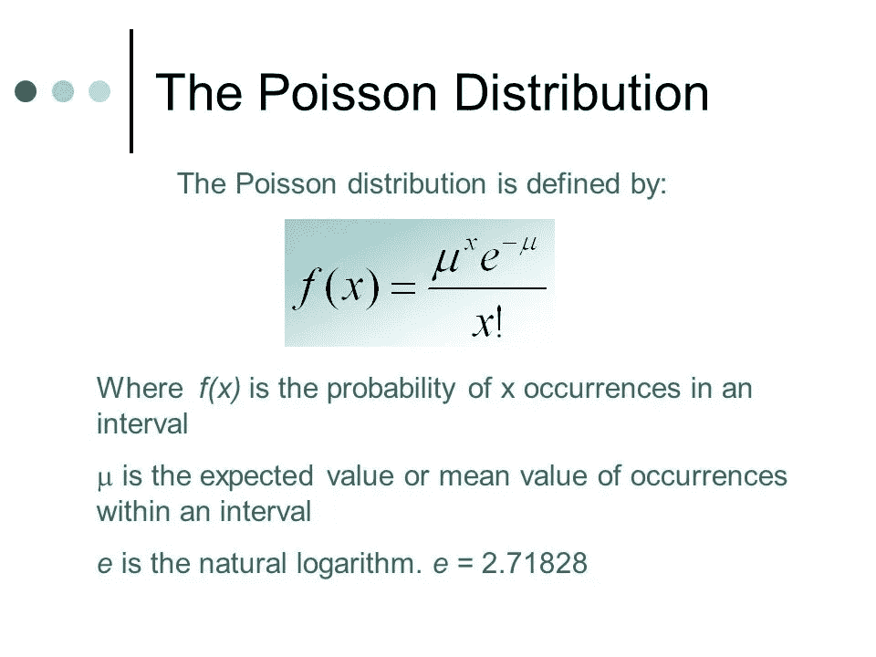

image from Slideplayer.com

利用 Twitter 上的信息，我想确定特朗普在接下来的一个小时内至少撰写 2 次推文的概率。这看起来很简单，但为了进行这种计算，我需要确定他在某个时间段内发推文的频率。

我从数据中寻找答案，相信他每天使用 Twitter 肯定有一种模式。当然，总统繁忙的日程安排会限制他在白天或晚上的特定时间使用智能手机。

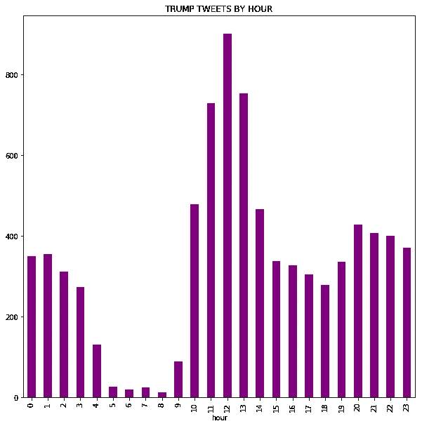

唉，似乎一天中没有一个小时是不发推特的，尽管特朗普很少在早上 5 点至 10 点之间发推特。他的公开日程安排显示，特朗普在一个典型的日子里从早上 8 点左右到上午 11 点都在椭圆形办公室，因此我们可以看到，他很可能已经发了 800 多次推特，同时可能做出影响世界各地数百万人生活的重要行政决策。

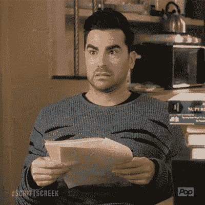

我不知道这些推文实际上是来自特朗普本人，还是由他的工作人员发送的。他的一些推文肯定是在他出国旅行或穿越美国时发出的，但存档的推特数据只给了我们东部标准时间戳。

Factbase】已经创建了一个详细的日历，它从多个公共来源汇总信息，并提供位置和会议数据。他们已经确定，特朗普在任的 879 天中有 705 天是在白宫度过的，这意味着这些推文的 80%是准确的。

也许他一周中的推文频率会给我们更好的洞察力。互联网和应用程序的使用显示了可预测的流量和行为模式。根据 [Sprout Social 的说法，](https://sproutsocial.com/insights/best-times-to-post-on-social-media/#times-tw)在 Twitter 上发帖的最佳时间是周二和周三。周一至周五上午 8 点到下午 4 点也有稳定的流量，周六 twitter 的参与度会下降。

下面是特朗普一周每天的推文频率图。一般来说，周三和周五是他最忙的日子。这可能与新闻周期或 Twitter 流量高峰期有关吗？或者说，发推特主要是一种冲动行为，如果是这样的话，它打断了什么更重要的工作？

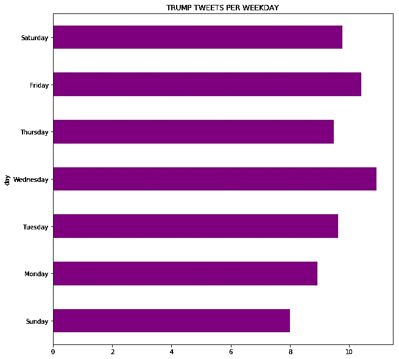

看看每天的平均推文，特朗普的推文频率逐年增加。虽然这不是一个完整的年同比比较，因为我们距离 2019 年还不到一半——但他每天的平均推文率在周末几乎翻了一番。

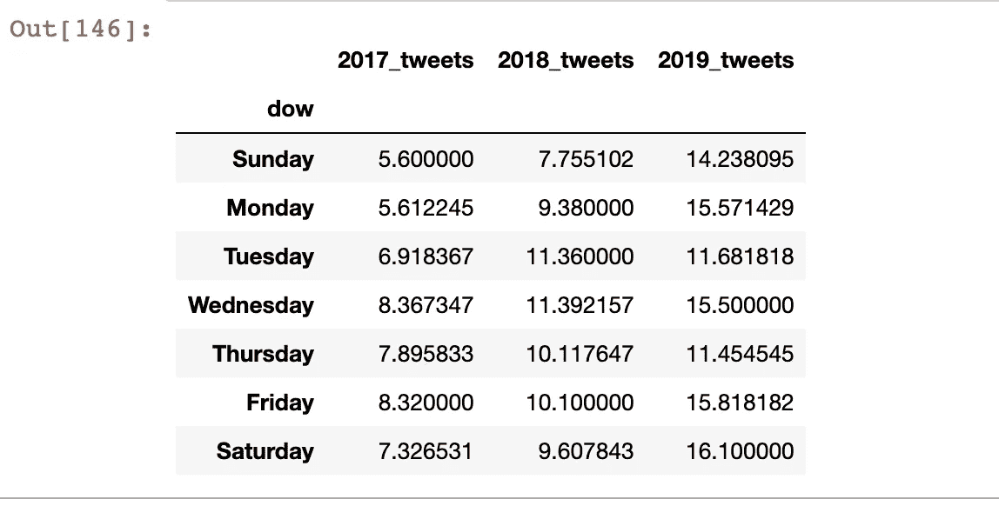

那么，特朗普在接下来的一个小时内发两条推特的可能性有多大？鉴于目前是 2019 年的周二，他平均每天发 12 条左右的推文，并且他报告说每天只睡 5 个小时左右，这种概率相当低——只有 11%。

# 如果时间不是特朗普发推特需求的最佳指标，还能是什么？

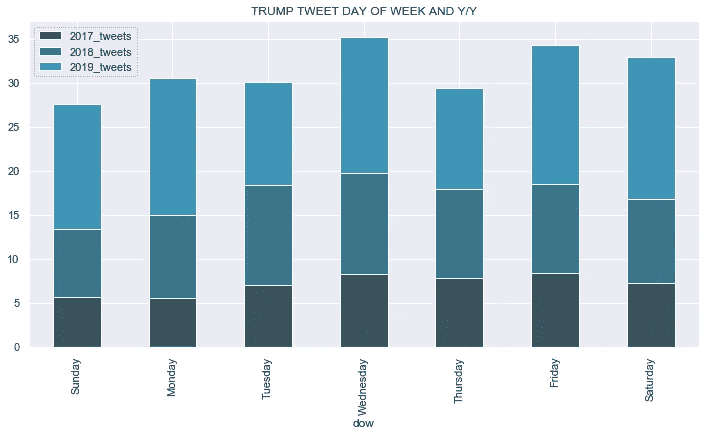

我从 Axios 下载了一份特朗普泄露的私人日程，并将其转换为 csv 文件，然后我将该文件与他的推文数据合并。我们现在可以看到特朗普在发推文时应该在做什么以及他在哪里-2018 年 11 月 7 日至 2019 年 2 月 1 日。看起来大多数(166 条推文)是在他被安排在椭圆形办公室的时候发出的。

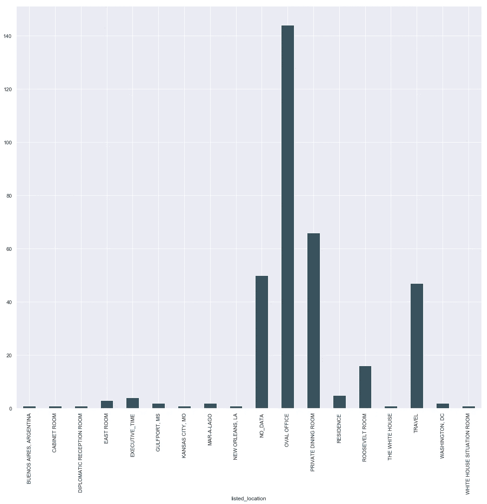

有 50 条推文丢失了位置数据，但它们大多是在假期期间发出的。我们知道特朗普在 Mar a Lago 过感恩节，由于政府关门，他在华盛顿特区过圣诞节。

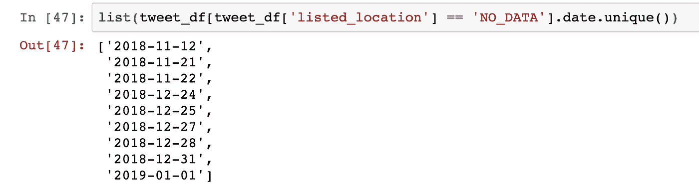

那么，特朗普在椭圆形办公室发推文时的日程安排是什么？毫不奇怪，这主要被归类为*执行时间，*，但他也在几次会议和午餐期间发推特。缩小范围，我们可以查看特朗普日程表上的所有活动类别，无论位置如何，以找到每个活动期间的推文频率。

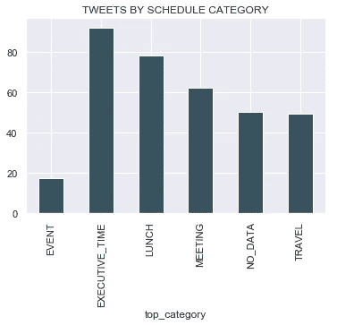

我们没有得到任何关于*执行时间*的额外信息，但是我们可以得到关于他的会议和午餐的额外细节。下面是归类为*会议*的活动的频率图。看起来，在政策讨论、情报简报和与他的幕僚长开会时，他最容易被 Twitter 分心，基本上是在进行他工作中一些最重要的方面。

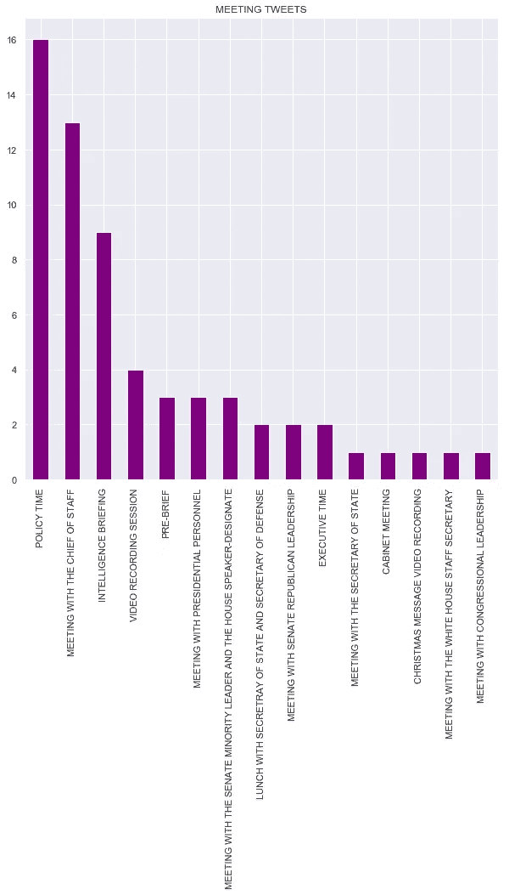

特朗普的午餐推特大多是在私人午餐期间发出的，当它是工作午餐时，频率会下降。

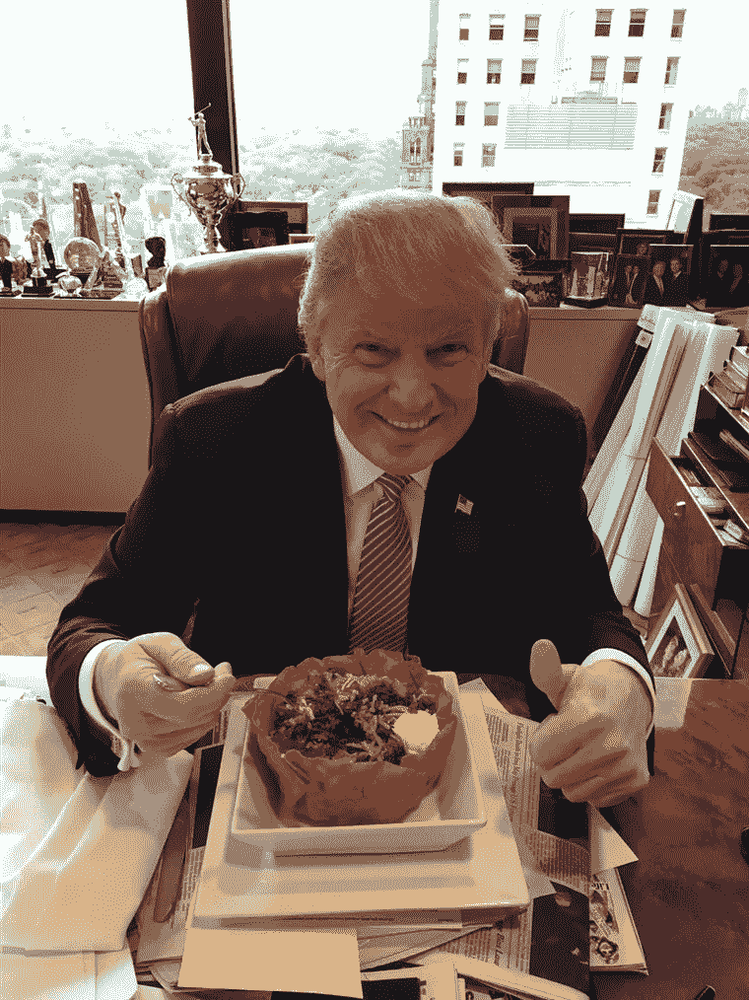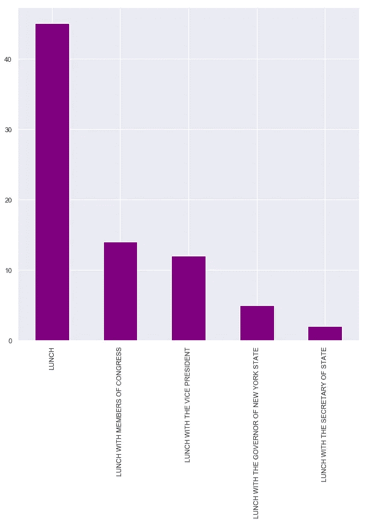

作为一名布鲁克林居民，我有点惊讶地看到他正在与纽约州长安德鲁·科莫一起吃饭和发推特。11 月 28 日午餐期间，他发了 5 条微博，4 条被转发，1 条是这样的

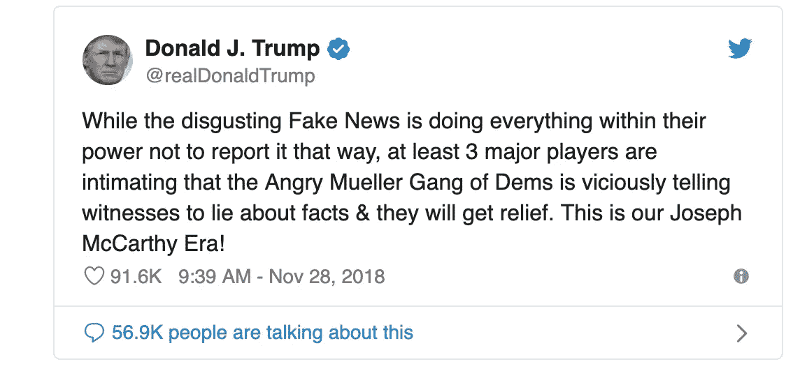

总之，分析特朗普的推文出人意料地容易。预测他是否会在某个时间段发微博是一个愚蠢的练习，但它不可避免地揭示了他日常活动的有趣信息。虽然已经对他的推文的内容和影响进行了几次调查，但我们也可以分析他的习惯造成的破坏和风险。

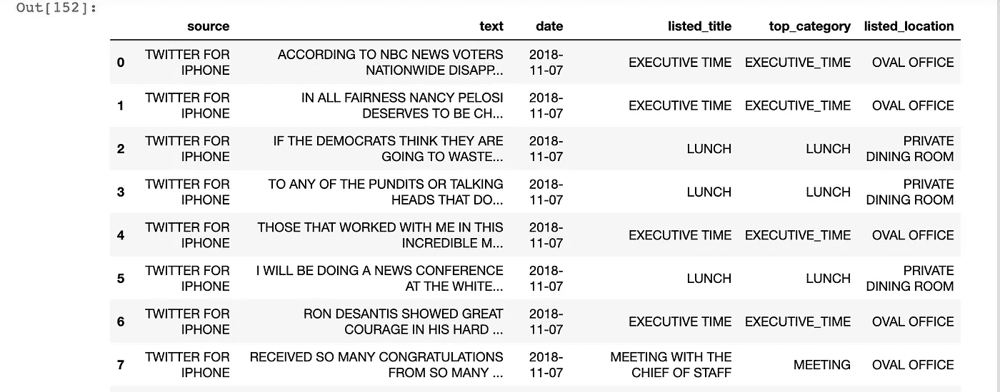