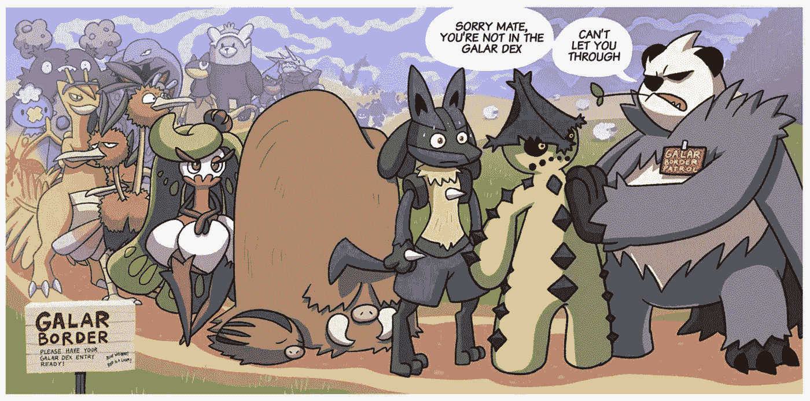
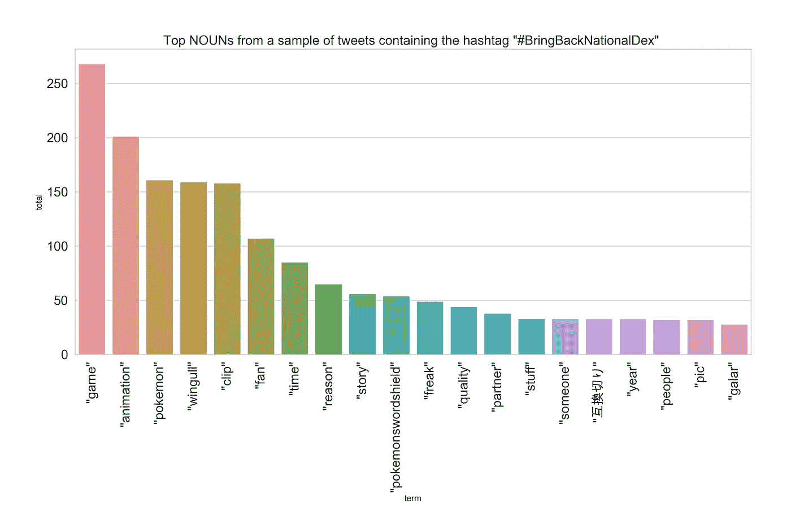
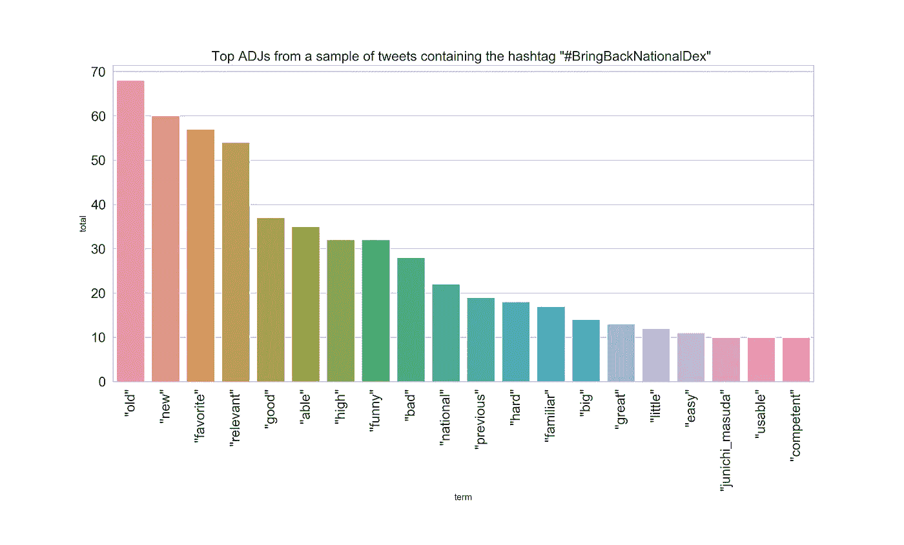
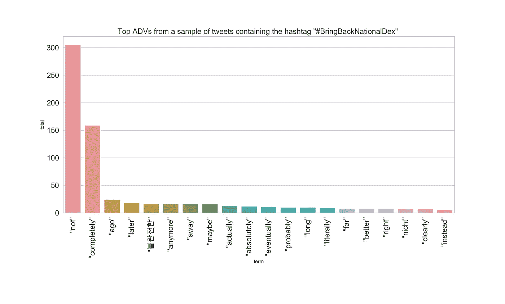
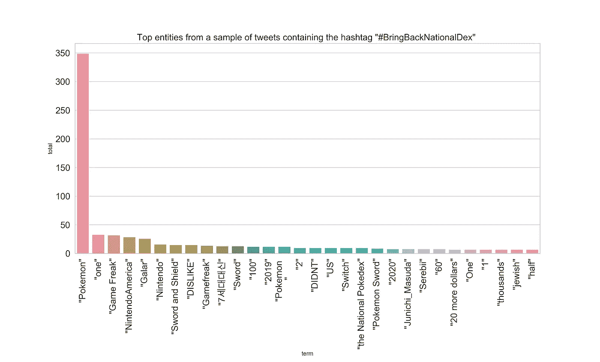
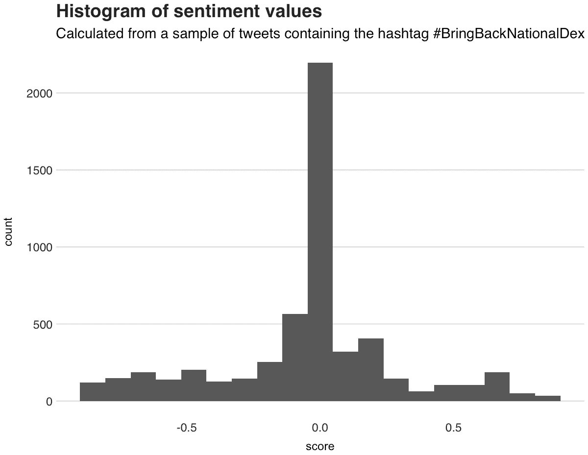
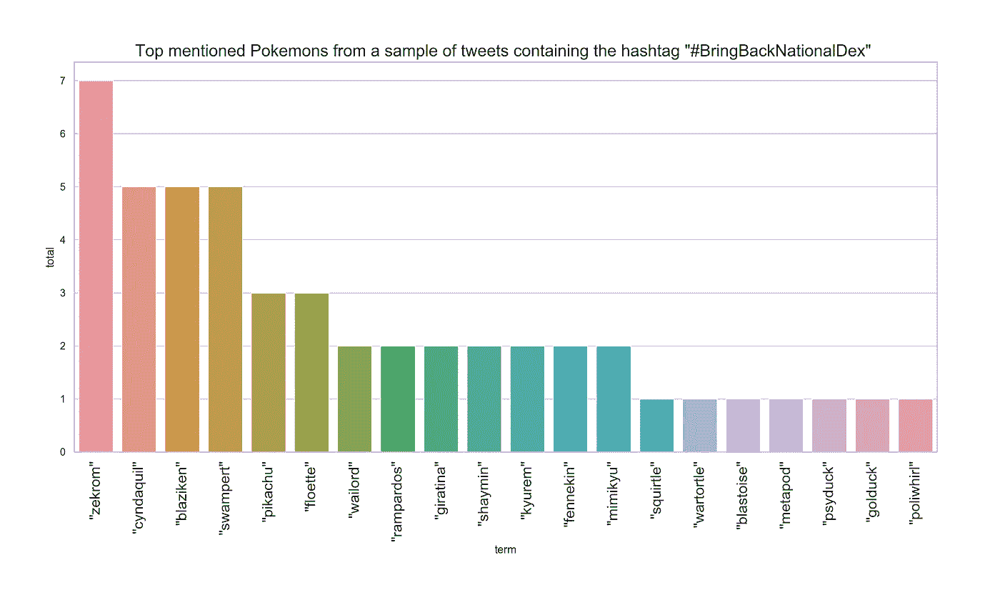

# 使用 NLP 分析与 Pokemon 相关的#BringBackNationalDex 标签的推文

> 原文：<https://towardsdatascience.com/analyzing-tweets-from-the-polemical-pokemon-related-bringbacknationaldex-tag-with-spacy-and-gcloud-661ec0a08a4c?source=collection_archive---------26----------------------->

## 使用 spaCy 和 Google Cloud 发现顶级词类术语、情感和提到的口袋妖怪

**突发新闻:**口袋妖怪社区一片哗然。上周，*游戏狂*，主要口袋妖怪游戏的开发商，宣布即将推出的游戏，*口袋妖怪剑与盾*，将不会拥有口袋妖怪的完整库。这个图书馆被称为*国家口袋妖怪*——因此这个运动被命名为**# BringBackNationalPokedex**——目前由 809 个口袋妖怪组成。除了仅仅是一个神奇生物的列表，完整的 Pokedex 代表了这个系列的进化和成长，这个系列自诞生以来已经征服了数百万人的心。就我个人而言，我觉得这有点令人难过，因为我认为这个声明违背了口袋妖怪的本质和定义:**必须抓住他们**。

Border Control. By Wooden Plank Studios ([https://www.woodenplankstudios.com/comic/galar-border-patrol/](https://www.woodenplankstudios.com/comic/galar-border-patrol/))

作为该系列的长期粉丝，作为一个好奇的数据人，我想快速看看社区在#BringBackNationalPokedex 标签下发布了什么。使用 [Tweepy](https://www.tweepy.org/) ，一个用于访问 Twitter API 的 Python 库，我快速编写了一个脚本，并让它运行几个小时来收集数据。然后，使用 Python 的自然语言处理(NLP)库 [spaCy](https://spacy.io) ，和 [Google 的云自然语言 API](https://cloud.google.com/natural-language/) ，我对上述数据进行了分析。

在这篇文章中，我将展示我的发现。

我这个实验的目标是学习推特圈分享的热门名词、**动词**、**形容词**和**副词**以及标签。此外，我还想看看哪些**命名的实体**，也就是说，一个*“被赋予名称的真实世界的对象——例如，一个人、一个国家、一个产品或一本书的标题”，如 spaCy 所定义的*。因为没有情绪分析，任何推文分析都是不完整的，所以我通过这个情绪模型运行推文，以了解人们对这个决定有多高兴或愤怒。最后，出于好奇，我很想知道哪些是被提及最多的口袋妖怪。

## 数据和准备步骤

本实验中使用的数据集由 2019 年 6 月 13 日和 6 月 14 日收集的 **2724 条**推文组成，其中包括标签#BringBackNationalDex。为了清理它，我删除了提到的转发，例如，“RT [@account_name](http://twitter.com/account_name) ”，将“神奇宝贝”的实例改为“口袋妖怪”，删除了所有特殊字符(问号、逗号等)，以及包含图像的推文中的 https 地址。我没有做的事情是将推文小写，因为这样做，我可能会丢失一些实体和专有名词，否则 spaCy 不会检测到它们。

## 顶级名词、动词、形容词、副词和实体

spaCy 最强大的功能之一是**词性** (POS)标记，它为每个文档的术语分配一个预测标签，如名词和动词。利用这一点，我可以发现所获得的推文的主要思想或背景。

在小学，我们学到了一个句子中最基本的部分是名词。这些必要的词存在的唯一用途是命名事物；就是这样，地点，人，想法，感觉。因为名词是如此重要，所以我想用它们来打开这篇文章。因此，对于第一个情节，我将展示来自 tweet 语料库的前 30 个名词。

在排名第一的位置上，我们有术语*“游戏”*，这一点也不奇怪，因为整个问题是关于即将到来的口袋妖怪游戏。接下来是术语*“动画”，*指的是声称为什么不是所有的口袋妖怪都将出现的主要原因是开发者没有足够的劳动力来制作所有口袋妖怪的动画。然后在第三个位置，是单词*“口袋妖怪”*。

The only Pokemon that appear on this list is **Wingull**, and that is because there was a tweet featuring a Wingull animation that went viral and was retweeted several times. Other important nouns from the list are *“time”*, most probably because of those who think the game needs more time before being released, the Japanese word “互換切り” or “Compatibility Switch”, which honestly I don’t understand the context (can someone corroborate this translation?), and lastly the proper noun *“Galar”*, which is the name of the new Pokemon region.

我要介绍的第二个词性是动词。有了名词，我们学习了用户谈论的主要内容，现在有了动词，我们将发现补充这些名词的动作。下图显示了前 30 个动词。

第一个术语是互联网在这些情况下想要什么的明显例子:想要*“知道】，*要求信息或要求解释。下面的术语，*“发现”，*指的是人们希望他们最喜欢的口袋妖怪找到进入游戏的方法。然后我们有*“感觉”，*主要来自用户陈述他们的观点，*“舒适”，*这是上面提到的 Wingull tweet 的一部分，以及*“需要”，*可能因为类似于*“知道”的原因*

为了给所呈现的术语添加进一步的上下文和精炼，我计算了形容词和副词；这两个语法概念分别用来描述和修饰名词和动词。

上图是关于顶级形容词的。图中的第一个词，*“旧的”，*涉及一条转发，说了一些类似于*的话，“即使话题*【Pokedex 问题】*变旧了，我也会继续谈论它。”*然后，在第二个位置的是单词*“新的”，*，在大多数情况下，这个形容词出现在抨击游戏的一些新功能的推文中，或者出现在另一条关于一些新视频的转发推文中，这些视频讨论了争议。列表中的第三个形容词是*“最喜欢的”，*，它出现在用户谈论他们最喜欢的口袋妖怪以及可能遗漏它们的推文中。其他引起我注意的术语还有*、*、*、*、*、【胜任】、*、*、【增田俊一】、*谁是游戏背后的导演。然而，将这个名字标在形容词下面可能是 spaCy 的一个假阳性预测。既然我们知道了名词是如何修饰的，让我们来看看副词。

最受欢迎的副词是*“不”，*，它出现在暗示负面情绪(我们很快会看到更多)或不同意的推文中。比如*“…做* ***不*** *信任游戏怪胎*，*“我会* ***不*** *买游戏”，或者“游戏会* ***不*** *有全国 Pokedex。”*然后，我们有*“完全”，*来自 Wingull 的推文，在它之后，副词*“以前”，*主要用于推文，比较即将到来的游戏和几年前发布的游戏。其他有趣的副词还有:*“后来”、“T47”、“불완전한”(韩语中的*“不完全”*)、*“最终”**

现在，让我们将注意力从语法和部分句子转移到语料库的实体，就是这样，人们在推文中讨论的特定和现有的事情。

主导实体是“*口袋妖怪*”。然后，我们就有了*【one】，*“用来指代*“这一款游戏”，*或者，*“这一款”*【口袋妖怪】*一代”*，*“游戏怪胎”，*争议的中心开发者。此外，其他经常出现的实体还有美国任天堂的推特账号、*“Nintendo America”*、*“剑与盾”*、*“增田俊一”等名字。*

## 情感分析

通常，在这种互联网变得有点愤怒和紧张的争议事件中，事情往往会有点失控。可悲的是，当这种情况发生时，人们选择以消极甚至仇恨的方式做出反应和评论。为了测试这个假设，我通过情绪分析引擎运行了这些推文，以量化其内容的*“积极”*或*“消极”*。我使用的情感模型是由**谷歌云的自然语言 API** 提供的，主要是因为我喜欢它如何将语料库分割成句子来计算每个句子的情感，因为它是一个 API，这意味着你不必安装、训练或下载模型。

总的来说，谷歌传递了它检测到的 5501 个句子的情感。每一个情感输出都包含两个值:*“分数”*和*“量级”。*前者是一个介于 **-1** 和 **1** 之间的值，其中 **-1** 表示负面情绪， **1** 表示正面情绪，而 magnitude(我在此不使用)则指定 [*“文档中存在多少情绪内容。”*](https://cloud.google.com/natural-language/docs/basics#sentiment-analysis-values) 下面的直方图显示了情绪值的分布。

令人惊讶的是，情绪几乎完全平衡；平均值为 **-0.045** ，标准差为 **0.27** 。直方图中心的峰值表明大多数推文根本没有情感，在人工检查推文和值后，我发现这些零值推文只是由标签组成的，所以根本没有情感。关于分布的两端，我们可以看到高度负面的推文比高度正面的多。一些例子是:*“他们毁了传奇！”、* *“口袋妖怪粉丝:抵制任天堂和游戏狂”，*和*“那个游戏太英国化了，他们甚至不让其他地区的 Pokemon 进来。”*从更积极的角度来看，我们有一些充满希望的评论，比如: *"* 【原文】*我仍然会得到它，但是*【原文】*我非常担心我的团队不会在游戏中，而且*【原文】*我真的*【原文】*不喜欢那个#BringBackNationalDex，"* *“看到口袋妖怪社区对游戏的热情真是太棒了，# bringgbndex*

## 提到口袋妖怪

在我结束之前，我想展示一下在推文中出现最多的口袋妖怪。除了 Wingull，由于许多转发，它在 tweets 语料库中出现了 160 次，我发现很奇怪的是，没有多少提到口袋妖怪。还有，你会看到，皮卡丘不是顶级的。

第五代传奇口袋妖怪捷克罗姆名列榜首。紧随其后的是首发口袋妖怪——**辛达奎尔**、**布拉齐肯**和**沼泽**——然后在第五个位置上我们有**皮卡丘**。

## 结论

Twitter 不浪费任何时间。当社区决定反对或支持某件事时，他们会聚集在一个标签下，让自己的声音被听到。在这篇文章中，我分享了我在调查一个包含#BringBackNationalDex 标签的推特样本后发现的发现，该标签是在宣布即将推出的口袋妖怪游戏不会以完整的生物名单为特色后创建的。

在我调查的第一部分，我使用了 NLP 库 spaCy，来发现与 tweets 一起使用的热门名词、动词、形容词和副词。在这里，我发现推文背后的整体意义是对答案的需求，失望感，甚至是对他们最喜欢的口袋妖怪可能无法穿越边境到 Galar 的消息的悲伤。此外，为了了解推文的整体感觉，我使用谷歌云的自然语言 API 计算了他们的情绪，并得出结论，虽然有些人很愤怒，但其他人充满了希望。最后，捷克罗姆，而不是皮卡丘，是语料库中被提及最多的口袋妖怪。

感谢阅读:)

本项目使用的代码和数据集可从以下网址获得:

 [## juandes/带回 pokedex-nlp

### 在 GitHub 上创建一个帐户，为 juandes/bring-back-pokedex-nlp 开发做贡献。

github.com](https://github.com/juandes/bring-back-pokedex-nlp)