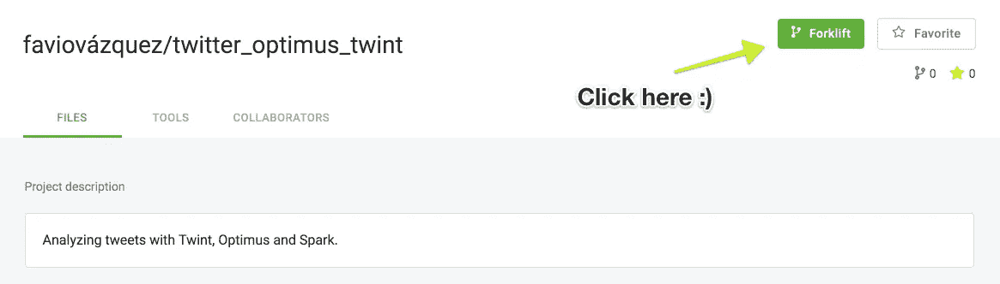
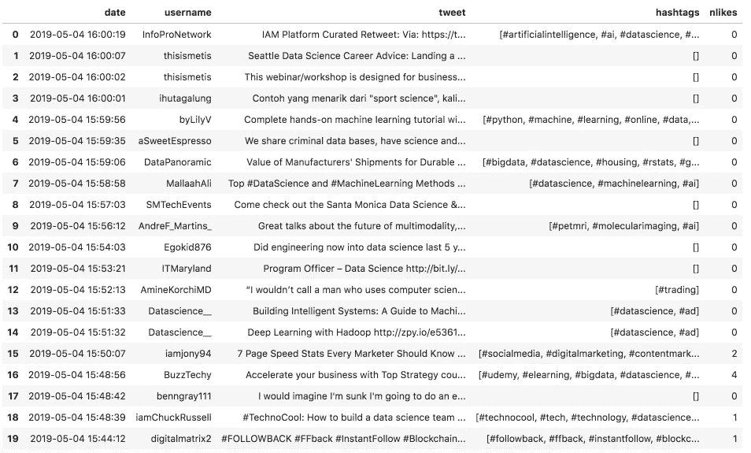
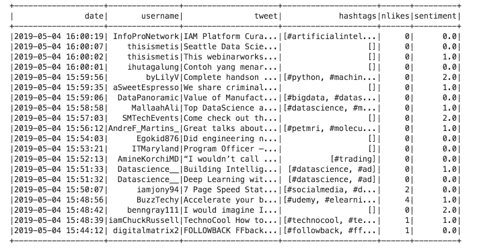
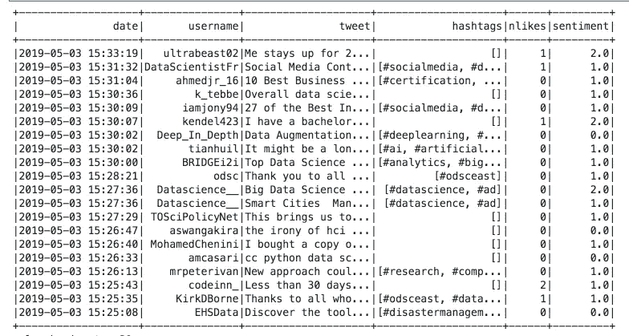
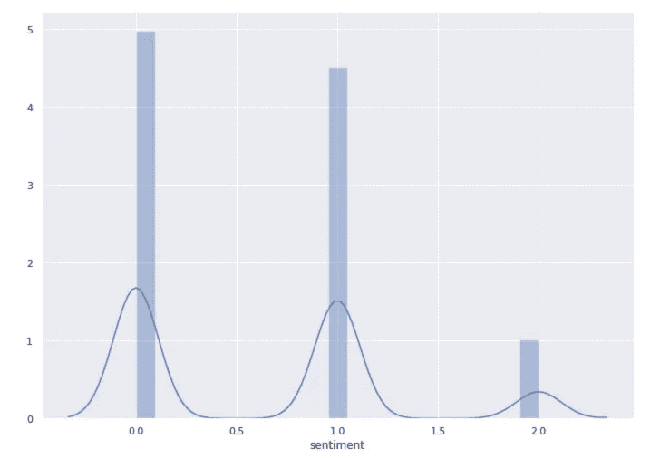

# 使用 Spark、Optimus 和 Twint 在几分钟内使用 NLP 分析推文

> 原文：<https://towardsdatascience.com/analyzing-tweets-with-nlp-in-minutes-with-spark-optimus-and-twint-a0c96084995f?source=collection_archive---------4----------------------->

## 社交媒体一直是研究人们沟通和行为方式的黄金，在本文中，我将向您展示在没有 Twitter API 的情况下分析推文的最简单方法，并可扩展用于大数据。


# 介绍

如果你在这里，很可能你对分析推文(或类似的东西)感兴趣，你有很多推文，或者可以得到它们。最烦人的事情之一就是获得一个 Twitter 应用程序，获得认证和所有这些。如果你用的是熊猫，那就没办法衡量了。

那么，一个不需要 Twitter API 认证的系统怎么样，它可以获得无限量(几乎是无限量)的推文和分析它们的能力，以及 NLP 等等。好吧，你一定会喜欢的，因为这正是我现在要给你看的。

# 获得项目和回购


[https://matrixds.com/](https://matrixds.com/)

你可以很容易地理解我将要向你展示的一切。只是铲车这个 MatrixDS 项目:

 [## MatrixDS |数据项目工作台

### MatrixDS 是一个构建、共享和管理任何规模的数据项目的地方。

community.platform.matrixds.com](https://community.platform.matrixds.com/community/project/5ccc9c4b3175e0603c394444/files) 

还有一个 GitHub repo，里面什么都有:

[](https://github.com/FavioVazquez/twitter_optimus_twint) [## FavioVazquez/Twitter _ Optimus _ twint

### 用 Twint，Optimus 和 Apache Spark 分析推文。-FavioVazquez/Twitter _ Optimus _ twint

github.com](https://github.com/FavioVazquez/twitter_optimus_twint) 

使用 MatrixDS，您可以免费运行笔记本、获取数据和运行分析，因此如果您想了解更多信息，请这么做。

# 得到 Twint 和擎天柱


Twint 利用 Twitter 的搜索运营商让你抓取特定用户的推文，抓取与某些主题、标签和趋势相关的推文，或者从推文中挑选出*敏感的*信息，如电子邮件和电话号码。

通过我共同创建的库 Optimus，你可以清理数据，准备数据，分析数据，创建剖面图和图表，执行机器学习和深度学习，所有这些都以分布式的方式进行，因为在后端我们有 Spark，TensorFlow，Sparkling Water 和 Keras。

因此，让我们首先安装您需要的所有东西，因为当您在 Matrix 项目中时，请转到分析 Tweets 笔记本并运行(您也可以从 JupyterLab 终端执行此操作):

```
!pip install --user -r requirements.txt
```

之后，我们需要安装 Twint，运行:

```
!pip install --upgrade --user -e git+[https://github.com/twintproject/twint.git@origin/master#egg=twint](https://github.com/twintproject/twint.git@origin/master#egg=twint)
```

这将下载一个 scr/文件夹，因此我们需要做一些配置:

```
!mv src/twint .
!rm -r src
```

然后导入我们需要运行的 Twint:

```
%load_ext autoreload
%autoreload 2import sys
sys.path.append("twint/")
```

最后:

```
import twint
```

Optimus 是在第一步安装的，所以我们就开始吧(这会为你启动一个 Spark 集群):

```
from optimus import Optimus
op = Optimus()
```

# 设置 Twint 以删除推文


[https://www.theverge.com/2015/11/3/9661180/twitter-vine-favorite-fav-likes-hearts](https://www.theverge.com/2015/11/3/9661180/twitter-vine-favorite-fav-likes-hearts)

```
# Set up TWINT config
c = twint.Config()
```

如果您在笔记本电脑上运行，您还需要运行:

```
# Solve compatibility issues with notebooks and RunTime errors.
import nest_asyncio
nest_asyncio.apply()
```

# 搜索数据科学推文


我将开始我们的分析，废弃关于数据科学的推文，你可以把它改成你想要的任何东西。

为此，我们只需运行以下命令:

```
c.Search = "data science"
# Custom output format
c.Format = "Username: {username} |  Tweet: {tweet}"
c.Limit = 1
c.Pandas = Truetwint.run.Search(c)
```

让我给你解释一下这段代码。在我们运行代码的最后一部分:

```
c = twint.Config()
```

我们开始了新的 Twint 配置。之后，我们需要通过不同的选项，我们想刮推文。以下是配置选项的完整列表:

```
Variable             Type       Description
--------------------------------------------
Username             (string) - Twitter user's username
User_id              (string) - Twitter user's user_id
Search               (string) - Search terms
Geo                  (string) - Geo coordinates (lat,lon,km/mi.)
Location             (bool)   - Set to True to attempt to grab a Twitter user's location (slow).
Near                 (string) - Near a certain City (Example: london)
Lang                 (string) - Compatible language codes: https://github.com/twintproject/twint/wiki/Langauge-codes
Output               (string) - Name of the output file.
Elasticsearch        (string) - Elasticsearch instance
Timedelta            (int)    - Time interval for every request (days)
Year                 (string) - Filter Tweets before the specified year.
Since                (string) - Filter Tweets sent since date (Example: 2017-12-27).
Until                (string) - Filter Tweets sent until date (Example: 2017-12-27).
Email                (bool)   - Set to True to show Tweets that _might_ contain emails.
Phone                (bool)   - Set to True to show Tweets that _might_ contain phone numbers.
Verified             (bool)   - Set to True to only show Tweets by _verified_ users
Store_csv            (bool)   - Set to True to write as a csv file.
Store_json           (bool)   - Set to True to write as a json file.
Custom               (dict)   - Custom csv/json formatting (see below).
Show_hashtags        (bool)   - Set to True to show hashtags in the terminal output.
Limit                (int)    - Number of Tweets to pull (Increments of 20).
Count                (bool)   - Count the total number of Tweets fetched.
Stats                (bool)   - Set to True to show Tweet stats in the terminal output.
Database             (string) - Store Tweets in a sqlite3 database. Set this to the DB. (Example: twitter.db)
To                   (string) - Display Tweets tweeted _to_ the specified user.
All                  (string) - Display all Tweets associated with the mentioned user.
Debug                (bool)   - Store information in debug logs.
Format               (string) - Custom terminal output formatting.
Essid                (string) - Elasticsearch session ID.
User_full            (bool)   - Set to True to display full user information. By default, only usernames are shown.
Profile_full         (bool)   - Set to True to use a slow, but effective method to enumerate a user's Timeline.
Store_object         (bool)   - Store tweets/user infos/usernames in JSON objects.
Store_pandas         (bool)   - Save Tweets in a DataFrame (Pandas) file.
Pandas_type          (string) - Specify HDF5 or Pickle (HDF5 as default).
Pandas               (bool)   - Enable Pandas integration.
Index_tweets         (string) - Custom Elasticsearch Index name for Tweets (default: twinttweets).
Index_follow         (string) - Custom Elasticsearch Index name for Follows (default: twintgraph).
Index_users          (string) - Custom Elasticsearch Index name for Users (default: twintuser).
Index_type           (string) - Custom Elasticsearch Document type (default: items).
Retries_count        (int)    - Number of retries of requests (default: 10).
Resume               (int)    - Resume from a specific tweet id (**currently broken, January 11, 2019**).
Images               (bool)   - Display only Tweets with images.
Videos               (bool)   - Display only Tweets with videos.
Media                (bool)   - Display Tweets with only images or videos.
Replies              (bool)   - Display replies to a subject.
Pandas_clean         (bool)   - Automatically clean Pandas dataframe at every scrape.
Lowercase            (bool)   - Automatically convert uppercases in lowercases.
Pandas_au            (bool)   - Automatically update the Pandas dataframe at every scrape.
Proxy_host           (string) - Proxy hostname or IP.
Proxy_port           (int)    - Proxy port.
Proxy_type           (string) - Proxy type.
Tor_control_port     (int) - Tor control port.
Tor_control_password (string) - Tor control password (not hashed).
Retweets             (bool)   - Display replies to a subject.
Hide_output          (bool)   - Hide output.
Get_replies          (bool)   - All replies to the tweet.
```

所以在这段代码中:

```
c.Search = "data science"
# Custom output format
c.Format = "Username: {username} |  Tweet: {tweet}"
c.Limit = 1
c.Pandas = True
```

我们设置搜索词，然后格式化响应(只是为了检查)，只获得 20 条 tweets，限制=1(它们以 20 为增量)，最后使结果与 Pandas 兼容。

然后当我们跑的时候:

```
twint.run.Search(c)
```

我们正在展开搜索。结果是:

```
Username: tmj_phl_pharm |  Tweet: If you're looking for work in Spring House, PA, check out this Biotech/Clinical/R&D/Science job via the link in our bio: KellyOCG Exclusive: Data Access Analyst in Spring House, PA- Direct Hire at Kelly Services #KellyJobs #KellyServices
Username: DataSci_Plow |  Tweet: Bring your Jupyter Notebook to life with interactive widgets  https://www.plow.io/post/bring-your-jupyter-notebook-to-life-with-interactive-widgets?utm_source=Twitter&utm_campaign=Data_science … +1 Hal2000Bot #data #science
Username: ottofwagner |  Tweet: Top 7 R Packages for Data Science and AI   https://noeliagorod.com/2019/03/07/top-7-r-packages-for-data-science-and-ai/ … #DataScience #rstats #MachineLearning
Username: semigoose1 |  Tweet: ëäSujy #crypto #bitcoin #java #competition #influencer #datascience #fintech #science #EU  https://vk.com/id15800296  https://semigreeth.wordpress.com/2019/05/03/easujy-crypto-bitcoin-java-competition-influencer-datascience-fintech-science-eu- https-vk-com-id15800296/ …
Username: Datascience__ |  Tweet: Introduction to Data Analytics for Business  http://zpy.io/c736cf9f  #datascience #ad
Username: Datascience__ |  Tweet: How Entrepreneurs in Emerging Markets can master the Blockchain Technology  http://zpy.io/f5fad501  #datascience #ad
Username: viktor_spas |  Tweet: [Перевод] Почему Data Science командам нужны универсалы, а не специалисты  https://habr.com/ru/post/450420/?utm_source=dlvr.it&utm_medium=twitter&utm_campaign=450420 … pic.twitter.com/i98frTwPSE
Username: gp_pulipaka |  Tweet: Orchestra is a #RPA for Orchestrating Project Teams. #BigData #Analytics #DataScience #AI #MachineLearning #Robotics #IoT #IIoT #PyTorch #Python #RStats #TensorFlow #JavaScript #ReactJS #GoLang #CloudComputing #Serverless #DataScientist #Linux @lruettimann  http://bit.ly/2Hn6qYd  pic.twitter.com/kXizChP59U
Username: amruthasuri |  Tweet: "Here's a typical example of a day in the life of a RagingFX trader. Yesterday I received these two signals at 10am EST. Here's what I did... My other activities have kept me so busy that ...  http://bit.ly/2Jm9WT1  #Learning #DataScience #bigdata #Fintech pic.twitter.com/Jbes6ro1lY
Username: PapersTrending |  Tweet: [1/10] Real numbers, data science and chaos: How to fit any dataset with a single parameter - 192 stars - pdf:  https://arxiv.org/pdf/1904.12320v1.pdf … - github: https://github.com/Ranlot/single-parameter-fit …
Username: webAnalyste |  Tweet: Building Data Science Capabilities Means Playing the Long Game  http://dlvr.it/R41k3t  pic.twitter.com/Et5CskR2h4
Username: DataSci_Plow |  Tweet: Building Data Science Capabilities Means Playing the Long Game  https://www.plow.io/post/building-data-science-capabilities-means-playing-the-long-game?utm_source=Twitter&utm_campaign=Data_science … +1 Hal2000Bot #data #science
Username: webAnalyste |  Tweet: Towards Well Being, with Data Science (part 2)  http://dlvr.it/R41k1K  pic.twitter.com/4VbljUcsLh
Username: DataSci_Plow |  Tweet: Understanding when Simple and Multiple Linear Regression give Different Results  https://www.plow.io/post/understanding-when-simple-and-multiple-linear-regression-give-different-results?utm_source=Twitter&utm_campaign=Data_science … +1 Hal2000Bot #data #science
Username: DataSci_Plow |  Tweet: Artificial Curiosity  https://www.plow.io/post/artificial-curiosity?utm_source=Twitter&utm_campaign=Data_science … +1 Hal2000Bot #data #science
Username: gp_pulipaka |  Tweet: Synchronizing the Digital #SCM using AI for Supply Chain Planning. #BigData #Analytics #DataScience #AI #RPA #MachineLearning #IoT #IIoT #Python #RStats #TensorFlow #JavaScript #ReactJS #GoLang #CloudComputing #Serverless #DataScientist #Linux @lruettimann  http://bit.ly/2KX8vrt  pic.twitter.com/tftxwilkQf
Username: DataSci_Plow |  Tweet: Extreme Rare Event Classification using Autoencoders in Keras  https://www.plow.io/post/extreme-rare-event-classification-using-autoencoders-in-keras?utm_source=Twitter&utm_campaign=Data_science … +1 Hal2000Bot #data #science
Username: DataSci_Plow |  Tweet: Five Methods to Debug your Neural Network  https://www.plow.io/post/five-methods-to-debug-your-neural-network?utm_source=Twitter&utm_campaign=Data_science … +1 Hal2000Bot #data #science
Username: iamjony94 |  Tweet: 26 Mobile and Desktop Tools for Marketers  http://bit.ly/2LkL3cN  #socialmedia #digitalmarketing #contentmarketing #growthhacking #startup #SEO #ecommerce #marketing #influencermarketing #blogging #infographic #deeplearning #ai #machinelearning #bigdata #datascience #fintech pic.twitter.com/mxHiY4eNXR
Username: TDWI |  Tweet: #ATL #DataPros: Our #analyst, @prussom is headed your way to speak @ the #FDSRoadTour on Wed, 5/8! Register to attend for free, learn about Modern #DataManagement in the Age of #Cloud & #DataScience: Trends, Challenges & Opportunities.  https://bit.ly/2WlYOJb  #Atlanta #freeevent
```

看起来不太好，但我们得到了我们想要的。推文！

# 将结果保存到熊猫中


遗憾的是 Twint 和 Spark 之间没有直接联系，但是我们可以用熊猫来做，然后将结果传递给 Optimus。

我创建了一些简单的函数，你可以在实际项目中看到，这些函数帮助你处理熊猫和这个部分的奇怪的 Twint API。所以当我们运行这个时:

```
available_columns()
```

你会看到:

```
Index(['conversation_id', 'created_at', 'date', 'day', 'hashtags', 'hour','id', 'link', 'location', 'name', 'near', 'nlikes', 'nreplies','nretweets', 'place', 'profile_image_url', 'quote_url', 'retweet','search', 'timezone', 'tweet', 'user_id', 'user_id_str', 'username'],dtype='object')
```

这些是我们刚刚查询得到的列。有很多不同的东西可以用来处理这些数据，但是对于本文，我将只使用其中的一部分。因此，为了将 Twint 的结果转换为 Pandas，我们运行:

```
df_pd = twint_to_pandas(["date", "username", "tweet", "hashtags", "nlikes"])
```

你会看到这只熊猫:



好多了不是吗？

# 情感分析(简单的方法)


我们将使用 Optimus 和 TextBlob 对一些推文进行情感分析。我们需要做的第一件事是清理这些推文，因为擎天柱是最好的选择。

为了将数据保存为 Optimus (Spark) DF，我们需要运行:

```
df = op.create.data_frame(pdf= df_pd)
```

我们将使用 Optimus 删除重音符号和特殊字符(对于真实的工作场景，您需要做的远不止这些，如删除链接、图像和停用词)，为此:

```
clean_tweets = df.cols.remove_accents("tweet") \
                 .cols.remove_special_chars("tweet")
```

然后，我们需要从 Spark 收集这些推文，将它们放在 Python 列表中，为此:

```
tweets = clean_tweets.select("tweet").rdd.flatMap(lambda x: x).collect()
```

然后，为了分析这些推文的情绪，我们将使用 TextBlob *情绪*函数:

```
from textblob import TextBlob
from IPython.display import Markdown, display# Pretty printing the result
def printmd(string, color=None):
    colorstr = "<span style='color:{}'>{}</span>".format(color, string)
    display(Markdown(colorstr))for tweet in tweets:
    print(tweet)
    analysis = TextBlob(tweet)
    print(analysis.sentiment)
    if analysis.sentiment[0]>0:
        printmd('Positive', color="green")
    elif analysis.sentiment[0]<0:
        printmd('Negative', color="red")
    else:
        printmd("No result", color="grey")
        print("")
```

这将给我们:

```
IAM Platform Curated Retweet  Via  httpstwittercomarmaninspace  ArtificialIntelligence AI What About The User Experience  httpswwwforbescomsitestomtaulli20190427artificialintelligenceaiwhatabouttheuserexperience  AI DataScience MachineLearning BigData DeepLearning Robots IoT ML DL IAMPlatform TopInfluence ArtificialIntelligence
Sentiment(polarity=0.0, subjectivity=0.0)
```

中立的

```
Seattle Data Science Career Advice Landing a Job in The Emerald City Tips from Metis Seattle Career Advisor Marybeth Redmond –  httpsbitly2IYjzaj  pictwittercom98hMYZVxsu
Sentiment(polarity=0.0, subjectivity=0.0)
```

中立的

```
This webinarworkshop is designed for business leaders data science managers and decision makers who want to build effective AI and data science capabilities for their organization Register here  httpsbitly2GDQeQT  pictwittercomxENQ0Dtv1X
Sentiment(polarity=0.6, subjectivity=0.8)
```

积极的

```
Contoh yang menarik dari sport science kali ini dari sisi statistik dan pemetaan lapangan Dengan makin gencarnya scientific method masuk di sport maka pengolahan data seperti ini akan semakin menjadi hal biasa  httpslnkdinfQHqgjh 
Sentiment(polarity=0.0, subjectivity=0.0)
```

中立的

```
Complete handson machine learning tutorial with data science Tensorflow artificial intelligence and neural networks  Machine Learning Data Science and Deep Learning with Python   httpsmedia4yousocialcareerdevelopmenthtmlmachinelearning  python machine learning online data science udemy elearning pictwittercomqgGVzRUFAM
Sentiment(polarity=-0.16666666666666666, subjectivity=0.6)
```

否定的；消极的；负面的；负的

```
We share criminal data bases have science and medical collaoarations Freedom of movement means we can live and work in EU countries with no hassle at all much easier if youre from a poorer background We have Erasmus loads more good things
Sentiment(polarity=0.18939393939393936, subjectivity=0.39166666666666666)
```

积极的

```
Value of Manufacturers Shipments for Durable Goods BigData DataScience housing rstats ggplot pictwittercomXy0UIQtNHy
Sentiment(polarity=0.0, subjectivity=0.0)
```

中立的

```
Top DataScience and MachineLearning Methods Used in 2018 2019 AI MoRebaie TMounaged AINow6 JulezNorton  httpswwwkdnuggetscom201904topdatasciencemachinelearningmethods20182019html 
Sentiment(polarity=0.5, subjectivity=0.5)
```

积极的

```
Come check out the Santa Monica Data Science  Artificial Intelligence meetup to learn about In PersonComplete Handson Machine Learning Tutorial with Data Science  httpbitly2IRh0GU 
Sentiment(polarity=-0.6, subjectivity=1.0)
```

否定的；消极的；负面的；负的

```
Great talks about the future of multimodality clinical translation and data science Very inspiring 1stPETMRIsymposium unitue PETMRI molecularimaging AI pictwittercomO542P9PKXF
Sentiment(polarity=0.4833333333333334, subjectivity=0.625)
```

积极的

```
Did engineering now into data science last 5 years and doing MSC in data science this year
Sentiment(polarity=0.0, subjectivity=0.06666666666666667)
```

中立的

```
Program Officer – Data Science  httpbitly2PV3ROF 
Sentiment(polarity=0.0, subjectivity=0.0)
```

中立。

诸如此类。

这非常容易，但它不会扩展，因为最终我们从 Spark 收集数据，所以驱动程序的 RAM 是极限。让我们做得更好一点。

# 将情感直接添加到 Spark 数据框架中


将这些代码转换成 Spark 代码很简单。这段代码也可以帮助您转换其他代码。因此，让我们开始从 Spark 导入用户定义的功能模块:

```
from pyspark.sql.functions import udf
```

然后我们将把上面的代码转换成一个函数:

```
def apply_blob(sentence):
    temp = TextBlob(sentence).sentiment[0]
    if temp == 0.0:
        return 0.0 # Neutral
    elif temp >= 0.0:
        return 1.0 # Positive
    else:
        return 2.0 # Negative
```

此后，我们将把该函数注册为火花 UDF:

```
sentiment = udf(apply_blob)
```

然后，为了将该函数应用于整个数据帧，我们需要编写:

```
clean_tweets.withColumn("sentiment", sentiment(clean_tweets['tweet'])).show()
```

我们会看到:



# 情感分析，程序员的好方法(使代码模块化)


这实际上不是质量代码。让我们把它转换成函数来反复使用。

第一部分是设置一切:

```
%load_ext autoreload
%autoreload 2# Import twint
import sys
sys.path.append("twint/")# Set up TWINT config
import twint
c = twint.Config()# Other imports
import seaborn as sns
import os
from optimus import Optimus
op = Optimus()# Solve compatibility issues with notebooks and RunTime errors.
import nest_asyncio
nest_asyncio.apply()# Disable annoying printingclass HiddenPrints:
    def __enter__(self):
        self._original_stdout = sys.stdout
        sys.stdout = open(os.devnull, 'w') def __exit__(self, exc_type, exc_val, exc_tb):
        sys.stdout.close()
        sys.stdout = self._original_stdout
```

最后一部分是一个类，它将删除 Twint 的自动打印，所以我们只看到数据帧。

以上所有的东西都可以用这些函数来概括:

```
from textblob import TextBlob
from pyspark.sql.functions import udf
from pyspark.sql.types import DoubleType# Function to get sentiment 
def apply_blob(sentence):
    temp = TextBlob(sentence).sentiment[0]
    if temp == 0.0:
        return 0.0 # Neutral
    elif temp >= 0.0:
        return 1.0 # Positive
    else:
        return 2.0 # Negative# UDF to write sentiment on DF
sentiment = udf(apply_blob, DoubleType())# Transform result to pandas
def twint_to_pandas(columns):
    return twint.output.panda.Tweets_df[columns]def tweets_sentiment(search, limit=1):
    c.Search = search
    # Custom output format
    c.Format = "Username: {username} |  Tweet: {tweet}"
    c.Limit = limit
    c.Pandas = True
    with HiddenPrints():
        print(twint.run.Search(c))

    # Transform tweets to pandas DF
    df_pd = twint_to_pandas(["date", "username", "tweet", "hashtags", "nlikes"])

    # Transform Pandas DF to Optimus/Spark DF
    df = op.create.data_frame(pdf= df_pd)

    # Clean tweets
    clean_tweets = df.cols.remove_accents("tweet") \
                 .cols.remove_special_chars("tweet")

    # Add sentiment to final DF
    return clean_tweets.withColumn("sentiment",    sentiment(clean_tweets['tweet']))
```

因此，为了获取推文并添加情感，我们使用:

```
df_result = tweets_sentiment("data science", limit=1)df_result.show()
```



就这样:)

让我们看看情绪的分布:

```
df_res_pandas = df_result.toPandas()
sns.distplot(df_res_pandas['sentiment'])
sns.set(rc={'figure.figsize':(11.7,8.27)})
```



# 利用 Twint 做更多事情


To see how to do this check: [https://amueller.github.io/word_cloud/auto_examples/masked.html](https://amueller.github.io/word_cloud/auto_examples/masked.html)

我们可以做更多的事情，这里我将向你展示如何创建一个简单的函数来获取 tweets，以及如何从它们构建一个单词云。

所以通过简单的搜索就能得到推文:

```
def get_tweets(search, limit=100):
    c = twint.Config()
    c.Search = search
    c.Limit = limit
    c.Pandas = True
    c.Pandas_clean = Truewith HiddenPrints():
        print(twint.run.Search(c))
    return twint.output.panda.Tweets_df[["username","tweet"]]
```

有了这个，我们可以很容易地获得成千上万条推文:

```
tweets = get_tweets("data science", limit=10000)tweets.count() # 10003
```

要生成单词云，我们需要做的就是:

```
from wordcloud import WordCloud, STOPWORDS, ImageColorGenerator
import matplotlib.pyplot as plt
%matplotlib inlinetext = tweets.tweet.values# adding movie script specific stopwords
stopwords = set(STOPWORDS)
stopwords.add("https")
stopwords.add("xa0")
stopwords.add("xa0'")
stopwords.add("bitly")
stopwords.add("bit")
stopwords.add("ly")
stopwords.add("twitter")
stopwords.add("pic")wordcloud = WordCloud(
    background_color = 'black',
    width = 1000,
    height = 500,
    stopwords = stopwords).generate(str(text))
```

我添加了一些与分析无关的常用词。为了说明这一点，我们使用:

```
plt.imshow(wordcloud, interpolation=’bilinear’)
plt.axis(“off”)
plt.rcParams[‘figure.figsize’] = [10, 10]
```

您将获得:


很漂亮，但没那么漂亮。如果我们想要好的代码，我们需要模块，那么让我们把它转换成一个函数:

```
def generate_word_cloud(tweets):

    # Getting the text out of the tweets
    text = tweets.tweet.values

    # adding movie script specific stopwords
    stopwords = set(STOPWORDS)
    stopwords.add("https")
    stopwords.add("xa0")
    stopwords.add("xa0'")
    stopwords.add("bitly")
    stopwords.add("bit")
    stopwords.add("ly")
    stopwords.add("twitter")
    stopwords.add("pic")wordcloud = WordCloud(
        background_color = 'black',
        width = 1000,
        height = 500,
        stopwords = stopwords).generate(str(text))

    plt.imshow(wordcloud, interpolation='bilinear')
    plt.axis("off")
    plt.rcParams['figure.figsize'] = [10, 10]
```

然后我们就跑:

```
tweets = get_tweets("artificial intelligence", limit=1000)
generate_word_cloud(tweets)
```


# 你自己试试

你可以利用图书馆做更多的事情。其他一些功能:

*   `twint.run.Search()` -使用搜索过滤器获取推文(正常)；
*   `twint.run.Followers()`——获取一个 Twitter 用户的关注者；
*   `twint.run.Following()` -获取关注推特用户的人；
*   `twint.run.Favorites()` -获取 Twitter 用户喜欢的推文；
*   `twint.run.Profile()` -从用户的个人资料中获取推文(包括转发)；
*   `twint.run.Lookup()` -从用户档案中获取信息(简历、位置等)。).

实际上，您可以从终端使用它。对于刚才运行:

```
pip3 install --upgrade -e git+https://github.com/twintproject/twint.git@origin/master#egg=twint
```

然后只需运行转到 twint 文件夹:

```
cd src/twint
```

最后你可以运行例如:

```
twint -u TDataScience --since 2019-01-01 --o TDS.csv --csv
```

在这里，我得到了本年度 [TDS 团队](https://medium.com/u/7e12c71dfa81?source=post_page-----a0c96084995f--------------------------------)的所有推文(迄今为止有 845 条)。如果你想要的话，下面是 CSV 文件:

[](https://github.com/FavioVazquez/twitter_optimus_twint/blob/master/TDS.csv) [## FavioVazquez/Twitter _ Optimus _ twint

### 用 Twint，Optimus 和 Apache Spark 分析推文。-FavioVazquez/Twitter _ Optimus _ twint

github.com](https://github.com/FavioVazquez/twitter_optimus_twint/blob/master/TDS.csv) 

# 奖金(缩放结果)

让我们获得 10k 条推文，并获得他们的情绪，因为为什么不。为此:

```
df_result = tweets_sentiment("data science", limit=100000)df_result.show()
```

这实际上花了将近 10 分钟，所以要做好预防措施。从 CLI 获取 tweets，然后应用该函数可能会更快。让我们看看有多少条推文:

```
df_results.count()
```

我们有 10.031 条带有情绪的推文！你也可以用它们来训练其他模型。

感谢您阅读本文，希望它能对您目前的工作和对数据科学的理解有所帮助。如果你想了解我更多，请在 twitter 上关注我:

[](https://twitter.com/faviovaz) [## 法维奥·巴斯克斯(@法维奥·巴斯克斯)|推特

### Favio Vázquez 的最新推文(@FavioVaz)。数据科学家。物理学家和计算工程师。我有一个…

推特通讯](https://twitter.com/faviovaz)