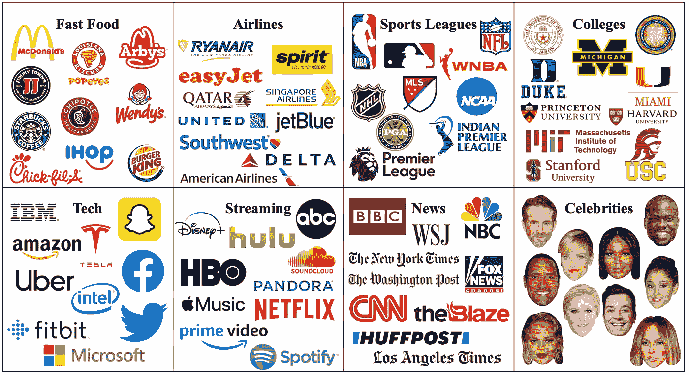
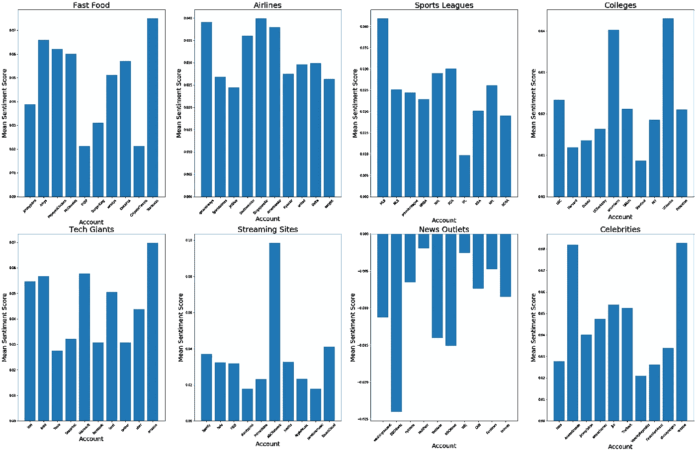
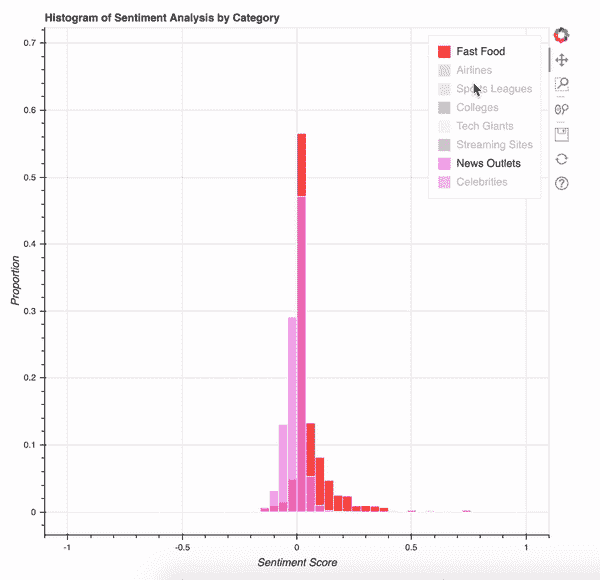
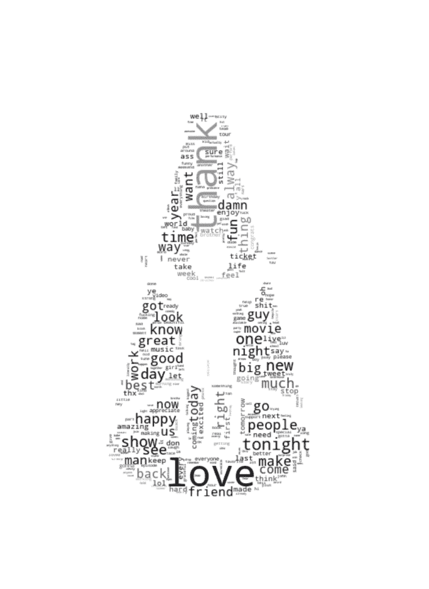
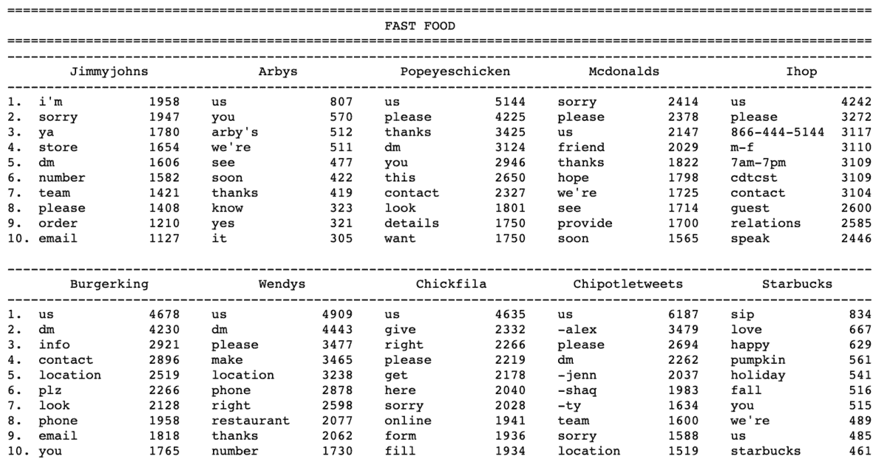
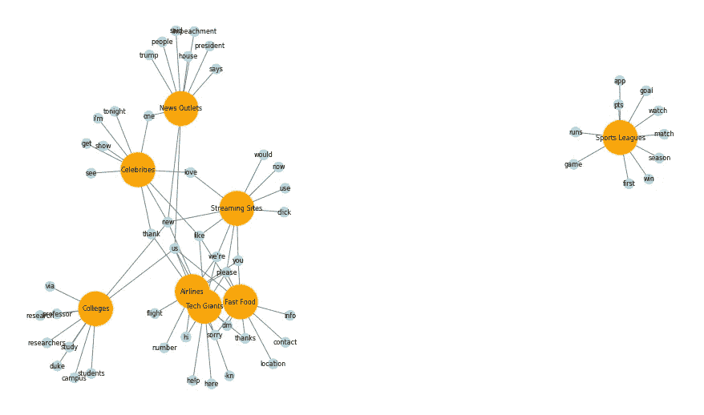
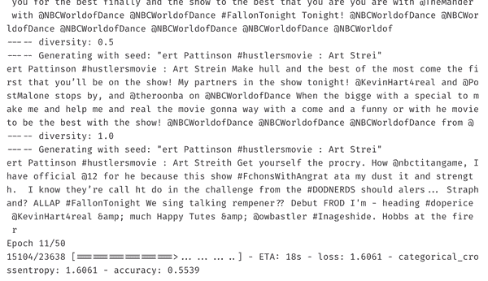

# 通过自然语言处理技术分析 Twitter 领域

> 原文：<https://towardsdatascience.com/analyzing-twitter-spheres-through-nlp-techniques-748b0df10b6c?source=collection_archive---------14----------------------->

## 使用情感分析、词云和递归神经网络探索 8 个类别 x 10 个账户 x 10000 条推文的数据集

由 Sejal Dua 和 Camille Bowman 创作


# 介绍

Twitter 是一个用于各种交流的平台:淋浴的想法、有趣的遭遇、严肃的新闻等等。我们很好奇不同类型的账户如何使用 Twitter。我们研究了 8 个类别的 10 个大客户:快餐、航空公司、体育联盟、大学、科技公司、流媒体服务、新闻媒体和名人。使用他们的推文，我们通过情感分析、词云、网络和递归神经网络检查了账户使用的词的模式。

# 数据收集

最初，我们的计划是使用 Twitter API 和 tweepy 库来获得一个数据集，该数据集主要由流行的标签和与这些标签的使用相对应的地理位置数据组成。然而，我们很快发现，使用我们的免费开发者帐户，Twitter REST API 将只允许我们挖掘过去 7 天的推文，即使我们付费，我们每天也只能获得 100 条推文。在做了更多的研究后，我们了解到有一些变通办法。例如，有一个页面滚动条可以超过我们的 API 查询的速度限制。但是，一旦我们开始收集热门推文数据，我们就面临另一个问题。Twitter 是一个平台，用户可以在这个平台上充分接触到无穷无尽的内容和庞大的用户网络，而不必提供任何位置数据。人们可以自愿入住一个地点，但这个地点往往是一些令人难以置信的模糊和古怪的东西(如“地球”)。我们评估了所有这些因素，并确定鉴于我们项目的时间表和整个首要目的，前面的障碍太难克服:收集*大*数据，并使用强大的技术从中获得洞察力。从那时起，我们知道我们必须找到一种替代的数据收集方法，我们还必须重新定义我们的研究问题，使其不涉及在地图上可视化地理位置数据。

我们浏览了互联网和 GitHub，寻找 StackOverflow 上那些绝对的传奇人物，他们总是在你准备放弃和改变的时候拯救你。幸运的是，我们找到了继续这个 Twitter 项目所需要的东西。[优化和修改的 GetOldTweets3 库(OMGOT)](https://github.com/marquisvictor/Optimized-Modified-GetOldTweets3-OMGOT) 可用于大量挖掘旧的和回溯的推文。我们使用这个 Python 库从特定用户那里提取了过去五年中发布的多达 10，000 条推文。如果你正在寻找 Twitter 上的公共账户，这个库比 Twitter API 简单得多(没有速率限制！)，并且不需要 API 键。

鉴于我们的新刮刀的能力，我们认为进行我们的项目的最佳途径是进入分类分析的领域。我们选择了下面的 8 个类别，因为我们相信它们共同代表了 Twitter 作为一个与其他人、整个社区以及我们触手可及的更大世界进行互动的平台的独特用途。我们通过找到经常发微博并且在“推特世界”之外很受欢迎的用户，为每个类别选择了 10 个账户。我们选择的客户显示在下面的徽标图中:



categories = {fast food, airlines, sports leagues, colleges, tech giants, streaming platforms, news, celebrities}

我们不得不删除一些我们最初选择的账户，因为它们的推文太少了。最初，我们有一个歌手和演员类别，但我们决定将这两个类别合并成一个更加多样化的名人类别。这使得我们能够包括像艾米·舒默和克莉茜·泰根这样的人(两人都在 Twitter 上非常活跃)，并淘汰了许多我们选择的在 Twitter 上更为分散的演员。

# **数据清理**

一旦我们收集了数据，我们必须对其进行预处理，以便为我们的情感分析和词云创建构建一个语料库。我们执行了以下清洁措施:

*   将所有推文改为小写
*   删除所有停用词(由 nltk 定义)
*   删除提及、链接和标签
*   删除所有标点和括号
*   删除所有单字符单词

这些清洗技术旨在去除在我们的分析中会导致无关信息或混淆信息的字符和单词。我们希望确保所有相同的单词看起来都一样——因此，小写和删除标点符号——我们还希望语料库中的所有单词都有意义，从而证明我们为什么删除特殊字符。如果你愿意，我们的清理，或者说去除谷壳，是为了让我们以后的分析更有信息和帮助。

# **方法 1:情绪分析**

对于我们探索性数据分析的第一阶段，我们认为按类别查看推文的负面或正面程度，以及不同账户的平均负面或正面程度会很有趣。我们使用 [affin](https://github.com/fnielsen/afinn) 库来计算情感得分，并根据清理后的推文长度进行标准化。然后我们绘制了每个账户的平均情绪得分，按类别细分。



category-level subplots of average sentiment score for each Twitter account

新闻是所有账户中唯一平均情绪得分为负的类别。这是有道理的，因为大多数公司都在回应投诉(并试图保持一切积极的态度)，名人也在努力维护自己的品牌。然而，新闻来源不断报道世界范围内的悲剧、战争和各种其他负面事件。我们确实期望看到更保守的新闻来源(福克斯、the Blaze 和《华尔街日报》)和更自由的新闻来源(华盛顿邮报、纽约时报和赫芬顿邮报)之间的差异。然而，新闻来源的积极性和它们在政治光谱中的位置之间没有明显的差异。《赫芬顿邮报》和《华尔街日报》是最不负面的两家推特，而 NBC 和 Blaze 是最负面的两家。

我们还分析了给定类别中所有推文的情绪直方图，没有考虑不同账户之间的情绪差异。


histogram subplots of average sentiment scores by category



preview of interactive Bokeh plot for sentiment score vs. category

如果你想和我们上面的散景直方图互动(强烈推荐)，请访问我们的 [GitHub repo](https://github.com/sejaldua/viral-network) 。不幸的是，目前你不能将散景图嵌入到媒体中(真的很遗憾，散景和 Codepen 应该合作，给人们他们想要的东西)。正如我们在前面的图表中观察到的，新闻比其他的要负面得多。这是唯一一个中位数小于 0 的类别，而其他类别都倾向于情绪谱的积极一面。也就是说，所有图表都以 0 为中心(在 0 处有一个巨大的峰值)，因此这意味着账户发送的许多 tweets 都由均等分布的正面和负面单词组成。

我们发现有趣的是，航空公司和快餐公司为糟糕的服务或客户问题道歉的所有推文并没有更负面地扭曲结果，因为这些推文充满了像“不”和“对不起”这样的词。我们假设，这可能是因为这些推文经常包含许多其他中性和积极的词，例如“请”、“帮助”和“更好”，这些词抵消了更多的负面词。

尽管我们的发现很有趣，但总的来说，这些类别和许多账户都是中性的。我们想对按类别和按账户使用的词做更深入的探索，这样我们就能更好地了解他们真正在推特上谈论什么。

# 方法二:词频

就量化任何给定文本样本的情感负荷而言，情感分析可能非常有价值，但情感得分的可视化往往令人印象深刻，我们了解到，从高度集中在 0 附近的直方图中只能获得这么多见解。此外，当试图描述具有类似“快餐”的类别标签的数据集时，情感分析完全忽略了可能看起来很有趣的名词的高流行率。出于这个原因，我们决定转向并深入一种不同类型的分析:词频。我们假设，通过以词云的形式可视化语料库，我们将能够识别扩大的高频词，这些词对于它们来自的类别来说很有意义。



word cloud GIF with 1 custom-shaped word cloud per category

我们的假设在很多方面都是正确的。正如你在上面的 GIF 中看到的，单词云似乎反映了你在查看 8 个类别的推文时可能观察到的单词内容。

以下是通过视觉观察单词 clouds 得出的一些观察结果:

> **快餐** : us，please，thank，sorry，dm，contact，info，hear，phone
> 航空公司 : please，thank，dm，us，hi，sorry，hear，flight，number
> **联赛**:游戏，比赛，pt，跑步，进球，获胜，观看，领先，团队，球员，运动
> **院校**:学生，新生，年，美国，via，杜克，研究，学习，世界
> **科技巨头【T13 感谢、使用、爱、现在、听、确认、宣传片、内容
> **新闻**:川普、新、总统、人、年、说、美国、弹劾
> **名人**:爱、感谢、今晚、快乐、人、朋友、时间、乐趣、年**

令人着迷的是，仅仅记下一列出现在人眼中的单词，我们就能够在某种程度上隐含地综合这些数据。一些跨多个类别的常用词包括“请”、“谢谢”。“我们”、“新”、“年”等。有趣的是，从客户服务的角度来看，快餐连锁店和航空公司似乎都在使用 Twitter，并向经常对产品不满的特定用户提供大量回复推文。这种直觉可能解释了为什么这两个类别共享“请”、“谢谢”、“dm”、“我们”、“抱歉”和“听到”等词。一家快餐公司可以索要顾客的联系信息，并以一顿免费餐来“弥补”,而一家航空公司却不能提供这样的友好姿态。只是精神食粮！

新闻和名人是有趣的类别，因为推文选择在本质上是如此多样化。每个单独的新闻提供者关注的是时事新闻，因此我们观察不到多少纵向趋势来阐明某个集中的主题。以类似的方式，名人在推特上发布与他们的生活和他们自己的生活相关的内容。瑞安·雷诺兹经常提到“死侍”，但毫不奇怪，数据集中的其他名人都没有提到这部电影。这里的要点是，由于语料库中充满了如此多的罕见名词，高频词的数量似乎减少了。我们看到高度通用的词，如“新”、“年”、“说”和“我们”，然后用最大的字体，我们看到“特朗普”、“总统”和“弹劾”。说够了…

单词 clouds 作为一个很好的刺激来收集每个类别的语料库的初步印象，但是我们渴望数字和数据！不仅如此，单词 clouds 还让我们好奇，我们如何通过账户获得每个类别中最常见单词*的洞察力，而不仅仅是一般的分类比较。因此，我们进一步研究了词频数据，提取了每个账户中最常见的 10 个词，并按类别显示出来。结果可以在下面的 GIF 中看到。*



top 10 words per account for each category and their occurrences

快餐、航空和科技 Twitter 账户说了很多“请”、“对不起”和“联系”(IHOP 的客户服务热线是他们第三常用的词)。正如我们前面提到的，这些账户的大多数推文都是发给不满意的客户的，帮助他们解决问题。这意味着他们的热门词汇都有令人难以置信的高计数，并且在某个点上有一些下降，因为他们的许多推文都有类似的前提(处理客户投诉)。

星巴克、特斯拉和 Snapchat 似乎是这些账户中唯一主要使用它做广告的账户，它们的每个词的计数要低得多，可能是因为对客户的重复回复最少。星巴克的前两个词是“啜饮”和“快乐”，特斯拉的是“增压器”和“模型”，Snapchat 的是“介绍”和“见面”。所有这些高频词都是非通用的，它们也不是对公司名称或产品的明确引用。人们可以看看这些词频见解，并声称这三家科技公司正在有效或最佳地使用 Twitter 平台，因为它们在太多直接回复用户和太多推广内容之间取得了完美的平衡。然而，相对于竞争对手，Snapchat 并不是一个特别活跃的 Twitter 用户:它的第七到第十热门词汇都只被使用了 5 次。也许他们应该分配更少的时间来开发新的变声和面部变形过滤器，而应该分配更多的时间来破坏人们的 Twitter 时间轴！也许他们在 Twitter 上的存在对他们作为一个年轻公司实现目标没有起到任何重要作用。谁知道呢？

体育联盟的推特使用了许多适合他们运动的行话，许多词指向用于广告游戏的推特(像“今晚”、“观看”和“游戏”这样的词很常见)。

看起来，大学的推特们喜欢谈论他们自己。除了普林斯顿和 UMiami，所有的账户都把他们的大学名称(以某种形式)作为他们最常用的词。其他常见的词是“学生”、“研究”和“校园”，表明他们的推特经常被用来谈论各自大学发生的事情。大多数科技公司和一些流媒体公司的名字都出现在他们的常用词汇列表中。这在其他类别中相当少见。

流媒体网站似乎大多使用他们的 Twitters 来推广新的发布，因为“首映”、“推广”、“新闻”和“今晚”都是跨帐户的常用词。与其他一些面向客户的类别不同，很少有词暗示了与快餐、科技和航空公司同等水平的解决客户问题的能力。

由于 9/10 的新闻推特是美国网站，许多词与美国政治和时事密切相关，如“总统”、“特朗普”和“弹劾”。有趣的是，BBC(唯一的国际新闻来源)的列表中也有“特朗普”和“总统”。唯一一个明显与非美国时事有关的词是“洪”，这是《华尔街日报》排名第十的最常用词。我们打赌他们第 11 个最常用的词是“孔”。有人要吗？

名人账户似乎主要是为了感谢他们的粉丝。“爱”、“感谢”和“快乐”都是流行词汇。不同名人的推特账户之间似乎也有明显的重叠。尽管类别内和类别间的字数差异很大，但名人的最高字数往往要少得多。与许多一天发多次推特、处理投诉和提及各种商品或销售的公司不同，名人的推特量要小得多。这导致热门词的使用更少，推文内容的变化更多。

我们还想看看前 10 个词在类别上的重叠情况。因为我们认为 10 路维恩图会有点忙乱，所以我们选择使用网络。较大的橙色节点代表类别，较小的蓝色节点代表单词，连接表示单词在该类别的前 10 名中。



network visualization of top 10 words per category

我们发现有趣的是，体育是唯一一个与其他类别完全没有重叠的类别。在 55 个不同的单词中，有 13 个至少被两个类别共享:“我们”、“请”、“dm”、“对不起”、“你”、“谢谢”、“喜欢”、“嗨”、“谢谢”、“我们很好”、“新的”、“爱”和“一”。单词节点的平均度为 1.45，这意味着平均排名靠前的单词通常是不止一个类别的常用单词。当只看跨多个类别共享的常用词时，平均程度为 2.92(大幅增加)。许多这样的共享词反映了消费者在 Twitter 上寻求帮助解决他们的问题或负面经历的流行，以及公司发出解决这些问题的推文数量。许多只用于一个类别的单词对该类别来说更加具体，比如所有的体育行话，“飞行”、“教授”和“特朗普”。

总之，本节中的自然语言处理技术帮助我们熟悉了来自不同账户和 Twitter 领域的推文内容。令人惊讶的是，我们随机选择了一些类别和账户，以为我们正在构建一个足够多样化的数据集来发现一些有趣的东西，而我们实际上*确实*收集了数据驱动的见解。现在我们知道我们的研究范围足够丰富，可以进一步研究，这就像我们已经验证了我们的概念设计证明，我们可以细化我们的研究问题，使其更窄，更有价值。

# 方法 3:递归神经网络(RNNs)

如果你已经做到了这一步，把这一步想象成喝完一碗可可脆饼后喝巧克力牛奶。这与我们开始这个项目的最初原因没有太大关系，但它无疑增加了我们的体验。

你可能想知道，为什么在过去的 10 分钟里，我们一直在不停地谈论 NLP 技术，如情感分析、词云可视化和词频分解，而我们现在提出了 RNNs。或者你可能想知道 RNN 是什么？这是完全正确的。

我们决定包括这一部分，因为，让我们面对现实吧，了解到吉米·法伦在他过去 5 年的推文中使用了 1303 次“今晚”这个词，这很酷，也很准确，但是你和我应该怎么处理这些信息呢？我们如何以最大限度地提供信息的方式来检测模式。好吧，你猜怎么着。答案就在我们心中。人类特别擅长综合信息。我们的神经元有点像野生的。但是，即使我们擅长综合信息，我们表达我们观察到的模式的能力也是相当糟糕的。

那么，我们为什么不训练一个神经网络模型来从数据中学习东西，就像人类会做的那样？对于这种类型的应用，RNNs 是神经网络的一种非常有用的变体。与依赖于两个连续输入相互独立的假设的普通神经网络不同，试图推断与基于语言的数据相关的模式需要某种“记忆”。网络必须捕捉、保留和积累信息。必须考虑对先前观测的依赖。

## 建筑


RNN model architecture

## **代码**

stripped down, uncommented RNN code in case you want to borrow it for your own usage

## 运行中的网络



video of our celebrities RNN training and generating sample tweets with varying diversities

我们重新利用了在丹麦留学学院(DIS)学习的“人工神经网络和深度学习”课程的代码，以便训练四个不同的神经网络，每个网络都适合一个独特类别的数据。我们训练了 50 个纪元，获得了 60%的准确率。我们还生成了具有不同多样性(0.2、0.5 和 1.0)的 tweet 样本。在下面的四个部分中，我们将嵌入一些使用 0.2 多样性生成的样本 tweets，我们将比较网络在早期和后期学到了多少。

## 快餐——生成的 Tweet 样本

```
epoch 1/50: accuracy = 44.18%, "to make it right? Very mysterious!"
```

> 去弥补吗？非常神秘！重要的事情。你能告诉我们具体的决定吗？你能告诉我们怎么想吗？你能告诉我们具体的决定吗？你能告诉我们怎么想吗？你能告诉我们如何思考吗？你能不能不要介意？你能给我们讲讲吗

在训练的第一个时期，我们的 RNN 模型开始生成一条 tweet (280 个字符),带有一个起始种子(40 个字符),内容是“让它正确？很神秘！”。当它开始偏离输入序列时，显然是非常混乱的。由于短语“你能给我们发短信吗”在数据集中的流行度很高，它反复尝试以该表达开始构建句子，但无法产生超出该表达的真实英语单词。

```
epoch 50/50: accuracy = 84.27%, "Please send us a DM if you're interested"
```

> 安吉拉，如果你对辣鸡块感兴趣，请给我们发一封 DM！请告诉我们餐厅的位置和你的电话号码，这样我们就能解决这个问题了。谢谢！那不行！请告诉我们餐厅的位置和你的电话号码，这样我们就能解决这个问题了。谢谢！那不行！

在精确度提高了近一倍后，神经网络的表现好了很多。我们看到连贯的英语句子，甚至可以发现这条推文中提到的快餐领域的“辣块”，这正是我们希望看到的内容类型。我们还看到网络试图加入一些标签。诚然，没有必要在推文中说#so，但它知道“#”字符在数据集中出现的频率很高，并且它积极地试图与时俱进，这一事实足以成为值得骄傲的理由。我们的神经网络总是把客户放在第一位，反复承诺“把这件事做好”，反复说“那不行！”。这表明它已经理解并能够反刍它从训练数据中观察到的语言模式。

## **联赛——生成的推文样本**

```
epoch: 3/50, accuracy = 51.7, "ty @Jamal_Carter6! What him scrape by t"
```

> ty @Jamal_Carter6！看着他从第一名到第一名，从第一名到第一名，从第一名到第一名，从第一名到第一名，从第一名到第一名，从第一名到第一名，从第一名到第一名

虽然，就像快餐一样，网络似乎陷入了一个无限循环，试图一遍又一遍地使用短语“第一”，但它发现了体育推特的一些重要方面。它试图提及一名球员和一支球队，并使用了“损失”一词。

```
epoch: 50/50, accuracy = 62.46%, "professionals for their impact on the game"
```

> 职业球员因其对@ national 比赛的影响而在@ LAClippers # PGA champ | @ BKoepka(22 分，6 次 REB，11 次 AST)和@SheffieldUnited 中的@Lakers 和@ ConnecticutSun 赢得@ national:# NFL 100 最伟大的球队@NFLNetwork №1: 1997 @NCAADII 女子高尔夫和 the

这条最大准确度的推文不如它的快餐同行好(可能是因为不同账户之间的同质化程度较低)，但它提到了真实的团队，并使用了真实的标签。“@BKoepka”是 Brooks Koepka 的真实 Twitter 句柄，“(22 PT，6 REB，11 AST)”是一个篮球运动员的合法统计报告，但当这两个部分在推文中相邻放置时没有意义。虽然国家队(一支棒球队)永远不会出现在 PGA 村(高尔夫球员)，但我们可以看到体育推特的一些重要方面:胜利公告、球员统计数据和提及次数。这意味着许多体育推特包含关于即将发生的比赛和过去比赛结果的信息。

## 新闻-生成的推文样本

```
epoch: 3/50, accuracy = 51.40%, "dispatcher is being lauded for recognizi"
```

> 调度员因为在弹劾调查中认识到了比总统更多的东西而受到称赞，学生们认为各州和各州的总统和检察官是市长，这将是一场竞争。

再说一遍，虽然这条推文没有太多意义。它采用了我们在频率分析中注意到的一些流行语，比如“总统”和“弹劾”。尽管它的结构很荒谬，但它能够复述新闻媒体经常使用的词汇。

```
epoch: 46/50, accuracy = 58.74%, "Sen. Warren on Bloomberg entering the ra"
```

> 参议员沃伦对彭博进入比赛的呼吁法院为国家的法院的总统的情况下。这个州使得一个派了一个媒体被一个接收到的州去看弹劾案的听证会，他们已经想站在竞选的那一边了

这条推文比第一时代更接近真实的新闻推文。它能够提取推文中常见的信息(如“弹劾听证会”和“竞选”)，我们可以推断新闻机构的许多推文目前正在讨论美国政治的两个最大方面:特朗普的弹劾听证会和即将到来的总统选举。

## 名人—生成的推文样本

```
epoch: 2/50, accuracy = 42.48%, "/Bv13d8lFHjc/?utm_source=ig_twitter_shar"
```

> /Bv13d8lFHjc/？UTM _ source = ig _ Twitter _ share&igshid = 1 ric 6 ctn 7 ZZ UX #不负责任# TheMich # the good # hustle hart # the miller # Fallon tonight 感谢你们的演出感谢过去的演出感谢工作感谢看演出的眼神最美好的演出最美好的未来和最美好的父亲

这条推文的标签比任何其他类别都多，并且来自各种不同的账户。我们可以再次看到，频率分析中的前 10 个词中的一些被纳入进来，因为最后一部分使用了大量的“谢谢”、“展示”和“最好的”——我们认为这些语言意味着名人感谢他们的粉丝。

```
epoch: 47/50, accuracy = 56.88%, "nstagram.com/p/BopWlA6lP_e/?utm_source=i"
```

> nstagram.com/p/BopWlA6lP_e/?UTM _ source = ig _ Twitter _ share&igshid = 1 zdttsjz 2 poo #今晚的法伦之夜:@ NBC world DOF dance #法伦之夜感谢@ HobbsAndShaw # TheNextLevel #法伦之夜感谢@ RealHughJannyMario&@ NBC world DOF dance #法伦之夜:@ NBC world DOF dance #法伦之夜感谢@TheEllenShow 今晚

这条推文包含一连串的提及和标签。由此，我们可以假设，比起体育账户，名人更热衷于给别人贴标签和包含标签。这最有可能提高他们推文的受欢迎程度，促进他们正在进行的各种项目，希望他们使用的一些标签能够爆炸，成为 Twitter 的趋势。这条特定的 RNN 生成的推文包含“今晚”、“谢谢”和“#FallonTonight”，这向我们表明，这个特定的 RNN 可能已经过度了，因为吉米·法伦在演出后发出了大量的“谢谢”(他需要冷静下来，不要歪曲我们的数据集)。

我们相信我们训练的四个 rnn 以一种真正有价值的方式帮助我们观察语言模式。不一定有生成推文的需求，因为大多数 Twitter 用户不难拿出仅 280 个字符的内容与世界分享，但这些递归神经网络能够合成大量推文并返回一些揭示原始数据特征的内容，这一事实非常酷！

# 未来方向

这个项目将来可以向许多潜在的方向扩展。由于 GetOldTweets3 使收集 Twitter 数据变得如此容易，我们很乐意检查更多的类别和每个类别的更多帐户，看看是否会出现更多的模式。同样，我们希望有时间在所有类别上训练一个递归神经网络，以便从数据中提取更多的模式。这将有助于我们进一步分析每一类 Twitter 讨论的一般话题，并更好地理解不同帐户组之间的一些趋势。

此外，引入一些不同类型的图表会非常有趣。我们的数据看起来是这样的，因为我们采用了最多 10，000 条推文，GetOldTweets3 是按时间倒序排列的，我们的数据集并没有完全设置为查看一段时间内的推文量。如果我们有时间，我们会取消我们的推文数量限制，重新搜索每个帐户，以获得过去 5 年的所有推文，然后我们会按类别绘制推文的时间序列分析。我们很想知道在过去的五年中是否有任何趋势，特别是在相对于时间的推文内容方面。我们可以设想这种时间序列分析启动另一个关于使用 NLP 和 ML 技术预测新闻趋势的大数据项目。

如果有时间，我们最想做的一件事就是创建一个机器学习模型，来预测给定推文的标签会有多流行。我们认为这是可行的，因为 Twitter API 和 UI 搜索字段使得查询带有趋势标签的推文变得非常容易，并且我们在整个项目中调查的所有账户都很受欢迎并且得到了验证。我们很想研究给定推文中使用的标签与该推文的病毒传播程度之间的关系，这可以通过赞数和转发数来量化。这个模型有可能被用来帮助公司决定他们应该利用哪些趋势，哪些趋势不值得花费精力。能够在一定程度上准确预测一条给定推文的成功将是一个有用和有趣的工具，尤其是在这个互联网营销的时代。

# 代码库

如果这个项目以任何方式、形状或形式让你感兴趣，我们强烈建议你使用我们的[代码](https://github.com/sejaldua/twitter-spheres)。采用我们在本文中使用的一种技术，用它来构建一些很酷的东西。然后写一个故事，让大家跟你学习，跟你一起学习。

[](https://github.com/sejaldua/twitter-spheres) [## sejaldua/Twitter-sphere

### 使用 8 x 10 x 10000 的推特数据集和大数据技术对推特内容进行分类分析…

github.com](https://github.com/sejaldua/twitter-spheres) 

# 承认

感谢我们的 Lucian Leahu 教授，感谢他对这个项目的帮助，感谢他教给我们这么多关于大数据领域的知识。感谢 Ulf Aslak Jensen 创建了这个课程和练习，帮助我们学习一些基本技能，我们现在可以用这些技能来处理令人敬畏的项目。感谢 GetOldTweets3，与 Twitter 的 API 相比，它就像是一个大大的拥抱。像往常一样，向开源社区和 StackOverflow 大声欢呼，感谢他们一路上帮助我们解决所有有趣的问题。还有像你这样的读者，激励你不断创造，不断用数据讲述故事！

# 参考

[](https://medium.com/@IrekponorVictor/twitter-data-mining-mining-twitter-data-without-api-keys-a2a2bd3f11c) [## Twitter 数据挖掘:挖掘没有 API 键的 Twitter 数据。

### 使用一行命令获取旧的 Twitter 大数据进行分析。

medium.com](https://medium.com/@IrekponorVictor/twitter-data-mining-mining-twitter-data-without-api-keys-a2a2bd3f11c) [](/creating-word-clouds-with-python-f2077c8de5cc) [## 用 python 创建单词云

### 在最近的一个 NLP 项目中，我发现单词云可以用遮罩来创建。在本文中，我将介绍如何…

towardsdatascience.com](/creating-word-clouds-with-python-f2077c8de5cc) [](https://pypi.org/project/netwulf/) [## netwulf

### Python 中简单的交互式网络可视化。网络可视化是一个不可或缺的工具，探索…

pypi.org](https://pypi.org/project/netwulf/) [](/understanding-neural-networks-from-neuron-to-rnn-cnn-and-deep-learning-cd88e90e0a90) [## 理解神经网络。从神经元到 RNN、CNN 和深度学习

### 神经网络是目前最流行的机器学习算法之一。它已经被决定性地证明了…

towardsdatascience.com](/understanding-neural-networks-from-neuron-to-rnn-cnn-and-deep-learning-cd88e90e0a90)