# 分析 R 中的视频游戏数据

> 原文：<https://towardsdatascience.com/analyzing-video-games-data-in-r-1afad7122aab?source=collection_archive---------13----------------------->

作为一名游戏玩家，我从分析这个数据集中获得了很多乐趣。实际上，这个数据集是由两个不同的数据集合并而成的: [Tidytuesday](https://github.com/rfordatascience/tidytuesday/blob/master/data/2019/2019-07-30/video_games.csv) 和 [Kaggle](https://www.kaggle.com/destring/metacritic-reviewed-games-since-2000) 。使用两个数据集的原因是因为 Tidytuesday 数据集没有足够的信息来进行有趣的分析。这就是为什么我合并了这两者，以便从中获得更多有趣的数据和见解。这也是我第一篇使用 Tidymodels 元包应用一些机器学习的文章。

```
***Loading Libraries***library(tidyverse) ## For data wrangling and visualization
library(lubridate) ## To work with dates
library(ggpubr)    ## Extra visualizations and themes
library(patchwork) ## Patch visualizations together
library(hrbrthemes)## Extra themes and formatting
library(ggalt)     ## Extra visualizations
library(vapoRwave) ## Retro themes
library(extrafont) ## Exta fonts***Loading Data*****video_games** <- read_csv("[https://raw.githubusercontent.com/rfordatascience/tidytuesday/master/data/2019/2019-07-30/video_games.csv](https://raw.githubusercontent.com/rfordatascience/tidytuesday/master/data/2019/2019-07-30/video_games.csv)") %>%
  mutate(release_date = as.Date(release_date, "%b %d, %Y")) %>%
  distinct(game, developer, publisher, .keep_all = TRUE)**metacritic_games** <- read_csv("C:\\Users\\ACER\\Downloads\\metacritic-games-stats-20112019\\metacritic_games.csv",trim_ws = TRUE) **Cleaning and mergin the datasets together**games_final <- metacritic_games %>%
  filter(platform=="PS4") %>% 
  inner_join(video_games,by = "game") %>%
  mutate(owners=parse_number(owners,trim_ws = TRUE)) %>%
  mutate(publisher = case_when(str_detect(publisher,pattern = "Warner Bros|WB")~"Warner Brothers",TRUE~publisher)) %>% 
  select(-c(release_date.x,developer.y,number_players,number,metascore.y))
```

*   在读入 **video_games** 数据后，我使用 **mutate** 函数将 **release_date** 列转换为日期类型
*   由于一些游戏有多个开发者和流派，我使用了 **distinct** 函数来获得每行的唯一游戏
*   对于这个分析，我只对 PS4 游戏感兴趣。这就是为什么我在对 **video_games** 数据集进行 **inner_join** 之前，将 **metacritic_games** 数据集过滤为仅 PS4 游戏
*   使用 **parse** 函数从 **owners** 列中获取每个游戏的数值上限
*   由于有多家华纳兄弟出版社，我使用了 **case_when** 函数将它们合二为一
*   最后，我取消选择了重复的列

## 进一步修整

经过一些调查，我意识到数据中有太多的垃圾，为了在游戏层面上做一个有见地的分析，我决定只根据拥有他们游戏的总人数来看前 50 名发行商

```
**Calculating top 50 publishers**top_50_publishers <- games_final %>% 
  group_by(publisher) %>% 
  summarise(Owners=sum(owners)) %>% 
  top_n(50)Filtering **games_final** based on top 50 publisherstop_50_filtered <- games_final %>% 
  semi_join(top_50_publishers)
```

*   首先，我在 **games_final** 数据集中按发行商分组，以获得每个发行商的所有者总数，然后使用 **top_n** 函数获得基于所有者的前 50 名发行商
*   然后我在 **games_final** 和 **top_50_publishers** 数据集之间使用 **semi_join** 函数。它的作用是根据**前 50 名发行商**中的前 50 名发行商过滤出**游戏 _ 决赛**数据
*   这个数据集比原来的小很多，但它允许我只看主流游戏
*   请注意，这个过滤后的数据只到 2018 年，以防你想知道为什么你最喜欢的游戏没有在 2019 年上市，如**战神**、**蜘蛛侠**或**红色死亡救赎 2**

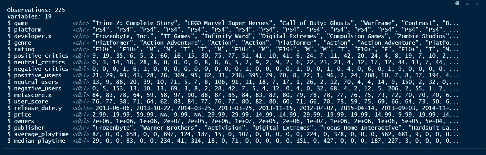

This is what the final dataset looks like

## 前 50 名出版商是谁？

```
top_50_filtered %>%
  filter(!is.na(publisher)) %>% 
  group_by(publisher) %>% 
  summarise(owners=sum(owners)) %>% 
  ggplot(aes(reorder(publisher,owners),owners))+
  geom_bar(fill="#8B2E8B",stat = "identity",color="black")+
  coord_flip()+
  geom_text(aes(label=paste0(round(owners/1000000,digits = 1)," ","M")),color="white",fontface="bold",hjust=1)+
  new_retro()+
  scale_color_hotlineBling()+
  labs(x=" ")+
  scale_y_comma()+
  theme(legend.position = "none",axis.text.y = element_text(colour = "white",family = "SF Alien Encounters")) 
```

*   从删除 NA 发布者开始
*   执行相同的 group by 函数来获得每个发布者的所有者总数
*   使用 **ggplot** 和 **geom_bar** 制作标准条形图，并使用 **coord_flip** 功能翻转轴。注意:ggplot 中的**重新排序**功能允许绘制从最大值到最小值的排序柱状图
*   由于 **owners** 变量是以百万为单位的，所以我将它除以一百万，并在末尾连接一个“M ”,使用 **paste0** 来标记每个发布者的所有者总数，而不会影响美观

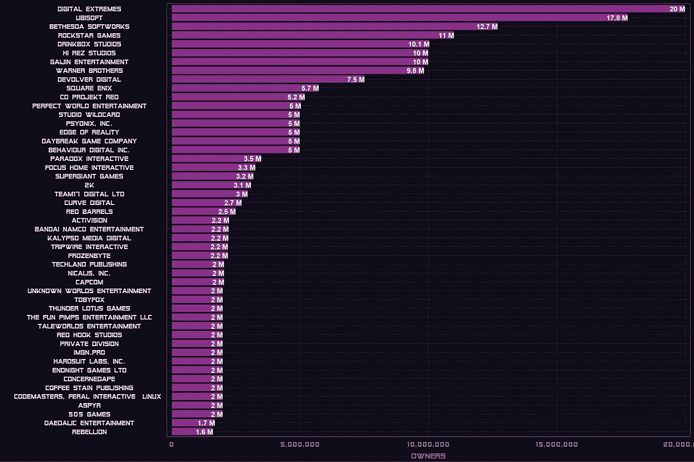

*   那里有很多熟悉的面孔，比如育碧、摇滚明星游戏等等，但是老实说，我不知道数字极端公司 T21——坐在最上面
*   他们实际上是一款非常受欢迎的在线免费角色扮演射击游戏的负责人，这款游戏名为 **Warframe** ，于 2013 年问世

## 用户评分和 Metascore 有什么关系？

```
top_50_filtered %>% 
  ggplot(aes(user_score,metascore.x))+
  geom_point(color="green")+
  geom_text(aes(label=game),check_overlap = TRUE,color="turquoise",size=3)+
  vapoRwave::new_retro()+
  scale_color_newRetro()+
  labs(title = "Relationship between Userscore and Metascore",x="USERSCORE",y="METASCORE")
```

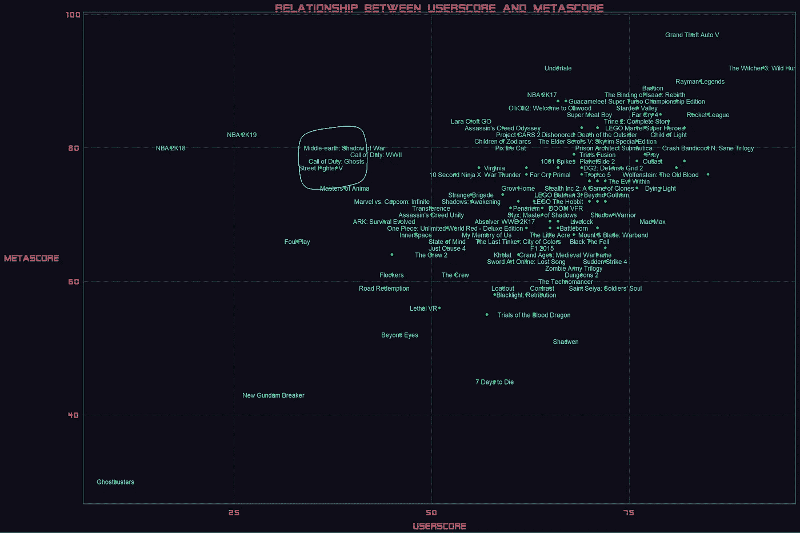

*   **用户评分**和 **Metascore 之间有大致趋势。像《巫师 3》、《GTA V》、《雷曼传奇》、《火箭联盟》(《T30》、《T31 》)这样的游戏在这两方面都获得了高分，这是理所应当的**
*   圈出的游戏是那些被大肆宣传但未能达到预期的游戏。虽然我很惊讶**战争阴影**的用户评分这么低，但是那个游戏有病啊！
*   一个引起我注意的游戏是**疯狂的麦克斯。评论家对它的评价不冷不热，但用户喜欢它。因为前者，我实际上从来没有玩过，但这可能会改变我的想法**

## 用户得分排名前 30 的游戏

```
top_50_filtered %>%
  top_n(30,user_score) %>% 
  ggplot(aes(reorder(game,user_score),user_score))+
    geom_lollipop(color="white")+
  coord_flip()+
  geom_text(aes(label=user_score),color="white",hjust=-1)+
  new_retro()+
  scale_y_continuous(limits = c(0,100))+
  labs(x=" ",title = "Top 30 Games by User Score")
```

*   使用 **top_n** 函数根据 **user_score** 筛选出前 30 个游戏
*   **重新排序 ggplot 中的**功能，从最大值到最小值对图形进行排序
*   **geom_lollipop** 制作棒棒糖图

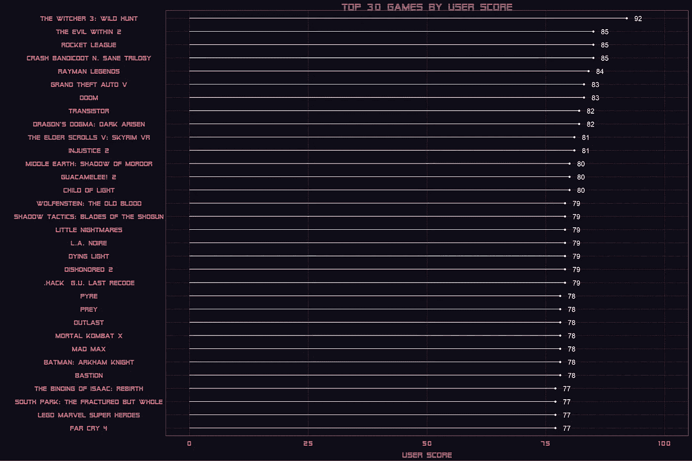

*   毫不奇怪看到**巫师 3** 在顶端。这场比赛是一个杰作
*   虽然我很惊讶地看到**内邪 2** 排在第二位**。这是一个非常好的游戏，但我没有意识到它会获得如此高的分数，超过了像《GTA V》这样的游戏**
*   因此,**的续集《战争阴影，中土世界:魔多阴影》**在用户中获得了更好的分数。我个人更喜欢前传，但两者都是不错的游戏
*   我很惊讶地看到**蝙蝠侠:阿卡姆骑士**低于预期。这是我在 PS4 上最喜欢的游戏之一，也是我认为蝙蝠侠阿卡姆三部曲中最好的。我认为低分可能是因为人们被蝙蝠战车的机制和乏味的老板战斗所激怒

## Metascore 的 op 30 游戏

```
top_50_filtered %>%
  top_n(30,metascore.x) %>% 
  ggplot(aes(reorder(game,metascore.x),metascore.x))+
    geom_lollipop(color="light blue")+
  coord_flip()+
   geom_text(aes(label=metascore.x),color="light blue",hjust=-1)+
  new_retro()+
  scale_y_continuous(limits = c(0,100))+
  labs(x=" ",y=" ",title = "Top 30 Games by Meta Score")
```

*   和以前一样的代码。刚刚用 metascore 替换了**用户分数**

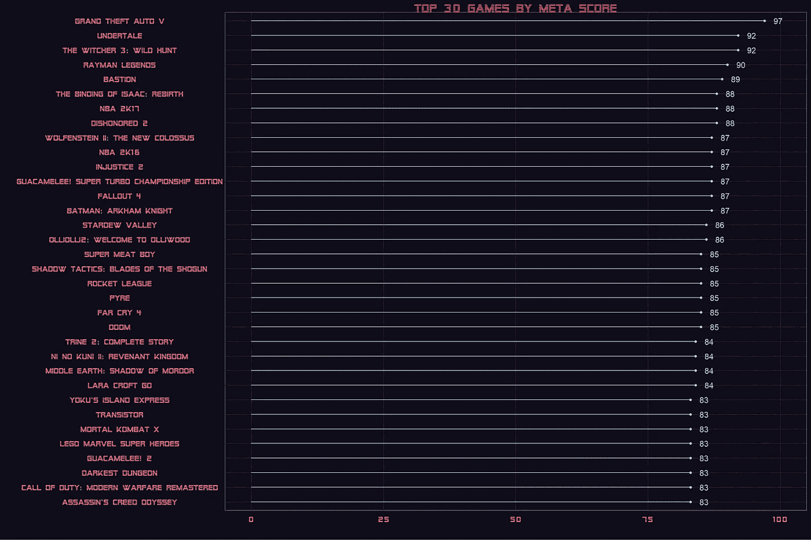

*   你可以清楚地看到，当我们从用户分数转移到 Metascore 时，许多游戏都发生了变化。使用 **anti_join** 函数，我们可以看到哪些游戏出现在用户分数排名前 30 的游戏中，而没有出现在元分数排名前 30 的游戏中

```
top_50_filtered %>%
  top_n(30,user_score) %>%
  anti_join(top_50_filtered %>% 
              top_n(30,metascore.x))
```

*   这里的 anti_join 函数自动检测两个数据框之间的公共列— **游戏**，并显示 metascore 排名前 30 的游戏中没有的前 30 个用户游戏

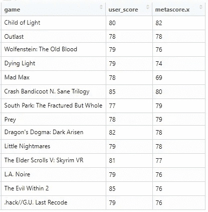

*   除了**邪恶 2** 和**疯狂的麦克斯**之外，这些游戏中的大多数在用户评分和 Metascore 之间没有太大的区别

## 按发布者的用户分数分布

```
top_50_filtered %>%
  filter(!is.na(publisher)) %>% 
  ggplot(aes(reorder(publisher,user_score,FUN = mean),user_score))+
  geom_boxplot(color="purple")+
  geom_hline(yintercept = 80,color="white")+
  coord_flip()+
  new_retro()+
  labs(x=" ")
```

*   绘制箱线图以可视化前 50 名出版商的用户分数分布
*   使用**重新排序**功能根据平均用户分数对箱线图进行排序
*   在 80 处增加了一条垂直线，作为一个伟大游戏的门槛

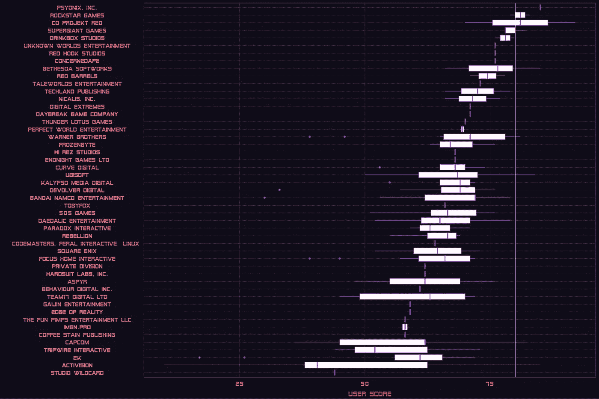

*   我明白为什么育碧在这里得分这么低了。他们最近在《孤岛惊魂》和《刺客信条》系列中的游戏表现平平
*   摇滚明星从不让人失望。他们制作的每一款游戏都是杰作
*   动视**遍地都是。也许人们终于厌倦了**使命召唤**系列**
*   **Capcom** 真的很低。这很可能是由于发布了一款不完整的**街霸 V** 游戏并对其收取全价。但是 2019 年对卡普空来说是令人惊讶的一年，像怪物猎人、生化危机 2:翻拍和鬼泣 5 这样的游戏对他们来说都是巨大的成功

## 发布者的 Metascore 分发

```
top_50_filtered %>%
  filter(!is.na(publisher)) %>% 
  ggplot(aes(reorder(publisher,metascore.x,FUN = mean),metascore.x))+
  geom_boxplot(color="green")+
  geom_hline(yintercept = 80,color="white")+
  coord_flip()+
  new_retro()+
  labs(x=" ",y="Metascore")
```

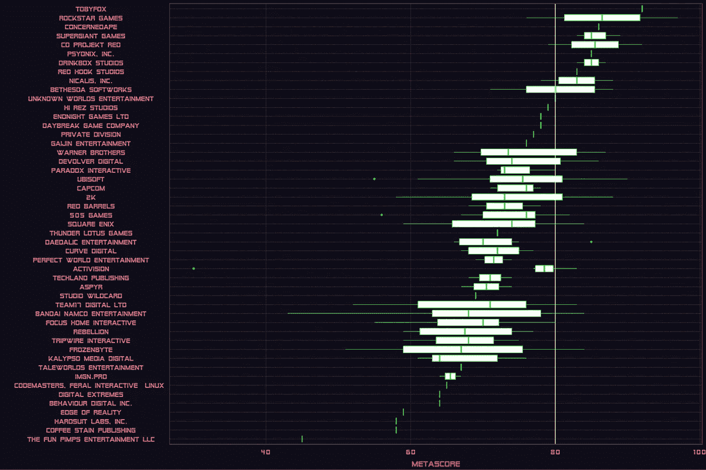

似乎出版商在 Metascore 方面比他们的用户得分做得更好

## **平均游戏时间最长的游戏**

```
top_50_filtered %>%
  top_n(30,average_playtime) %>% ggplot(aes(reorder(game,average_playtime/60),average_playtime/60))+
  geom_lollipop(color="purple")+
  coord_flip()+
  geom_text(aes(label= round(average_playtime/60)),color="white",hjust=-1)+
  vapoRwave::new_retro()+
  scale_y_continuous(limits = c(0,40))+
  labs(x=" ",y="Average playtime in 2 weeks -  (hrs)")
```

*   每款游戏的平均游戏时间(T47)以分钟为单位来衡量用户两周平均玩游戏的时间
*   使用 **top_n** 函数只查看前 30 个最长的游戏
*   绘图时，将 **average_playtime** 除以 60，换算成小时
*   **geom_text** 以小时为单位标注**平均播放时间**

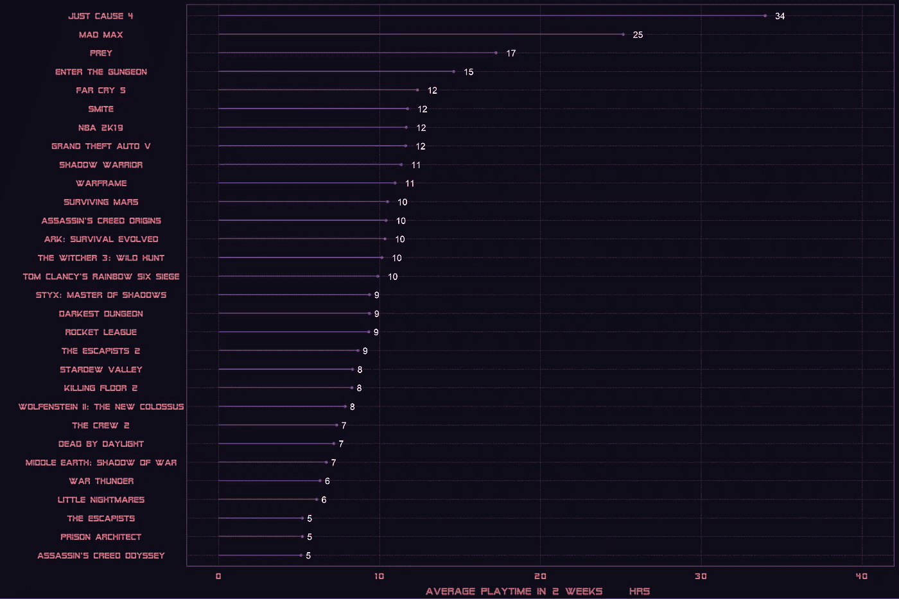

*   排名靠前的最长游戏大多是开放世界的比如**正义事业 4、孤岛惊魂 5、疯狂的麦克斯、刺客信条、GTA V、**和**巫师 3**
*   惊讶地看着**号猎物**号。我没有玩，但我不认为这是开放世界

## 用户正面评价的百分比

```
top_50_filtered **%>%**  **mutate**(percentage_positive_users=positive_users/(positive_users+negative_users+neutral_users),
         percentage_positive_critics =positive_critics/(positive_critics+negative_critics+neutral_critics)) **%>%**
  **filter**(positive_users>=10,percentage_positive_users>=0.5) **%>%**
  **top_n**(30,percentage_positive_users) **%>% ** **ggplot**(aes(**reorder**(game,percentage_positive_users),percentage_positive_users))+
  **geom_lollipop**(color="white")+
  **coord_flip**()+
  **labs**(x=" ")+
 ** new_retro**()
```

*   使用 **mutate** 函数创建两个新列:**percentage _ positive _ users**和**percentage _ positive _ critics**
*   由于有些游戏获得的总分很少，我使用了**过滤器**功能，只显示那些至少有 10 个正面用户分数，并且正面用户总百分比≥ 50%的游戏
*   Rest 与我们在之前的棒棒糖图表中使用的代码相同

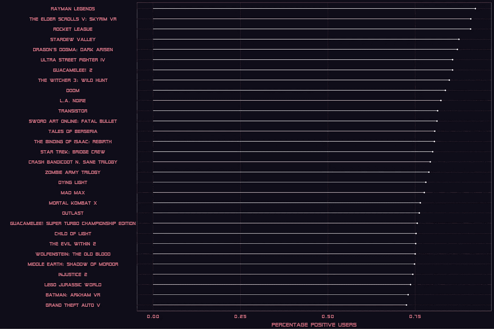

*   哇！看到 GTA V 这么低很惊讶吧
*   《疯狂的麦克斯》和《死亡之光》是其中一款非常好但却不为人知的游戏
*   《剑术在线》收到了来自评论家的可怕评论，但是看起来用户们喜欢它

## 评论家的正面评论百分比

```
top_50_filtered **%>%**  **mutate**(percentage_positive_users=positive_users/(positive_users+negative_users+neutral_users),
         percentage_positive_critics =positive_critics/(positive_critics+negative_critics+neutral_critics)) **%>%**
  **filter**(positive_critics>=10,percentage_positive_critics>=0.5) **%>%**
  **top_n**(30,percentage_positive_critics) **%>% ** **ggplot**(aes(**reorder**(game,percentage_positive_critics),percentage_positive_critics))+
  **geom_lollipop**(color="white")+
  **coord_flip**()+
  **labs**(x=" ")+
 ** new_retro**()
```

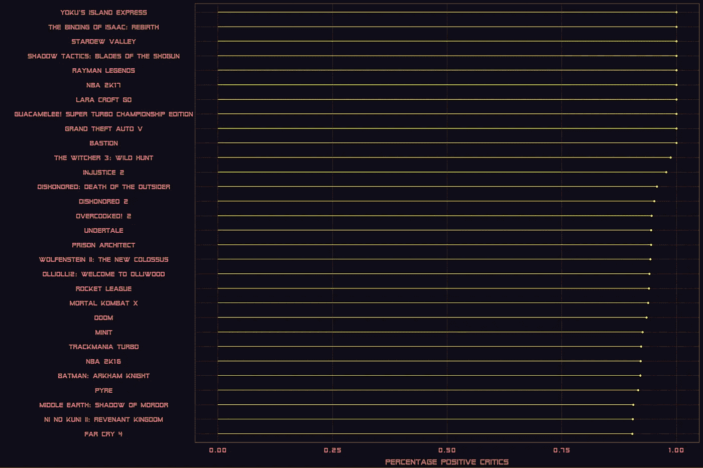

*   NBA 2k16 和 **NBA 2k17** 得到了评论家的好评，但用户的评分很低

老实说，我没有听说过排名前四的游戏，但由于它们的规模小，所以不被认为是 AAA 级游戏

# 预测分析

预测**元得分**是不实际的，因为它是基于数据集中提供的所有数值变量的公式计算的。预测**用户评分**更有意思。为此，我将使用 [Tidymodels](https://github.com/tidymodels) 元包。它是一个软件包的集合，允许您创建一个无缝的数据管道，从预处理您的数据、调整您的模型、建模您的数据、做出预测和测量您的模型性能，同时遵守 Tidyverse 的[“整洁”原则](https://cran.r-project.org/web/packages/tidyr/vignettes/tidy-data.html)

## 数据准备

```
**library(tidymodels)**ratings_data <- top_50_filtered %>% 
  **mutate**(percentage_positive_users=positive_users/(positive_users+negative_users+neutral_users),
         percentage_negative_users =negative_users/(positive_users+negative_users+neutral_users),
         percentage_positive_critics =positive_critics/(positive_critics+negative_critics+neutral_critics),
         percentage_negative_critics =negative_critics/(positive_critics+negative_critics+neutral_critics)) %>% 
  **drop_na()****Splitting the data**split <- initial_split(ratings_data,prop = 0.6,)train_games <- split %>% training() %>%
test_games <- split %>% testing()
```

*   使用 **mutate** 函数创建新变量，这些变量将用作 **user_score** 的预测值
*   删除任何缺少的值
*   使用 **rsample** 库中的 **intial_split** 函数为我们的训练和测试分割创建一个分割参数
*   将它与来自 **rsample** 的**训练**和**测试**函数链接起来，创建我们的训练和测试数据集

## 创建预处理管道

```
**Creating Recipe**norm_recipe <-
  **recipe**(user_score~percentage_positive_critics+percentage_negative_critics+percentage_positive_users+
           percentage_negative_users+price+genre+rating+publisher,data = train_games) %>%
  **step_naomit**(all_numeric(),all_nominal()) %>%
  **step_dummy**(all_nominal(),,one_hot = TRUE) %>% 
  **step_normalize**(all_predictors(),na_rm = TRUE) %>%
 ** step_corr**(all_predictors()) %>%
  **prep**()**Applying Recipe on Train and Test sets**train_prepped <- juice(norm_recipe)
test_prepped <- norm_recipe %>% bake(test_game)
```

*   使用**配方**包，我正在创建一个“配方”,它基本上是我想要如何处理我的数据中的变量的管道
*   我们从定义因变量和自变量之间的关系开始
*   “步进”功能是数据转换功能
*   **step_naomit** 删除名义变量和数值变量中的缺失值
*   **step_dummy** 对所有分类变量进行一次性编码
*   **step_normalize** 归一化所有数值预测值
*   **step_corr** 删除任何彼此高度相关的独立变量
*   **准备**功能基本完成并准备配方
*   **juice** 函数，应用于 norm_recipe，给出了训练集的转换版本
*   **烘焙**函数与**定额 _ 配方**链接在一起，应用于测试数据，给出了转换后的版本

## 建模

```
ranger <- rand_forest(trees = 100,mode = "regression") %>% 
  set_engine("ranger") %>% 
  fit(user_score~.,data=train_prepped)
```

*   为了定义我们的模型，我们使用了 Parsnip 包来定义一个 randomforest 回归模型
*   将发动机设置到**档位**
*   使用**拟合**函数来定义我们的公式，并提供转换后的训练数据

## **预测**

```
**Converting NAs to 0**test_prepped <- test_prepped %>% 
  mutate_all(~replace(.,is.na(.),0)) **Making predictions**ranger %>% 
  predict(test_prepped) %>% 
   bind_cols(test_games) %>% 
   select(game,.pred,user_score)**Measuring Model Accuracy**ranger %>% 
  predict(test_prepped) %>%
  bind_cols(test_games) %>% 
  metrics(truth=user_score,estimate=.pred)
```

*   在对准备好的测试集应用预测之前，我必须将一些 NAs 转换为 0，否则 randomforest 模型将抛出错误
*   最后，我们使用 ranger 模型对我们准备好的测试集进行预测，并将预测与原始测试数据结合起来，以查看每个游戏的预测和实际用户分数

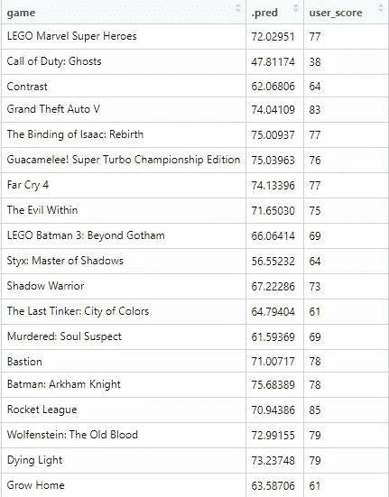

Sample of predicted vs actual user scores

*   一旦我们做出了预测，我使用**标尺**包中的**度量**函数，通过提供实际和预测的用户分数来计算模型的准确性

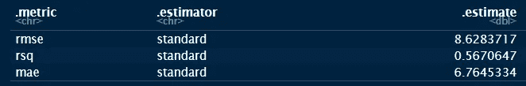

*   **rsq** 衡量因变量 **user_score** 的变化在多大程度上可以由数据集中的自变量来解释。在我们的案例中，考虑到我们拥有的数据类型，这还不算太糟糕，而且它是一个非常小的数据集
*   它可以通过超参数调优和交叉验证来改进，但这超出了本文的范围。此外，这些功能目前仍在 **Tidymodels** 中开发，在我们的分析中还没有无缝集成它们

# 结论

我在对这些数据进行端到端分析时获得了很多乐趣，并且能够使用 **Tidymodels** 包应用一些基本的机器学习是很好的实践。尽管如此，重要的是要注意不要从这些数据中得出任何重要的结论，因为我们只查看了原始数据源的一个非常小的子集。我认为，如果我们收集更多关于所有不同视频游戏的数据，这种分析会变得更加有趣。