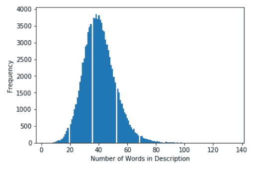

# 使用 Python 中的自然语言工具包分析葡萄酒描述

> 原文：<https://towardsdatascience.com/analyzing-wine-descriptions-using-the-natural-language-toolkit-in-python-497ac1e228d5?source=collection_archive---------23----------------------->


# 为外行描述葡萄酒

几个月前，我创建了一个 [web 应用](http://robotsdodream.com)，它允许用户输入一个查询，并根据语义相似度返回葡萄酒推荐。[它是使用 Tensorflow 实验室通用句子编码器](/generating-wine-recommendations-using-the-universal-sentence-encoder-d086edd13d00)构建的。当我将该工具投入生产时，我添加了将用户输入写入数据库的代码，这样我就可以分析人们用来寻找葡萄酒的词语。根据我对目前记录的内容的分析，似乎大多数人都和我一样:我几乎没有评论葡萄酒的经验，我不知道在搜索葡萄酒时应该使用哪些词。我记录的大多数查询都是两三个简单的词，比如“容易喝”为了帮助我自己和我的用户，我正在钻研葡萄酒描述，看看我能从描述葡萄酒的语言中学到什么。滚动到文章底部，查看完整的代码。


# 数据和依赖关系

原始数据可以在 [Kaggle](https://www.kaggle.com/zynicide/wine-reviews#winemag-data-130k-v2.csv) 上找到；然而，本文中的例子使用了我的工程数据。对于那些感兴趣的人，我在我的[原始文章](/generating-wine-recommendations-using-the-universal-sentence-encoder-d086edd13d00)中讨论了一些数据工程。为了分析文本，我使用了 [WordCloud](http://amueller.github.io/word_cloud/index.html) 和 [nltk(自然语言工具包)](https://www.nltk.org/) python 包。我从加载依赖项和检查数据开始:

```
#dependencies
import pandas as pd
import sqlite3
from sqlite3 import Error
import refrom wordcloud import WordCloud
import matplotlib.pyplot as pltimport nltk
from nltk.tokenize import RegexpTokenizer
from nltk.stem.snowball import SnowballStemmer
#nltk.download('wordnet')
from nltk.stem.wordnet import WordNetLemmatizer#nltk.download('stopwords')
from nltk.corpus import stopwordsfrom sklearn.feature_extraction.text import CountVectorizer#force output to display the full description
pd.set_option('display.max_colwidth', -1)#create connection to database
conn = sqlite3.connect('db\wine_data.sqlite')
c = conn.cursor()#create the pandas data frame
wine_df = pd.read_sql('Select title, description, rating, price, color from wine_data', conn)#display the top 3 records from the data frame
wine_df.head(3)
```


Top 3 results from wine_df

# 字数和分布

从关于数据的一些基本信息开始，很容易向数据框添加一个字数统计列，并使用 pandas 的 describe 方法来处理一些基本统计数据:

```
#inline function to produce word count, splitting on spaces
wine_df['word_count'] = wine_df['description'].apply(lambda x: len(str(x).split(" ")))wine_df.word_count.describe()
```


wine_df.word_count.describe()

使用 matplotlib 中的图可以很容易地直观显示字数的分布:

```
#set x for the histogram and set bins based on max
x = wine_df['word_count']
n_bins = 140#plot histogram
plt.hist(x, bins=n_bins)
plt.show()
```



Distribution of description word count

# 停用词和频率

在依赖项中，我导入了 NLTK 库中包含的停用词列表。停用字词是最常见的字词列表，如“the”和“of”将它们从描述中移除可以突出更相关的常用词。我通过词频来判断是否应该将额外的词添加到停用词表中。在计算字数之前，我使用[正则表达式](https://en.wikipedia.org/wiki/Regular_expression)清除描述，删除标点符号、标签和特殊字符:

```
stop_words = set(stopwords.words("english"))#show how many words are in the list of stop words
print(len(stop_words))
#179#loops through descriptions and cleans them
clean_desc = []
for w in range(len(wine_df.description)):
    desc = wine_df['description'][w].lower()

    #remove punctuation
    desc = re.sub('[^a-zA-Z]', ' ', desc)

    #remove tags
    desc=re.sub("&lt;/?.*?&gt;"," &lt;&gt; ",desc)

    #remove digits and special chars
    desc=re.sub("(\\d|\\W)+"," ",desc)

    clean_desc.append(desc)#assign the cleaned descriptions to the data frame
wine_df['clean_desc'] = clean_desc#calculate the frequency
word_frequency = pd.Series(' '.join(wine_df['clean_desc']).split()).value_counts()[:30]
word_frequency
```


25 most frequent words

查看最常用单词的列表，我决定将“葡萄酒”和“饮料”添加到停用单词列表中，这样它们就不会显示在单词云中。

```
#add single word to stoplist
#stop_words.add("wine")#add list of words to stoplist
add_stopwords = ["wine", "drink"]
stop_words = stop_words.union(add_stopwords)print(len(stop_words))
#181
```

# 词干化还是词干化？

两者都是规范化语言的技术，但是变元化和词干化之间的主要区别在于变元化将单词简化为词根形式，同时保持它是一个真实的单词。词干化通过去除后缀将单词还原为词根形式，并将其转化为真实单词的表示形式。例如，词干“body”和“body”都会导致“bodi”我相信共识是，引理满足优于一些词干算法；然而，词干仍然是一项需要理解的重要技术。比较这两个词云:第一个用词干处理，第二个用词条解释:


Stemming (left) v.s. Lemmatisation (right)

尽管大体相似，但请注意词干是如何影响单词后缀的。你可以看到包括“dri”、“complex”和“medium bodi”在内的几个词之间的明显区别

```
stem_desc = []
for w in range(len(wine_df['clean_desc'])):split_text = wine_df['clean_desc'][w].split()

    ##Stemming
#     stm = SnowballStemmer("english")
#     split_text = [stm.stem(word) for word in split_text if not word in stop_words] 
#     split_text = " ".join(split_text)
#     stem_desc.append(split_text)

    #Lemmatisation
    lem = WordNetLemmatizer()
    split_text = [lem.lemmatize(word) for word in split_text if not word in stop_words] 
    split_text = " ".join(split_text)
    stem_desc.append(split_text)
stem_desc
```

# 生成单词云

词云是可视化文本数据的一种有用方式，因为它们使理解词频变得更容易。在葡萄酒描述中出现频率更高的词在云中会显得更大。这是一种提取和可视化关键词的方法。

```
#set the word cloud parameters
wordcloud = WordCloud(width = 800, height = 800, background_color = 'black', stopwords = stop_words, max_words = 1000,                  min_font_size = 20).generate(str(stem_desc)) #plot the word cloud
fig = plt.figure(figsize = (8,8), facecolor = None)
plt.imshow(wordcloud)
plt.axis('off')
plt.show()
#fig.savefig("wordcloud.png")
```


Word Cloud

# 分析 n 元语法

观察排名靠前的单词序列有助于理解描述葡萄酒的语言。三元模型分析三个单词的组合，可以让我们深入了解描述葡萄酒的常见方式，因为它保持了单词的顺序。通常，n-gram 模型用于帮助预测序列中的下一个项目，并帮助在文本分析期间维护上下文。

因为目的是分析如何描述葡萄酒，所以我需要基于频率分析创建一个新的停用词列表。我使用 scikit-learn CountVectorizer 创建一个函数来生成三元模型，然后将它们放入一个数据框中，看看我的停用词列表是否需要调整。

```
def get_trigrams(descriptions, n=None):

    vec = CountVectorizer(ngram_range = (3,3), max_features = 20000).fit(descriptions)
    bag_of_words = vec.transform(descriptions)
    sum_words = bag_of_words.sum(axis = 0) 
    words_freq = [(word, sum_words[0, i]) for word, i in vec.vocabulary_.items()]
    words_freq =sorted(words_freq, key = lambda x: x[1], reverse = True)

    return words_freq[:n]#run the function on the processed descriptions
trigrams = get_trigrams(clean_desc, n=15)#create a trigram data frame
trigram_df = pd.DataFrame(trigrams)
trigram_df.columns=["Trigram", "Freq"]#output top 15 rows
trigram_df.head(15)
```


top 15 trigrams

在分析了顶级三元模型之后，我决定使用一个定制的停用词表。我去掉了“葡萄酒”和“饮料”以及几个顶级品种，所以我只剩下 n_grams 来帮助我理解如何描述葡萄酒。

```
stops = ['wine','the', 'drink', 'an', 'cabernet', 'sauvignon', 'black', 'cherry']stem_desc = []
for w in range(len(wine_df['clean_desc'])):split_text = wine_df['clean_desc'][w].split()

    #Lemmatisation
    #lem = WordNetLemmatizer()
    split_text = [lem.lemmatize(word) for word in split_text if not word in stops] 
    split_text = " ".join(split_text)
    stem_desc.append(split_text)trigrams = get_trigrams(clean_desc, n=15)#create a trigram data frame
trigram_df = pd.DataFrame(trigrams)
trigram_df.columns=["Trigram", "Freq"]#output top 15 rows
trigram_df.head(15)
```

可以使用条形图来可视化三元模型。

```
fig = sns.set(rc = {'figure.figsize':(12,8)})
bp = sns.barplot(x = "Trigram", y = "Freq", data = trigram_df)
bp.set_xticklabels(bp.get_xticklabels(), rotation = 75)
plt.show()
```


Top 15 trigrams

通过查看三元模型，我可以深入了解应该如何查询葡萄酒。例如，我可以看到描述中包含像“带有暗示”和“有点”这样的描述符是很常见的结合“云”这个词，我现在对关键词、顶级品种和用于描述葡萄酒的语言有了更好的理解。以下是所有代码:

```
#dependencies
import pandas as pd
import sqlite3
from sqlite3 import Error
import re
from wordcloud import WordCloud
import matplotlib.pyplot as plt
import nltk
from nltk.tokenize import RegexpTokenizer
from nltk.stem.snowball import SnowballStemmer
#nltk.download('wordnet')
from nltk.stem.wordnet import WordNetLemmatizer
#nltk.download('stopwords')
from nltk.corpus import stopwords
from sklearn.feature_extraction.text import CountVectorizer
#force output to display the full description
pd.set_option('display.max_colwidth', -1)
#create connection to database
conn = sqlite3.connect('db\wine_data.sqlite')
c = conn.cursor()#create the pandas data frame
wine_df = pd.read_sql('Select title, description, rating, price, color from wine_data', conn)#display the top 3 records from the data frame
wine_df.head(3)#inline function to produce word count, splitting on spaces
wine_df['word_count'] = wine_df['description'].apply(lambda x: len(str(x).split(" ")))wine_df.word_count.describe()#set x for the histogram and set bins based on max
x = wine_df['word_count']
n_bins = 140#plot histogram
plt.hist(x, bins=n_bins)
plt.show()stop_words = set(stopwords.words("english"))#show how many words are in the list of stop words
print(len(stop_words))
#179#loops through descriptions and cleans them
clean_desc = []
for w in range(len(wine_df.description)):
    desc = wine_df['description'][w].lower()

    #remove punctuation
    desc = re.sub('[^a-zA-Z]', ' ', desc)

    #remove tags
    desc=re.sub("&lt;/?.*?&gt;"," &lt;&gt; ",desc)

    #remove digits and special chars
    desc=re.sub("(\\d|\\W)+"," ",desc)

    clean_desc.append(desc)#assign the cleaned descriptions to the data frame
wine_df['clean_desc'] = clean_desc#calculate the frequency
word_frequency = pd.Series(' '.join(wine_df['clean_desc']).split()).value_counts()[:30]
word_frequency#add single word to stoplist
#stop_words.add("wine")#add list of words to stoplist
add_stopwords = ["wine", "drink"]
stop_words = stop_words.union(add_stopwords)print(len(stop_words))
#181stem_desc = []
for w in range(len(wine_df['clean_desc'])):
split_text = wine_df['clean_desc'][w].split()

    ##Stemming
#     stm = SnowballStemmer("english")
#     split_text = [stm.stem(word) for word in split_text if not word in stop_words] 
#     split_text = " ".join(split_text)
#     stem_desc.append(split_text)

    #Lemmatisation
    lem = WordNetLemmatizer()
    split_text = [lem.lemmatize(word) for word in split_text if not word in stop_words] 
    split_text = " ".join(split_text)
    stem_desc.append(split_text)
stem_desc#set the word cloud parameters
wordcloud = WordCloud(width = 800, height = 800, background_color = 'black', stopwords = stop_words, max_words = 1000, min_font_size = 20).generate(str(stem_desc))#plot the word cloud
fig = plt.figure(figsize = (8,8), facecolor = None)
plt.imshow(wordcloud)
plt.axis('off')
plt.show()
#fig.savefig("wordcloud.png")def get_trigrams(descriptions, n=None):

    vec = CountVectorizer(ngram_range = (3,3), max_features = 20000).fit(descriptions)
    bag_of_words = vec.transform(descriptions)
    sum_words = bag_of_words.sum(axis = 0) 
    words_freq = [(word, sum_words[0, i]) for word, i in vec.vocabulary_.items()]
    words_freq =sorted(words_freq, key = lambda x: x[1], reverse = True)

    return words_freq[:n]stops = ['wine','the', 'drink', 'an', 'cabernet', 'sauvignon', 'black', 'cherry']
stem_desc = []for w in range(len(wine_df['clean_desc'])):
split_text = wine_df['clean_desc'][w].split()

    #Lemmatisation
    lem = WordNetLemmatizer()
    split_text = [lem.lemmatize(word) for word in split_text if not word in stops] 
    split_text = " ".join(split_text)
    stem_desc.append(split_text)trigrams = get_trigrams(clean_desc, n=15)#create a trigram data frame
trigram_df = pd.DataFrame(trigrams)
trigram_df.columns=["Trigram", "Freq"]#output top 15 rows
trigram_df.head(15)fig = sns.set(rc = {'figure.figsize':(12,8)})
bp = sns.barplot(x = "Trigram", y = "Freq", data = trigram_df)
bp.set_xticklabels(bp.get_xticklabels(), rotation = 75)
plt.show()
```

# 谢谢大家！

*   *如果你喜欢这个，* [*在 Medium 上关注我*](https://medium.com/@erickleppen) *获取更多*
*   [*通过订阅*](https://erickleppen.medium.com/membership) 获得对我的内容的完全访问和帮助支持
*   *我们连线上* [*LinkedIn*](https://www.linkedin.com/in/erickleppen01/)
*   *用 Python 分析数据？查看我的* [*网站*](https://pythondashboards.com/)

[**—埃里克·克莱本**](http://pythondashboards.com/)

有关分析文本和自然语言处理的更多信息，请查看以下链接:

[](https://www.nltk.org/) [## 自然语言工具包- NLTK 3.4.5 文档

### NLTK 是构建 Python 程序来处理人类语言数据的领先平台。它提供了易于使用的…

www.nltk.org](https://www.nltk.org/)  [## NLTK 图书

### Steven Bird、Ewan Klein 和 Edward Loper 这本书的 NLTK 版本针对 Python 3 和 NLTK 3 进行了更新。第一个…

www.nltk.org](http://www.nltk.org/book/) [](https://medium.com/analytics-vidhya/automated-keyword-extraction-from-articles-using-nlp-bfd864f41b34) [## 使用自然语言处理从文章中自动提取关键词

### 背景

medium.com](https://medium.com/analytics-vidhya/automated-keyword-extraction-from-articles-using-nlp-bfd864f41b34) 

[robotsdodream.com](http://robotsdodream.com)